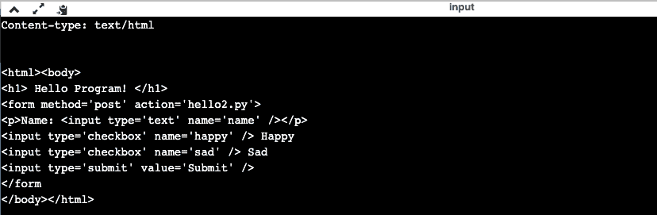
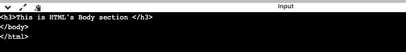

# 如何在日常编码中最好地利用 Python CGI？

> 原文：<https://www.edureka.co/blog/python-cgi/>

Python 是当今市场上最通用的编程语言之一。Python 受欢迎的主要原因是它带来了大量的特性以及跨多个平台的通用性。我们被问得最多的 Python 编程系统的特性之一是 Python CGI，因此在本文中，我们将更多地讨论 Python CGI，它的用途以及如何在日常编码中实现它。

本文将涉及以下几点:

*   [什么是 CGI？](#WhatisCGI?%20)
*   [Python CGI 程序的结构](#StructureofaPythonCGIProgram%20)
*   [CGI 环境变量](#CGIEnvironmentVariables)

让我们开始吧

## **Python CGI**

**什么是 CGI？**

CGI 或通用网关接口是行业公认的 set 方法的首字母缩略词，用于定义 web 服务器和自定义脚本之间的信息交换方式。到目前为止，CGI 脚本由 NCSA 官方维护。

**在 Python 中使用 CGI**

如前所述，CGI 是一种编写程序的方式，它能够通过运行在另一个网络服务器上的网络服务器交换数据。

在 Python 界面上编写 CGI 程序时，需要注意的最重要的一点是，编写 CGI 程序是为了动态生成网页，这些网页不仅接受用户的输入，同时还显示输出。

**例子**

为了理解 Python 中 CGI 编程的概念，让我们看一下下面的例子。

注意:为了执行下面的例子，您需要已经安装了 apache2。默认情况下，这个名为“hello.py”的程序将在主机 127.0.0.1 上运行。

```
#!/usr/bin/python3&nbsp;
# Importing the 'cgi' module&nbsp;
import cgi&nbsp;
print("Content-type: text/htmlrnrn")&nbsp;
print("<html><body>")&nbsp;
print("

<h1> Hello Program! </h1>

")&nbsp;
# Using the inbuilt methods&nbsp;
form = cgi.FieldStorage()&nbsp;
if form.getvalue("name"):&nbsp;
name = form.getvalue("name")&nbsp;
print("

<h1>Hello" +name+"! Thanks for using my script!</h1>

")&nbsp;
if form.getvalue("happy"):&nbsp;
print("
 Yayy! I'm happy too! 
")&nbsp;
if form.getvalue("sad"):&nbsp;
print("
 Oh no! Why are you sad? 
")&nbsp;
# Using HTML input and forms method&nbsp;
print("

<form method='post' action='hello2.py'>
")&nbsp;
print("
Name: <input type='text' name='name' />
")&nbsp;
print("<input type='checkbox' name='happy' /> Happy")&nbsp;
print("<input type='checkbox' name='sad' /> Sad")&nbsp;
print("<input type='submit' value='Submit' />")&nbsp;
print("</form")&nbsp;
print("</body></html>") 
```

**输出**



让我们看看 Python CGI 程序的结构是什么，

## **Python CGI 程序的结构**

现在你知道 Python 中的 CGI 程序是什么样子了，让我们仔细看看它的结构。

1.  用 Python 编写的 CGI 脚本的输出必须包含由空行分隔的两个部分。
2.  第一部分将包含描述的标题，第二部分将包含脚本执行期间将使用的数据类型。

为了理解这一点，请看下面的例子。

```
print ("Content-Type : text/html")
# then comes the rest hyper-text documents
print ("<html>")
print ("<head>")
print ("<title>My First CGI-Program </title>")
print ("<head>")
print ("<body>")
print ("
<h3>This is HTML's Body section </h3>
")
print ("</body>")
print ("</html>")
```

**输出**



为了使用 Python 中的 CGI 模块，首先需要将其导入到 Python IDLE 中。执行相同操作的语法如下。

导入 cgitb

cgitb.enable()

通过使用上述代码，您基本上触发了一个特殊异常处理程序的形成，该处理程序能够在执行时在浏览器中显示任何运行时错误。

**语法图例**

当用 Python 编写 CGI 程序时，请注意以下常用的语法。

**HTML**

1.  内容或类型:文本/html
2.  位置:网址
3.  到期日:日期
4.  内容长度:N
5.  设置 Cookie:字符串

让我们看看这篇 Python CGI 文章的最后一点，即环境变量，

## **CGI 环境变量**

除了上面分享的 HTMl 语法，你还需要记下常用的 CGI 环境变量。

1.  **内容 _ 类型:** 这是用来描述内容的数据和类型。
2.  **CONTENT_LENGTH:** 这主要用于 Post 中定义一条查询或信息的长度。
3.  **HTTP_cookie:** 如果在某种情况下，用户设置了一个 COOKIE，那么这个 COOKIE 用来返回相同的。
4.  **HTTP_USER_AGENT:** 如果你需要查看用户当前使用的浏览器类型，那么这个变量将被使用。
5.  **REMOTE_HOST:** 这是用来定义访问者的主机名。
6.  **PATH_INFO:** 用于定义 CGI 脚本的路径。
7.  **REMOTE_ADDR:** 如果你需要定义访问者的 IP 地址，那么你可以利用这个变量。
8.  **REQUEST_METHOD:** 用于通过 POST 或 GET 发出请求。

这就把我们带到了本文的结尾。

*要深入了解 Python 及其各种应用，您可以 [**在此**](https://www.edureka.co/python/) 注册参加在线直播培训，全天候支持，终身访问。*

*有问题吗？在这篇文章的评论部分提到它们，我们会给你回复。*