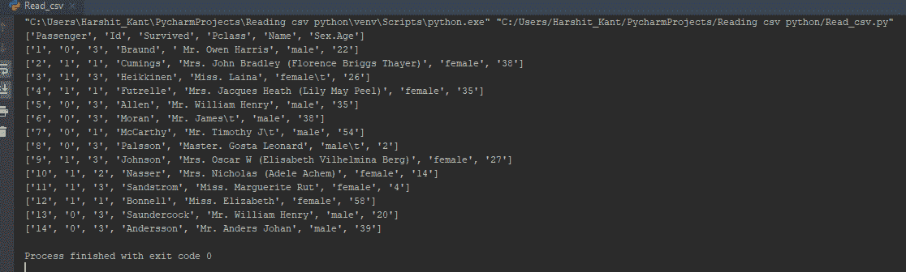
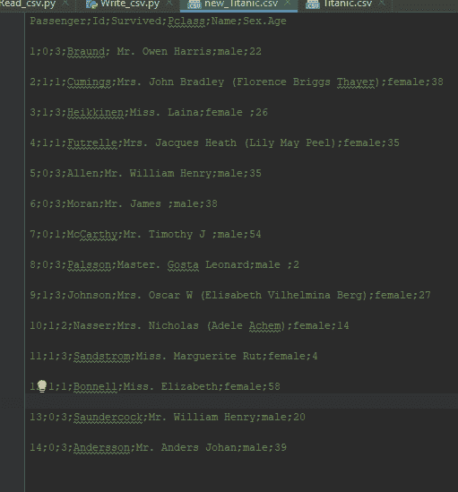
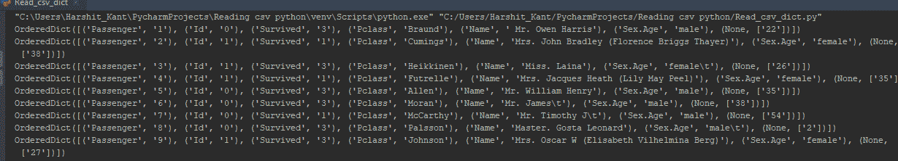

# 如何用 Python 读取 CSV 文件？

> 原文：<https://www.edureka.co/blog/python-csv-files/>

您知道将表格数据存储到纯文本文件背后的机制是什么吗？答案是 CSV(逗号分隔值)文件，它允许将数据转换成纯文本格式。在这篇关于“如何在 Python 中读取 CSV 文件”的文章中，我们将学习如何在 [Python](https://www.edureka.co/blog/python-tutorial/) 中读取、写入和解析 CSV 文件。

将详细讨论以下几个方面:

让我们开始吧。

## **什么是 CSV 文件及其用途？**

CSV(逗号分隔值)是一种纯文本 [t 文件](https://www.edureka.co/blog/file-handling-in-python/)格式，用于存储表格数据，如电子表格或[数据库](https://www.edureka.co/blog/python-database-connection/)。它本质上是将由数字和文本组成的表格数据存储到纯文本中。大多数在线服务允许用户将数据从网站导出为 CSV 文件格式。CSV 文件通常可以在 Excel 中打开，几乎所有的数据库都有不同的特定工具来导入相同的文件。

文件的每一行称为一条记录。每个记录都包含由逗号分隔的字段，这些字段也被称为“分隔符”，这是默认的分隔符，其他的包括竖线(|)、分号(；).下面给出的是一个由逗号分隔的普通 CSV 文件的结构，我使用的是 titanic CSV 文件。

### **结构**

```
Passenger,Id,Survived,Pclass,Name,Sex.Age 1,0,3 Braund, Mr. Owen Harris ,male, 22 2,1,1 Cumings, Mrs. John Bradley (Florence Briggs Thayer), female,38 3,1,3 Heikkinen, Miss. Laina ,female, 26 4,1,1 Futrelle, Mrs. Jacques Heath (Lily May Peel),female,35
```

继续，让我们谈谈使用 CSV 文件格式背后的原因。

## **为什么用 CSV 文件格式？**

CSV 是一个纯文本文件，这使得数据交换更容易，也更容易导入到电子表格或数据库存储中。例如:您可能希望将某个统计分析的数据导出到 CSV 文件，然后导入到电子表格中进行进一步分析。总的来说，它使用户的工作体验非常容易编程。任何支持文本文件或字符串操作的语言，比如 Python，都可以直接使用 CSV 文件进行 T2。

继续，让我们看看 Python 如何原生使用 CSV。

## **Python CSV 模块**

Python 使用一个 CSV 包，它是标准库的一部分，所以您不需要安装它。

```
import csv

```

现在让我向您展示不同的 CSV 功能。

### **CSV 模块功能**

在 CSV 模块下，您可以找到以下功能:

| 功能 | 描述 |
| csv.field_size_limit | 它返回最大字段大小 |
| csv.get_dialect | 获取与名称相关的方言 |
| csv.list _ 方言 | 显示所有注册的方言 |
| csv .阅读器 | 从 csv 文件中读取数据 |
| csv.register_dialect | 与名字相关的方言 |
| csv.writer | 将数据写入 csv 文件 |
| csv.unregister_dialect | 它删除与名称方言注册表相关联的方言 |
| csv。报价 _ 全部 | 引用所有内容，不考虑类型 |
| csv。报价 _ 最小 | 引号特殊字符字段 |
| csv。报价 _ 非数字 | 引用非数字字段 |
| csv。报价 _ 无 | 在输出中不引用任何内容 |

让我们继续从编码的角度来看 Python 中对 CSV 文件的不同操作。

## **Python 中对 CSV 文件的操作**

CSV 文件加载后，您可以执行多种操作。我将展示 Python 中对 CSV 文件的读写操作。

**用 Python 读取 CSV 文件:**

```
import csv 

with open('Titanic.csv','r') as csv_file: #Opens the file in read mode
    csv_reader = csv.reader(csv_file) # Making use of reader method for reading the file

    for line in csv_reader: #Iterate through the loop to read line by line
        print(line)

```

**输出:**

****

这里，正如你从输出中看到的，我使用了 Titanic CSV 文件。并且所有字段都用逗号分隔，文件被读入 Python。

接下来，让我们看看如何写入 CSV [文件](https://www.edureka.co/blog/file-handling-in-python/)。

**写入 Python 中的 CSV 文件:**

```
import csv

with open('Titanic.csv', 'r') as csv_file:
    csv_reader = csv.reader(csv_file)

    with open('new_Titanic.csv', 'w') as new_file: # Open a new file named 'new_titanic.csv' under write mode
        csv_writer = csv.writer(new_file, delimiter=';') #making use of write method

        for line in csv_reader: # for each file in csv_reader
            csv_writer.writerow(line) #writing out to a new file from each line of the original file

```

**输出:**  现在这种处理 CSV 文件的方式使用读写器方法是最常见的方法之一。让我们继续，看看如何使用 [python 字典](https://www.edureka.co/blog/dictionary-in-python/)做同样的事情。

**将 CSV 文件作为字典读取:**

```
import csv 

with open('Titanic.csv','r') as csv_file: #Open the file in read mode
    csv_reader = csv.DictReader(csv_file) #use dictreader method to reade the file in dictionary

    for line in csv_reader: #Iterate through the loop to read line by line
        print(line)

```

**输出:**  从输出中可以看出，字段已经被取代，它们现在充当字典的‘键’。

让我们看看如何将 CSV 文件作为字典写入。

**作为字典写入 CSV 文件**

```
import csv 

mydict = [{'Passenger':'1', 'Id':'0', 'Survived':'3'}, #key-value pairs as dictionary obj
          {'Passenger':'2', 'Id':'1', 'Survived':'1'},
          {'Passenger':'3', 'Id':'1', 'Survived':'3'}]

fields = ['Passenger', 'Id', 'Survived'] #field names

filename = 'new_Titanic.csv' #name of csv file

with open('new_Titanic.csv', 'w')as new_csv_file: #open a new file 'new_titanic,csv' under write mode
    writer = csv.DictWriter(new_csv_file, fieldnames=fields) 
    writer.writeheader() #writing the headers(field names)

    writer.writerows(mydict) #writing data rows

```

**输出:**

我们来看看如何像熊猫一样用 python 读取一个 CSV 文件。

**以熊猫身份读取 CSV 文件:**

```
import pandas #install pandas package

result = pandas.read_csv('Titanic.csv') #read the csv file

print(result) # print result

```

**输出:**

这就把我们带到了文章的结尾“如何在 Python 中读取 CSV 文件”。希望你对 CSV 相关的所有概念都很清楚，怎么读写，怎么把 CSV 当字典读，怎么把 CSV 当熊猫读。

确保你尽可能多的练习并恢复你的经验。

有问题吗？请在这篇“如何用 Python 阅读 CSV 文件”文章的评论部分提到它，我们会尽快回复您。要深入了解 Python 及其各种应用，您可以  *立即*报名参加我们的现场 [Python 课程](https://www.edureka.co/python-programming-certification-training)培训，24/7 全天候支持，终身访问。