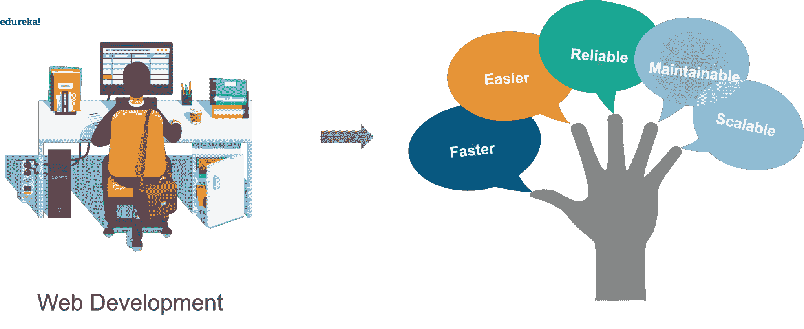
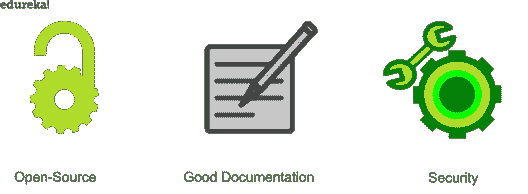
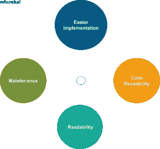
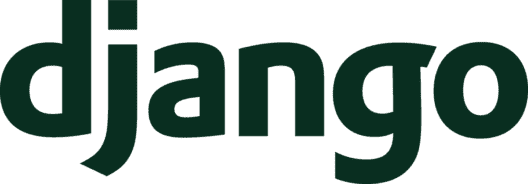
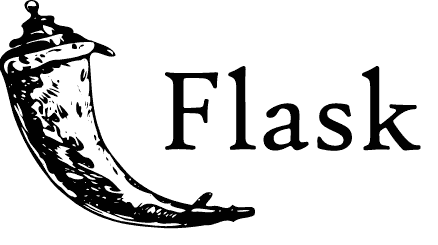
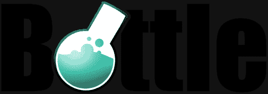

# Python 框架:Python 中排名前 5 的框架是什么？

> 原文：<https://www.edureka.co/blog/python-frameworks/>

Python 编程语言在实现方面有很多应用。 [Web 开发](https://www.edureka.co/blog/django-tutorial/)作为应用程序之一，迫切需要了解哪种框架能以最佳方式服务于您的目的。在这篇博客中，我们将了解 5 大 python 框架的关键特性。以下是本博客涉及的主题:

*   [Python 中的框架有哪些？](#1)
*   [为什么要用框架？](#2)
*   [库 vs 框架](#3)
*   [Python 中排名前 5 的框架](#4)
    *   [姜戈](#5)
    *   [Web2Py](#6)
    *   [烧瓶](#7)
    *   [瓶子](#8)
    *   [CherryPy](#9)

## **Python 中有哪些框架？**

框架是帮助编写 web 应用程序的模块或包的集合。在 python 中开发框架时，我们不必担心底层细节，如协议、套接字或线程管理。

框架自动化了常见解决方案的常见实现，这为用户提供了灵活性，使他们能够专注于应用程序逻辑，而不是基本的例行流程。

框架给了 web 开发者一个应用开发的结构，让他们的生活变得更加轻松。它们在 web 应用程序中提供了快速、可靠且易于维护的通用模式。

让我们来看看使用 web 框架的 web 应用程序中涉及的一些操作:

*   **Url 路由**–路由是将 Url 直接映射到创建网页的代码的机制。
*   **输入表单处理和验证**——假设你有一个接受输入的表单，想法是验证数据，然后保存它。
*   **输出格式带** **模板** **引擎**——模板引擎允许开发者生成想要的内容类型，如 HTML、XML、JSON。
*   **数据库连接**——通过 ORM 进行数据库连接配置和持久数据操作。
*   **Web 安全**–框架提供 Web 安全，防止跨站点请求伪造(也称为 CSRF、sql 注入、跨站点脚本和其他常见的恶意攻击)。
*   **会话存储和** **检索**–当页面会话结束时，存储在会话存储中的数据被清除。

**框架的优势**

1.  开源
2.  良好的文档记录
3.  高效
4.  安全
5.  整合

## ****

## **为什么要用框架？**

框架使得重用普通 HTTP 操作的代码变得更加容易。他们以某种方式构建项目，以便其他具有框架知识的开发人员可以轻松地维护和构建应用程序。

## ****

## **库 vs 框架**

| **库** | **框架** |
| 不太复杂 | 更复杂的 |
| 当你从一个库中调用一个方法时，你处于控制之中。 | 控件被反转，框架调用你。 |
| 一个库执行特定的操作。 | 一个框架包含了基本的流程，剩下的由用户来构建。 |

使用框架而不是库的关键优势是灵活性。它们是可扩展的，并为我们提供了扩展其功能的必要工具。

当你有一个库时，你必须学习每个功能来执行特定的操作。但是使用框架，由于流程的结构化控制，这变得相对容易。我们只需要使用框架中已经存在的功能来指导我们的操作。

虽然市场上有很多可供 web 开发使用的框架，以下是 python 中排名前 5 的框架。

## **Python 中排名前 5 的框架**

根据它们提供给用户的功能和关键特性的种类，这些是 python 中的五大框架，包括微框架和全栈框架。

*   姜戈
*   Web2Py
*   烧瓶
*   瓶子
*   CherryPy

在我们继续之前，让我们快速看一下下面提到的术语之间的区别:

**微框架和全栈框架的区别？**

| **微观框架** | **全栈架构** |
| 简单易用 | 复杂而繁重的工作 |
| url 路由通常是 RESTful 的 | 不需要休息 |
| 小型应用的良好选择 | 可用于制作任何应用程序 |
| 使用 WSGI 并通过 HTTP 请求/响应工作。 | 提供库、模板引擎、数据库管理等。 |

**姜戈**

[Django](https://www.edureka.co/blog/django-tutorial/) 是一个免费开源的全栈 python 框架，它默认包含了所有必要的特性。

它遵循干燥原则，即不要重复自己。Django 使用它的 ORM mappers 将对象映射到数据库表。ORM 或对象关系映射器是一个代码库，它帮助您使用面向对象的范例操作数据库中的数据。

django 工作的主要数据库有 PostgreSQL、MySQL、SQLite、Oracle。它还可以使用第三方驱动程序与其他数据库一起工作。

**django web 框架的一些典型特性如下:**

*   认证
*   URL 路由
*   模板引擎
*   蛇
*   数据库模式迁移

Django 也遵循 MVC-MVT 架构，

**MVC-MVT 架构:**

MVT 与 MVC 略有不同，尽管 Django 负责控制器部分，即控制模型和视图之间交互的代码。并且模板是 HTML 文件混合 Django 模板语言。

开发者提供模型、视图和模板。然后用户将它映射到 url，剩下的工作由 django 完成，提供给用户。

**Web2Py**

Web2Py 是开源的、可扩展的、全栈的框架。它不支持 python 3，并自带基于 web 的 IDE，该 IDE 还包括一个单独的代码编辑器、调试器和一键部署。

****

**以下是 Web2Py 框架的特点:**

*   它没有任何安装和配置的先决条件
*   它具有在不同平台上运行的能力。例如，windows、mac、linux 等。
*   具有读取多个协议的能力
*   Web2Py 提供了数据安全性，可以抵御跨站点脚本、sql 注入和其他恶意攻击。
*   它通过错误记录和标签系统提供错误跟踪机制。
*   也有基于角色的访问控制
*   向后兼容确保了面向用户的进步，而无需失去与早期版本的任何联系。

**烧瓶**

烧瓶是一个微型框架。它是轻量级的，它的模块化设计使它很容易适应开发者的需求。它有许多开箱即用的特性，如下所示:

*   内置开发服务器
*   快速调试器
*   对单元测试的集成支持
*   RESTful 请求调度
*   Jinja2 模板
*   安全 cookies 支持
*   基于 Unicode 的
*   符合 WSGI 标准
*   能够插入任何 ORM
*   HTTP 请求处理

**瓶子**

bottle 是一个微框架，原本是用来构建 API 的，Bottle 在一个源文件中实现了所有的东西。除了 python 标准库之外，它没有任何依赖性。

默认特性包括如下:

*   路由
*   模板化
*   对表单数据、文件上传、cookies、标题等的访问。
*   WSGI 标准上的抽象层
*   一个内置的开发服务器，支持任何其他支持 WSGI 的 HTTP 服务器。

Bottle 非常适合构建简单的个人应用程序、原型设计和学习 web 框架的组织。

**CherryPy**

CherryPy 是一个开源框架。它遵循构建 web 应用程序的极简方法。它使得构建 web 应用程序类似于编写面向对象的程序。

CherryPy 允许我们使用任何类型的技术来创建模板和数据访问。它仍然能够处理会话、cookies、statics、文件上传和 web 框架通常可以处理的一切。

以下是 CherryPy 的一些关键特性:

*   符合 HTTP WSGI 的线程池 web 服务器
*   它具有同时运行多个 HTTP 服务器的简单性
*   灵活的插件系统
*   缓存
*   编码
*   认证
*   内置对分析、覆盖和测试的支持
*   在不同平台上运行的能力

在为任何项目选择框架时，你必须记住它的功能和特性。规范和框架处理这些需求的能力将决定项目的性能。在这篇博客中，我们讨论了 python 中五大框架的关键特性，这将帮助您在从事 web 开发项目时确定这些框架的必要性。

你也可以参考下面的视频，了解 python 中 5 大框架的关键特性。

**Python 中排名前 5 的框架| Edureka**

[https://www.youtube.com/embed/4XAQF9Qgtes?rel=0&showinfo=0](https://www.youtube.com/embed/4XAQF9Qgtes?rel=0&showinfo=0)

本视频将帮助您了解 python 中 5 大框架的主要特性，并比较它们之间的差异。

如果你想掌握使用 python 框架进行 web 开发，你可以报名参加 [Django 认证项目](https://www.edureka.co/python-django)，从头开始学习 web 应用程序开发。

*如有疑问？你可以在评论中提到它们，我们会尽快回复你。*