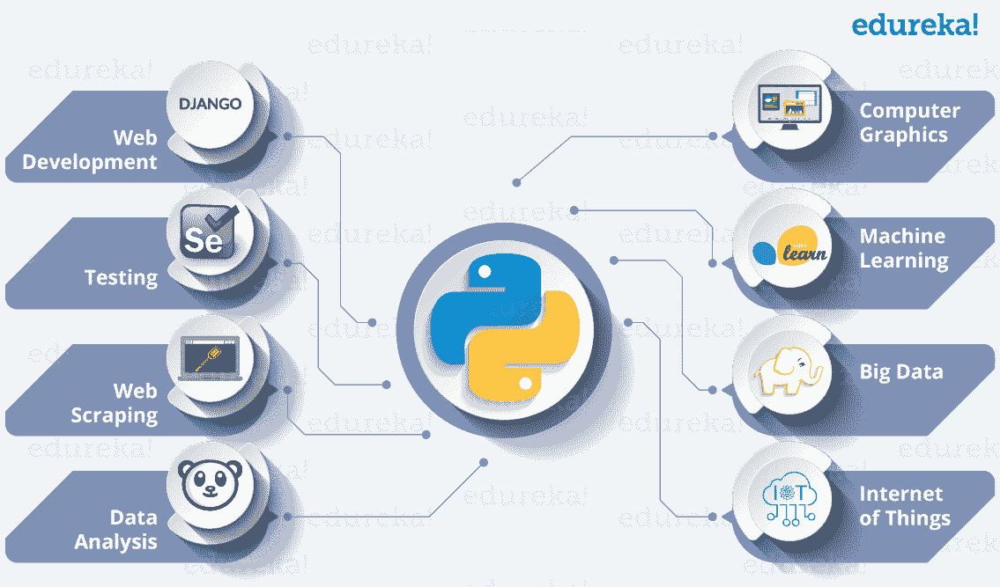
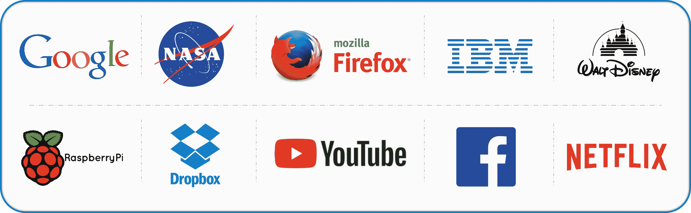
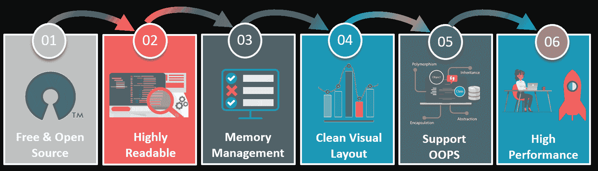
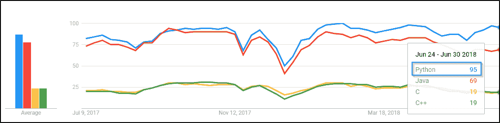

# Python:你需要知道的有趣事实

> 原文：<https://www.edureka.co/blog/python-interesting-facts-you-need-to-know/>

听到***【Python】****这个词，你首先想到的是什么？*** *是凶猛的蛇还是有趣的编程语言？*

虽然这两个词听起来，但它们最终却有着截然不同的 **效果** ！！

虽然 Python(蛇)是危险的**敌对的**生物，但 Python(编程语言)则是更友好的生物。所以让我们更多地了解更友好的一个。在我们开始之前，你还应该知道 [***Python 认证***](https://www.edureka.co/python-programming-certification-training) 是当今大多数雇主和招聘人员都追捧的行业通用技能。

**你知道谁发明了 Python 吗？**

**Guido Van Rossum:**一位 荷兰程序员，俗称 Python 编程语言的作者。他在 1989 年创造了 Python，并为 *Google* 和 *Dropbox 工作过！*

**有没有想过它为什么取名为 Python？**

关于它有一个有趣的故事。在实现 Python 的同时，*范罗森*也在阅读来自***天魔蟒剧团***的已出版剧本，这是一部来自 20 世纪 70 年代的 *BBC* *喜剧系列*。由于他想为自己的发明取一个简短、独特且略带神秘的名字，他从该系列中获得灵感，将其命名为 **Python** ！

**有哪些现实生活中的应用？**

**Over75%**你所看的由 **网飞** 推荐。

推荐由 **机器学习！**

正在使用 **机器学习** 在帖子和图片中进行标记。

**Alexa** 是亚马逊的虚拟个人助理 用于语音识别、天气检测等。

**你知道 Python 迎合的不同领域吗？**

所有上述技术都将 Python 作为其功能的核心。所以综上所述，

***Python 是机会的海洋！！***

Python 已经发展成为一种流行的编程语言。给大家介绍一下 **大** 玩家:

The **simplicity** of Python is what makes it so popular!Let’s look at some **FEATURES**:

Python is not that complex! It is a high-level dynamic programming language and is quite easy to learn. Python code has a very ‘natural’ style to it, which makes it easy to read and **understand**.***It’s really a** **great language for beginners,** **all the way up to seasoned professionals!***

因此，对于那些熟悉 Java 或 C++的人来说，Python 将打破你为典型编程语言建立的模式。上面的截图显示了这些编程语言按照 的趋势。

***Python 在过去的一年里人气飙升！！***

在这个不断发展和适应的世界里， **Python 带来了 和平 以其简单易用** 支持创建和维护过多的应用程序。

<article class="maincontentblog">

到此为止，献给所有的 Python 粉丝。如果你对 Python 有兴趣，可以参考这个: **[Python 教程](https://www.edureka.co/blog/python-tutorial/)**

*喜欢我们关于 Python 的故事？请与您的朋友分享，并向他们介绍更友好的 Python 版本！*

</article>

Get In-depth Knowledge of Python along with its Diverse Applications [<button>Enroll Now!</button>](https://www.edureka.co/python-programming-certification-training)