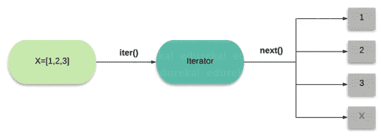

# Python 迭代器:Python 中迭代器是什么，如何使用？

> 原文：<https://www.edureka.co/blog/python-iterator>

Python 编程语言已经扩展了创新的每一个方面，包括[机器学习](https://www.edureka.co/blog/videos/python-machine-learning/)、[数据科学](https://www.edureka.co/blog/learn-python-for-data-science/)、[人工智能](https://www.edureka.co/blog/artificial-intelligence-with-python/)等。这一成就的众多原因之一是像 Python 迭代器这样的概念，像这样的概念是 Python 作为编程语言取得成功的基石。在本文中，我们将通过以下概念来理解 Python 迭代器:

*   [迭代器 vs 可迭代的](#iteratorvsiterable)
*   [什么是 Python 迭代器？](#iterator)
*   [自定义迭代器](#custom)
*   [无限迭代器](#infinite)
*   [停止迭代](#stopIteration)
*   [Python 迭代器示例](#examples)

## **迭代器 vs 可迭代的**

在 Python 中，可以作为可迭代对象的对象称为可迭代对象。这基本上意味着对象中的序列可以被迭代。像 [list](https://www.edureka.co/blog/lists-in-python/) 、 [dictionary](https://www.edureka.co/blog/dictionary-in-python/) 、 [tuple](https://www.edureka.co/blog/tuple-in-python/) 、 [sets](https://www.edureka.co/blog/sets-in-python/) ，甚至 [range](https://www.edureka.co/blog/range-in-python/) 这样的 Python 集合大部分都可以作为 Iterable 对待。

## **什么是 Python 迭代器？**

Python I**畸胎** 是一个包含可数个值的容器。容器中的值可以用迭代器遍历——尤其是列表。

除了遍历，迭代器还可以访问容器中的数据元素，但它本身并不执行 迭代 ，也就是说，这个概念或术语的使用并没有太大的自由度。迭代器在行为 上几乎类似于 数据库光标 。下面是 Python[中迭代器的一个简单例子。](https://www.edureka.co/blog/learn-python/)

```
my_obj = {"Edureka", "Python", "iterator"}
iter_obj = iter(my_obj)
print(next(iter_obj))

```

**输出:** `Edureka`

迭代器是任何类型的 Python，可以与“for in loop”一起使用。 任何要用作迭代器的对象都必须实现以下方法。

****

**1。__iter__()**

迭代器初始化时调用它。 它应该返回一个有 next 或者 __next__ 方法的对象。

**2。__ 下一个 __()**

迭代器的 next 方法返回 Iterable 的下一个值。

当迭代器与“for in”循环一起使用时，next()由迭代器对象上的 [for 循环](https://www.edureka.co/blog/loops-in-python/)隐式调用。此方法应该使用 StopIteration 来表示迭代的结束。 这两种方法合在一起称为迭代器协议。让我们用一个例子来试着理解一下 Python 中 for 循环是如何充当迭代器的。

```
for i in object:
     print(i)

```

让我们了解一下 for 循环是如何作为迭代器工作的。

```
# create an iterator object from that iterable
iter_obj = iter(iterable)

# infinite loop
while True:
    try:
        # get the next item
        element = next(iter_obj)
        # do something with element
    except StopIteration:
        # if StopIteration is raised, break from loop
        break

```

现在我们知道了循环的[是如何作为迭代器工作的。让我们理解如何用 Python 实现自定义迭代器。](https://www.edureka.co/blog/python-for-loop/)

## **自定义迭代器**

现在让我们看看如何在 Python 中实现定制迭代器。为了理解这一点，我们将使用一个例子。在这个例子中，我们将实现 __iter__()和 __next__()方法。

```
class MyNumbers:
  def __iter__(self):
    self.a = 1
    return self

  def __next__(self):
    x = self.a
    self.a += 1
    return x

myclass = MyNumbers()
myiter = iter(myclass)

print(next(myiter))
print(next(myiter))
print(next(myiter))

```

**输出:** `1`

`        2`

`        3`

现在我们知道了如何实现自定义迭代器，让我们看看 Python 中的无限迭代器。

## **无限迭代器**

迭代器对象中的项目并不总是必须用尽的。可以有无限的迭代器(永远不会结束)。下面是一个演示无限迭代器的基本例子。

内置的[函数](https://www.edureka.co/blog/python-functions) iter() 可以用两个参数调用，其中第一个参数必须是可以调用的对象(函数)，第二个参数是 sentinel。迭代器调用这个函数，直到返回值等于 sentinel。

让我们举个例子来理解这一点

```
class MyNumbers:
  def __iter__(self):
    self.a = 1
    return self

  def __next__(self):
    x = self.a
    self.a += 1
    return x

myclass = MyNumbers()
myiter = iter(myclass)

print(next(myiter))
print(next(myiter))
print(next(myiter))
print(next(myiter))
print(next(myiter))

```

**输出:**`1``        2``        3``        4``        5`

在上面的例子中，只要我们继续添加 print 语句，执行就会继续。为了停止无限迭代器，我们需要使用 stopIteration 语句。

## **停止迭代**

为了阻止迭代永远进行下去，我们使用 StopIteration 语句。让我们用几个例子来理解这一点。

```
class MyNumbers:
  def __iter__(self):
    self.a = 1
    return self

  def __next__(self):
    if self.a &amp;amp;amp;lt;= 5:
      x = self.a
      self.a += 1
      return x
    else:
      raise StopIteration

myclass = MyNumbers()
myiter = iter(myclass)

for x in myiter:
  print(x)

```

**输出:**`1``        2``        3``        4``        5`

现在，一旦 [if 语句](https://www.edureka.co/blog/if-else-in-python/)条件为假，执行将移动到 else 块，迭代将停止。现在让我们看看 Python 中迭代器的其他几个例子。

## **Python 迭代器示例**

这里还有几个 Python 中迭代器的例子。

```
my_obj = ["Edureka", "python", "iterator"]
iter_obj = iter(my_obj)
print(next(iter_obj))

```

**输出:** `Edureka`

在这个例子中，我们使用 tuple 作为 iterable 对象。

```
my_obj = ("Edureka", "python", "iterator")
iter_obj = iter(my_obj)
print(next(iter_obj))

```

**输出:** `Edureka`

我们甚至可以使用字符串作为 python 中的可迭代对象。

```
my_obj = "Edureka"
iter_obj = iter(my_obj)
print(next(iter_obj))

```

**输出:** `E`

这就把我们带到了本文的结尾，在这里我们学习了如何通过例子使用 Python 迭代器。我希望你清楚本教程中与你分享的所有内容。

*如果您发现这篇文章与“Python 迭代器”相关，请查看一下  [Edureka 的 Python 编程认证课程](https://www.edureka.co/python-programming-certification-training) 这是一家值得信赖的在线学习公司，拥有遍布全球的 250，000 多名满意的学习者。*

*我们在这里帮助你踏上旅程的每一步，并为想要成为  [Python 开发者](https://www.edureka.co/blog/how-to-become-a-python-developer/)的学生和专业人士设计课程。该课程旨在让您在 Python 编程方面有一个良好的开端，并训练您掌握核心和高级 Python 概念以及各种  [Python 框架](https://www.edureka.co/blog/python-frameworks/) ，如  [Django。](https://www.edureka.co/blog/django-tutorial/)*

如果你遇到任何问题，请在“Python 迭代器”的评论区自由提问。我们团队很乐意回答。