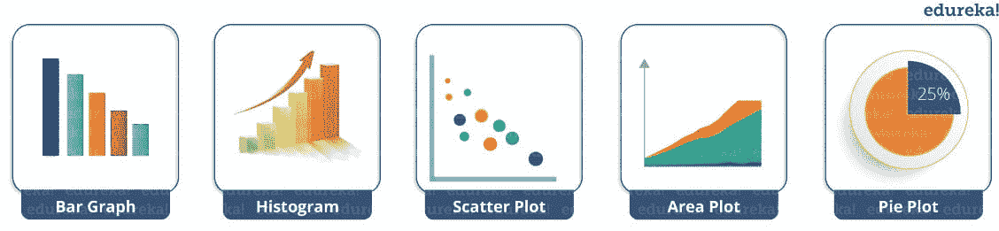
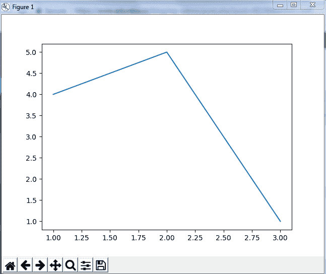
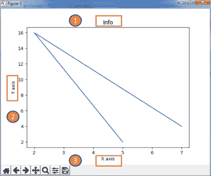
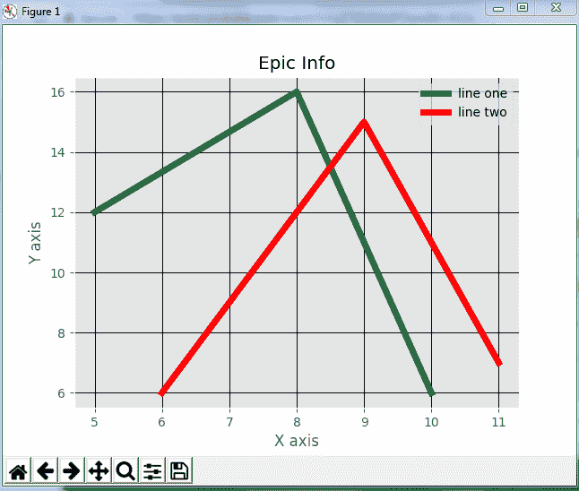
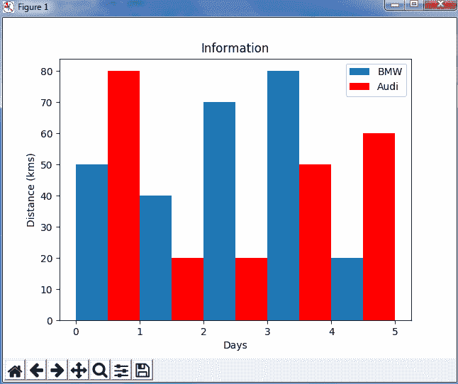
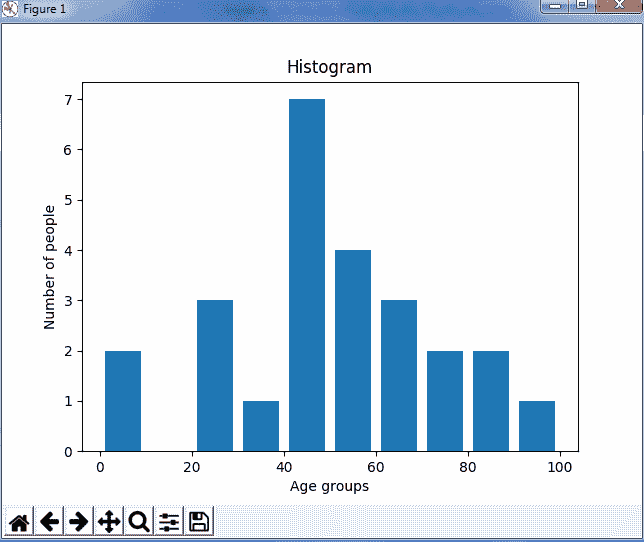
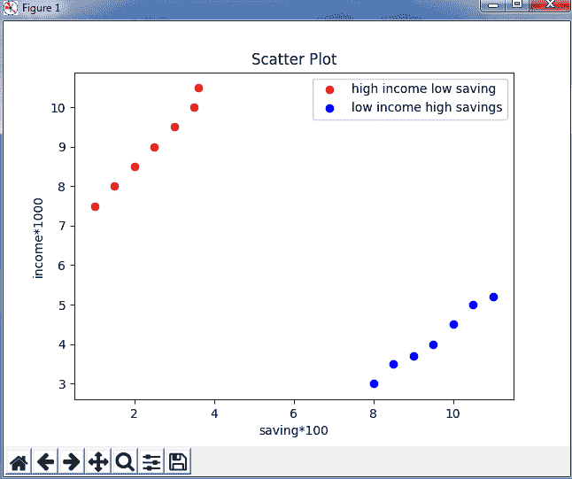
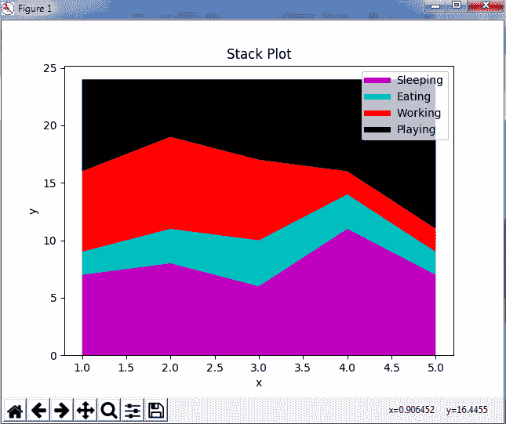
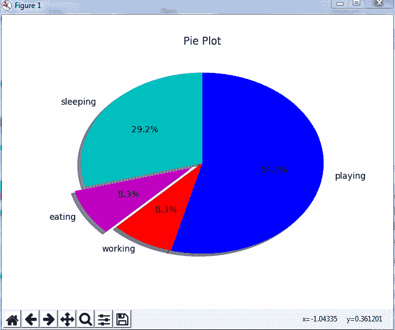

# Matplotlib 教程–Python Matplotlib 库及示例

> 原文：<https://www.edureka.co/blog/python-matplotlib-tutorial/>

在我之前的博客中，我讨论过一个叫做***[python NumPy](https://www.edureka.co/blog/python-numpy-tutorial/)***的 Python 数值库。在这篇博客中，我将谈论另一个库， **Python Matplotlib** 。matplotlib.pyplot 是一个用于 2D 图形的 python 包。学会高效使用这个库也是 *[**Python 认证**](https://www.edureka.co/python-programming-certification-training) 课程*必不可少的一部分。下面是我讲述 python matplotlib 所有主题的顺序:

*   [什么是 Python Matplotlib](#matplotlib) ？
*   [Matplotlib 是做什么用的？](#whatismatplotlibusedfor)
*   [图类型](#types)–[条形图](#Bargraph)–[柱状图](#Histogram)–[散点图](#Scatter)–[面积图](#AreaPlot)–[饼图](#PiePlot)

*   [处理多个地块](#multiplePlots)

## **什么是 Python Matplotlib？**

**matplotlib.pyplot** 是 python 编程语言中用于 2D 图形的绘图库。  可用于 python 脚本、shell、web 应用服务器等图形用户界面工具包。

## **Matplotlib 是做什么用的？**

Matploitlib 是一个用于绘图的 python 库，这个 Python 库提供了面向对象的 API，用于将绘图集成到应用程序中。

### **Python 中包含 Matplotlib 吗？**

Matplotlib 不是 Python 时默认安装的标准库的一部分，这里有几个扩展 python matplotlib 功能的工具包。其中一些是单独下载的，另一些可以随 matplotlib 源代码一起提供，但有外部依赖性。

您可以浏览一下这段 Python Matplotlib 的录音，我们的讲师已经详细解释了如何用 Python 下载 Matplotlib 以及相关主题，并举例说明，这将有助于您更好地理解这一概念。

## Python Matplotlib 教程| Matplotlib 教程| Python 教程| Python 培训| Edureka


[https://www.youtube.com/embed/yZTBMMdPOww?rel=0&showinfo=0](https://www.youtube.com/embed/yZTBMMdPOww?rel=0&showinfo=0)This Edureka Python Matplotlib tutorial explains what is data visualization and how to perform data visualization using Matplotlib.

接下来，让我们继续这篇博客，探索 python matplotlib 中可用的不同类型的绘图。

## **Python Matplotlib:地块类型**

使用 python matplotlib 可以创建各种图形。下面列举了其中的一些:



我将详细演示其中的每一个。

但在此之前，让我向您展示 python matplotlib 中非常基本的代码，以便生成一个简单的图形。

```
from matplotlib import pyplot as plt

 #Plotting to our canvas

 plt.plot([1,2,3],[4,5,1])

 #Showing what we plotted

 plt.show()

```

输出–

因此，通过三行代码，您可以使用 python matplotlib 生成一个基本图形。很简单，不是吗？ 让我们看看如何给 python matplotlib 库创建的图形添加标题和标签，以赋予它更多的含义。考虑下面的例子:

```

from matplotlib import pyplot as plt

x = [5,2,7]
y = [2,16,4]
plt.plot(x,y)
plt.title('Info')
plt.ylabel('Y axis')
plt.xlabel('X axis')
plt.show()

```

输出--



你甚至可以尝试许多样式技巧来创造更好的图形。如果你想改变某条线的宽度或颜色，或者你想有一些网格线，你需要设计风格！因此，让我向您展示如何使用 python matplotlib 向图表添加样式。首先，您需要从 python matplotlib 库中导入样式包，然后使用如下代码所示的样式函数:

```

from matplotlib import pyplot as plt
from matplotlib import style

style.use('ggplot')
x = [5,8,10]
y = [12,16,6]
x2 = [6,9,11]
y2 = [6,15,7]
plt.plot(x,y,'g',label='line one', linewidth=5)
plt.plot(x2,y2,'c',label='line two',linewidth=5)
plt.title('Epic Info')
plt.ylabel('Y axis')
plt.xlabel('X axis')
plt.legend()
plt.grid(True,color='k')
plt.show()

```

输出–

接下来在这篇 python matplotlib 博客中，我们将了解不同种类的情节。先说条形图吧！

### **python matplot lib:bar graph**

首先，让我们明白为什么我们需要条形图。条形图使用条形来比较不同类别的数据。当您想要测量一段时间内的变化时，它非常适合。可以水平表示，也可以垂直表示。此外，要记住的重要一点是，棒线越长，价值就越大。现在，让我们使用 python matplotlib 实际实现它。

```
from matplotlib import pyplot as plt

plt.bar([0.25,1.25,2.25,3.25,4.25],[50,40,70,80,20],
label="BMW",width=.5)
plt.bar([.75,1.75,2.75,3.75,4.75],[80,20,20,50,60],
label="Audi", color='r',width=.5)
plt.legend()
plt.xlabel('Days')
plt.ylabel('Distance (kms)')
plt.title('Information')
plt.show()

```

输出–



在上面的图中，我展示了宝马和奥迪两辆车在 5 天内行驶距离的对比。接下来，让我们使用 python matplotlib 进行另一种绘图——直方图。

### **Python Matplotlib–直方图**

让我先告诉你条形图和柱状图的区别。直方图用于显示分布，而条形图用于比较不同的实体。当您有数组或很长的列表时，直方图很有用。让我们考虑一个例子，我必须根据 bin 绘制人口年龄。现在，bin 指的是被分成一系列区间的值的范围。通常创建相同大小的媒体夹。在下面的代码中，我创建了间隔为 10 的容器，这意味着第一个容器包含从 0 到 9 的元素，然后是从 10 到 19 的元素，依此类推。

```
import matplotlib.pyplot as plt
population_age = [22,55,62,45,21,22,34,42,42,4,2,102,95,85,55,110,120,70,65,55,111,115,80,75,65,54,44,43,42,48]
bins = [0,10,20,30,40,50,60,70,80,90,100]
plt.hist(population_age, bins, histtype='bar', rwidth=0.8)
plt.xlabel('age groups')
plt.ylabel('Number of people')
plt.title('Histogram')
plt.show()

```

输出--

 从上面的图中可以看出，我们得到了年龄组相对于垃圾箱的位置。我们最大的年龄组在 40 到 50 岁之间。

### **Python Matplotlib:散点图**

通常我们需要散点图来比较变量，例如，一个变量受另一个变量的影响有多大，以此来建立关系。 数据显示为点的集合，每个点有一个变量的值决定横轴的位置，另一个变量的值决定纵轴的位置。

考虑下面的例子:

```
import matplotlib.pyplot as plt
x = [1,1.5,2,2.5,3,3.5,3.6]
y = [7.5,8,8.5,9,9.5,10,10.5]

x1=[8,8.5,9,9.5,10,10.5,11]
y1=[3,3.5,3.7,4,4.5,5,5.2]

plt.scatter(x,y, label='high income low saving',color='r')
plt.scatter(x1,y1,label='low income high savings',color='b')
plt.xlabel('saving*100')
plt.ylabel('income*1000')
plt.title('Scatter Plot')
plt.legend()
plt.show()
```

输出--

 如上图所示，我根据上面代码中指定的输入绘制了两个散点图。数据显示为具有“高收入低工资”和“低收入高工资”的点的集合。

接下来，让我们来理解面积图，或者你也可以使用 python matplotlib 说堆栈图。

### **Python Matplotlib:面积图**

面积图与线图非常相似。它们也被称为堆栈图。这些图可用于跟踪构成一个完整类别的两个或多个相关组随时间的变化。例如，让我们将一天中完成的工作进行分类，比如睡觉、吃饭、工作和玩耍。 考虑下面的代码:

```
import matplotlib.pyplot as plt
days = [1,2,3,4,5]

 sleeping =[7,8,6,11,7]
 eating = [2,3,4,3,2]
 working =[7,8,7,2,2]
 playing = [8,5,7,8,13]

 plt.plot([],[],color='m', label='Sleeping', linewidth=5)
 plt.plot([],[],color='c', label='Eating', linewidth=5)
 plt.plot([],[],color='r', label='Working', linewidth=5)
 plt.plot([],[],color='k', label='Playing', linewidth=5)

 plt.stackplot(days, sleeping,eating,working,playing, colors=['m','c','r','k'])

 plt.xlabel('x')
 plt.ylabel('y')
 plt.title('Stack Plot')
 plt.legend()
 plt.show()

```

输出–



正如我们在上面的图片中看到的，我们根据类别花费了时间。因此，面积图或堆积图用于显示不同属性随时间变化的趋势。 接下来，让我们看看最后一个也是最常用的图表——饼状图。

### **Python Matplotlib:饼图**

饼图指的是一个圆形图，它被分解成多个部分，即饼图的切片。它主要用于显示百分比或比例数据，其中每个饼图切片代表一个类别。 我们来看看下面的例子:

```
import matplotlib.pyplot as plt

days = [1,2,3,4,5]

sleeping =[7,8,6,11,7]
eating = [2,3,4,3,2]
working =[7,8,7,2,2]
playing = [8,5,7,8,13]
slices = [7,2,2,13]
activities = ['sleeping','eating','working','playing']
cols = ['c','m','r','b']

plt.pie(slices,
  labels=activities,
  colors=cols,
  startangle=90,
  shadow= True,
  explode=(0,0.1,0,0),
  autopct='%1.1f%%')

plt.title('Pie Plot')
plt.show()

```

输出–

在上面的饼状图中，我将圆圈分成 4 个部分，分别代表不同的类别(玩耍、睡觉、吃饭和工作)以及它们所占的百分比。现在，如果您已经注意到这些切片加起来是 24 小时，但是饼图切片的计算是自动为您完成的。通过这种方式，饼图非常有用，因为您不必计算百分比或饼图的份额。

接下来在 python matplotlib 中，我们来了解一下如何处理多个地块。

## **Python Matplotlib:处理多个地块**

我已经讨论了 python matplotlib 中的多种绘图类型，如条形图、散点图、饼图、面积图等。现在，让我告诉你如何处理多个情节。为此，我必须导入 numpy 模块，我在之前关于 [Python Numpy](https://www.edureka.co/blog/python-numpy-tutorial/) 的博客中讨论过这个模块。让我实际地实现它，考虑下面的例子。

```
import numpy as np
import matplotlib.pyplot as plt

def f(t):
    return np.exp(-t) * np.cos(2*np.pi*t)
t1 = np.arange(0.0, 5.0, 0.1)
t2 = np.arange(0.0, 5.0, 0.02)
plt.subplot(221)
plt.plot(t1, f(t1), 'bo', t2, f(t2))
plt.subplot(222)
plt.plot(t2, np.cos(2*np.pi*t2))
plt.show()

```

```
Output -

```

这段代码与你之前看到的例子非常相似，但是这里有一个新的概念，即子情节。subplot()命令指定 numrow、numcol、fignum，范围从 1 到 numrows*numcols。如果 numrows*numcols < 10，此命令中的 the 逗号是可选的。 所以支线剧情(221)等同于支线剧情(2，2，1)。因此，subplots 帮助我们绘制多个图形，您可以通过垂直或水平对齐来定义它。在上面的例子中，我将它水平对齐。

除了这些，python matplotlib 还有一些缺点。下面列举了其中的一些:

*   他们严重依赖其他软件包，比如 NumPy。
*   它只适用于 python，所以很难或不可能用于 python 之外的语言。(但是可以从 Julia 通过 PyPlot 包使用)。

本 python matplotlib 教程到此结束。我已经介绍了 matplotlib 、的所有基础知识，所以你现在可以开始练习了。我希望你们清楚我上面讨论的每一个方面。在这篇 python matplotlib 博客之后，我将会有更多关于 python 类、scikit learn 和 array 的博客。敬请期待！

*有问题吗？请在“Python Matplotlib”博客的评论部分提到它，我们会尽快回复您。*

*要深入了解 python 及其各种应用程序，您可以注册 Edureka 提供的实时 Python 在线培训，该培训提供全天候支持和终身访问。*