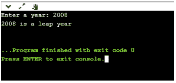
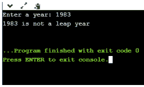
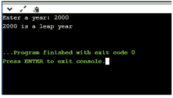

# 如何实现 Python 程序查闰年？

> 原文：<https://www.edureka.co/blog/python-program-to-check-leap-year/>

闰年有额外的一天，这使得一年的总天数为 366 天。闰年的这一额外的一天被添加到二月。闰年每四年出现一次。这个博客将帮助你实现一个 [Python](https://www.edureka.co/blog/python-programming-language) 程序来检查闰年与否。涵盖以下主题:

*   [如何确定闰年？](#determineleapyear)
*   [Python 程序查闰年](#implementpythonprogram)
*   [程序说明](#programexplanation)

## **如何确定闰年？**

*   如果一年能被 4 整除，且没有余数，则进入下一步。如果不能被 4 整除。这不是闰年。例如，1997 年不是闰年。
*   如果能被 4 整除但不能被 100 整除，那就是闰年。例如，2012 年是闰年。如果一年能同时被 4 和 100 整除，那么进入下一步。
*   如果一年能被 100 整除，但不能被 400 整除。比如 1900 年不是闰年。如果一年能被这两个数字整除，那么它就是闰年。比如- 2000。

## **Python 程序检查闰年**

```
year = int(input("Enter a year: "))  
 #Getting value for user 
if (year % 4) == 0:  
   if (year % 100) == 0:  
       if (year % 400) == 0:  
           print("{0} is a leap year".format(year))  
       else:  
           print("{0} is not a leap year".format(year))  
   else:  
       print("{0} is a leap year".format(year))
       # Number will be printed as leap year
else:  
   print("{0} is not a leap year".format(year))
   #Number will be printed as Non Leap Year

```

**输出:**T3

输入值= 1983

```
Input value = 2000
```

## **节目解说**

1.  用户必须首先输入要检查闰年的年份。
2.  然后，if 语句检查年份是 4 的倍数而不是 100，还是 400 的倍数。
3.  然后打印结果。

至此，我们结束了这篇关于“Python 程序检查闰年”的博客。我希望它增加了您对 Python 的了解。要深入了解 Python 及其各种应用，您可以注册参加现场 **[Python 认证培训](https://www.edureka.co/python)** ，全天候支持，终身访问。