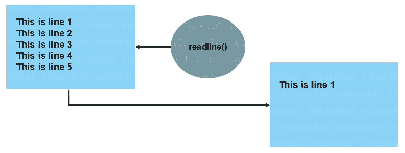
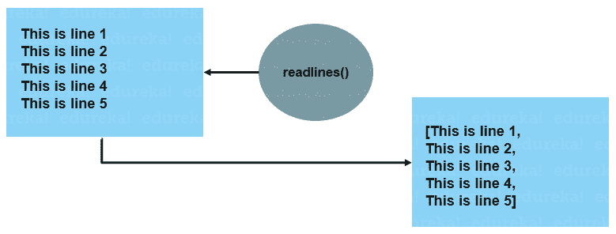

# Python 中的 readline() & readlines()方法是什么

> 原文：<https://www.edureka.co/blog/python-readline/>

Python 编程语言是 IT 行业的巅峰之作。凭借出色的库支持和开箱即用的特性， [Python 编程](https://www.edureka.co/python-programming-certification-training)让文件处理看起来像小菜一碟。它为[文件处理](https://www.edureka.co/blog/file-handling-in-python/)相关任务提供了简单的实现。Python readline 方法就是这样一种方法。在本文中，我们将通过示例了解 Python readline()方法。本文涵盖了以下概念:

*   [什么是 Python readline()？](#pythonreadline)
*   [语法和用法](#syntax)
*   [Python readline()示例](#readlineexamples)
*   [Python readlines()示例](#readlinesexample)

## **什么是 Python readline()？**

**Python readline()** 方法在调用时会从[文件中返回一行。](https://www.edureka.co/blog/file-handling-in-python/)



**readlines()方法**将以[列表](https://www.edureka.co/blog/lists-in-python/)的格式返回文件中的所有行，其中每个元素都是文件中的一行。



## **语法和用法**

使用 open()方法打开文件后，我们可以简单地使用这些方法。

**Python readline()语法**

```
file = open("filename.txt", "r")
file.readline()

```

readline 方法接受一个参数，即 size，size 参数的默认值是-1。这意味着该方法将返回整行。它是一个可选参数，我们可以指定从一行返回的字节数。

**readlines()语法**

```
file = open("filename.txt","r")
file.readlines()

```

readlines 方法接受一个参数，即提示，提示参数的默认值是-1。这意味着该方法将返回所有的行。如果我们指定了提示参数，readlines 方法将不会返回超出提示参数字节数的行。

让我们看一些例子来理解这些方法在 Python 中是如何工作的。

## **Python readline()示例**

假设我们有一个名为 examples.txt 的文本文件，其内容如下。

`Python is the best programming language in the world in 2020``Edureka is the biggest Ed-tech platform to learn python`

现在，要使用 readline，我们必须打开 example.txt 文件。

```
file = open("example.txt", "r")
example1 = file.readline()
example2 = file.readline(14)
print(example1)
print(example2)

```

**输出:** `Python is the best programming language in the world in 2020` `         Edureka is the`

**readlines()示例**

我们可以使用 readline()方法，就像我们在上面的例子中使用 read line()一样。

```
example1 = file.readlines()
print(example1)

```

**输出:`['`** `Python is the best programming language in the world in 2020',` `'Edureka is the biggest Ed-tech platform to learn python',` `'Python programming is as easy as writing a program in simple English language']`

```
example2 = file.readlines(80)
print(example2)

```

**输出:** `**['**Python is the best programming language in the world in 2020',` `        'Edureka is the biggest Ed-tech platform to learn python']`

这就把我们带到了本文的结尾，在这里我们学习了如何通过例子使用 Python readline()方法。我希望你清楚本教程中与你分享的所有内容。

*如果你在“Python readline()”上找到了这篇相关文章，请查看一下  Edureka 的 [Python 课程](https://www.edureka.co/python-programming-certification-training) 这是一家值得信赖的在线学习公司，拥有遍布全球的 250，000 多名满意的学习者。*

*我们在这里帮助你踏上旅程的每一步，并为想要成为  [Python 开发者](https://www.edureka.co/blog/how-to-become-a-python-developer/)的学生和专业人士设计课程。该课程旨在让您在 Python 编程方面有一个良好的开端，并训练您掌握核心和高级 Python 概念以及各种  [Python 框架](https://www.edureka.co/blog/python-frameworks/) ，如  [Django。](https://www.edureka.co/blog/django-tutorial/)*

如果您遇到任何问题，请在“Python readline()”的评论区提出您的所有问题。我们团队很乐意回答。