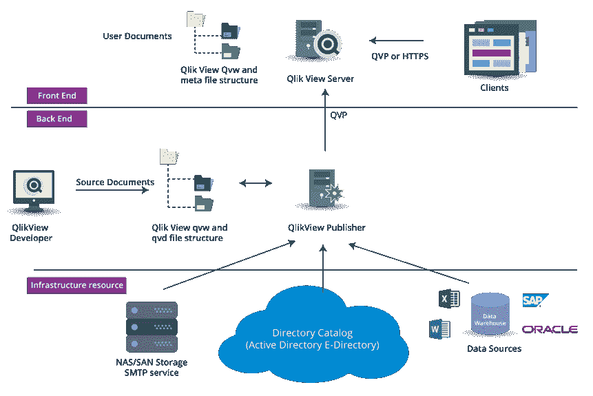
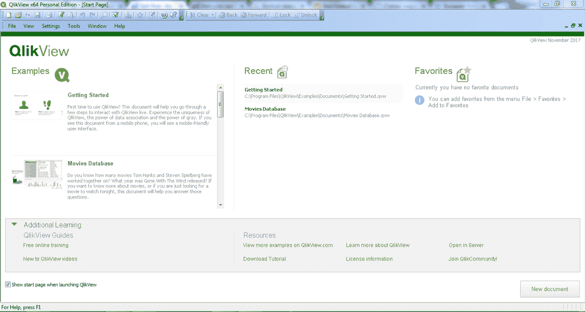
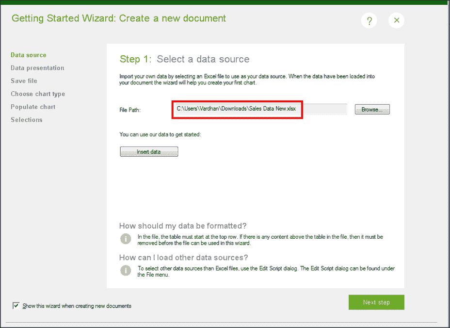
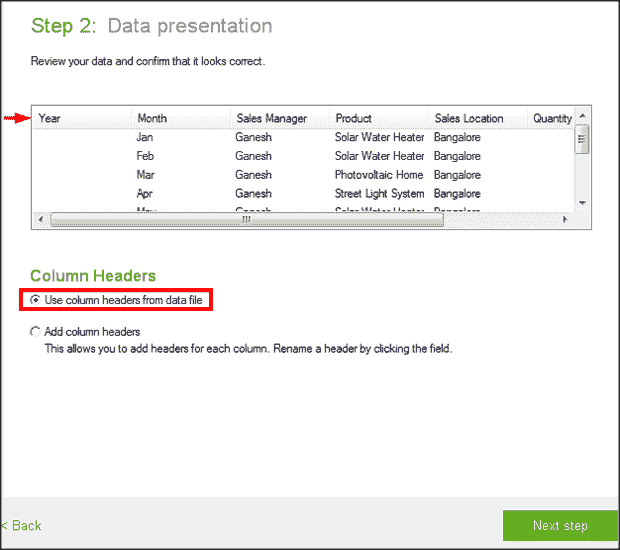
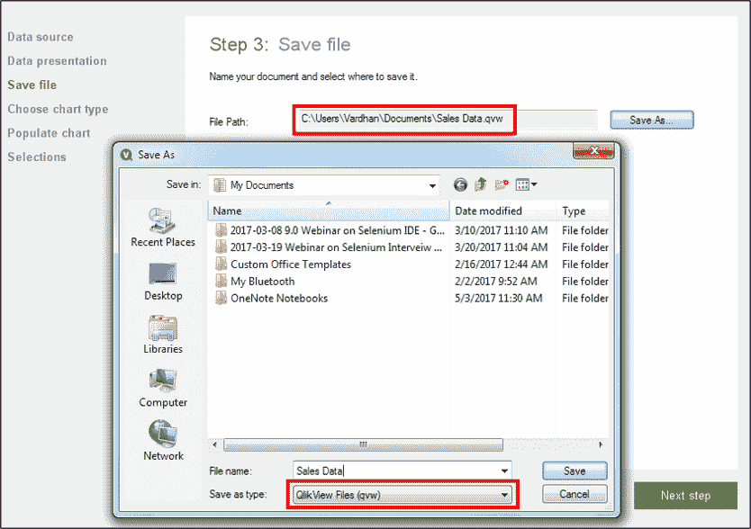
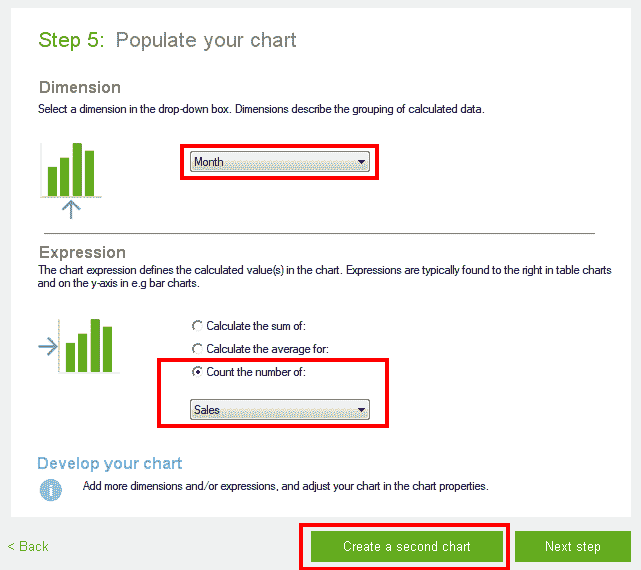
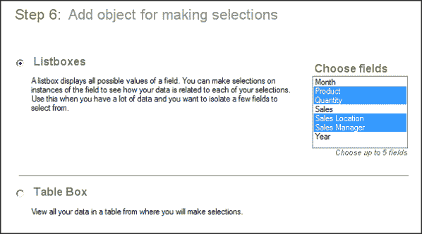
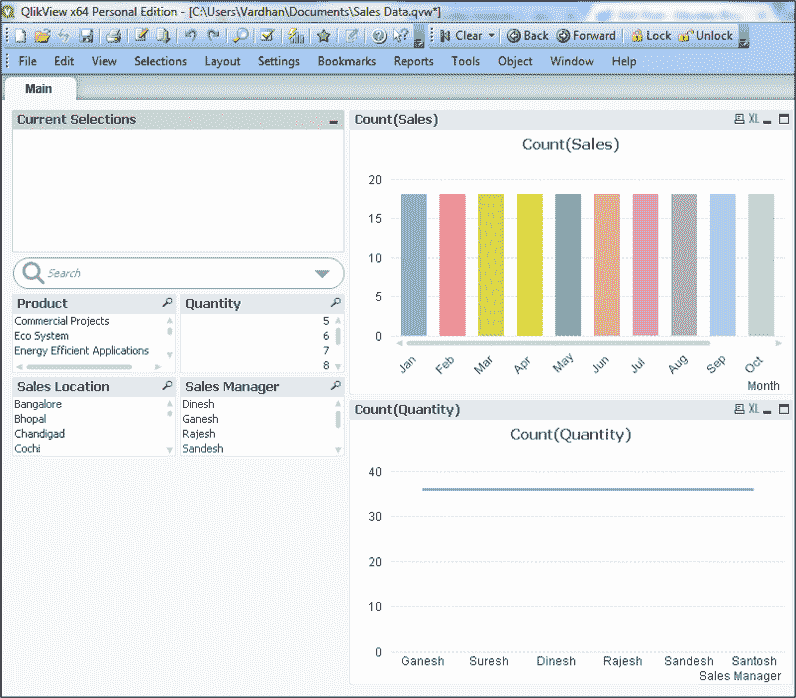
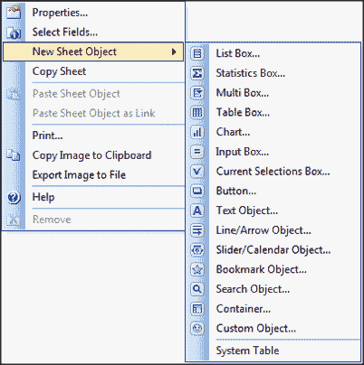
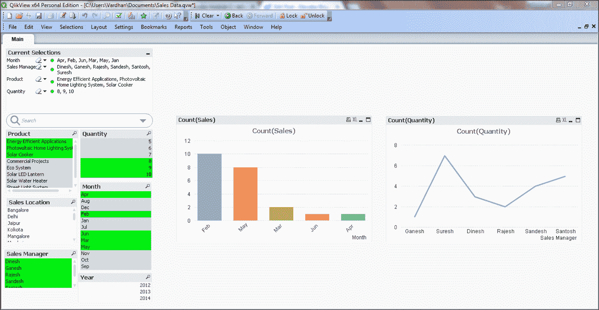

# QlikView 教程:了解 QlikView 点击可视化的强大功能

> 原文：<https://www.edureka.co/blog/qlikview-tutorial/>

任何人想到 **QlikView** 的第一件事就是它是一个 BI(商业智能)工具。这是绝对正确的。但是，QlikView 可以提供更多。它能提供的任何额外功能正是我在这篇 QlikView 教程博客中要讨论的内容。

QlikView 是一款*自助式商业智能*、*数据可视化*和*数据分析*工具。你可能会问什么是自助商业智能？因此，作为 QlikView 教程的一部分，让我先回答这个问题。

自助式商业智能(SSBI)是一种数据分析方法，由没有*统计分析、* *商业智能*或数据挖掘背景的非技术用户使用。

这使最终用户能够独立自主，从而解放了组织的 BI 和 IT 团队的带宽，使其不必为他们创建报告和仪表板。那么市场上有没有其他可以和 QlikView 媲美的工具呢？让我们在这篇 QlikView 教程博客的下一部分了解一下。

## **QlikView 诉表**

你可能知道 Tableau，它是 QlikView 的直接竞争对手。很多人认为 Tableau 比 QlikView 更好。这不是真的。因为 Tableau 只是一个数据可视化和 BI 工具。然而，QlikView 是一个端到端的 ETL 解决方案暨分析引擎暨 BI 和数据可视化工具。

然而，Tableau 更加用户友好，因为非技术业务用户可以直接上手。但是 QlikView 需要开发人员的干预来创建报告或仪表板。我还想提一下，与 QlikView 相比，Tableau 的用户界面更好看。

但是 QlikView 的一个明显优势是速度。由于 QlikView 将数据存储在服务器 RAM 中，因此与 Tableau 相比速度非常快。就这样了。这两种工具都有各自的优点和缺点。

所以，通过这篇 QlikView 教程博客，让我们继续前进，了解让它脱颖而出的好处。

## **QlikView 的特性**

### **数据压缩&内存存储**

您发送到 QlikView 的数据首先会被**压缩** *至其原始大小*的近 10%，然后存储在*服务器 RAM* 中。因为它存储在服务器的 RAM 中，所以被称为**内存** **存储**，这实质上导致甚至*处理*和*计算*都非常快。

存储在内存中的数据可以被多个用户立即访问以进行数据浏览。对于太大而无法放入内存的数据集，QlikView 可以直接连接到数据源。

### **自动数据关联**

**数据关联**是自动识别数据集中出现的各个字段之间的关系的能力。例如，如果两个字段具有相同的名称，那么将它们连接起来就更容易了。因此，用户不需要预先配置不同数据实体之间的关系。

### **视觉分析&直接搜索**

这是一个你会注意到的特殊功能，因为这是大多数其他工具所没有的。QlikView 中的关系在视觉上很吸引人，因为它们是用颜色而不是箭头/线条来表示的。此外，在搜索数据时，不仅会显示直接结果，甚至还会返回相关的搜索结果。这要归功于数据关联。

以上是 QlikView 的一些显著特性。因此，让我在本 QlikView 教程中通过讨论 QlikView 的架构和组件来进一步了解 QlikView 的工作原理。

## **QlikView 架构**

下面是 QlikView 的架构图。在理解我提供的解释之前，看一看它。

如你所见，有两种主要的分类:

1.  前端
2.  后端

基础设施资源是架构中可见的另一种资源，位于后端之下。

### **前端**

顾名思义，这是终端用户的 UI 点。这里的 UI 是一个基于浏览器的访问点，从这里可以查看文档。我所指的文档只不过是由 QlikView Server 托管在互联网上的已创建的 BI 报告。

作为一个最终用户，你可以通过访问相应的网址来访问这些文件，这个网址就是 HTTPS 通讯。您也可以通过 QVP 访问它，这是 QlikView 的专有通信协议。然后，你可以通过分析与数据互动，获得洞察力，然后得出结论。

你还能做什么？

您可以与其他用户共享这些报告和文档，共同处理这些报告和文档，并就从数据中实时获得的见解进行协作。即使不是实时的，也可以离线完成。

这些文件都在。qvw 格式，也可以作为独立文档存储在 Windows 操作系统中。由于所有操作都在 QlikView server 中进行，因此它负责用户和 QlikView 后端系统之间的客户端-服务器通信。

### **后端**

后端由两部分组成:-

1.  QlikView 开发者
2.  QlikView 发布者

#### **QlikView 开发者**

QlikView Developer 或通常被称为 QlikView Desktop 是一种基于 Windows 的桌面工具，主要由开发人员或设计人员使用。这是源文件所在的位置。它用于数据提取、加载和转换，也可用于创建报告的自定义 GUI 布局。

自定义 GUI 可以通过拖放功能创建，完全相同的功能将反映在前端。使用开发人员创建的文件类型再次存储在中。qvw 扩展。这些文件与传递到 QlikView server 前端的文件相同。

这个。qvw 文件可以修改为。qvd 文件，这是纯数据文件。纯数据文件是指那些只包含数据，既不包含 GUI 组件也不包含报告的文件。

#### **QlikView 出版社**

QlikView Publisher 是另一个后端组件，用作分发服务来分发。qvw 文档发送给各种 QlikView 服务器和用户。它还进行数据加载。它还负责维护用户访问和权限。它还通过使用。qvw 文件。数据源可以是数据仓库、Excel 文件、Salesforce、Oracle DB、各种数据库等。

## **在 QlikView 中构建基本仪表盘**

这就是 QlikView 教程博客有趣的地方。我将向您展示如何向 QlikView 桌面添加数据，并在此基础上向您展示如何创建基本的仪表板和可视化效果。 注意我用的是桌面版的 QlikView 12。下面的截图是 QlikView 的样子。

如果您是第一次使用 QlikView，您将会看到类似上面的内容。您可以点击“入门”或“电影数据库”或“示例”选项卡中的任何其他选项，访问任何默认或内置的仪表板和报告。

然而，我们将处理一个数据集，为了练习，你可以从[这里](https://drive.google.com/uc?export=download&id=1qLGoZEPUtsOhw8g_gvH7pPIPiHT5yvzf)下载。好吧，那么我们要开始做的第一件事是什么？加载数据正确吗？

### **加载数据到 QlikView**

要将数据加载到 QlikView，点击**文件****–>****新建**。 这样做后，会弹出下面的窗口。

第一步，输入 excel 文件的路径，输入数据源，点击“下一步”。然后，您将看到下面的窗口，这是数据呈现步骤。确保您已选中“使用数据文件中的列标题”，然后单击“下一步”。

在下一步中，您必须保存 QlikView 工作簿文件。输入您选择的名称，然后单击“下一步”。您应该能够看到类似于下面截图的“文件路径”。

将出现另一个窗口提示您使用机器和 QlikView 软件进行身份验证。单击“确定”继续。

然后会要求您选择一个图表来可视化您的数据。您可以选择“条形图”并点击“下一步”。

接下来是最重要的一步，因为这里我们必须用一些数据填充图表。如果您想要分析和可视化数据，那么您必须创建一个模式或者定义维度和度量之间的关系。因为分析总是一个特定维度的度量。

在我们的数据集中，各个字段分别是*年*、*月*、*销售*、*经理*、*产品*、*销售地点*、*数量*和*销售*。让我们选择“月”作为维度，选择“销售额”作为衡量标准。下面的截图也是如此。

您可以点击“下一步”或“创建第二个图表”。我选择了后者来创建一个新的“折线图”,其维度和度量将分别为“销售经理”和“数量”。你大概也可以选择一样，进入下一步。

最后一步是添加一个对象，用于动态选择和可视化。你可以从*列表框、* *表格框*、*统计框*等等中选择。我最初选择了列表框。看看下面的截图作为参考。

最初最多可以选择 5 个字段。但是稍后从*应用程序的画布*，你可以添加更多的字段。我已经选择了产品、数量、销售地点、月份、销售经理和年份。

即使这是最初的样子，你也可以在画布中随意移动图表和对象。事实上，您甚至可以按照自己的意愿对齐它们。水平或垂直。右键单击画布可以找到这样做的选项。

要进一步添加对象，您可以再次右击画布并选择‘新建工作表对象’。您可以从列表中选择框类型或图表类型。列表框、统计框、多选框、表格框、图表、输入框等。

### **可视化数据**

从这里开始，一切都是关于你想要想象的。您只需点击任何图表，就会看到与该列表的详细信息相对应的不同图表。您也可以单击列表框中的某些值，图形将根据选择而变化，只显示这些值的相关字段。

这也是这个工具得名“ **QlikView** 的原因。只需点击一些图表或对象，就可以与数据进行交互。那么，我们能做什么样的可视化呢？

我想象的是，这些年的前 6 个月的销售情况。在此期间，每位销售经理在精选产品上做出了多少贡献:*节能应用*、*光伏家庭照明系统*和*太阳灶*。

最终可视化如下。您可以通过单击屏幕截图左侧突出显示的值来实现类似的可视化。此外，为实现可视化所做的选择会在顶部单独提及。

所以，这篇 QlikView 教程博客到此结束。我强烈建议您达到这一点，然后以您想要的方式探索您的数据集。探索 QlikView 的强大功能，让您惊叹不已。

## QlikView 初学者教程|什么是 QlikView | QlikView 教程

[https://www.youtube.com/embed/xua3ahyWRdA?rel=0&showinfo=0](https://www.youtube.com/embed/xua3ahyWRdA?rel=0&showinfo=0)

如果您有兴趣了解有关 QlikView 的更多信息，请查看 Edureka 的 [*Qlikview 认证培训*](https://www.edureka.co/qlikview) ，它附带有讲师指导的实时在线培训和全天候支持，可在整个学习期间为您提供指导。

*有问题吗？请在评论区提到它，我们会给你回复。*