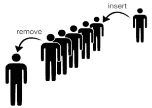
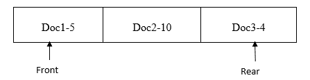

# Python 中队列数据结构是什么？

> 原文：<https://www.edureka.co/blog/queue-data-structure-in-python/>

因为您已经在前一篇文章中研究了数据结构的重要性，所以让我们直接进入文章的主题，即队列数据结构。我将讨论以下主题:

*   [对队列数据结构的需求](#need)
*   [日常生活中排队的例子](#daily)
*   [创建队列数据结构](#create)
*   排队
*   [出队](#dequeue)
*   [队列应用](#applications)

## **对队列数据结构的需求**

假设有一天你想去看电影。在电影院里，票是按照先到先得的原则发放的，人们一个接一个地站在后面等着轮到他们。那么，你会怎么做？？你一定是去了后面，站在最后一个等票的人后面。



在这里，人们一个接一个地站着，基于**先进先出(FIFO)** 机制为他们提供服务。这样的安排被称为**队列。**

## **日常生活中排队的例子**

让我们考虑一些在日常生活中使用队列类型的例子:

*   **电话应答系统-** 首先在您的小工具上拨打电话的人将首先获得服务。
*   **行李检查机**——检查先放在传送带上的行李。
*   **收费站上的车辆**——先到的车辆先走。
*   **呼叫中心**–电话系统将使用队列，让人们按顺序呼叫他们，直到服务代表空闲为止。

所有这些例子都遵循**先进后出**策略。

## **创建队列数据结构**

除了补充操作之外，我可以说队列上可能的主要操作有:

1.进入队列或将一个元素添加到队列末尾。

2.**取消队列**或从队列前面移除一个元素

现在，让我们从用 Python 创建类队列开始:

```
class Queue:
    def __init__(self,max_size):
        self.__max_size=max_size
        self.__elements=[None]*self.__max_size
        self.__rear=-1
        self.__front=0
```

*   **max_size** 是队列中预期的最大元素数。
*   队列的元素存储在 python 列表中
*   rear 表示队列中最后一个元素的索引位置。
*   因为队列是空的，所以尾部最初被取为-1
*   Front 表示队列中第一个元素的位置。
*   前端最初被认为是 0，因为它总是指向队列的第一个元素

## **入队**

现在，当您尝试将元素加入队列时，您必须记住以下几点:

*   队列中是否还有剩余空间，即，rear 是否等于 max_size -1
*   尾部将指向队列中插入的最后一个元素。

那么，算法会是什么呢？？

```
#returns max_size of queue
def get_max_size(self):
        return self.__max_size

#returns bool value whether queue is full or not, True if full and False otherwise
def is_full(self):
        return self.__rear==self.__max_size-1

#inserts/enqueue data to the queue if it is not full
def enqueue(self,data):
        if(self.is_full()):
            print("Queue is full. No enqueue possible")
        else:
            self.__rear+=1
            self.__elements[self.__rear]=data

#display all the content of the queue
def display(self):
        for i in range(0,self.__rear+1):
            print(self.__elements[i])

#You can use the below __str__() to print the elements of the DS object while debugging
def __str__(self):
        msg=[]
        index=self.__front
        while(index<=self.__rear):
            msg.append((str)(self.__elements[index]))
            index+=1
        msg=" ".join(msg)
        msg="Queue data(Front to Rear): "+msg
        return msg
```

现在，当您执行以下命令时:

队列 1 =队列(5)

#将所有必需的元素入队。

queue1.enqueue("A ")

queue1.enqueue("B ")

queue1.enqueue("C ")

queue1.enqueue("D ")

queue1.enqueue("E ")

queue1.display()

queue1.enqueue("F ")

打印(队列 1)

**输出:**

A

B

C

D

E

队列已满。不可能排队

队列数据(从前到后):A B C D E

## **从队列**

现在，当您已经将元素插入队列/使其入队时，您希望从前面将它们出队/删除，因此您需要注意以下事项:

*   队列中有元素，即后面不应等于-1。
*   其次，你需要记住，由于元素是从前面删除的，所以，在删除 front 之后，应该递增到指向下一个 front。
*   前端不应指向队列末端，即等于 max_size。

那么，算法会是什么呢？？

```
#function to check if queue is empty or not
def is_empty(self):
        if(self.__rear==-1 or self.__front==self.__max_size):
            return True
        else: return False

#function to deque an element and return it    
def dequeue(self):
if(self.is_empty()):
print("queue is already empty")
else:
data=self.__elements[self.__front]
self.__front+=1
         return data

#function to display elements from front to rear if queue is not empty    
def display(self):
if(not self.is_empty()):
         		for i in range(self.__front,self.__rear+1):
print(self.__elements[i])
 else:
            print("empty queue")
```

现在，当您执行以下命令时:

队列 1 =队列(5)

#将所有必需的元素排队

queue1.enqueue("A ")

queue1.enqueue("B ")

queue1.enqueue("C ")

queue1.enqueue("D ")

queue1.enqueue("E ")

打印(队列 1)

#将所有必需的元素出队

print(" dequeue:"，queue1.dequeue())

print(" dequeue:"，queue1.dequeue())

print(" dequeue:"，queue1.dequeue())

print(" dequeue:"，queue1.dequeue())

print(" dequeue:"，queue1.dequeue())

print(" dequeue:"，queue1.dequeue())

#显示队列中的所有元素。

queue1.display()

**输出:**

队列数据(从前到后):A B C D E

出列:A

出列:B

出列:C

:D 出列

出列:E

队列已经为空

出列:无

空队列

## **队列应用**

截至目前，您已经了解了队列的基本知识。现在，为了更深入，我们将研究它的一些应用。

*   **例 1:**

**Windows**中的打印队列使用一个队列来存储所有活动的和待定的打印作业。当我们想要打印文档时，我们一个接一个地发出打印命令。基于打印命令，文档将在打印队列中排队。当打印机准备好了，文件将被先进先出的顺序打印出来。

假设您已经为顺序为 doc1、随后是 doc2 和 doc3 的 3 个文档发出了打印命令。打印队列将被填充，如下所示:



**doc-n，其中 doc 是发送打印的文档，n，** 是文档的页数。例如，文档 2-10 表示要打印文档 2，它有 10 页。下面是模拟打印队列操作的代码。浏览代码，观察队列在这个实现中是如何使用的。

```
class Queue:
    def __init__(self,max_size):
        self.__max_size=max_size
        self.__elements=[None]*self.__max_size
        self.__rear=-1
        self.__front=0

    def is_full(self):
        if(self.__rear==self.__max_size-1):
                return True
        return False

    def is_empty(self):
        if(self.__front>self.__rear):
            return True
        return False

    def enqueue(self,data):
        if(self.is_full()):
            print("Queue is full!!!")
        else:
            self.__rear+=1
            self.__elements[self.__rear]=data

    def dequeue(self):
        if(self.is_empty()):
            print("Queue is empty!!!")
        else:
            data=self.__elements[self.__front]
            self.__front+=1
            return data

    def display(self):
        for index in range(self.__front, self.__rear+1):
            print(self.__elements[index])

    def get_max_size(self):
        return self.__max_size

#You can use the below __str__() to print the elements of the DS object while #debugging
    def __str__(self):
        msg=[]
        index=self.__front
        while(index<=self.__rear):
            msg.append((str)(self.__elements[index]))
            index+=1
        msg=" ".join(msg)
        msg="Queue data(Front to Rear): "+msg
        return msg

#function that enqueue are the documents to be printed in Queue named print_queue
def send_for_print(doc):
    global print_queue
    if(print_queue.is_full()):
        print("Queue is full")
    else:
        print_queue.enqueue(doc)
        print(doc,"sent for printing")

#function that prints the document if number of pages of document is less than #total number of pages in printer
def start_printing():
    global print_queue
    while(not print_queue.is_empty()):
	#here we dequeue the Queue and take the coument that was input first for printing.
        doc=print_queue.dequeue()
        global pages_in_printer
#the aim of this for loop is to find number of pages of the of document which is doc name followed by “-“
        for i in range(0,len(doc)):
            if(doc[i]=="-"):
                no_of_pages=int(doc[i+1:])
                break
        if(no_of_pages<=pages_in_printer):
            print(doc,"printed")
            pages_in_printer-=no_of_pages
            print("Remaining no. of pages in printer:", pages_in_printer)
        else:
            print("Couldn't print",doc[:i],". Not enough pages in the printer.")

pages_in_printer=12
print_queue=Queue(10)
send_for_print("doc1-5")
send_for_print("doc2-3")
send_for_print("doc3-6")
start_printing()
```

**输出:**

文件 1-5 已发送打印

文件 2-3 已发送打印

文件 3-6 已发送打印

文件 1-5 已打印

打印机剩余页数:7

文件 2-3 已打印

打印机剩余页数:4

无法打印文档 3。打印机中没有足够的页面

*   **例 2:**

让我们试着理解另一个使用队列数据结构的例子。你能试着理解代码并说出下面的函数是做什么的吗？

1.  定义乐趣(n):
2.  伫列=伫列(100)
3.  对于 num in 范围(1，n+1):
4.  排队(数量)
5.  结果=1
6.  while (not(aqueue.is_empty()):
7.  num = aqueue.dequeue()
8.  结果* =数量
9.  打印(结果)

当通过传递 n 调用 fun()函数时，

*   第 2 到 4 行将元素从 1 到 n 排队
*   第 5 行到第 8 行通过一个接一个地对这些元素进行排队来找到它们的乘积

至此，我们结束了这篇队列数据结构文章。如果你自己成功地理解并运行了代码，你就不再是队列数据结构的新手了。

*有问题吗？请在这篇文章的评论部分提到它，我们会尽快回复你。*

*要深入了解 Python 及其各种应用，您可以注册参加实时 **[Python 在线培训](https://www.edureka.co/python)** ，该培训提供全天候支持和终身访问。*