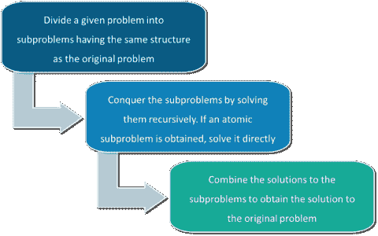
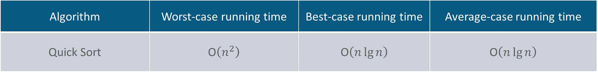
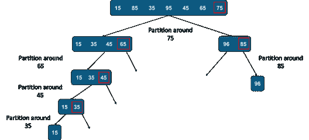
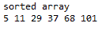

# 如何用 Java 实现快速排序？

> 原文：<https://www.edureka.co/blog/quicksort-in-java/>

快速排序是一种分治算法。在分而治之的算法设计范式中，我们递归地将问题分成子问题，然后求解子问题，最后将解组合起来得到最终结果。在这篇文章中，我们将关注于 Java 中的快速排序

本文将涉及以下几点:

*   [Java 中的快速排序](#QuickSortinJava)
*   [快速排序功能](#QuickSortFunction)
*   [分区代码](#PartitionCode)
*   [快速排序 Java 代码](#QuickSortJavaCode)

让我们开始吧！

在将问题划分为子问题时，需要记住的一点是，子问题的结构不会随着原始问题而改变。除法&征服算法有 3 个步骤:

*   划分:将问题分解成子问题
*   征服:递归地解决子问题
*   合并:合并解决方案以获得最终结果



有各种基于分治模式的算法。快速排序和合并排序就是其中之一。

虽然快速排序的最坏情况时间复杂度是 O(n2 ),这比许多其他排序算法(如合并排序和堆排序)都要高，但快速排序在实践中更快，因为它的内部循环可以在大多数体系结构和大多数真实世界的数据中有效地实现。



先说快速排序算法的实现。快速排序算法采用一个 pivot 元素，并围绕 pivot 元素划分数组。Quicksot 有许多变体，这取决于您如何选择 pivot 元素。有多种方法可以选择枢轴元素:

*   选择第一个元素
*   选择最后一个元素
*   选择一个随机元素
*   选取中间元素

接下来需要理解的重要事情是，快速排序算法中的 partition()函数。分区函数获取一个 pivot 元素，把它放在右边，把所有比 pivot 元素小的元素移到左边&所有比 pivot 元素大的元素移到右边。快速排序需要线性时间来完成。然后数组从 pivot 元素(即小于 pivot 的元素&大于 pivot 的元素)&分成两部分，两个数组都使用快速排序算法递归排序。



既然我们已经了解了快速排序算法的工作原理。让我们来了解一下如何用 Java 实现快速排序算法。

## 快速排序**功能:**

/* Quicksort 函数需要按最低和最高索引对数组进行排序*/

```
void sort(int arr[], int lowIndex, int highIndex)
{
//Until lowIndex = highIndex
if (lowIndex < highIndex)
{
// partitioning of the array
int p = partition(arr, lowIndex, highIndex);
// Recursively sort elements before & after partition
sort(arr, lowIndex, p-1);
sort(arr, p+1, highIndex);
}
}

```

现在让我们看看分区代码，了解它是如何工作的。

## 分区**代码**

在分区代码中，我们将选择最后一个元素作为枢纽元素。我们遍历整个数组(即在我们的例子中使用变量 j)。我们跟踪数组中最后一个最小的元素(即在我们的例子中使用变量 I)。如果我们发现任何元素小于枢轴，我们移动交换当前元素 a[j]与 arr[i]，否则我们继续遍历。

```
int partition(int arr[], int lowIndex, int highIndex)
{
//Making the last element as pivot
int pivot = arr[highIndex];
//Using i to keep track of smaller elements from pivot
int i = (lowIndex-1);
for (int j=lowIndex; j<highIndex; j++)
{
// If current element is smaller than or equal to pivot
if (arr[j] <= pivot)
{
i++; // increment i
//swap ith element with jth element
int temp = arr[i];
arr[i] = arr[j];
arr[j] = temp;
}
}
// moving pivot at its correct position
int temp = arr[i+1];
arr[i+1] = arr[highIndex];
arr[highIndex] = temp;
return i+1;
}

```

现在你已经理解了快速排序分区函数，让我们快速看一下完整的代码

## 快速排序 **Java 代码**

```
class QuickSort
{
// Partition Method
int partition(int arr[], int lowIndex, int highIndex)
{
int pivot = arr[highIndex];
int i = (lowIndex-1);
for (int j=lowIndex; j<highIndex; j++)
{
if (arr[j] <= pivot)
{
i++;
int temp = arr[i];
arr[i] = arr[j];
arr[j] = temp;
}
}
int temp = arr[i+1];
arr[i+1] = arr[highIndex];
arr[highIndex] = temp;
return i+1;
}

```

//排序方法

```
void sort(int arr[], int lowIndex, int highIndex)
{
if (lowIndex < highIndex)
{
int pi = partition(arr, lowIndex, highIndex);
sort(arr, lowIndex, pi-1);
sort(arr, pi+1, highIndex);
}
}

```

//打印数组的方法

```
static void printArray(int arr[])
{
int n = arr.length;
for (int i=0; i<n; ++i)
System.out.print(arr[i]+" ");
System.out.println();
}

```

//主方法

```
public static void main(String args[])
{
int arr[] = {101, 37, 68, 29, 11, 5};
int n = arr.length;
QuickSort ob = new QuickSort();
ob.sort(arr, 0, n-1);
System.out.println("sorted array");
printArray(arr);
}
}

```

**输出:**



现在，在执行了上面的 Java 程序之后，您应该已经理解了 QuickSort 是如何工作的&如何用 Java 实现它。这样，我们就结束了这篇关于“Java 快速排序”的文章。如果你想了解更多， 请查看 Edureka 值得信赖的在线学习公司提供的 [**Java 培训**](https://www.edureka.co/java-j2ee-training-course) 。Edureka 的 Java J2EE 和 SOA 培训和认证课程旨在培训您掌握核心和高级 Java 概念以及各种 Java 框架，如 Hibernate & Spring。

有问题要问我们吗？请在这个博客的评论部分提到它，我们会尽快回复你。