# R 教程——学习 R 编程的初学者指南

> 原文：<https://www.edureka.co/blog/r-tutorial/>

R 是最受欢迎的数据分析工具，因为它是开源的、灵活的、提供多种包并拥有巨大的社区。它是为软件程序员、统计学家和数据挖掘者设计的，因此，导致了带有 R ***认证*** 的[数据科学的流行。在这篇 R 教程博客里，我会用例子给你一个关于 R 的完整见解。](https://www.edureka.co/data-science-r-programming-certification-course)

下面是这篇 R 教程博客的主题，我将按以下顺序讨论:

1.  [我们为什么需要分析](#whyAnalytics)？
2.  [什么是商业分析](#BusinessAnalytics)？
3.  [为什么 R，谁用 R](#WhyR) ？
4.  [安装 R](#Installation)
5.  [数据操作符](#dataOperators)
6.  [数据类型](#dataTypes)
7.  [流量控制](#flowControl)

## **R 教程:我们为什么需要分析？**

在回答问题之前，我先给大家简单介绍一下 R 在多个领域的一些问题及其解决方案。


**银行业** :

银行每天都会产生大量的客户数据。当定期与数百万客户打交道时，跟踪他们的抵押贷款变得很困难。

*解* :

R 构建了一个自定义模型，维护提供给每个客户的贷款，这有助于我们确定客户在一段时间内要支付的金额。


**保险** :

保险在很大程度上依赖于预测。 很难决定接受或拒绝哪个政策。

*解:*

通过使用连续的信用报告作为输入，我们可以在 R 中创建一个模型，该模型不仅可以评估风险偏好，还可以进行预测。


**医疗:**

每年都有数百万人住院，仅在入院过程中就要花费数十亿美元。

*解* :

根据患者病史和医疗史，可以建立一个预测模型来确定谁有住院的风险，以及医疗设备应该扩展到什么程度。

现在，我们知道了数据分析如何帮助组织利用他们的数据并利用它来发现新的机会。如果我们谈论一个组织对分析的需求，你一定会遇到这 4 个方面:

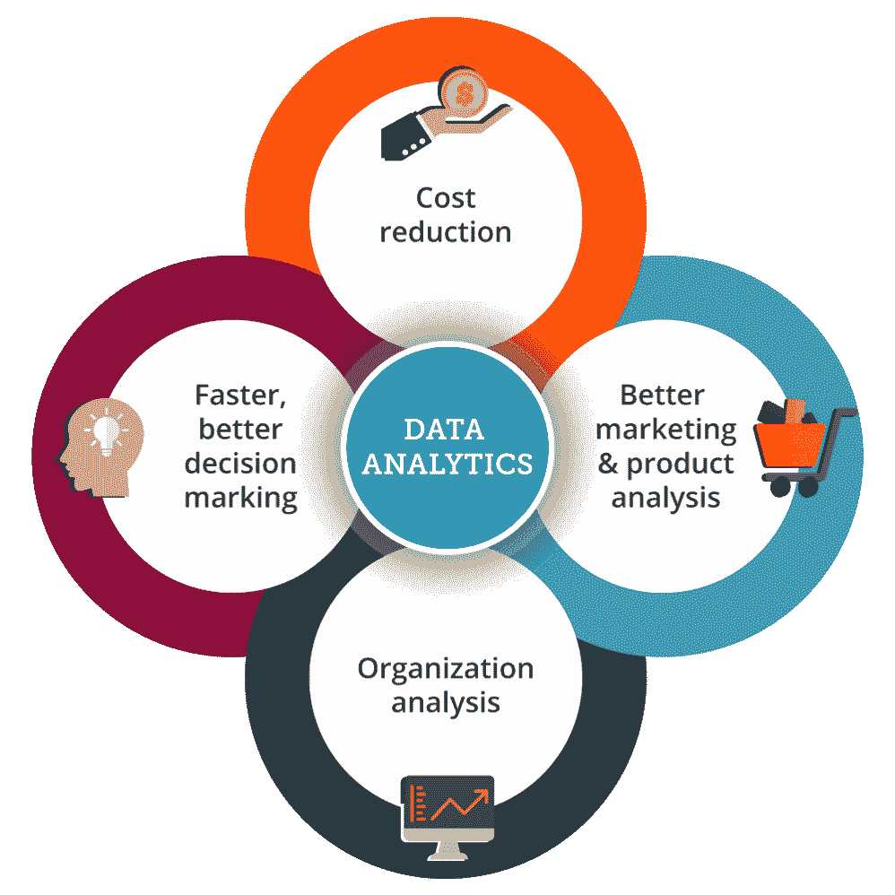

接下来，让我们在 R tutorial blog 中继续前进，在这里我们将首先了解到底什么是商业分析。

## **R 教程:什么是商业分析？**

商业分析是一个检查大量数据并获得隐藏模式、相关性和其他洞察力的过程。它基本上帮助你理解你收集的所有数据，无论是组织数据、市场或产品研究数据还是任何其他类型的数据。你很容易做出更好的决定，更好的产品，更好的营销策略等等。为了更好的理解，请参考下图:

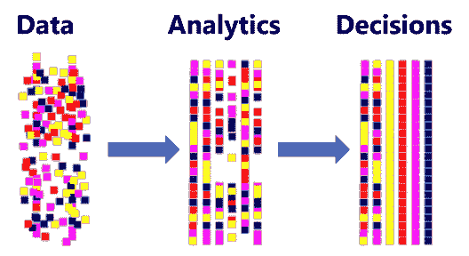

如果你看上图，你在第一张图中的数据是散乱的。现在，如果您想要特定的东西，比如数据库中的特定记录，这就变得很麻烦。为了简化这一点，你需要分析。通过分析，找出数据之间的关联变得很容易。一旦你确定了要做什么，你就很容易做出决定，比如，你想走哪条路，或者就商业分析而言，哪条路会让你的组织变得更好。

但是你不能指望上面的人总是理解你在分析后提供给他们的原始数据。因此，为了克服这个差距，我们有了一个概念*数据可视化*。

**数据可视化**:数据可视化是对你分析后生成的海量数据的可视化访问。人类的大脑处理视觉图像和视觉图形比原始数据更好。与原始数据相比，我们总是很容易理解饼状图或条形图。现在，您可能想知道如何从已经分析过的数据中实现这种数据可视化？ 市场上有各种数据可视化工具:


你们一定想知道已经有这么多工具可以帮助你们实现数据可视化和一定量的分析，为什么还要用 R？

所以我在 R 教程博客中的下一个话题是关于“为什么 R”和“谁使用 R”。

## **R 教程:为什么要 R，谁用 R？**

**为什么是 R？**

  R 是一种编程和统计语言。

  R 用于数据分析和可视化。

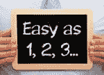  R 简单易学，读写。

R 是一个 FLOSS(自由和开源软件)的例子，在这里人们可以自由地分发这个软件的拷贝，阅读它的源代码，修改它，等等。

**谁用 R？**

*   消费者金融保护局使用 R 进行数据分析
*   John Deere 的统计学家以可靠且可重复的方式使用 R 进行时间序列建模和地理空间分析。
*   美国银行使用 R 进行报告。
*   R 是 Foursquare 著名推荐引擎背后的技术栈的一部分。
*   ANZ，澳洲第四大银行，使用 R 进行信用风险分析。
*   谷歌用 R 来预测经济活动。
*   负责 Firefox 网络浏览器的基金会 Mozilla 使用 R 来可视化网络活动。

下面是一些使用 R 的领域:


现在，让我们在 R 教程博客中前进，安装 R.

## **R 教程:安装 R**

让我来指导您在系统上安装 R 的过程。只需遵循以下步骤:

**第一步**:进入链接——https://cran.r-project.org/

**第二步**:在你的系统上下载并安装 R 3.3.3。

参考下面的截图，以便更好地理解。

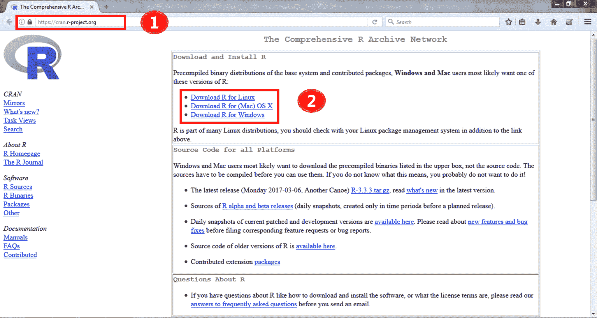

按照上面的步骤，你就完成了 R 安装部分。现在下载 RStudio IDE 就可以直接开始用 R 编码了。要下载该文件，请遵循以下步骤:

**第一步**:进入链接——https://www.rstudio.com/

**第二步**:在你的系统上下载并安装 Rstudio。

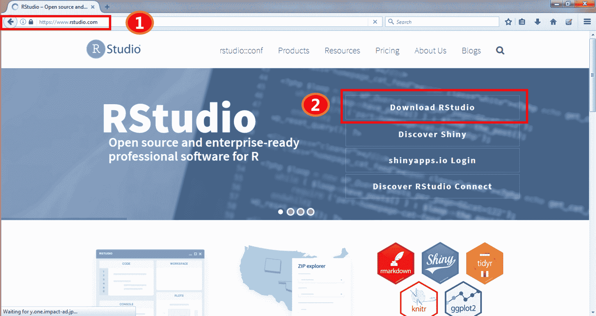

安装好所有东西后，您就可以开始编写代码了！

## **R 初学者教程| R 编程教程| edu reka**

[//www.youtube.com/embed/eDrhZb2onWY?rel=0&showinfo=0](//www.youtube.com/embed/eDrhZb2onWY?rel=0&showinfo=0)

接下来，让我们在 R 教程博客中继续前进，了解 R 中的数据运算符是什么

## **R 教程:R 中的数据运算符**

主要有 5 种不同类型的操作员，列举如下:

1.  **算术运算符**:执行加、减、乘、除等算术运算。
2.  **赋值运算符** : 赋值运算符用于赋值。例如:

*   **赋值运算符= 语法:** 变量名=值

```
>x=5
>x

```

```
Output : [1] 5 
```

*   **赋值运算符< - 语法:**变量名< -值

    ```
    >x<- 15
    >x
    ```

    ```
    Output : [1] 15
    ```

*   **赋值运算符< < - 语法:**变量名< < -值

```
>x <<- 2 >x
```

```
Output : [1] 2
```

*   **赋值运算符- > 语法:**值- >变量名

    ```
    >25 -> x
    >x

    ```

    ```
    Output : [1] 25
    ```

**3。关系运算符**:定义两个实体之间的关系。比如:<、>、< =、！=等等。

```
>x<-3
>x!=2
```

```
Output: [1] TRUE
```

**4。逻辑运算符**:这些运算符比较两个实体，通常与布尔(逻辑)值一起使用，如&、|和！。

```
>x<-2
>2&3 
```

```
Output: [1] TRUE
```

**5。特殊运算符**:这些运算符用于特定目的，而不是用于逻辑计算。例如:

*   它为一个向量创建一系列有序的数字。

    ```
    >x<-2:8
    >x
    ```

    

*   %in%该运算符用于识别一个元素是否属于一个向量。 例子

    ```
    >x<- 2:8
    >y<-5
    >y %in% x 
    ```

    ```
    Output : [1] TRUE
    ```

## **R 教程:数据类型**

数据类型是用来存储信息的。在 R 中，我们不需要将变量声明为某种数据类型。变量被赋予 R 对象，R 对象的数据类型成为变量的数据类型。R 中主要有六种数据类型:

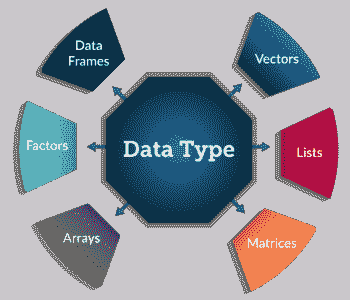

让我们更详细地了解每一项技术:

**向量**:向量是一个基本类型相同的数据元素序列。示例:

vtr = (1，3，5，7 9)

或

vtr < - (1，3，5，7 9)

有 5 个原子向量，也称为五类向量。

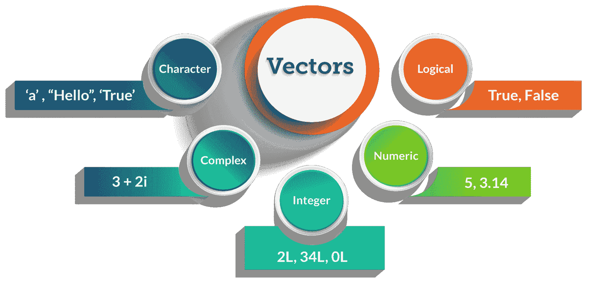  **列表**:列表是包含不同类型元素的 R 对象，比如数字、字符串、向量和其他列表。

```
>n = c(2, 3, 5)

>s = c("aa", "bb", "cc", "dd", "ee")

>x = list(n, s, TRUE)

>x
```

**输出**–

```
[[1]]
[1] 2 3 5
[[2]]
[1] "aa"  "bb"  "cc" "dd" "ee"
[[3]]
[1] TRUE 
```

**数组**:数组是可以存储二维以上数据的数据对象。它将向量作为输入，并使用 dim 参数中的值来创建一个数组。

```
vector1 <- c(5,9,3)

vector2 <- c(10,11,12,13,14,15)

result <- array(c(vector1,vector2),dim = c(3,3,2))
```

**输出**–

```
, , 1
     [,1] [,2] [,3]

[1,]    5   10   13

[2,]    9   11   14

[3,]    3   12   15

, , 2
     [,1] [,2] [,3]

[1,]    5   10   13

[2,]    9   11   14

[3,]    3   12   15
```

**矩阵**:矩阵是 R 对象，其中的元素以二维矩形布局排列。使用 Matrix()函数创建矩阵。例: *矩阵(data，nrow，ncol，byrow，dimnames)* where，

**数据**是输入向量，它成为矩阵的数据元素。

**nrow** 是要创建的行数。

**ncol** 是要创建的列数。

**byrow** 是逻辑线索。如果为真，则输入向量元素按行排列。

**dimname** 是分配给行和列的名称。

```
>Mat <- matrix(c(1:16), nrow = 4, ncol = 4 ) >Mat
```

**Output** :

```
         [,1]  [,2]  [,3]  [,4]
[1,]    1      5       9     13
[2,]    2      6       10   14
[3,]    3      7       11   15
[4,]    4      8       12   16
```

**因子**:因子是数据对象，用来对数据进行分类，并按层次存储。它们可以存储字符串和整数。它们在统计建模的数据分析中很有用。

```
>data <- c("East","West","East","North","North","East","West","West“,"East“)

>factor_data <- factor(data)

>factor_data
```

**输出** :

```
[1] East  West  East  North North East  West  West  East 
Levels: East North West
```

**数据帧**:数据帧是一个表格或类似二维数组的结构，其中每一列包含一个变量的值，每一行包含每一列的一组值。

```
>std_id = c (1:5)

>std_name = c("Rick","Dan","Michelle","Ryan","Gary")

>marks = c(623.3,515.2,611.0,729.0,843.25)

>std.data <- data.frame(std_id, std_name, marks)

>std.data
```

**输出** :

```
    std_id     std_name     marks

1      1          Rick            623.30

2      2          Dan            515.20

3      3         Michelle       611.00

4      4          Ryan          729.00

5      5          Gary           843.25
```

至此，我们结束了 R 中不同的数据类型，接下来，让我们在 R 教程博客中继续前进，理解另一个关键概念——流控制语句。

## **R 教程:流量控制语句**

流控制语句起着非常重要的作用，因为它们允许你控制一个函数中脚本的执行流。下图显示了最常用的流控制语句:

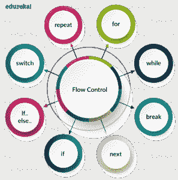现在，让我们用例子来讨论其中的每一个。

## **R 教程:选择器语句**

*   **If 控制语句**:该控制语句评估单个条件。这很简单，因为它只有一个关键字“if ”,后跟条件，然后是在条件为真的情况下需要执行的一组语句。请参考下面的流程图，以便更好地理解:

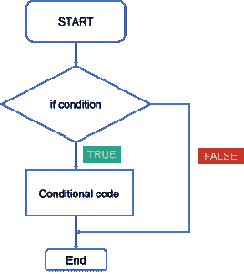在此流程图中，代码将以如下方式响应:

1.  首先，它将进入检查条件的循环。
2.  如果条件为真，将执行条件代码或编写的语句。
3.  如果条件为假，语句将被忽略。

下面是 R 中的 *if* 控制语句的例子，试着在 R Studio 中运行这个例子。

```

x=2
repeat {
x= x^2
print(x)
if(x>100) {
break
}
```

输出:

```
[1] 4
[1] 16
[1] 256
```

*   **If Else 控制语句** : Thi s 类控制语句对一组条件求值并选择语句。请参考下面的流程图，以便更好地理解:

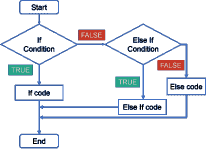在此流程图中，代码将以如下方式响应:

1.  首先，它将进入检查条件的循环。
2.  如果条件为真，将执行第一个“If”语句。
3.  如果条件为假，则转到‘else If’条件，如果为真，则执行‘else If’代码。
4.  最后，如果‘else if’代码也为假，那么它将转到‘else’代码并执行。这意味着如果这些条件都不为真，则执行“else”语句。

下面是 R 中的 *if else* 控制语句的例子。

```
x<-5
if(x>5) {
print("x is greater than 5")
}
elseif(x==5) {
print("x is equal to 5")
}
else {
print("x is not greater than 5")
}

```

输出:

```
[1] "x is equal to 5"
```

*   **开关语句**:这些控制语句基本上是用来比较某个表达式和某个已知值。请参考下面的流程图，以便更好地理解:

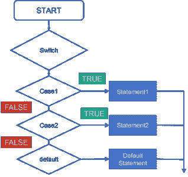在这个切换案例流程图中，代码将按以下步骤响应:

1.  首先，它将进入有表达式的开关盒。
2.  接下来，它将转到情况 1 条件，检查传递给该条件的值。如果为真，将执行语句块。之后，它将从那个开关盒中断开。
3.  如果为假，则切换到下一种情况。如果情况 2 的条件为真，它将执行该语句并从该情况中断，否则它将再次跳转到下一个情况。
4.  现在，假设您没有指定任何 case，或者用户输入了一些错误，那么它将转到默认 case，打印您的默认语句。

下面是 R 中 switch 语句的一个例子，试着在 R Studio 中运行这个例子。

```
vtr <- c(150,200,250,300,350,400)
option <-"mean"
switch(option,
"mean" = print(mean(vtr)),
"mode" = print(mode((vtr))),
"median" = print(median((vtr)))
)

```

输出:

```
[1] 275
```

## **R 教程:循环语句**

循环帮助你重复某些动作，这样你就不必重复执行它们。想象一下，你需要执行一个操作 10 次，如果你每次都开始写代码，程序的长度会增加，你以后会很难理解。但同时通过使用循环，如果我在循环中写同样的语句，它会节省时间并使代码可读性更好。它在代码效率方面也得到更多的优化。

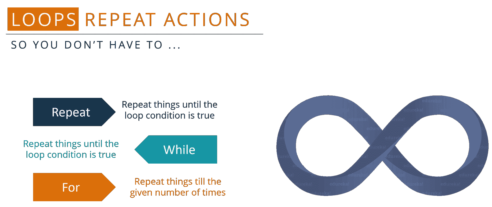

在上图中，*重复*和*，而*语句帮助您执行一组特定的规则，直到条件为真，但是【】的*是一个循环语句，当您知道要重复一个语句块多少次时使用。现在，如果你知道你想重复 10 次，那么你将使用“for”语句，但如果你不确定你想让代码重复多少次，你将使用“repeat”或“while”循环。*

让我们用例子来讨论每一个问题。

*   **重复**:重复循环帮助一次又一次地执行同一套代码，直到满足停止条件。请参考下面的流程图，以便更好地理解:

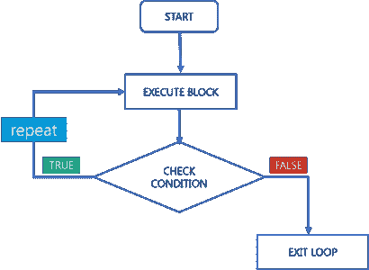

在上面的流程图中，代码将按照以下步骤进行响应:

1.  首先它会输入并执行一组代码。
2.  接下来，它将检查条件，如果是真的，它将返回并再次执行相同的代码集，直到它是假的。
3.  如果发现是假的，就直接退出循环。

*   **While**:While 语句也有助于一次又一次地执行同一套代码，直到满足停止条件。请参考下面的流程图，以便更好地理解:

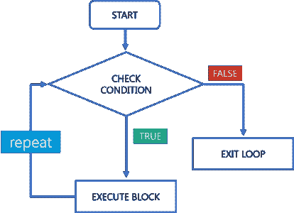

在上面的流程图中，代码将按照以下步骤进行响应:

1.  首先，它会检查条件。
2.  如果发现是真的，就会执行那套代码。
3.  接下来，它再次检查条件，如果为真，它将再次执行相同的代码。一旦发现条件为假，就立即退出循环。

下面是 R 中 while 语句的一个例子，试着在 R Studio 中运行这个例子。

```

x=2
while(x<1000)
{
x=x^2
print(x)
}

```

输出:

```
4
16
256
65536
```

所以你一定想知道这两种说法有什么不同？让我来消除你的疑虑！ 这里 repeat 和 while 语句的主要区别在于它根据你的条件而变化。*而*循环基本上定义了你什么时候要进入循环执行语句，而*重复*循环定义了你什么时候在执行完语句后离开循环。所以这两个语句被称为入口控制循环和出口控制循环。这就是 while 和 repeat 语句的不同之处。

*   **For 循环:**For 循环是在需要多次执行一段代码时使用的。请参考下面的流程图，以便更好地理解:

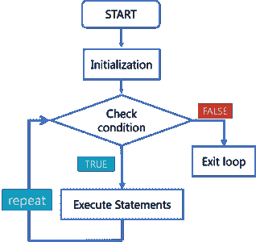在上面的流程图中，代码会按照以下步骤进行响应:

1.  首先有一个初始化，你指定你想要循环重复多少次。
2.  接下来，它检查条件。如果条件为真，它将执行这组代码指定的次数。
3.  一旦发现条件为假，就立即退出循环。

下面是 R 中 for 语句的一个例子，试着在 R Studio 中运行这个例子。

```

vtr <- c(7,19,25,65, 45)
 for( i in vtr) {
 print(i)
 }

```

输出:

```
7
19
25
65
45
```

接下来，让我们来看看 R Tutorial blog 中的最后一组语句，即跳转语句。

## **R 教程:跳转语句**

**Break 语句** : Break 语句有助于终止程序，并将控制权恢复到循环后的下一条语句。这些语句也用在 switch case 中。请参考下面的流程图，以便更好地理解:

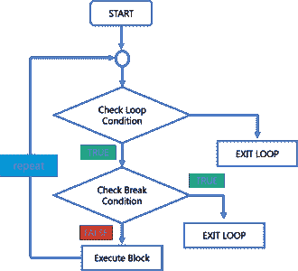在上面的流程图中，代码会按照以下步骤进行响应:

1.  首先，它将进入检查条件的循环。
2.  如果循环条件为假，则直接退出循环。
3.  如果条件为真，它将检查中断条件。
4.  如果中断条件为真，它从循环中存在。
5.  如果中断条件为假，那么它将执行循环中剩余的语句，然后重复相同的步骤。

下面是 R 中 jump 语句的一个例子，试着在 R Studio 中运行这个例子。

```
x <- 1:5
for (val in x) {
if (val == 3){
break
}
print(val)
}

```

输出:

```
[1] 1
[1] 2
```

**下一条语句**:当你想跳过循环的当前迭代而不终止它时，使用下一条语句。下一条语句与其他编程语言中的“继续”非常相似。请参考下面的流程图，以便更好地理解:

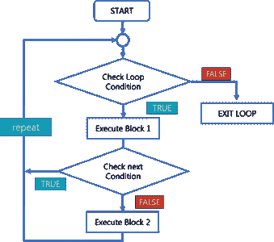

在上面的流程图中，代码将按照以下步骤进行响应:

1.  首先，它将进入检查条件的循环。

2.  如果循环条件为假，则直接退出循环。

3.  如果循环条件为真，它将执行 block 1 语句。

4.  之后，它将检查“下一条”语句。如果存在，那么之后的语句将不会在循环的同一次迭代中执行。

5.  如果“next”语句不存在，那么将执行其后的所有语句。

下面是 R 中 next 语句的一个例子，试着在 R Studio 中运行这个例子。

```

for(i in 1:15)
 {
 if((i%%2)==0) {
 next
 }
 print(i)
 }

```

输出:

```
1
3
5
7
9
11
13
15
```

R 教程博客到此结束。我希望你们都清楚我上面讨论的每一个概念。请继续关注，我的下一篇博客将会是关于 R 训练的，我将会用一些例子来详细解释一些 R 的概念。

既然你已经了解了 R 的基础知识，那就来看看 Edureka 的 **R 培训** *吧，edu reka 是一家值得信赖的在线学习公司，拥有遍布全球的 250，000 多名满意的学习者。Edureka 的数据分析与 R 培训将帮助您获得 R 编程、数据操作、探索性数据分析、数据可视化、数据挖掘、回归、情感分析方面的专业知识，并使用 R Studio 进行零售、社交媒体方面的真实案例研究。*

*有问题吗？请在这个“R 教程”博客的评论部分提到它，我们会尽快回复你。*