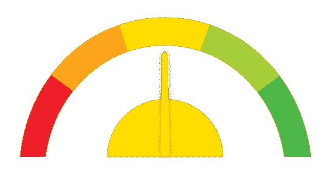
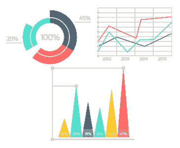
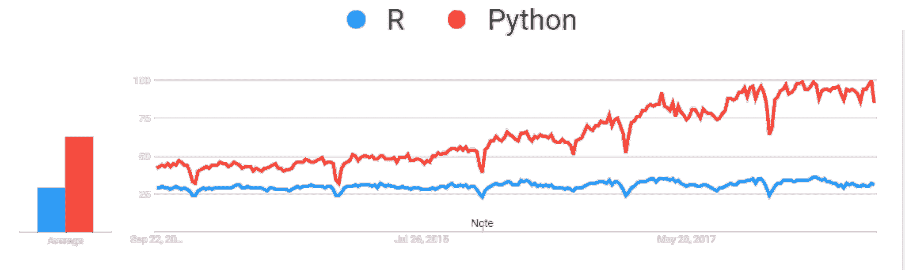
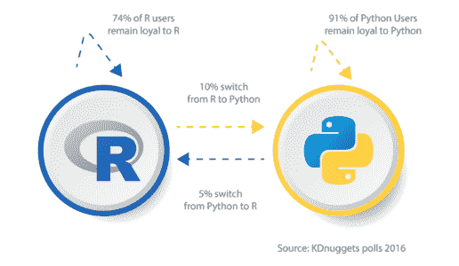
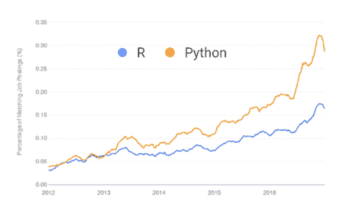

# R vs Python:精英之战

> 原文：<https://www.edureka.co/blog/r-vs-python/>

随着[大数据](https://www.edureka.co/blog/what-is-big-data/)、[机器学习](https://www.edureka.co/blog/what-is-machine-learning/)和[数据科学](https://www.edureka.co/blog/what-is-data-science/)在软件行业或软件服务公司中的重要性大幅增长，两种语言已经成为对开发者最有利的语言。关于 **R 与 Python** 的比较将为您提供关于这两种最受数据科学家和数据分析师欢迎和喜爱的语言的清晰知识。这篇 **R vs Python** 的博客将按以下顺序为您提供对这些语言的全面了解:

*   [R&Python](#introduction)简介
*   [比较因素](#comparison)
*   [易学性](#ease)
*   [速度](#speed)
*   [数据处理能力](#data)
*   [图形&可视化](#graphics)
*   [灵活性](#flexibility)
*   [人气指数](#popularity)
*   [工作场景](#job)
*   [社区&客户支持](#community)

[//html5-player.libsyn.com/embed/episode/id/10521842/height/360/theme/legacy/thumbnail/yes/direction/backward/](//html5-player.libsyn.com/embed/episode/id/10521842/height/360/theme/legacy/thumbnail/yes/direction/backward/)

[//html5-player.libsyn.com/embed/episode/id/10521842/height/360/theme/legacy/thumbnail/yes/direction/backward/](//html5-player.libsyn.com/embed/episode/id/10521842/height/360/theme/legacy/thumbnail/yes/direction/backward/)

## R & Python 简介

R 被认为是任何统计学家的最佳编程语言，因为它拥有大量的统计和图形方法。 [**Python**](https://www.edureka.co/blog/learn-python-for-data-science/) 另一方面，可以做与 [**R**](https://www.edureka.co/blog/r-tutorial/) 几乎相同的工作，但由于其简单性和高性能，它更受数据科学家或数据分析师的青睐。r 是一种强大的脚本语言，高度灵活，拥有活跃的社区和资源库，而 Python 是一种广泛使用的面向对象的语言，易于学习和调试。

因此，让我们继续比较 R 和 Python，看看比较因素。

## 比较因素

[**R**](https://www.edureka.co/blog/r-programming-language) 被引入用于数据分析，而 [**Python**](https://www.edureka.co/blog/python-tutorial/) 被开发为通用语言。前者最适用于即席分析和探索数据集，而后者适用于数据操作和重复任务。

让我们看看 **因素** 我们将在 **R vs Python:** 的 **比较中使用**

| **比较因素** | **R** | **Python** |
| 易于学习 |  |  |
| 速度 |  |  |
| 数据处理能力 |  |  |
| 图形和可视化 |  |  |
| 灵活性 |  |  |
| 流行 |  |  |
| 工作场景 |  |  |
| 社区支持 |  |  |

## 易于学习

R 有一个陡峭的学习曲线，有**很少或没有编程经验的人**一开始会发现**很难**。一旦你掌握了这门语言，理解起来就没那么难了。

Python 强调生产率和代码可读性，这使它成为最简单的编程语言之一。由于其易于学习和理解，它是优选的。

## 速度

r 是一种**低级**编程语言，因此对于简单的程序，它需要较长的代码。这是**减速**的一个原因。

Python 是一种**高级**编程语言，它已经成为构建关键而又**快速**应用的选择。

## 数据处理能力

由于**大量的包**，易于使用的测试和使用公式的优势，R 便于分析。但是它也可以用于基本的数据分析，而不需要安装任何包。

用于数据分析的 Python 包**是一个问题**，但这在最近的版本中有所改善。Numpy 和 Pandas 用于 Python 中的数据分析。它也适用于并行计算。

## 图形和可视化

可视化数据比原始值更容易理解。r 由许多提供高级图形功能的**包组成。**

在选择数据分析软件时，可视化很重要，Python 有一些令人惊叹的可视化库。 它有更多的库，但是**它们很复杂**并且输出很整齐。

## 灵活性

在 R 中使用复杂的公式**很容易，统计检验和模型也很容易获得和使用。**

当从零开始构建东西时，Python 是一种灵活的语言。它也用于编写网站或其他应用程序的脚本。

## 流行

现在，如果我们看看这两种语言的受欢迎程度，十年前它们从同一水平开始，但是 **Python 见证了受欢迎程度的巨大增长**，与排名第六的 R 相比，Python 在 2016 年排名第一。

**Python** 的用户比后者的用户对他们的语言更忠诚，因为从 R 转向 Python 的比例是 Python 转向 R 的两倍

## 工作场景

软件公司更倾向于诸如[**人工智能**](https://www.edureka.co/blog/what-is-artificial-intelligence) 和 [**大数据**](https://www.edureka.co/blog/big-data-tutorial) 等技术，这解释了对 Python 开发者需求的增长。虽然这两种语言都可以用于统计和分析，但是 Python 比另一种语言略胜一筹，因为它简单，在工作趋势中排名更高。

## 客户支持和社区

商业软件通常提供付费的客户支持，但 R 和 Python 没有客户服务支持，这意味着如果你遇到任何麻烦，你只能靠自己。尽管这两种语言都有在线社区来寻求帮助。**与 R. 相比，Python** 拥有**更大的社区支持**

至此，我们已经结束了 R 与 Python 的比较。这两种语言在数据科学和数据分析领域展开了正面交锋。但是 Python 在这两者中脱颖而出，因为它在编写代码方面非常流行和简单。

*既然你已经了解了 R & Python 之间的比较，那就来看看 Edureka 的 **[Python 认证培训](https://www.edureka.co/data-science-python-certification-course) & [R 认证培训](https://www.edureka.co/data-analytics-with-r-certification-training)** 吧，edu reka 是一家值得信赖的在线学习公司，拥有遍布全球的 25 万多名满意的学习者。*

*Python 认证培训将帮助您获得定量分析、数据挖掘和数据呈现方面的专业知识，通过将您的职业生涯转变为数据科学家角色来超越数字。*

*数据分析与 R 培训将帮助您获得 R 编程、数据操作、探索性数据分析、数据可视化、数据挖掘、回归、情感分析方面的专业知识，并在现实生活中使用 R Studio零售、社交媒体案例研究。*