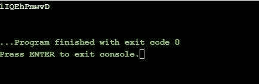

# Java 中如何处理随机数和字符串生成器？

> 原文：<https://www.edureka.co/blog/random-number-and-string-generator-in-java/>

本文将向您介绍 Java 中的[随机数](https://www.edureka.co/blog/generate-random-number-in-python/)和字符串生成器，并随后进行编程演示。本文将涉及以下几点:

*   [Java.util.Random](#Java.util.Random)
*   [Math.random()](#Math.random())
*   [Java . util . concurrent . threadlocalrrandom 类](#Java.util.concurrent.ThreadLocalRandomclass)
*   [在 Java 中生成随机字符串](#GeneratingrandomStringinJava)
*   [使用 Math.random()](#UsingMath.random())
*   [使用字符集](#UsingCharSet)
*   [使用正则表达式](#UsingRegularExpressions)

在 java 中，有三种使用内置方法和类生成随机数的方法。

*   Java.util.Random 类
*   数学随机方法
*   ThreadLocalRandom 类

让我们开始这篇关于 Java 中随机数和字符串生成器的文章，

## **Java** .util. **随机**

首先，我们需要在程序中创建该类的一个实例，然后使用我们创建的实例调用各种内置方法，如 nextInt()、nextDouble()等。使用这个类可以创建整数、浮点、双精度、长整型、布尔型的随机数。参数可以传递给定义上限的方法，直到生成数字。例如，nextInt(4)将生成范围为 0 到 3(包括 0 和 3)的数字。

**例 1:**

```
// A Java program to show random number generation
// using java.util.Random;
import java.util.Random;
public class Main{
public static void main(String args[])
{
// creating an instance of Random class
Random rand = new Random();
// Generating random integers in range 0 to 99
int int1 = rand.nextInt(100);
int int2 = rand.nextInt(100);
// Printing random integers
System.out.println("Random Integers:> "+int1);
System.out.println("Random Integers:> "+int2);
// Generating Random doubles
double dub1 = rand.nextDouble();
double dub2 = rand.nextDouble();
// Printing random doubles
System.out.println("Random Doubles:> "+dub1);
System.out.println("Random Doubles:> "+dub2);
}
}

```

**输出:**


**举例:**

```
// Java program to show random number generation
// using java.util.Random;
import java.util.Random;
public class Main{
public static void main(String args[])
{
// creating an instance of Random class
Random rand = new Random();
// Generating random integers in range 0 to 9
int int1 = rand.nextInt(10);
// Printing random integer
System.out.println("Random Integer:> "+int1);
}
}

```

**输出:**


继续这篇文章

## **数学**。**随机** ( **)**

名为 Math 的类包含各种方法，用于执行许多不同的数字运算，包括对数、求幂等。在这些操作中，有一个 random()用于生成范围在 0.0 和 1.0 之间的 doubles 类型的随机数。此方法返回一个大于或等于 0.0 且小于或等于 1.0 的 double 值以及一个正号。random()返回的值是机器随机选择的。

**例 1:**

```
// A Java program to demonstrate working of
// Math.random() to generate random numbers
import java.util.*;
public class Main
{
public static void main(String args[])
{
// Generating random value of data type double
System.out.println("Random value: " + Math.random());
}
}

```

**输出:**


为了检查随机性，让我们再次执行程序。

```
// A Java program to demonstrate working of
// Math.random() to generate random numbers
import java.util.*;
public class Main
{
public static void main(String args[])
{
// Generating random value of data type double
System.out.println("Another Random value: " + Math.random());
}
}

```

**输出:**


继续这篇关于 java 中随机数和字符串生成器的文章

## **Java . util . concurrent . threadlocalrrandom 类**

这个类是在 java 1.7 中引入的，用于生成整数、双精度数、布尔值等数据类型的随机数。 **例 1:**

```
// A Java program to demonstrate working of ThreadLocalRandom
// for generating random numbers.
import java.util.concurrent.ThreadLocalRandom;
public class Main
{
public static void main(String args[])
{
// Generating random integers in range 0 to 99
int int2 = ThreadLocalRandom.current().nextInt();
// Printing random integer
System.out.println("Random Integers: " + int2);
// Generating Random doubles
double dub1 = ThreadLocalRandom.current().nextDouble();
double dub2 = ThreadLocalRandom.current().nextDouble();
// Printing random doubles
System.out.println("Random Doubles: " + dub1);
System.out.println("Random Doubles: " + dub2);
}
}

```

**输出:**


**例 2:**

```
// Java program to demonstrate working of ThreadLocalRandom
// to generate random numbers.
import java.util.concurrent.ThreadLocalRandom;
public class Main
{
public static void main(String args[])
{
// Generating random booleans
boolean bool1 = ThreadLocalRandom.current().nextBoolean();
boolean bool2 = ThreadLocalRandom.current().nextBoolean();
// Print random Booleans
System.out.println("Random Booleans: " + bool1);
System.out.println("Random Booleans: " + bool2);
}
}

```

**输出:**


继续这篇关于 java 中随机数和字符串生成器的文章

## **在 Java 中生成随机字符串**

我们可以使用以下方法生成随机的字母数字字符串:

继续这篇关于 java 中随机数和字符串生成器的文章

## **使用数学**。**随机** ( **)**

下面是一个例子，可以更好地理解这个概念。

```
// A Java program generating a random AlphaNumeric String
// using Math.random() method
public class Main {
// define a function to generate a random string of length n
static String RequiredString(int n)
{
// chose a Character random from this String
String AlphaNumericString = "ABCDEFGHIJKLMNOPQRSTUVWXYZ"
+ "0123456789"
+ "abcdefghijklmnopqrstuvxyz";
// create StringBuffer size of AlphaNumericString
StringBuilder s = new StringBuilder(n);
int y;
for ( y = 0; y < n; y++) {
// generating a random number
int index
= (int)(AlphaNumericString.length()
* Math.random());
// add Character one by one in end of s
s.append(AlphaNumericString
.charAt(index));
}
return s.toString();
}
public static void main(String[] args)
{
// Get the size n
int n = 20;
// Get and display the alphanumeric string
System.out.println(Main.RequiredString(n));
}
}

```

**输出:**


继续这篇关于 java 中随机数和字符串生成器的文章

## **使用字符集**

这里我们必须使用一个不同的包，即 java.nio.charset 包。下面是一个例子。

```
// A Java program generate a random AlphaNumeric String
// using CharSet
import java.util.*;
import java.nio.charset.*;
class Main {
static String RequiredString(int n)
{
// length declaration
byte[] array = new byte[256];
new Random().nextBytes(array);
String randomString
= new String(array, Charset.forName("UTF-8"));
// Creating a StringBuffer
StringBuffer ra = new StringBuffer();
// Appending first 20 alphanumeric characters
for (int i = 0; i < randomString.length(); i++) { char ch = randomString.charAt(i); if (((ch >= 'a' && ch <= 'z') || (ch >= 'A' && ch <= 'Z') || (ch >= '0' && ch <= '9')) && (n > 0)) {
ra.append(ch);
n--;
}
}
// returning the resultant string
return ra.toString();
}
public static void main(String[] args)
{
// size of random alphanumeric string
int n = 10;
// Get and display the alphanumeric string
System.out.println(RequiredString(n));
}
}

```

**输出:**



继续这篇关于 java 中随机数和字符串生成器的文章

## **使用正则表达式**

实现如下例所示。

```
// A Java program generate a random AlphaNumeric String
// using Regular Expressions method
import java.util.*;
import java.nio.charset.*;
class Main {
static String getAlphaNumericString(int n)
{
// length declaration
byte[] array = new byte[256];
new Random().nextBytes(array);
String randomString
= new String(array, Charset.forName("UTF-8"));
// Creating a StringBuffer
StringBuffer ra = new StringBuffer();
// remove all spacial char
String AlphaNumericString
= randomString
.replaceAll("[^A-Za-z0-9]", "");
// Append first 20 alphanumeric characters
// from the generated random String into the result
for (int k = 0; k < AlphaNumericString.length(); k++) {
if (Character.isLetter(AlphaNumericString.charAt(k))
&& (n > 0)
|| Character.isDigit(AlphaNumericString.charAt(k))
&& (n > 0)) {
ra.append(AlphaNumericString.charAt(k));
n--;
}
}
// returning the resultant string
return ra.toString();
}
public static void main(String[] args)
{
// size of random alphanumeric string
int n = 15;
// Get and display the alphanumeric string
System.out.println(getAlphaNumericString(n));
}
}

```

**输出:**


这样我们就结束了这篇文章。如果您希望了解更多，请查看由 Edureka(一家值得信赖的在线学习公司)提供的  [Java 认证课程](https://www.edureka.co/java-j2ee-training-course)。Edureka 的 Java J2EE 和 SOA 培训和认证课程旨在培训您掌握核心和高级 Java 概念以及各种 Java 框架，如 Hibernate & Spring。

有问题要问我们吗？请在这个博客的评论部分提到它，我们会尽快回复你。