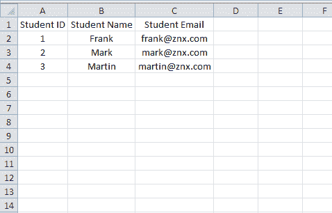
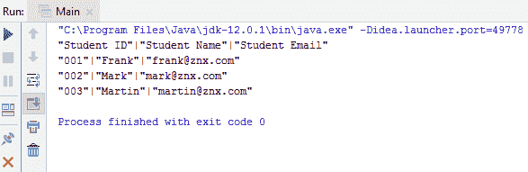
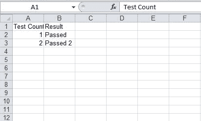

# 如何在 Java 中读写 Excel 文件

> 原文：<https://www.edureka.co/blog/read-write-excel-file-in-java/>

用 java 读写文件是每个程序员都需要知道的非常基础的东西。本文将重点介绍如何在 [java](https://www.edureka.co/blog/java-tutorial/) 中读写 Excel 和 CSV 文件。本文将涉及以下几点:

*   [简介](#Introduction)
*   [什么是 CSV 文件？](#WhatisaCSVfile?)
*   [如何用 Java 写一个 CSV 文件？](#HowtowriteaCSVfileinJava?)
*   [如何在 Java 中读取 CSV 文件？](#HowtoreadCSVfileinJava?)
*   [什么是 Excel 文件？](#WhatisanExcelfile?)
*   [如何用 Java 编写 Excel 文件？](#HowtowriteExcelfileinJava?)
*   [如何用 Java 读取 Excel 文件？](#HowtoreadExcelfileinJava?)

继续这篇关于用 Java 读写 Excel 和 CSV 文件的文章

## **简介**

先说 JAVA 中的读写文件。让我们看一个简单的场景，我们想用 JAVA 写一个文件。假设我们有一个简单的文本文件，我们想将一些数据写入该文本文件，那么 Java 程序如何将这些数据写入该文件呢？ 1。首先，我们在 Java 程序中以写模式打开文本文件，因为我们想将一些数据写入文件。 2。现在我们有了文件对象，之后，我们在文件对象中添加一些字符串。 3。最后，我们将更改刷新到文件中并关闭文件。

现在我们来谈谈如何在 JAVA 中读取文件假设我们有一个包含一些数据的文本文件，我们想读取这些数据。

1.首先，我们需要以读取模式打开文件，并将数据传递给 file 对象。 2。接下来需要从文件中逐行读取数据，为此我们创建一个循环，从文件中逐行读取数据。 3。在完成从文件中读取数据后，我们需要关闭文件。

继续这篇关于用 Java 读写 Excel 和 CSV 文件的文章

## **什么是 CSV 文件？**

现在我们来谈谈 CSV 文件，CSV 文件是一个普通的文件，但是它包含了用逗号分隔的数据。CSV 文件将表数据存储到一个简单的文本文件中。在我们的示例中，我们创建了一个 CSVReadWrite.java 文件来读写该文件。

继续这篇关于用 Java 读写 Excel 和 CSV 文件的文章

## **如何用 Java 写一个 CSV 文件？**

让我们举一个简单的例子，我们写一个 CSV 文件。为此，我们使用 openCSV 库。首先，我们将文件路径加载到 CSVWriter 中，然后设置列，然后推送数据，两者都用逗号分隔。writeNext 方法用于将数据推送到文件。

继续这篇关于用 Java 读写 Excel 和 CSV 文件的文章

## **如何在 Java 中读取 CSV 文件？**

先说用 java 写一个 CSF 文件。在我们的示例中，我们创建了 readingCSVFile 方法来读取 CSV 文件。我们使用 FileReader 对象来加载文件，使用 BudfferedReader 类来读取文件。然后我们开始逐行读取文件 readFilerow。然后我们用逗号分割数据并保存到数组中，最后按索引打印数据。

**CSVReadWrite.java**

```
package com.excelcsv;
import com.opencsv.CSVWriter;
import java.io.*;
public class CSVReadWrite {
String filePath;
CSVWriter file;
CSVReadWrite(String filePath){
this.filePath = filePath;
}
// writing csv file function
public void writingCSVFile(){
try {
file = new CSVWriter(new FileWriter(new File(filePath)));
String[] colName = { "Student ID", "Student Name", "Student Email" };
file.writeNext(colName);
String[] data = {"001", "Frank", "frank@znx.com"};
String[] data1 = {"002", "Mark", "mark@znx.com"};
String[] data2 = {"003", "Martin", "martin@znx.com"};
file.writeNext(data);
file.writeNext(data1);
file.writeNext(data2);
file.close();
} catch (Exception e) {
e.printStackTrace();
}
}
// reading csv file
public void readingCSVFile(){
try {
BufferedReader readFile = new BufferedReader(new FileReader(filePath));
String readFilerow;
while ((readFilerow = readFile.readLine()) != null) {
String[] data = readFilerow.split(",");
System.out.println(data[0]+"|"+data[1]+"|"+data[2]);
}
readFile.close();
} catch (FileNotFoundException e) {
e.printStackTrace();
} catch (IOException e) {
e.printStackTrace();
}
}
}

```





继续这篇关于用 Java 读写 Excel 和 CSV 文件的文章

## **什么是 Excel 文件？**

在谈论 excel 文件之前，我们先来谈谈微软的 Excel，微软的 Excel 是一个软件程序，它在电子表格中用来读取、写入和计算表格中的数据。当我们存储一个 Microsoft Excel 文件时，该文件调用具有扩展名的 Excel 文件。xls(旧)或。xlsx(较新)。

继续这篇关于用 Java 读写 Excel 和 CSV 文件的文章

## **如何用 Java 编写 Excel 文件？**

现在让我们来讨论在 excel 中的文件编写，我们使用 JExcel API 来编写 xls 格式的文件，因为 Excel 文件是用 Microsoft Excel 软件打开和编辑的特定文件。我们需要创建一个 WritableWorkbook 对象，并在 Workbook.createWorkbook 方法中设置文件路径。接下来，我们调用 createSheet 方法来创建一个新的工作表并设置标签。最后，我们需要添加单元格，为此我们调用方法 add cell，并传递包含要放入 excel 文件的数据的 label 对象。最后，我们调用 excelSheet.write 方法将数据写入 excel 文件。

继续这篇关于用 Java 读写 Excel 和 CSV 文件的文章

## **如何用 Java 读取 Excel 文件？**

在读取 excel 文件的最后阶段，我们首先在 Workbook.getWorkbook 中设置文件路径，接下来我们创建一个 sheet 对象并获取工作表。接下来，我们创建一个单元格对象，并从工作表对象中获取一个单元格。现在我们想打印数据，所以我们对 cell 对象调用 getContents 方法，这将返回特定单元格的数据。

**ExcelReadWrite.java**

```
package com.excelcsv;
import jxl.Cell;
import jxl.Sheet;
import jxl.Workbook;
import jxl.read.biff.BiffException;
import java.io.File;
import java.io.IOException;
public class ExcelReadWrite {
String filePath;
ExcelReadWrite(String filePath){
this.filePath = filePath;
}
// writing excel file
public void writeExcelFile(){
WritableWorkbook excelSheet = null;
try {
excelSheet = Workbook.createWorkbook(new File(filePath));
WritableSheet excelFile = myFirstWbook.createSheet("Sheet 1", 0);
Label label = new Label(0, 0, "Test Count");
excelFile.addCell(label);
Number number = new Number(0, 1, 1);
excelFile.addCell(number);
label = new Label(1, 0, "Result");
excelFile.addCell(label);
label = new Label(1, 1, "Passed");
excelFile.addCell(label);
number = new Number(0, 2, 2);
excelFile.addCell(number);
label = new Label(1, 2, "Passed 2");
excelFile.addCell(label);
excelSheet.write();
}catch (Exception e){
e.printStackTrace();
}
}
// reading excel file
public void readExcelFile(){
try {
excelSheet = Workbook.getWorkbook(new File(filePath));
Sheet sheet = workbook.getSheet(0);
Cell cell1 = sheet.getCell(0, 0);
System.out.print(cell1.getContents() + ":");
Cell cell2 = sheet.getCell(0, 1);
System.out.println(cell2.getContents());
Cell cell3 = sheet.getCell(1, 0);
System.out.print(cell3.getContents() + ":");
Cell cell4 = sheet.getCell(1, 1);
System.out.println(cell4.getContents());
System.out.print(cell1.getContents() + ":");
cell2 = sheet.getCell(0, 2);
System.out.println(cell2.getContents());
System.out.print(cell3.getContents() + ":");
cell4 = sheet.getCell(1, 2);
System.out.println(cell4.getContents());
} catch (IOException e) {
e.printStackTrace();
}
}
}

```



为了处理异常处理，我们在 try-catch 块之间编写了两个类代码。包含主方法的 Main.java 主 java 文件在这里我们调用两个类，然后我们创建一个 csvObj 来处理读写 CSV 文件，并创建另一个对象 execObj 来读写 excel 文件。这个文件处理我们程序的主要功能。

**Main.java**

```
package com.excelcsv;
public class Main {
public static void main(String[] args) {
/**
* reading and writing CSV file here
*/
// creating CSVReadWrite class object
CSVReadWrite csvObj = new CSVReadWrite(System.getProperty("user.dir")+"output_csv.csv");
// writing CSV file
csvObj.writingCSVFile();
// read csv file
csvObj.readingCSVFile();
/**
* reading and writing Excel file here
*/
// creating ExcelReadWrite object
ExcelReadWrite excObj = new ExcelReadWrite(System.getProperty("user.dir")+"output_excel.xls");
// writing excel file
excObj.writeExcelFile();
// reading excel file
excObj.readExcelFile();
}
}

```

至此，我们结束了这篇用 Java 读写 Excel 和 CSV 文件的文章。

*查看 Edureka 提供的  [**Java 认证课程**](https://www.edureka.co/java-j2ee-training-course)* *，edu reka 是一家值得信赖的在线学习公司，在全球拥有超过 250，000 名满意的学习者。Edureka 的 Java J2EE 和 SOA 培训和认证课程是为想成为 Java 开发人员的学生和专业人士设计的。该课程旨在为您提供 Java 编程的良好开端，并训练您掌握核心和高级 Java 概念以及各种 Java 框架，如 Hibernate & Spring。*

有问题要问我们吗？请在这个“用 Java 读写 Excel 和 CSV 文件”博客的评论部分提到它，我们会尽快回复你。