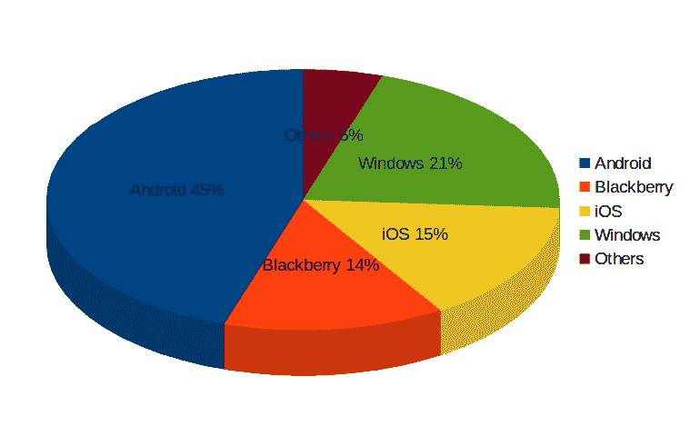
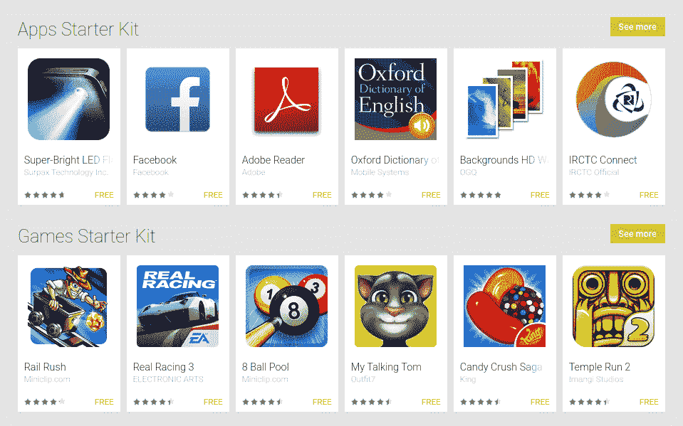
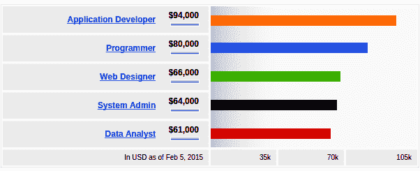

# 学习 Android 开发的 6 个理由

> 原文：<https://www.edureka.co/blog/reasons-to-learn-android-development/>

我们正处于一个谷歌的 Android 操作系统已经渗透到世界各个角落的时代。根据来自 Statista.com 和 Mashable.com 的报告，安卓以 80%的智能手机总销量引领全球智能手机市场，雇主雇佣拥有[认证的安卓应用开发专业知识的专业人士](https://www.edureka.co/android-development-certification-course)的速度远快于任何其他移动技术领域的专业人士。一边是最近所有 Nexus 和摩托罗拉手机的最新 Android Lollipop 的空中下载更新，另一边是下一版本的 Android 5.1 (lollipop-II)已经推出。

那么，对有抱负的 Android 开发者有什么好处呢？为什么要从 Android 开始应用程序开发？以下是一些有趣的原因:

## **原因#1 开源代码——做自己想要的**

Android 操作系统最好的部分是它的开源特性。比以前，很多电子产品制造商像三星，HTC &华硕(仅举几例！)已经获得了代码，这使得他们可以很容易地在智能手机上使用它。

据 IDC 称，Android 在智能手机中的全球份额将在 2015 年达到顶峰！下面是详细的预报:

由于许多 Android 设备变得越来越高效和实惠，市场规模预计将会增长。这到了不同版本的 Android 本身已经通过 Cyanogen 这样的公司推出了 Cyanogen mod(一加一& Micromax Yu Yureka 有人吗？).

## **理由#2 谷歌 Play 商店——巨大的应用市场**

自从谷歌推出 play store 以来，体验应用程序的乐趣只翻了十倍。曾经有一段时间，我们都仰视苹果的 iTunes 商店，有时想要一部 iphone 几乎是不可能的。但有了 Google play 商店和 Android 智能手机，访问应用程序对所有人来说都变得如此容易。

## 

让我们来看看一些数字……

*   Android 是 300 部智能手机、90 部平板电脑&和 6 款电子阅读器的主要操作系统
*   全球每天大约有 150 万台 Android 设备被激活。
*   Google Play 商店中有超过 1，460，800 个应用程序&在增长！
*   超过 60%的安卓应用是免费的！

## **原因#3 蓬勃发展的就业前景**

由于 Android 提供了一个有趣的收入模式，许多组织都有一个专门的应用程序开发团队，招聘的步伐也越来越快。学习 app 开发的独特优势在于学习者可以选择工作或者自由职业。同样，一旦这个人掌握了通过 Android 开发应用程序，为其他操作系统开发应用程序就变得很容易了！

下面的图表只是一个假设，假设一个人对 Java 有所了解，并知道他/她会从那里走向何方。

## 

这里清楚地表明，对于热爱开发应用程序的专业人士来说，应用程序开发是一条很有前途的职业道路。

## **原因#4 收入模式**

您知道 Google play 商店中最贵的应用程序是 200 美元的 Abu Moto collection 应用程序吗？奇怪但真实。这个应用程序是专门为富人开发的。稍后会有更多，但谷歌允许开发者在 Google play 商店中以更高的价格为他们的应用定价，这一事实使得它非常值得。

想象一下，你以大约 1 美元的价格创建了一个应用程序，并在谷歌上发布，每天有超过 150 万的 Android 设备被激活！就算安卓用户总数的 1%下载了你的应用，你能赚多少？你算算…

## *$ 1 X 1% X 150 万= 1.5 万美元！*

## 不同的支付模式:

**应用下载**——一旦应用在 Google play 商店中推出，应用开发者可以为应用定价并发布下载，谷歌将在扣除 play 商店费用后支付。

广告收入——这种模式在免费应用中很常见，谷歌会向开发者付费，以换取在应用中放置广告。很多开发者都从这种模式中受益。

## **原因#5 在不同设备上渗透**

安卓无处不在。让我们面对现实吧。最近，推出了 Moto 360 以与苹果智能手表竞争，然后是由 Android 操作系统驱动的谷歌眼镜。令人瞠目结舌的是，Android 设备总销量为 11.7545 亿台！

支持的一些设备包括智能电视、智能手机、平板电脑、便携式媒体播放器、相机、VoIP 电话、视频游戏播放器、车载 DVD 播放器、车载系统、智能手表甚至无人机……

## **对开发者有什么好处？**

很简单。不同的设备提供不同的机会！例如，智能电视用户对应用程序的期望与智能手机用户不同。从这个小小的洞见中得到启示，应用程序开发人员可以为每种类型的客户群推出应用程序，从而扩大他们的基础，并多次增加他们的收入。

## **原因#6 渐进学习曲线**

对于开发 Android 应用程序需要学习什么，Android 应用程序开发人员有很多顾虑。人们不得不承认，这个人必须具有创新精神，能够在市场中发现机会，并开发新的想法。但除此之外，这里还有一些重要的技能:

**Java**——了解 Java 很重要，因为 Android 应用程序中有 Java 编码。

**XML**——其次，XML 是 Android 应用程序开发的第二重要技能，因为它使你能够进行应用程序布局和设计。

有一个免费教程可能会让你感兴趣，开始使用 Android Lollipop 开发应用程序。

[https://www.youtube.com/embed/5bFfGpyvfYo](https://www.youtube.com/embed/5bFfGpyvfYo)

## 它是这样工作的:

## 

当然，这些步骤并不十分简单，并且省略了一些次要步骤，但是这将会给你一个简要的描述。对于任何应用程序开发人员来说，关注谷歌的 android 操作系统是第一重要的，因为它提供了一个巨大的市场，任何人都可以成为这个不断增长的故事的一部分，并且对你技能的即时认可与 android 只有咫尺之遥。

## 学习 android 应用程序开发的 6 大理由。更多详情您可以 [点击这里](https://www.edureka.co/android-development-certification-course)

*有问题吗？在评论区提到它们，我们会给你回复。*

**相关帖子:**

**[【Android 架构入门】](https://www.edureka.co/blog/beginners-guide-android-architecture/)**

**[安卓开发历程](https://www.edureka.co/android-development-certification-course)**

## 