# 递归神经网络(RNN)教程|使用 Python 中的张量流分析序列数据

> 原文：<https://www.edureka.co/blog/recurrent-neural-networks/>

在这篇博客中，让我们来讨论递归神经网络工作背后的**概念**。递归 神经网络在图像和视频识别、音乐创作和机器翻译方面有**广泛的应用**。

我们将检验以下概念:

*   [为什么不是前馈网络？](#z1)
*   [什么是递归神经网络？](#z2)
*   [如何训练递归神经网络？](#z3)
*   [消失和爆炸渐变](#z4)
*   [【长短期记忆(LSTM)网络](#z6)
*   [LSTM 用例](#z7)

## **为什么不是前馈网络？**

考虑一个**图像分类**用例，其中**训练**神经网络**对各种**动物的图像**进行分类。**

所以，假设你**在一只**猫**或一只**狗的**图像**中喂养**，**网络实际上提供了一个**输出**，带有分别对应于猫或狗**图像的**对应标签**。**

考虑下图:


在这里，作为**大象**的**第一输出**将对作为**狗的**先前输出**的**没有影响**。**这意味着**‘t’**时刻的输出与**‘t-1’**时刻的输出**无关。**

考虑这个**场景**，其中您将要求**使用之前获得的**输出的**:**

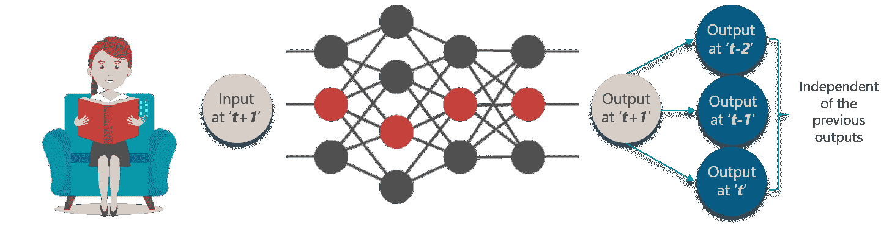 这个概念类似于**读**一本**的书。**随着**进入每一页**，你需要**理解**前几页**的**才能让**完全理解**信息**在大多数**情况下。****

利用**前馈网络**，在时间**‘t+1’**的**新**输出与在时间 t、t-1 或 t-2 的输出**没有关系**。

所以，当**预测**一个句子中的**单词**时，不能使用**前馈网络，因为它与**之前的**组**单词没有**绝对关系**。****

但是，有了**递归神经网络，**这个挑战可以被**克服。**

考虑下图:

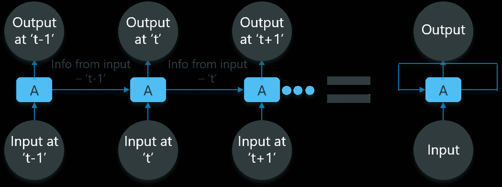

在上图中，我们在**‘t-1’**处有**个特定输入**，这些输入**馈入**网络。这些**输入**也将在时间‘t-1’导致**相应的输出**。

在**下一个时间戳，来自**前一个**输入‘t-1’的**信息随着**输入‘t’处的**被提供给**，最终**也在‘t’处提供**输出。**

重复此过程**，**以确保**最新输入**被**知晓**并且可以使用从先前**时间戳**获得的**信息**。

接下来在这个**递归神经网络**博客中，我们需要看看**什么是**递归神经网络**。**

## **什么是递归神经网络？**

递归网络是一种**型**的**人工神经网络**，设计用于**识别数据序列中的模式**，如**文本、**基因组、手写、口语、数字乘以**系列**传感器发出的数据、**股票市场**和**政府机构。**

为了更清楚，考虑下面的**类比:**

你定期去**健身房**，而**教练**已经给了你以下**日程**供你锻炼:


注意，所有这些**练习**都是每周按顺序**重复**的**。** 首先，让我们用一个**前馈网络**来尝试和**预测**运动的类型。

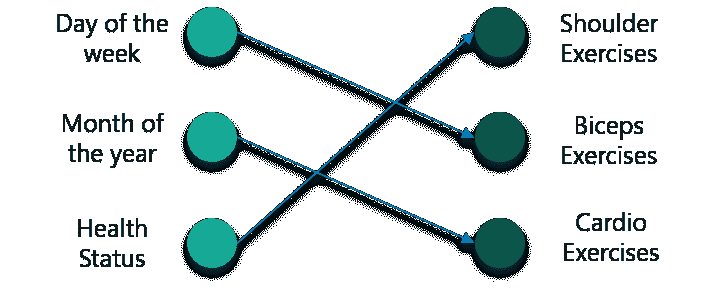

输入是**日、**月和**健康状态。**必须使用这些输入对神经网络进行**训练**，为我们提供**练习的**预测**。**

然而，考虑到输入，这将**不是非常准确**。为了**修复** **这个，**我们可以利用**递归神经网络**的概念如下:

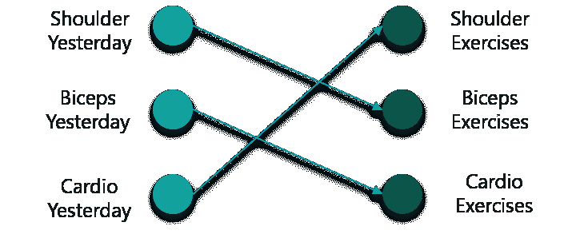

在这种情况下，将**输入**视为前一天在**完成的**锻炼**。**

所以，如果你昨天做了**肩部锻炼**，你今天就可以做**二头肌锻炼**，这个**也会在**周**的**休息**中继续**。

但是，如果你碰巧**在健身房错过了** **一个** **日**，那么来自**之前参加的时间戳**的数据可以被**认为是**如下图:

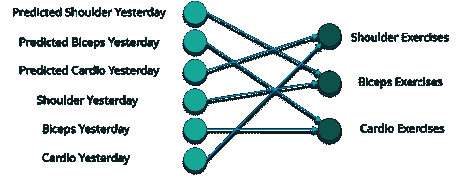 如果一个**模型**基于数据被训练，它**可以从**之前的练习中获得**，**模型的输出将**极其精确。**

总而言之，让我们**把我们拥有的**数据**转换成**向量**。**嗯，**什么是矢量？**

**向量**是**数字**，它们被输入到**模型中**到**表示**，如果你已经**做了**练习**或者**没有做。 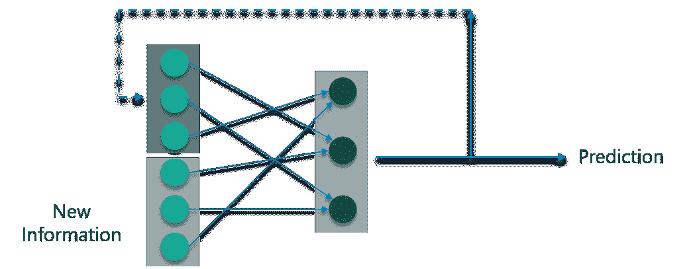

因此，如果你有一个**肩部运动，**对应的**节点**将是**‘1’**，**运动**的**休息**节点将被**映射**到**‘0’。**

让我们来看看**神经网络的**工作**背后的**数学**。**考虑下图:

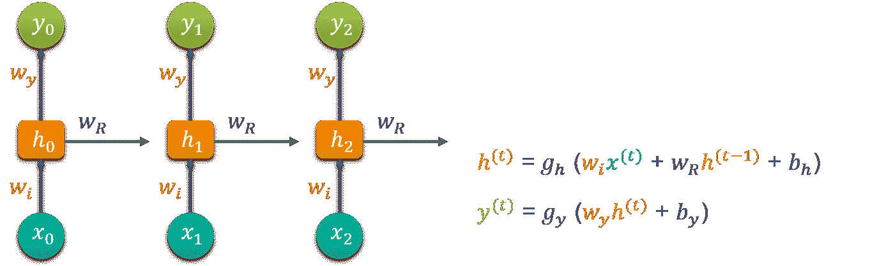 认为**【w】**为**权重矩阵**和**【b】**为**偏差:**

在时间 **t=0，**输入为**‘x0’**，任务是计算出什么是【T5’‘h0’。将 **t=0** 代入**方程**，得到函数 **h(t)值。**接下来，当应用于**新公式时，使用**先前计算的值**找出**‘y0’**的值。**

这个过程是**重复**到**模型中所有**时间戳**的**到**列车**模型。****

那么，**如何**训练循环神经网络**？**

View Upcoming Batches For The AI and Deep Learning Course Now! [<button>Read Now</button>](https://www.edureka.co/ai-deep-learning-with-tensorflow)

## **训练递归神经网络**

递归神经网络使用**反向传播算法**进行训练，**但**对每个**时间戳应用**。**俗称**穿越时间的反向传播(BTT)。****

有**一些关于反向传播的**问题，例如:

*   **消失渐变**
*   **爆炸渐变**

让我们逐一考虑这些因素，以了解发生了什么

## **消失渐变**

当利用**反向传播**时，**的目标**是**计算**误差**，该误差是通过**找出**实际输出**和**模型输出**之间的**差值**并将其提高到 2 的幂而实际得到的。

考虑下图:

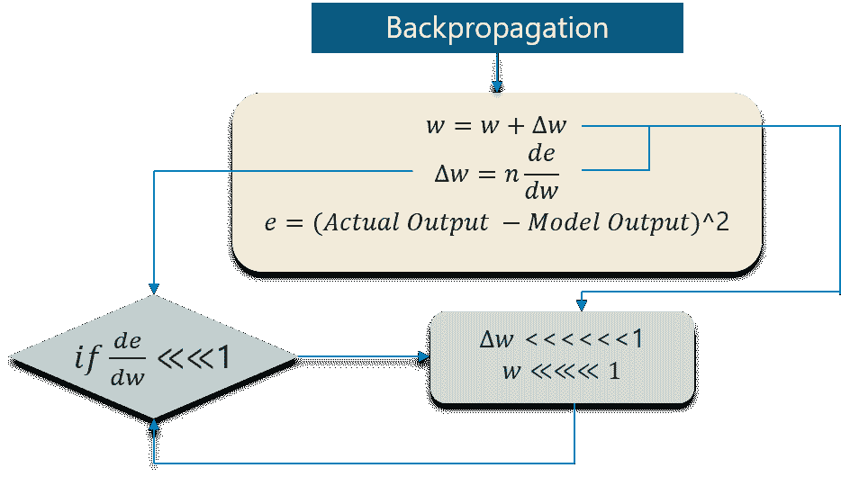

随着**误差的计算，**中的**变化**相对于**变化**的**权重**被计算**。**但是对于每一个**学习**速率，这必须乘以**相同的**。

因此，**学习率**与变化**的**乘积**导致**为**权重的**实际变化**。**

如图**所示，对于每个训练迭代，**权重**的这种变化被添加到旧的**组的** **权重**中。**这里的问题是当 **中的**变化** **乘以**时，**值**比**小很多。****

考虑你是**预测**一个**句子**说，**“我要去** **法国”**而你要预测**“我要去法国，那里说的语言是 _ _ _ _ _”**

**大量的迭代**将导致新的权重**可以忽略不计**，这导致**权重没有**被更新**。**

## **爆炸渐变**

爆炸梯度的工作与**类似**，但是这里的**权重**变化**剧烈**而不是**变化可忽略不计。**注意下图中的**小变化**:

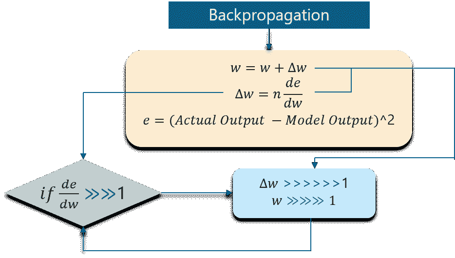

我们需要**克服这两个**，首先这是一个**挑战**的**位**。请看下图:

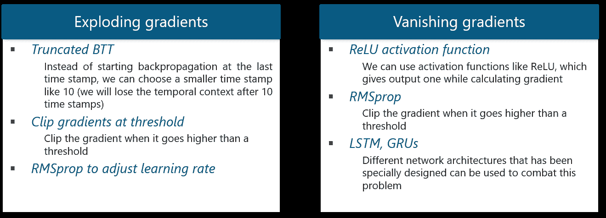

继续这篇关于递归神经网络的博客，我们将**进一步讨论 LSTM 网络。**

## 长短期记忆网络

长短期记忆网络通常被称为“LSTMs”。

它们是一种**特殊的**递归神经网络，能够**学习**长期依赖关系的**。**

**什么是长期依赖？**

很多时候，模型中只需要**最近的数据**来**执行操作。**但是从过去**中**获得的**数据**中可能有一个**要求**。****

我们来看下面这个例子:

考虑一个**语言模型**试图根据前面的单词预测下一个**单词**。如果我们试图**预测**句子中的**最后一个词**说**“云在天上”**。

这里的语境是**非常简单**，最后一个单词总是以**天空**结束。在这种情况下，**过去信息**和**当前需求**之间的差距可以通过使用**递归神经网络**很容易地**弥合。**

因此，像**消失**和**爆炸梯度**不存在**的问题**这使得 LSTM 网络处理**长期依赖**很容易。

LSTM 有**链状的**神经网络层。在标准的递归神经网络中，重复模块由一个**单一函数**组成，如下图所示:

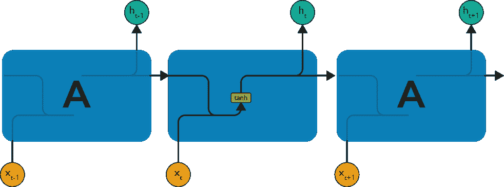

如上图，图层中有一个**双曲正切函数**。该功能是一个**挤压功能。**那么，**什么是挤压功能？**

它是一个**功能**，基本用于-1 到+1 的**范围内，并根据**输入**操作**的**值**。****

现在，让我们考虑一个 LSTM 网络的**结构**:

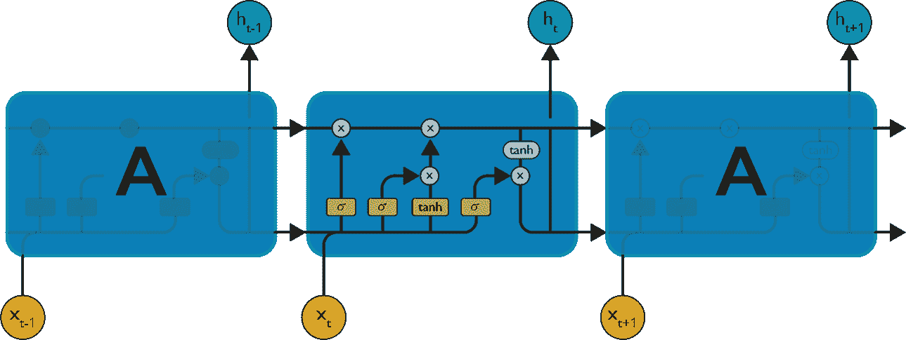

如图所示，对于 LSTM 网络，各层中的每个功能都有自己的结构。单元状态是图中的水平线，它的作用类似于传送带，在数据通道上线性传送某些数据。

让我们考虑一种循序渐进的方法来更好地理解 LSTM 网络。

**第一步:**

**LSTM**的第一步是**识别**那些**不需要**并将**从**信元状态中丢弃**的信息。**该决定由称为**忘记门**层的**s 形层**做出。

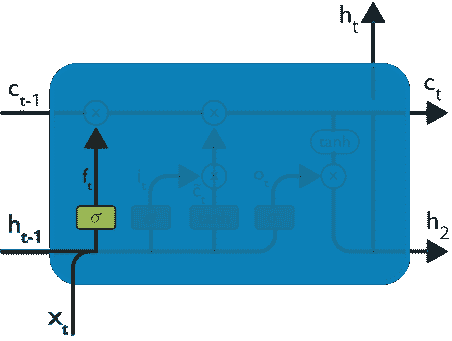

上面的**高亮层**就是前面提到的**的**乙状结肠层**。**

**计算**是通过考虑**新输入**和**先前时间戳**来**完成的，最终**将**引向在那个**单元状态中的**每个**号的在 0 和 1** 之间的数字**的**输出**。****

作为典型的二进制， **1** 表示向 **kee** p 信元状态，而 **0** 表示向 **trash** it 信元状态。

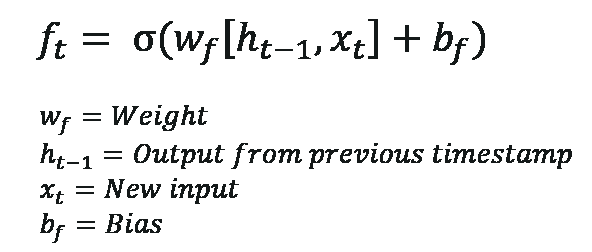

考虑**性别分类，**在使用**网络时，考虑**最新的**和**正确的性别**真的很重要。**

**第二步:**

下一步是**决定，**什么**新信息**我们要在单元格状态下**存储**。整个过程包括以下步骤:

*   一个被称为“输入门层”的**s 形层**决定**哪些值**将被更新**。**
*   **tanh 层**创建一个**新候选值**的**向量**，它可以被**添加到状态**。

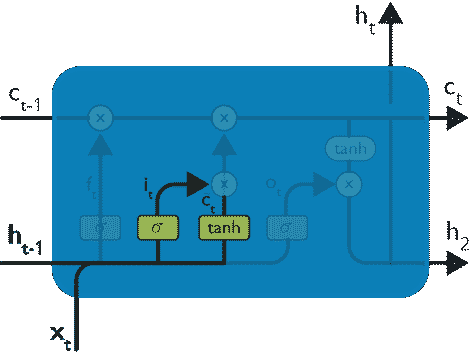

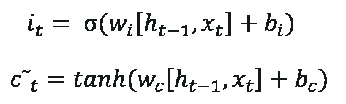

来自**先前时间戳**的输入和新输入通过 **sigmoid 函数**被**传递**，该函数给出值 **i(t)。**该值然后被**乘以 c(t)** ，然后被加到**单元状态。**

下一步，这**两个**被**组合**到**更新**到**状态。**

**第三步:**

现在，我们将**更新**旧的**单元状态 ct1，**进入**新的**单元状态 **Ct。**

首先，我们**将**的**旧的**状态**(ct1)**乘以 f(t)**遗忘**我们**决定**到**更早抛下**的事情。

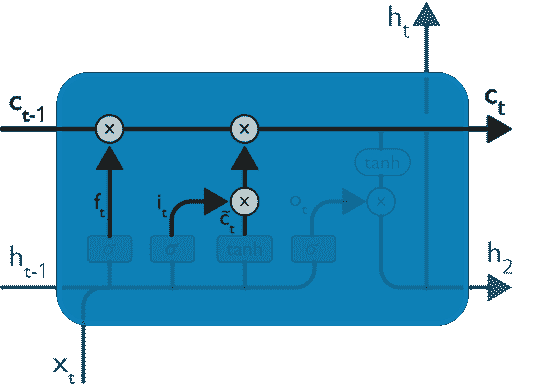

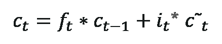 然后，我们**加上 I _ t * c\\**这就是**新的候选值**，**按比例缩放**的多少，我们决定**更新每个状态的**值。

第二步，我们决定让**利用**数据**的**，这些数据只在**阶段需要。**

在第三步，我们实际上**实现了**它。

在之前讨论过的**的语言用例中，**有**旧性别**将被**丢弃**而**新性别**将被**考虑。**

**第四步:**

我们将运行一个 **sigmoid 层**，它决定**单元状态**的什么**部分**我们将**输出。**

然后，我们将**单元状态**通过 **tanh** (将值推到 1 和 1 之间)

之后，我们**将**乘以**s 形门**的**输出**，这样我们只输出我们决定的**部分**。

 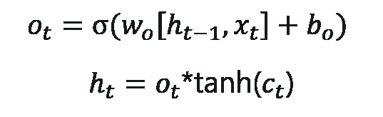

这一步中的**计算**非常简单**直接**，最终**导致**输出。****

然而，**输出**仅由**输出**组成，在**之前的**步骤中**被决定结转**，而不是所有的**输出**。

总结所有 4 个步骤:

在**第一个**步骤中，**我们发现了需要删除的内容。**

**第二个**步骤由 w **个新的输入加入网络组成。**

**第三个**步骤是**组合先前获得的输入以生成新的单元状态。**

**最后，**我们按照要求达到了**的输出。**

接下来在这个关于递归神经网络的博客上，让我们考虑一个**有趣的用例。**

## 用例:长短期记忆网络

我们将**考虑到**的用例是**预测**一个样本短篇故事中的**下一个单词**。

我们可以从**馈给**一个 **LSTM** 网络开始，该网络具有来自作为**输入**和 1 个标记符号的 3 个**符号**的文本的**正确序列**。

最终，神经网络将**学习**到**正确预测**下一个符号**！**

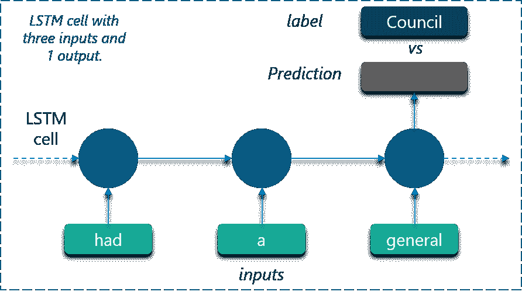

**数据集:**

使用由 **112 个独特符号组成的**样本短篇故事**来训练 LSTM。逗号**和**句号**也被**认为是**在此**情况下的**唯一符号**。**

很久以前，老鼠们举行了一次全体会议，讨论如何智取他们共同的敌人——猫。有些人这样说，有些人那样说，但最后一只年轻的老鼠站起来说，他有一个建议，他认为会满足的情况。你们都会同意，他说，我们的主要危险在于敌人向我们逼近的狡猾和奸诈的方式。现在，如果我们能收到一些她接近的信号，我们就能轻易地逃离她。 *我* *因此斗胆提议采购一个小铃铛，用丝带系在猫的脖子上。通过这种方法，我们应该总是知道她什么时候在附近，当她在附近的时候，我们可以很容易地退休。这个提议得到了普遍的掌声，直到一只老老鼠站起来说，这一切都很好，但是谁来给猫系上铃铛呢？老鼠们面面相觑，谁也不说话。然后老老鼠说提出不可能的补救办法很容易。”*

**训练:**

我们已经知道**lstm**只能**理解实数。**所以，第一个**要求**是**根据**出现的**频率**将**唯一符号转换为**唯一整数**值。**

这样做将创建一个**定制的字典**，我们可以**使用它**来**映射**这些值。

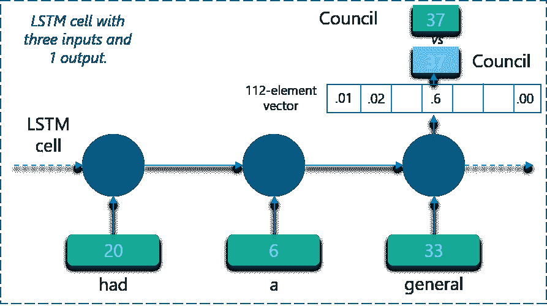

上图中，**某些符号**被映射成**整数**，如图所示。

网络将创建一个 **112 元素向量**，由这些唯一整数值中的每一个的**出现**的**概率**组成。

**实现:**

代码使用 Tensorflow 实现，如下所示:

```
import numpy as np
import tensorflow as tf
from tensorflow.contrib import rnn
import random
import collections
import time

start_time = time.time()

def elapsed(sec):
    if sec<60:
        return str(sec) + " sec"
    elif sec<(60*60): return str(sec/60) + " min" else: return str(sec/(60*60)) + " hr" # Target log path logs_path = '/tmp/tensorflow/rnn_words' writer = tf.summary.FileWriter(logs_path) # Text file containing words for training training_file = 'Story.txt' def read_data(fname): with open(fname) as f: content = f.readlines() content = [x.strip() for x in content] content = [content[i].split() for i in range(len(content))] content = np.array(content) content = np.reshape(content, [-1, ]) return content training_data = read_data(training_file) print("Loaded training data...") def build_dataset(words): count = collections.Counter(words).most_common() dictionary = dict() for word, _ in count: dictionary[word] = len(dictionary) reverse_dictionary = dict(zip(dictionary.values(), dictionary.keys())) return dictionary, reverse_dictionary dictionary, reverse_dictionary = build_dataset(training_data) vocab_size = len(dictionary) # Parameters learning_rate = 0.001 training_iters = 50000 display_step = 1000 n_input = 3 # number of units in RNN cell n_hidden = 512 # tf Graph input x = tf.placeholder("float", [None, n_input, 1]) y = tf.placeholder("float", [None, vocab_size]) # RNN output node weights and biases weights = { 'out': tf.Variable(tf.random_normal([n_hidden, vocab_size])) } biases = { 'out': tf.Variable(tf.random_normal([vocab_size])) } def RNN(x, weights, biases): # reshape to [1, n_input] x = tf.reshape(x, [-1, n_input]) # Generate a n_input-element sequence of inputs # (eg. [had] [a] [general] -> [20] [6] [33])
    x = tf.split(x,n_input,1)

    # 2-layer LSTM, each layer has n_hidden units.
    # Average Accuracy= 95.20% at 50k iter
    rnn_cell = rnn.MultiRNNCell([rnn.BasicLSTMCell(n_hidden),rnn.BasicLSTMCell(n_hidden)])

    # 1-layer LSTM with n_hidden units but with lower accuracy.
    # Average Accuracy= 90.60% 50k iter
    # Uncomment line below to test but comment out the 2-layer rnn.MultiRNNCell above
    # rnn_cell = rnn.BasicLSTMCell(n_hidden)

    # generate prediction
    outputs, states = rnn.static_rnn(rnn_cell, x, dtype=tf.float32)

    # there are n_input outputs but
    # we only want the last output
    return tf.matmul(outputs[-1], weights['out']) + biases['out']

pred = RNN(x, weights, biases)

# Loss and optimizer
cost = tf.reduce_mean(tf.nn.softmax_cross_entropy_with_logits(logits=pred, labels=y))
optimizer = tf.train.RMSPropOptimizer(learning_rate=learning_rate).minimize(cost)

# Model evaluation
correct_pred = tf.equal(tf.argmax(pred,1), tf.argmax(y,1))
accuracy = tf.reduce_mean(tf.cast(correct_pred, tf.float32))

# Initializing the variables
init = tf.global_variables_initializer()

# Launch the graph
with tf.Session() as session:
    session.run(init)
    step = 0
    offset = random.randint(0,n_input+1)
    end_offset = n_input + 1
    acc_total = 0
    loss_total = 0

    writer.add_graph(session.graph)

    while step < training_iters: # Generate a minibatch. Add some randomness on selection process. if offset > (len(training_data)-end_offset):
            offset = random.randint(0, n_input+1)

        symbols_in_keys = [ [dictionary[ str(training_data[i])]] for i in range(offset, offset+n_input) ]
        symbols_in_keys = np.reshape(np.array(symbols_in_keys), [-1, n_input, 1])

        symbols_out_onehot = np.zeros([vocab_size], dtype=float)
        symbols_out_onehot[dictionary[str(training_data[offset+n_input])]] = 1.0
        symbols_out_onehot = np.reshape(symbols_out_onehot,[1,-1])

        _, acc, loss, onehot_pred = session.run([optimizer, accuracy, cost, pred], 
                                                feed_dict={x: symbols_in_keys, y: symbols_out_onehot})
        loss_total += loss
        acc_total += acc
        if (step+1) % display_step == 0:
            print("Iter= " + str(step+1) + ", Average Loss= " + 
                  "{:.6f}".format(loss_total/display_step) + ", Average Accuracy= " + 
                  "{:.2f}%".format(100*acc_total/display_step))
            acc_total = 0
            loss_total = 0
            symbols_in = [training_data[i] for i in range(offset, offset + n_input)]
            symbols_out = training_data[offset + n_input]
            symbols_out_pred = reverse_dictionary[int(tf.argmax(onehot_pred, 1).eval())]
            print("%s - [%s] vs [%s]" % (symbols_in,symbols_out,symbols_out_pred))
        step += 1
        offset += (n_input+1)
    print("Optimization Finished!")
    print("Elapsed time: ", elapsed(time.time() - start_time))
    print("Run on command line.")
    print("	tensorboard --logdir=%s" % (logs_path))
    print("Point your web browser to: http://localhost:6006/")
    while True:
        prompt = "%s words: " % n_input
        sentence = input(prompt)
        sentence = sentence.strip()
        words = sentence.split(' ')
        if len(words) != n_input:
            continue
        try:
            symbols_in_keys = [dictionary[str(words[i])] for i in range(len(words))]
            for i in range(32):
                keys = np.reshape(np.array(symbols_in_keys), [-1, n_input, 1])
                onehot_pred = session.run(pred, feed_dict={x: keys})
                onehot_pred_index = int(tf.argmax(onehot_pred, 1).eval())
                sentence = "%s %s" % (sentence,reverse_dictionary[onehot_pred_index])
                symbols_in_keys = symbols_in_keys[1:]
                symbols_in_keys.append(onehot_pred_index)
            print(sentence)
        except:
            print("Word not in dictionary")

```

看完这篇关于卷积神经网络的博客后，我很确定你想了解更多关于深度学习和神经网络的知识。要了解更多关于深度学习和神经网络的知识，你可以参考以下博客:

1.  **[什么是深度学习？](https://www.edureka.co/blog/what-is-deep-learning)**

3.  [**张量流教程**](https://www.edureka.co/blog/tensorflow-tutorial/)
4.  [**神经网络教程**](https://www.edureka.co/blog/neural-network-tutorial/)
5.  [](https://www.edureka.co/blog/backpropagation/)

## **(RNN)递归神经网络| RNN LSTM |深度学习教程|爱德华卡**


[https://www.youtube.com/embed/y7qrilE-Zlc?rel=0&showinfo=0](https://www.youtube.com/embed/y7qrilE-Zlc?rel=0&showinfo=0)*This Edureka Recurrent Neural Networks tutorial video will help you in understanding why we need Recurrent Neural Networks (RNN) and what exactly it is.*Learn Artificial Intelligence And Deep Learning From Experts Now! [<button>Read Now</button>](https://www.edureka.co/ai-deep-learning-with-tensorflow)

看看这个 [**使用 Python 训练的 NLP**](https://www.edureka.co/python-natural-language-processing-course)由 Edureka 将你的 AI 技能提升到下一个级别