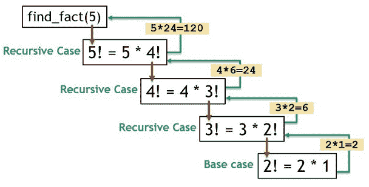

# 关于 Python 中的递归，你需要知道的一切

> 原文：<https://www.edureka.co/blog/recursion-in-python/>

简单来说，递归是一种通过函数调用自身来解决问题的方法，单词“ **recursive** ”来源于拉丁语动词“**recurre**”，意思是重做某事。这就是递归函数所做的，它一次又一次地重复同样的事情，也就是说，它回忆自己。在本文中，我们将学习 python 中的递归。以下是本博客涵盖的主题:

*   [Python 中什么是递归？](#recursion)
*   [终止条件](#termination)
*   [Python 的递归极限](#limit)
*   [用递归拉平列表](#flattening)
*   [递归的优点](#advantages)
*   [递归的缺点](#disadvantages)

## **Python 中什么是递归？**

递归是根据事物本身来确定事物的过程。我们知道在 Python 中，任何函数都可以调用任何其他函数，函数也可以调用自身。这类在不满足特定条件之前一直调用自身的函数称为递归函数。



让我们举几个例子来看看这是如何工作的，如果给你一个正整数 n，阶乘就是。

*   n！= n * (n-1) * (n-2)以此类推。
*   2! = 2 * (2-1)
*   1! = 1
*   0! = 0
*   4! = 4 * 3!
*   3! = 3 * 2!
*   2! = 2 * 1!

替换上述值将产生以下表达式

*   4! = 4 * 3 * 2 * 1

我们必须定义一个函数，比如 fact(n ),它以正整数或 0 为参数，返回第 n 个阶乘，我们如何使用递归来实现呢？

让我们看看，为了使用递归，我们需要检查下面的等式

*   n！= n.(n-1)。(n-2)…3.2.1

*   n！= n.(n-1)！#我们可以将上面的语句重写为这行

*   现在，如果我们将 2 作为参数传递，我们将得到:

    *   2! = 2.1! = 2

*   同样，如果我们传递 1，我们将得到:

    *   1! = 1.0! = 1

*   但是如果我们超过 0，它就坏了

    *   0!= 0.(-1)!这里没有定义-1 的阶乘，所以这只适用于大于 0 的值

*   所以我们要写两个案例

    *   1.n！= n.(n-1)！如果 n>=1

    *   2.1 如果 n = 0

这是一个完整的解决所有正整数和 0。

## **终止条件**

递归函数必须满足一个重要条件才能终止。当问题不需要进一步递归就能解决时，递归函数将终止，将问题最小化为更小的子步骤。如果调用中不满足终止条件，递归可能会在无限循环中结束。

阶乘条件:

*   只要 n 大于 1，n = n * (n-1)的阶乘。
*   1 如果 n = 0

我们将在 python 代码中转换上述阶乘条件:

```
def fact(n):
     if n == 1:
       return n
     else:
       return n * fact(n-1)

```

让我们举个例子，假设我们想求 4 的阶乘:

```
fact(4)
#this will return 4 * fact(3) and so on until n == 1.

```

```
Output: 24
```

它经常被用作递归的例子，因为它简单明了。在每一步解决一个小问题，这在计算机科学中被称为递归。

## **Python 的递归极限**

在一些语言中，你可以创建一个无限的递归循环，但是在 Python 中，有一个递归限制。要检查限值，从 sys 模块运行以下功能。这将给出 python 递归集的极限。

```
import sys
sys.getrecursionlimit()

```

```
Output: 1000
```

您还可以根据您的要求使用 sys 模块的 functionsetrecursionlimit()来更改限制，现在让我们创建一个函数，它递归地调用自己，直到它超过限制并检查发生了什么:

```
def recursive():
      recursive()
if __name__ == '__main__':
   recursive()

```

如果你运行上面的代码，你会得到一个运行时异常:RuntimeError:超过了最大递归深度。Python 阻止你创建一个以永无止境的递归循环结束的函数。

## **用递归拉平列表**

除了阶乘之外，你还可以用递归来做其他事情，比如说你想从一个嵌套的列表中创建一个 single，可以用下面的代码来实现:

```
def flatten(a_list , flat_list=none):
if flat_list is none:
   flat_list = []
for item in a_list:
   if isinstance(item, list):
      flatten(item , flat_list)
   else:
      flat_list.append(item)
   return flat_list
if __name__ == '__main__':
   nested = [1,2,3,[4,5] , 6]
   x = flatten(nested)
print(x)

```

```
Output: [1,2,3,4,5,6]
```

运行上面的代码将产生一个单一的列表，而不是包含我们用作输入的整数列表的整数列表。你也可以用其他方法做同样的事情，Python 有一个叫 itertools.chain()的东西，你可以检查用于创建函数链()的代码，这是一种不同的方法来做同样的事情。

## **递归的优点**

*   递归函数中的代码简洁优雅。

*   使用递归可以将一个复合任务分解成更简单的子问题。

*   使用递归生成序列比使用嵌套迭代更容易。

## **递归的弊端**

*   遵循递归函数背后的逻辑有时可能很难。

*   递归调用是昂贵的(低效的),因为它们占用了大量的内存和时间。

*   递归函数很难调试。

在本文中，我们看到了什么是递归，我们如何从问题陈述中开发递归函数，如何从数学上定义问题陈述。我们解决了一个阶乘的问题，并找出了寻找阶乘所需的条件，我们能够将这些条件转换成 python 代码，让您了解递归是如何工作的。我认为 Python 对递归有一个内置的限制，以防止开发人员创建结构不良的递归函数，这很好。需要注意的一件重要事情是，递归很难调试，因为函数一直在调用自己。