# 如何从快照恢复 EC2？

> 原文：<https://www.edureka.co/blog/restore-ec2-from-snapshot/>

亚马逊 EC2 和 S3 是亚马逊使用最广泛的服务。EC2 是基于实例的计算服务，S3 是轻量级存储服务。为您的 EC2 实例创建备份总是一个好的做法，这样，如果您的实例被删除或停止工作，您可以从创建的快照恢复 EC2。了解更多关于 [AWS 培训和认证](https://www.edureka.co/aws-certification-training)的信息。

创建备份和恢复模块是灾难管理的最佳方法之一。在数据丢失的情况下，您可以随时使用备份，这样您的工作和业务就不会受到影响。既然您已经知道为什么备份和恢复模块是必要的，那么让我来引导您完成我将在本文中讨论的主题，即“*如何从快照*恢复 EC2”。

*   [EC2 和 S3 是什么？](#WhatAreEC2AndS3)
*   [什么是](#WhatIsEBSVolume) [EBS 卷？](#WhatIsEBSVolume)
*   [什么是 EBS 快照？](#WhatIsEBSSnapshot)
*   [演示:(创建一个实例，删除它并从快照恢复 EC2)](#CreateInstanceDeleteItAndRestorItUsingSnapshot)

## **EC2 和 S3 是什么？**

[亚马逊网络服务](https://www.edureka.co/blog/amazon-aws-tutorial/)俗称 AWS，是亚马逊旗下提供按需云计算平台的子公司。AWS 提供许多服务，其中 EC2 和 S3 是常用的服务。

[亚马逊 EC2](https://www.edureka.co/blog/ec2-aws-tutorial-elastic-compute-cloud/) 构成了亚马逊云计算平台的核心部分。亚马逊允许个人租用虚拟电脑运行自己的应用程序。这些虚拟计算机被称为 EC2 实例。AWS 中的 EC2 实例是用最常用的操作系统预定义的，您也可以根据自己的需求创建操作系统。

[亚马逊 S3](https://www.edureka.co/blog/s3-aws-amazon-simple-storage-service/) 是亚马逊提供的“简单存储服务”，在 web 界面中提供对象存储。S3 使用可扩展的存储基础架构为其全球电子商务网络中的客户提供存储。

在本文中，我们将主要关注 EC2 和 S3。现在您已经知道了什么是亚马逊 EC2 和亚马逊 S3，让我们看看如何在使用快照恢复 EC2 实例的过程中使用它。

## **什么是 EBS 卷？**

亚马逊 EBS ( [弹性块存储](https://docs.aws.amazon.com/AWSEC2/latest/UserGuide/AmazonEBS.html))提供原始块级存储，可以附加到亚马逊 EC2，也可以在亚马逊 RDS 中使用。亚马逊 EBS 于 2008 年 8 月推出。EBS 用于以下情况:

1.  频繁的数据变化
2.  需要长期保存的数据
3.  读和写操作频率较多的数据库。
4.  需要不断更新的数据
5.  数据库应用存储

## **什么是 EBS 快照？**

[EBS 快照](https://docs.aws.amazon.com/AWSEC2/latest/UserGuide/EBSSnapshots.html)用于通过拍摄即时快照将数据从 [EBS 卷](https://docs.aws.amazon.com/AWSEC2/latest/UserGuide/EBSVolumes.html)备份到 S3。快照只不过是增量备份。EBS 快照的性质与原始卷的性质相同(加密或未加密)，EBS 快照创建的卷的性质与快照的性质相同(加密或未加密)。

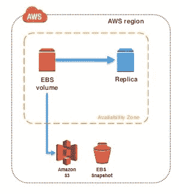

您可以通过拍摄时间点快照将 EBS 卷中的数据备份到亚马逊 S3。快照是增量备份。增量备份是指仅包含更新文件的副本。这有助于最大限度地减少创建备份所需的时间。

现在你已经了解了所有与亚马逊提供的存储服务相关的事情，让我们来学习一下如何在实践中实现上面给出的信息。

## **演示:(创建一个实例，删除它并从快照恢复 EC2)**

在关于如何从 快照中恢复 EC2 的文章中，我将致力于以下事情:-

1.  创建一个 EC2 实例
2.  创建文件以在从快照恢复 EC2 的过程后进行验证
3.  为实例创建一个 EBS 快照
4.  删除 EC2 实例
5.  从快照恢复 EC2
    1.  从 EBS 快照创建 AMI
    2.  启动已创建的 AMI
6.  验证文件是否存在？

让我们仔细看看每一个步骤。

1.  **创建一个亚马逊 EC2 实例**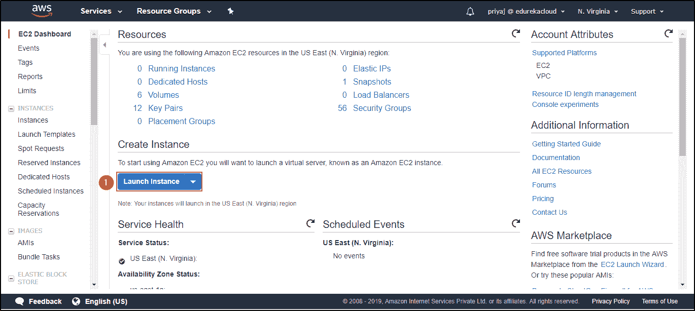*使用 AWS 控制台启动 EC2 实例。*   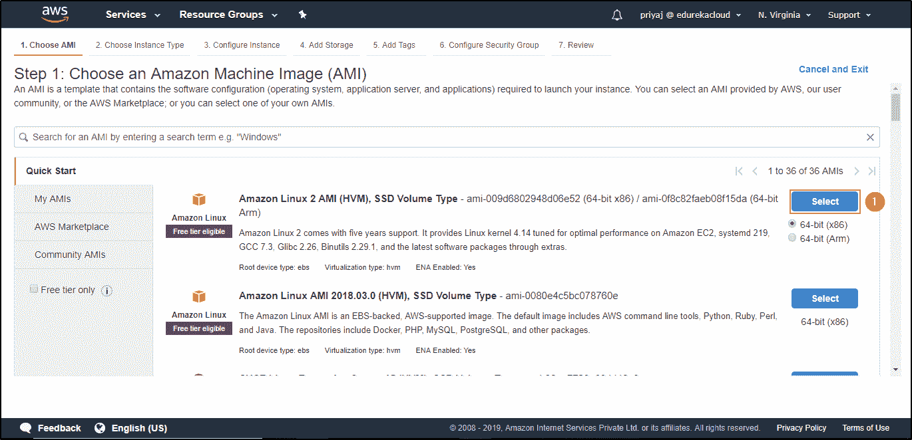 *选择实例的类型。*   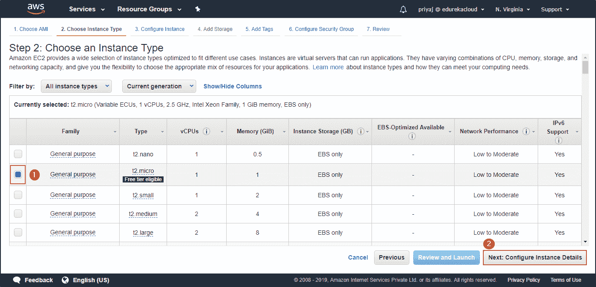 *选择存储类型。*    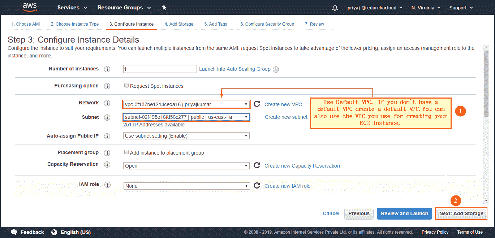 *选择您希望实例所在的 VPC 和子网。*   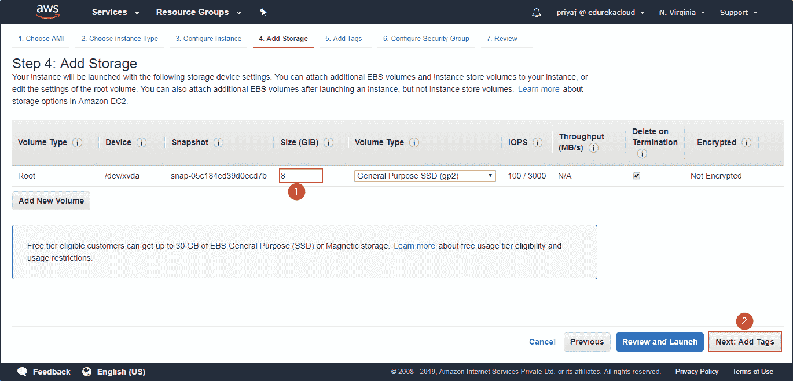 *添加存储。*   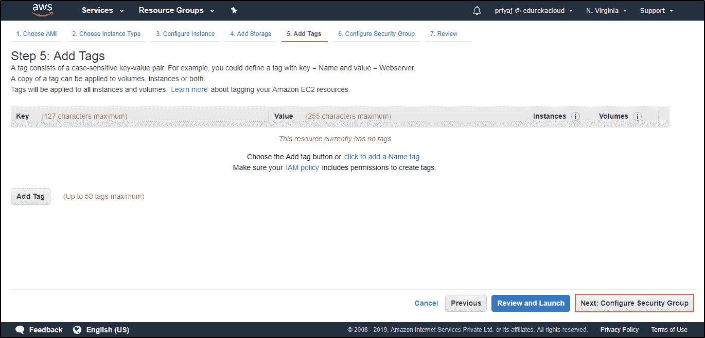 *给你的实例添加标签。*   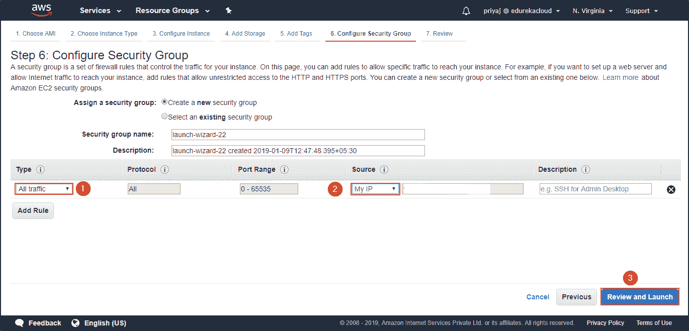 *配置安全组。*   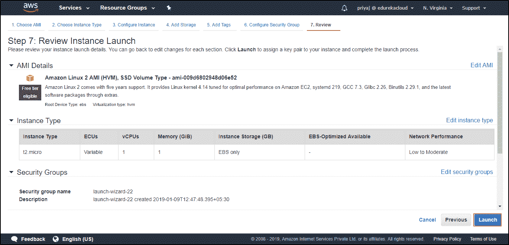 *核实详情。点击启动。*   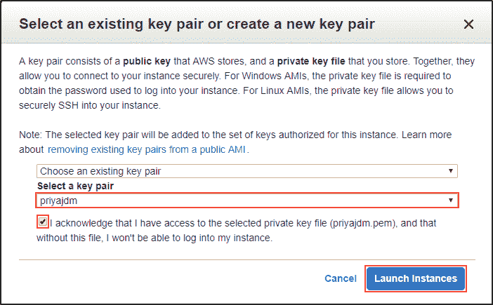 *选择 key-pair 来访问你的实例。*  * 你的实例被创建。现在是时候访问实例并创建文件了。*
2.  **创建文件验证以后***创建一个名为 EdurekaDemo 的目录。移动到目录。创建一个名为 edurekademotext.txt 的文件，打开文本文件。*  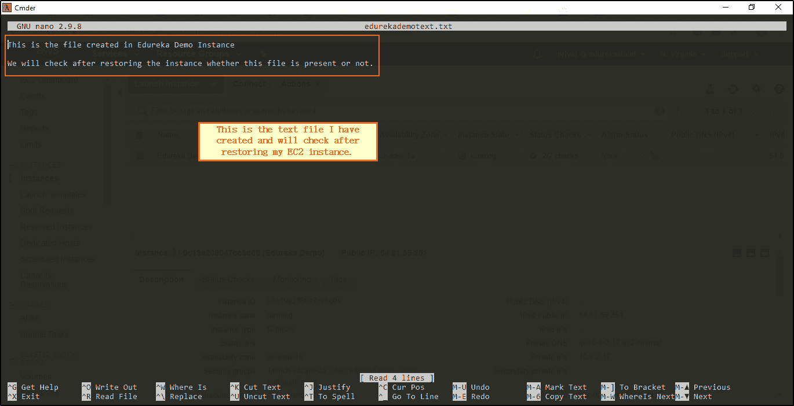 *写一些文字以便验证。* 
3.  **为实例**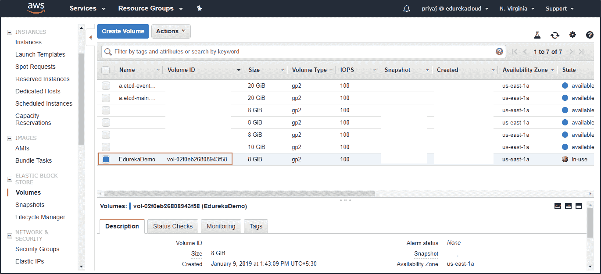*创建 EBS 快照定位卷。*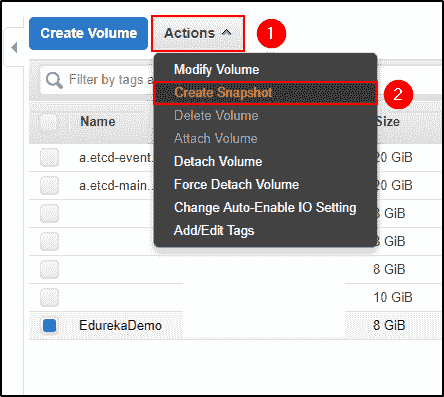*创建快照。*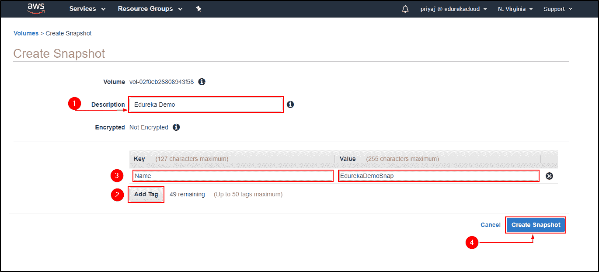*对您的快照进行描述并创建快照。* 
4.  **删除 EC2 实例** 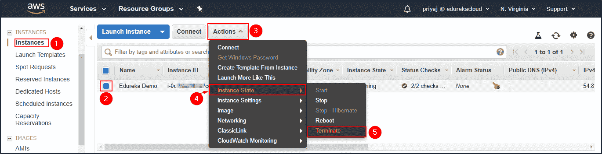 *终止实例。*
5.  **从快照恢复 EC2**
    1.  **从 EBS 快照创建 AMI**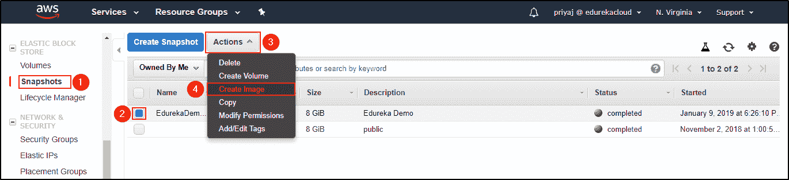*从 EBS 快照创建映像。*   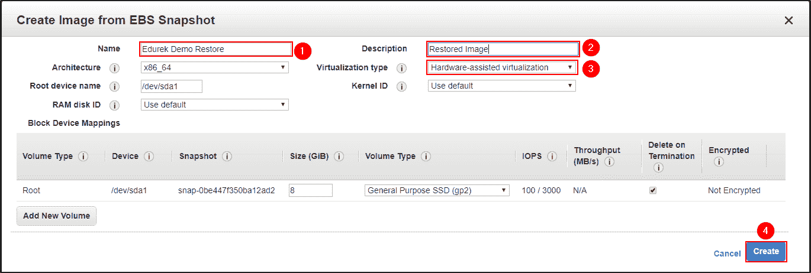 *选择名称和描述，不要忘记选择硬件辅助虚拟化。*    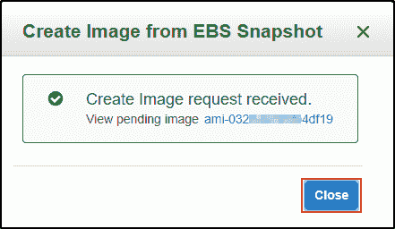 *您的图像创建请求已被处理，并将在* *几分钟内完成。* 
    2.  **启动已创建的 AMI** 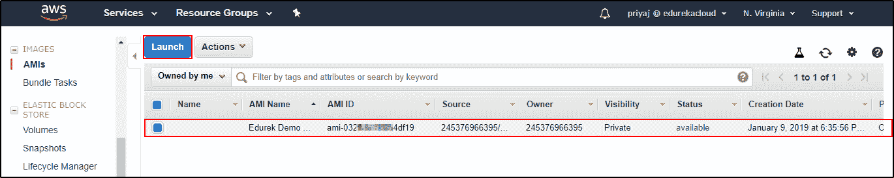 *启动时创建并重做在**EC2**中创建 姿态时完成的所有步骤。 *  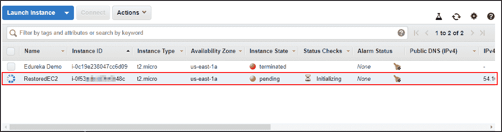 *你的 EC2 实例被恢复。*    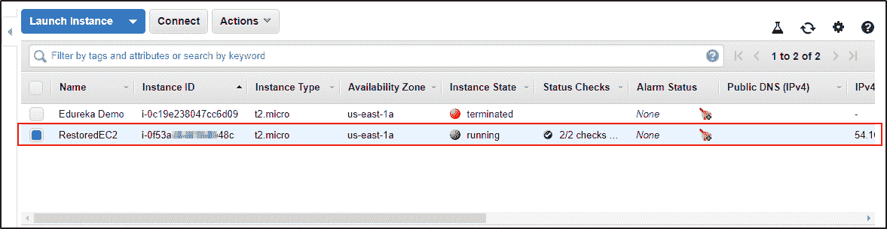 *您的 EC2 实例被创建。*
6.  **验证文件是否存在？**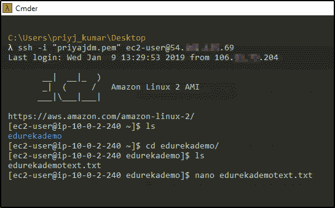*V**验证我们创建的文件是否存在？*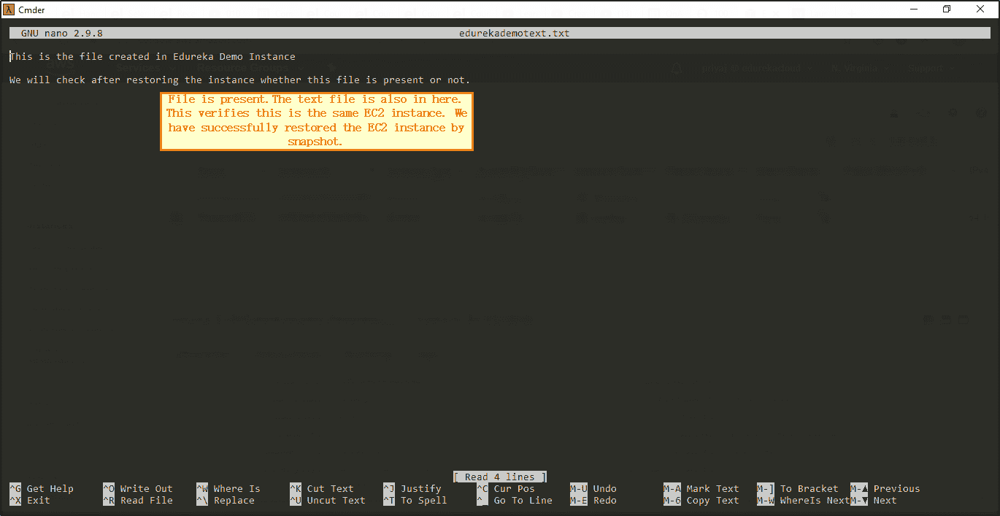*经验证，我创建的*  *目录和文件都存在于恢复后的 EC2 实例中。* 

这是使用快照成功恢复 EC2 实例的过程。我希望你明白演示。最好的学习方法是实施它。去执行吧。

*如果您希望学习亚马逊网络服务并在云计算领域建立职业生涯，那么就来看看我们在钦奈的 [AWS 培训](https://www.edureka.co/aws-certification-training-chennai)吧，该培训包含讲师指导的现场培训和真实项目体验。本培训将帮助您深入了解 Amazon Web Services，并帮助您掌握该主题。*

*有问题吗？请在评论区提出，我们将会回复您或在 [Edureka | Community 上发布您的问题。](https://www.edureka.co/community)在 Edureka 社区，我们有超过 100，000 名技术狂热分子随时准备提供帮助。*