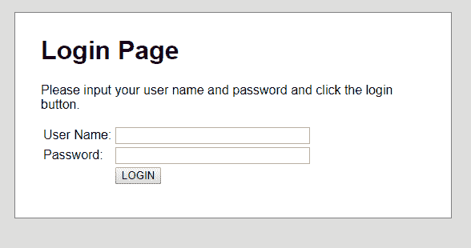
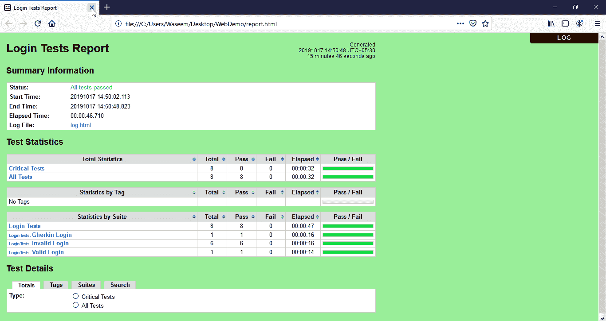
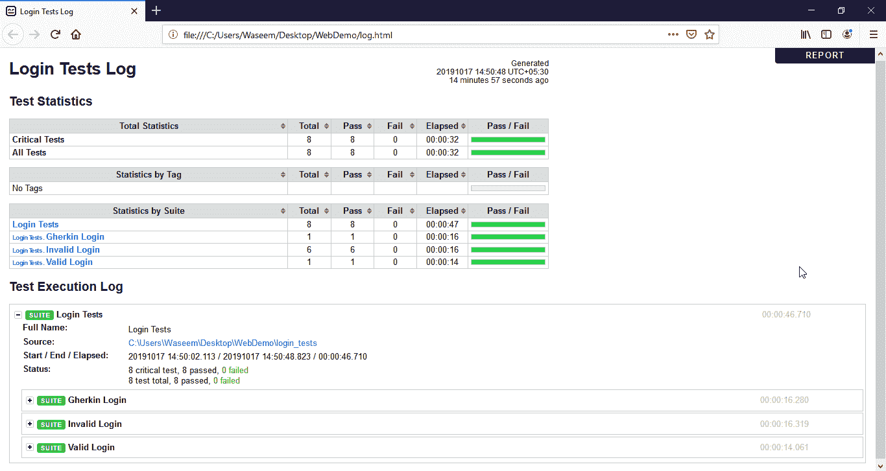

# 用 Python 了解机器人框架

> 原文：<https://www.edureka.co/blog/robot-framework-tutorial/>

Python 编程语言有一个机器人[框架](https://www.edureka.co/blog/python-frameworks/)，可以使用外部[库](https://www.edureka.co/blog/python-libraries-for-data-science-and-machine-learning/)如 selenium 进行 web 测试。在本文中，我们将通过一个使用 selenium 库进行 web 测试的用例，了解测试用例以及与 [python](https://www.edureka.co/data-science-python-certification-course) 中的机器人框架相关的各种其他术语。本博客讨论了以下主题:

*   [Python 中的机器人框架是什么？](#robot)
    *   [机器人框架架构](#arch)
    *   [安装](#install)
*   [标准库](#lib)
*   [内置工具](#tools)
*   [测试用例](#testcase)
    *   [工作流测试](#workflow)
    *   [更高级别的测试](#higher)
    *   [数据驱动测试](#data-driven)
*   [关键词](#key)
    *   [库关键字](#libkey)
    *   [用户关键词](#userkey)
*   [变量](#var)
    *   [定义变量](#defvar)
    *   [使用变量](#usevar)
*   [组织测试用例](#org)
*   [机器人框架-硒库](#selenium)
    *   [安装](#installation)
    *   [浏览器驱动程序](#drivers)
*   [用例——使用机器人框架和硒库进行网络测试](#usecase)

## **什么是机器人框架？**

Robot framework 是一个通用的开源自动化框架，用于[验收测试](https://www.edureka.co/blog/acceptance-testing/)，验收测试驱动开发，以及[机器人流程自动化](https://www.edureka.co/blog/robotic-process-automation/)。它使用关键字驱动的测试技术方法。这些功能可以通过测试库来扩展，测试库可以由 [Java](https://www.edureka.co/blog/java-tutorial) 或 [Python](https://www.edureka.co/blog/python-programming-language) 来实现。

**验收测试**

它是一种测试系统能力的测试技术。[验收测试](https://www.edureka.co/blog/acceptance-testing/)的目的是根据业务需求评估系统的能力。

**验收测试驱动开发**

ATDD 或验收测试驱动开发是一种基于业务客户、开发人员和测试人员之间交流的开发方法。他们协同工作，并在实现功能之前进行验收测试。

**机器人过程自动化**

RPA 或[机器人流程自动化](https://www.edureka.co/blog/rpa-projects)是通过使用机器学习和人工智能功能的软件，方便地减少人类工作的过程。RPA 处理高级别的可重复任务。

### **机器人框架架构**

机器人框架是独立于平台的，尽管核心框架是使用 python 实现的，但它也可以运行在 [JPython](https://www.edureka.co/blog/java-virtual-machine/) (JVM)和 IronPython(。网)。

### ****

当流程开始时，测试数据采用易于编辑的格式。框架处理测试数据并生成日志和报告。交互由库处理，库可以使用额外的测试工具作为测试目标的驱动程序。

### **安装**

在 python 上安装机器人框架的推荐方法是[使用 pip](https://www.edureka.co/blog/how-to-install-pip-in-python/) 。您可以使用下面的命令来安装框架。

```
pip install robotframework

```

**验证安装**

成功安装后，您应该能够使用–version 选项看到解释器和机器人框架版本。

```
robot --version
rebot --version

```

## **标准库**

以下测试库随 robot framework 一起分发。

*   固定
*   收集
*   日期时间
*   对话
*   操作系统
*   过程
*   遥远的
*   屏幕上显示程序运行的图片
*   线
*   用于远程联接服务的标准协议或者实现此协议的软件(可为动词)
*   可扩展标记语言

## **内置工具**

除了核心的测试执行引擎之外，还有一些内置在 robot 框架中的支持工具。python 中的 robot 框架提供了以下内置工具。

*   Rebot
*   Libdoc
*   Testdoc
*   整洁的

机器人框架测试数据在下面列出的不同章节中定义。

| **节** | **描述** |
| **设置** | 它用于导入资源文件、库和变量文件。也用于定义测试用例及测试套件的元数据。 |
| **变量** | 用于定义可在测试数据中其他地方使用的变量。 |
| **测试用例** | 它用于从可用的关键字中创建测试用例 |
| **任务** | 用于使用可用关键字创建任务 |
| **关键词** | 从可用的较低级别的关键字创建用户关键字 |
| **评论** | 框架通常忽略的附加注释 |

## **测试用例**

测试用例可以在下面的测试中进行分类。

*   工作流测试

*   更高级别的测试

*   数据驱动测试

### **工作流测试**

机器人框架测试用例通常以表格语法编写。让我们看一下例子来理解这一点。

*   用户可以创建帐户并登录

*   用户无法使用错误的密码登录

```
*** Test Cases ***
User can create an account and log in
    Create Valid User    python    P4ssw0rd
    Attempt to Login with Credentials    python    P4ssw0rd
    Status Should Be    Logged In

User cannot log in with bad password
    Create Valid User    pytHon    P4ssw0rd
    Attempt to Login with Credentials    pytHon    wrong
    Status Should Be    Access Denied

```

python 中的机器人框架遵循用简单英语编写的测试用例，而不是自动化测试用例。它遵循关键字驱动的方法，在行动和期望方面与自然语言产生共鸣。

测试用例由关键字和可能的参数构成。

### **高阶测试**

机器人框架中的测试用例可以只使用高级关键字而不使用位置参数来构建。让我们通过下面的一个例子来理解高级测试。

```
*** Test Cases ***
User can change password
    Given a user has a valid account
    When she changes her password
    Then she can log in with the new password
    And she cannot use the old password anymore

```

### **数据驱动测试**

数据驱动测试允许在不重复工作流程的情况下改变测试数据。robot 框架中的[Template]设置将测试用例设置为数据驱动测试。

```
*** Test Cases ***
Invalid password
    [Template]    Creating user with invalid password should fail
    abCD5            ${PWD INVALID LENGTH}
    abCD56789    ${PWD INVALID LENGTH}
    123DEFG       ${PWD INVALID CONTENT}
    abcd56789      ${PWD INVALID CONTENT}
    abCdEfGh      ${PWD INVALID CONTENT}
    abCD56+        ${PWD INVALID CONTENT}

```

## **关键词**

机器人框架中的测试用例是用来自两个来源的关键字创建的。

*   库关键字

*   用户关键字

### **图书馆关键词**

所有最低级别的关键字都在标准库中定义，这些标准库可以使用编程语言来实现，如 [Python](https://www.edureka.co/blog/why-python/) 、 [Java](https://www.edureka.co/blog/structure-of-a-java-program/) 等。

机器人框架带有测试库，可以分为标准库、外部库和自定义库。标准库在核心框架中，如内置、截图、操作系统等。外部库是单独安装的，比如用于 web 测试的 seleniumlibrary。

若要使用资源库中的关键词，必须导入资源库设置。让我们看一个例子来理解这一点。

```
*** Settings ***
Library           OperatingSystem
Library           lib/LoginLibrary.py

```

### **用户关键词**

robot 框架的一个强大特性是，我们可以使用其他关键字定制高级关键字。让我们看一个例子来理解它是如何工作的。

```
*** Keywords ***
Clear login database
    Remove file    ${DATABASE FILE}

Create valid user
    [Arguments]    ${username}    ${password}
    Create user    ${username}    ${password}
    Status should be    SUCCESS

Creating user with invalid password should fail
    [Arguments]    ${password}    ${error}
    Create user    example    ${password}
    Status should be    Creating user failed: ${error}

Login
    [Arguments]    ${username}    ${password}
    Attempt to login with credentials    ${username}    ${password}
    Status should be    Logged In

# Keywords below used by higher level tests. Notice how given/when/then/and
# prefixes can be dropped. And this is a comment.

A user has a valid account
    Create valid user    ${USERNAME}    ${PASSWORD}

She changes her password
    Change password    ${USERNAME}    ${PASSWORD}    ${NEW PASSWORD}
    Status should be    SUCCESS

She can log in with the new password
    Login    ${USERNAME}    ${NEW PASSWORD}

She cannot use the old password anymore
    Attempt to login with credentials    ${USERNAME}    ${PASSWORD}
    Status should be    Access Denied

```

用户定义的关键词可以包括由其他用户定义的关键词或库关键词提供的动作。

## **变量**

变量是机器人框架中任何测试用例的一个非常重要的部分。任何数据都是易变的测试用例，最好使用变量来定义。

让我们看看如何在测试用例中定义变量。

### **定义变量**

```
*** Variables ***
${USERNAME}               janedoe
${PASSWORD}               J4n3D0e
${NEW PASSWORD}           e0D3n4J
${DATABASE FILE}          ${TEMPDIR}${/}robotframework-quickstart-db.txt
${PWD INVALID LENGTH}     Password must be 7-12 characters long
${PWD INVALID CONTENT}    Password must be a combination of lowercase and uppercase letters and numbers

```

除了用户定义的变量之外，robot 框架中还有内置变量，如＄{ TEMPDIR }和＄{/}我们在上面的示例中也使用了它们。

### **使用变量**

我们可以在测试用例中的任何地方使用变量，它们通常被用作关键字中的参数。让我们看一下例子来理解这一点。

```
*** Test Cases ***
User status is stored in database
    [Tags]    variables    database
    Create Valid User    ${USERNAME}    ${PASSWORD}
    Database Should Contain    ${USERNAME}    ${PASSWORD}    Inactive
    Login    ${USERNAME}    ${PASSWORD}
    Database Should Contain    ${USERNAME}    ${PASSWORD}    Active

*** Keywords ***
Database Should Contain
    [Arguments]    ${username}    ${password}    ${status}
    ${database} =     Get File    ${DATABASE FILE}
    Should Contain    ${database}    ${username}t${password}t${status}n

```

现在我们知道了，我们如何使用关键字和变量来创建一个测试用例。让我们试着理解我们将如何组织测试用例。

## **组织测试用例**

机器人测试用例是在测试用例文件中创建的，但是我们可以将它们组织到创建测试套件层次结构的目录中。

测试用例的集合被称为测试套件。每个包含测试用例的文件也形成了一个测试套件。可以使用目录在一个层次结构中组织测试用例，所有这些目录创建了高级测试套件，它们的名字来自目录名。

**设置和拆卸**

如果您想要在测试之前或之后执行测试中的特定关键字，您可以使用设置表中的“测试设置”和“测试拆卸”设置。您还可以使用“Suite Setup”和“Suite Teardown”在测试套件之前或之后执行关键字。

您还可以像[Template]一样在测试用例中创建自定义的[Setup]和[Teardown]。让我们看一个例子来理解这一点。

```
*** Settings ***
Suite Setup       Clear Login Database
Test Teardown     Clear Login Database

```

**使用标签**

机器人框架允许标签为测试用例提供免费的元数据。可以使用“强制标签”和“默认标签”在文件中设置标签。

可以像[Template]一样使用[Tags]为单个测试用例给出标签。让我们举一个例子来理解我们如何使用标签。

```
*** Settings ***
Force Tags        quickstart
Default Tags      example    smoke

```

在执行之后，报告将会有与测试用例相关联的标签，以及基于标签的统计数据。

## **机器人框架-硒库**

robot 框架中的 selenium 库是一个 web 测试库，它在内部使用 selenium 工具。Selenium 库可以很好地与 python 2.7、3.4 和更新的版本一起工作。除了标准的 python 解释器，除了 IronPython，它还可以与 Pypy 和 JPython 一起工作。

### **安装**

要安装 selenium 库，我们可以遵循使用 python 中的 pip 的典型方法。使用以下命令在 python 中安装 seleniumlibrary。

```
pip install robotframework-seleniumlibrary

```

### **浏览器驱动**

安装完成后，您仍然需要为测试中要使用的操作系统和浏览器安装相关的驱动程序。一般方法是安装浏览器驱动程序，如 Chromedriver for chrome，但也可以使用名为 Webdrivermanager 的工具。

它会在需要的时候找到最新的版本，它会在正确的位置下载所有的链接/文件。它支持所有主要的操作系统，并支持像 chrome，opera 等浏览器的下载。

您可以使用以下命令安装 WebdriverManager

```
pip install webdrivermanager
webdrivermanager firefox chrome --linkpath /usr/local/bin

```

**如何使用硒库**

要使用 selenium 库，必须像其他库一样使用“library”设置导入它。建议使用 robot framework 高层关键字编写内部使用 selenium 低层关键字的测试用例。

这里有一个简单的例子来展示如何在测试用例中使用 selenium 库。

```
*** Settings ***
Documentation     Simple example using SeleniumLibrary.
Library           SeleniumLibrary

*** Variables ***
${LOGIN URL}      http://localhost:7272
${BROWSER}        Chrome

*** Test Cases ***
Valid Login
    Open Browser To Login Page
    Input Username    demo
    Input Password    mode
    Submit Credentials
    Welcome Page Should Be Open
    [Teardown]    Close Browser

*** Keywords ***
Open Browser To Login Page
    Open Browser    ${LOGIN URL}    ${BROWSER}
    Title Should Be    Login Page

Input Username
    [Arguments]    ${username}
    Input Text    username_field    ${username}

Input Password
    [Arguments]    ${password}
    Input Text    password_field    ${password}

Submit Credentials
    Click Button    login_button

Welcome Page Should Be Open
    Title Should Be    Welcome Page

```

## **用例——使用机器人框架和 Selenium 库进行 Web 测试**

在本例中，我们将创建以下目录。

1.  application——这是一个简单的登录应用程序，有登录页面、欢迎页面和错误页面。

2.  测试——这将包含所有的测试用例。

3.  任务–这将包含任务。

**应用**

**HTML**

*   **index.html**

```
<!DOCTYPE html>
<html>
<head>
  <title>Login Page</title>
  <link href="demo.css" media="all" rel="stylesheet" type="text/css">
  
</head>
<body>

<div id="container">

<h1>Login Page</h1>

Please input your user name and password and click the login button

<form name="login_form" onsubmit="login(this.username_field.value, this.password_field.value); return false;">

<table>

<tr>

<td><label for="username_field">User Name:</label></td>

<td><input id="username_field" size="30" type="text"></td>

          </tr>

<tr>

<td><label for="password_field">Password:</label></td>

<td><input id="password_field" size="30" type="password"></td>

          </tr>

<tr>

<td>&nbsp;</td>

<td><input id="login_button" type="submit" value="LOGIN"></td>

          </tr>

        </table>

      </form>

  </div>

</body>
</html>

```

*   **welcome.html**

```
<!DOCTYPE html>
<html>
<head>
  <title>Welcome Page</title>
  <link href="demo.css" media="all" rel="stylesheet" type="text/css">
</head>
<body>

<div id='container'>

<h1>Welcome Page</h1>

Login succeeded. Now you can <a href=".">logout</a>.

</div>

</body>
</html>

```

*   **error.html**

```
<!DOCTYPE html>
<html>
<head>
  <title>Error Page</title>
  <link href="demo.css" media="all" rel="stylesheet" type="text/css">
</head>
<body>

<div id="container">

<h1>Error Page</h1>

Login failed. Invalid user name and/or password.

  </div>

</body>
</html>

```

*   **demo.css**

```
body {
    font-family: sans-serif;
    color: black;
    background: #DDDDDD;
}
#container {
    width: 30em;
    height: 15em;
    margin: 5em auto;
    background: white;
    border: 1px solid gray;
    padding: 0.5em 2em;
}

```

*   **server.py**

```
from __future__ import print_function

from os import chdir
from os.path import abspath, dirname, join
try:
    from SocketServer import ThreadingMixIn
    from BaseHTTPServer import HTTPServer
    from SimpleHTTPServer import SimpleHTTPRequestHandler
except ImportError:
    from socketserver import ThreadingMixIn
    from http.server import SimpleHTTPRequestHandler, HTTPServer

ROOT = join(dirname(abspath(__file__)), 'html')
PORT = 7272

class DemoServer(ThreadingMixIn, HTTPServer):
    allow_reuse_address = True

    def __init__(self, port=PORT):
        HTTPServer.__init__(self, ('localhost', int(port)),
                            SimpleHTTPRequestHandler)

    def serve(self, directory=ROOT):
        chdir(directory)
        print('Demo server starting on port %d.' % self.server_address[1])
        try:
            server.serve_forever()
        except KeyboardInterrupt:
            server.server_close()
        print('Demo server stopped.')

if __name__ == '__main__':
    import sys
    try:
        server = DemoServer(*sys.argv[1:])
    except (TypeError, ValueError):
        print(__doc__)
    else:
        server.serve()

```

**测试**

*   **valid_login.robot**

```
*** Settings ***
Documentation     A test suite with a single test for valid login.
...
...               This test has a workflow that is created using keywords in
...               the imported resource file.
Resource          resource.robot

*** Test Cases ***
Valid Login
    Open Browser To Login Page
    Input Username    demo
    Input Password    mode
    Submit Credentials
    Welcome Page Should Be Open
    [Teardown]    Close Browser

```

*   **invalid _ log in . robot**
*   **资源.机器人**
*   **小黄瓜 _ 登录.机器人**

```
*** Settings ***
Documentation     A test suite with a single Gherkin style test.
...
...               This test is functionally identical to the example in
...               valid_login.robot file.
Resource          resource.robot
Test Teardown     Close Browser

*** Test Cases ***
Valid Login
    Given browser is opened to login page
    When user "demo" logs in with password "mode"
    Then welcome page should be open

*** Keywords ***
Browser is opened to login page
    Open browser to login page

User "${username}" logs in with password "${password}"
    Input username    ${username}
    Input password    ${password}
    Submit credentials

```

**tasks.py**

```
from pathlib import Path
import shutil

from docutils.core import publish_cmdline
from invoke import task
from rellu.tasks import clean

assert Path.cwd() == Path(__file__).parent

@task
def project_docs(ctx):
    """Generate project documentation.

    These docs are visible at http://robotframework.org/WebDemo/.
    """
    args = ['--stylesheet=style.css,extra.css',
            '--link-stylesheet',
            'README.rst',
            'docs/index.html']
    publish_cmdline(writer_name='html5', argv=args)
    print(Path(args[-1]).absolute())

@task
def move_docs(ctx):
    """Move report.html and log.html to docs

    These docs are visible http://robotframework.org/WebDemo/.
    """
    log = Path('./log.html')
    report = Path('./report.html')
    dest = Path('.') / 'docs'
    print(log.absolute())
    shutil.copy(log.absolute(), str(dest))
    print(report.absolute())
    shutil.copy(report.absolute(), str(dest))

```

要运行我们的应用程序，只需运行 server.py 文件，登录页面将在 **https//:localhost:7272** 打开



当演示运行时，您可以使用命令执行测试

```
robot tests

```

运行测试后，您将获得 HTML 格式的报告和日志文件。

**report.html**

**log.html**



在本文的最后，我们学习了如何使用 python 中的 robot framework 和 seleniumlibrary 在登录页面上执行 web 测试。我希望你清楚本教程中与你分享的所有内容。

*如果您发现了这篇关于“Python 中的机器人框架”的相关文章，请查看一下  [Edureka Python 认证培训、](https://www.edureka.co/data-science-python-certification-course) 一家值得信赖的在线学习公司，拥有遍布全球的 250，000 多名满意的学习者。*

*我们在这里帮助你踏上旅程的每一步，并为想要成为  [Python 开发者](https://www.edureka.co/blog/how-to-become-a-python-developer/)的学生和专业人士设计课程。该课程旨在让您在 Python 编程方面有一个良好的开端，并训练您掌握核心和高级 Python 概念以及各种  [Python 框架](https://www.edureka.co/blog/python-frameworks/) ，如  [Django。](https://www.edureka.co/blog/django-tutorial/)*

如果您遇到任何问题，请在“Python 中的机器人框架”的评论区提出您的所有问题，我们的团队将很乐意回答。