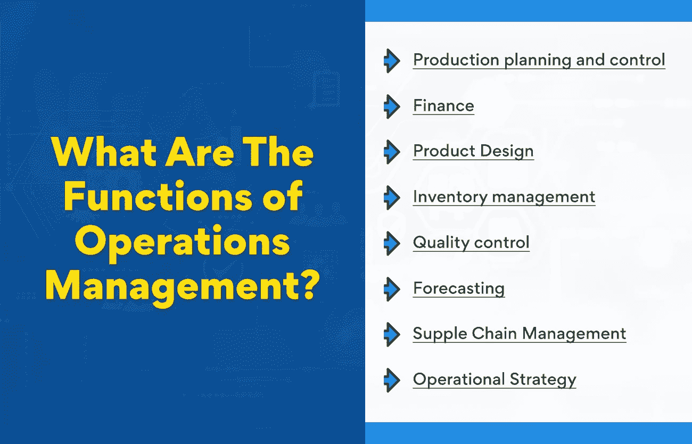

# 运营管理的角色和职能

> 原文：<https://www.edureka.co/blog/roles-and-functions-of-operations-management/>

运营管理(OM)是任何公司的关键职能，无论其规模和模式如何。运营管理职能对于任何寻求简化流程和提高产量的公司来说都是必不可少的。它负责企业的日常运营，并确保一切顺利进行。运营管理中有许多不同的角色和职能，理解起来可能很复杂。

本博客介绍了[运营管理](https://www.edureka.co/blog/beginners-guide-to-operations-management/)的各种角色和职能，并概述了每一项的内容。

**商业世界运营管理的演变**

运营管理在商业和贸易的早期就已经存在了。简单来说，运营管理就是管理企业日常运营的过程。这包括制造商品、处理客户服务查询和管理库存。

随着业务的增长和变得越来越复杂，运营管理的角色也发生了变化。今天，运营经理监督生产过程的所有方面。这包括从[产品开发](https://www.edureka.co/blog/dynamic-stages-of-the-new-age-product-development-process/)和采购到制造和物流的一切。

在 OM 的帮助下，企业可以提高效率，优化运营。这将提高盈利能力和竞争力。在当今的商业世界中，OM 对于任何想要成功的公司都是必不可少的。

在早期的商业时代，运营经理的职能更加有限。他们负责日常工作，确保业务顺利进行。随着公司的发展，运营管理的角色也在发展。他们现在负责监督生产的所有方面，从产品开发到制造和物流。这使得企业能够更高效地优化运营。

想让运营管理更上一层楼，提高你作为运营经理的技能吗？浏览我们的[运营、供应链管理和项目管理](https://www.edureka.co/highered/advanced-program-in-operations-supply-chain-project-management-iitg)高级证书，它将为您提供关于运营管理的所有详细信息。

**运营管理的职能是什么？**

运营管理是一个与生产商品和服务有关的商业领域，包括资源、流程和员工的管理。运营管理的职能是确保这些资源得到有效和高效的利用，以实现组织的主要目标。

运营管理的职能可分为四大类:

*   生产计划和控制
*   金融
*   产品设计
*   库存管理
*   质量控制
*   预测
*   供应链管理
*   [作战策略](https://www.edureka.co/blog/what-are-the-objectives-of-operations-management/)

**又读:[运营管理中的决策:要点](https://www.edureka.co/blog/operations-management-decisions)**

**产品规划&控制**

运营管理的首要职能是生产计划和控制。这涉及到与商品和服务生产相关的所有活动的计划和协调。这包括生产计划的制定、生产活动的安排和生产过程的控制。有了高效的[产品规划](https://www.edureka.co/blog/what-is-product-planning-and-how-is-it-done/) &管理，组织就能确保自己的产品高质量，满足客户的需求。

**产品规划的好处&控制**

*   **确保产品制造:** 通过计划生产过程和调度活动，产品计划员可以确保产品按时制造。
*   **提高产品质量:** 通过控制生产过程，产品规划者可以确保高质量的产品。
*   **降低成本:** 组织能够通过有效地计划和协调生产活动来降低生产成本。
*   **顾客满意:** 产品策划人员可以通过满足顾客的要求来确保顾客满意。

**金融**

运营管理的第二个职能是财务。这涉及到财政资源的管理。融资功能包括预算、预测和会计。该职能旨在确保本组织拥有实现其目标所需的资金。重要的是要明白，融资不仅限于获取资金，还包括如何高效和有效地使用资金。财务在运营管理中的作用是寻找更好的投资方式。

**金融的好处**

*   **高效利用资源:** 财务帮助组织高效、有效地利用资源。它确保组织有必要的资金来实现其目标，并就如何有效地使用这些资金提供指导。
*   **改善决策:** 财务提供的信息可以用来做出更好的决策。这些信息可以帮助组织决定在哪里投资资源和分配预算。
*   **增加盈利:** 财务可以帮助组织增加盈利。通过了解组织的钱花在哪里以及如何更有效地使用，组织可以节省资金并增加利润。

**产品设计**

运营经理也负责流程设计。这包括创造生产产品和提供服务的有效方法。他们将与工程师和设计师密切合作，以确保产品高效生产并符合质量标准。产品设计的功能是创造一种产品，既能满足客户的需求，又能为公司带来实惠和利润。为了有效地进行流程设计，运营经理必须对生产技术和流程有深刻的理解。

**产品设计的好处:**

*   **提高效率:** 通过设计易于制造、加工时间最短的产品和流程，运营经理可以提高制造流程的整体效率。这可以降低生产成本，缩短交货时间。
*   **降低产品成本:** 在[运营管理部门](https://www.edureka.co/blog/beginners-guide-to-operations-management/)工作的产品规划人员经常能找到降低制造产品所用材料和组件成本的方法。这可以通过重新设计产品以使用更便宜的材料或寻找提供更低价格的新供应商来实现。
*   **更高质量的产品:** 通过精心设计产品和流程，运营经理可以帮助确保产品的高质量并满足客户的期望。这可以增加销售额，提高客户满意度。

**库存管理**

库存管理无疑是运营管理的关键职能之一。它包括管理公司的库存水平，以确保有足够的库存满足客户需求，同时避免过多的库存占用营运资金。

运营经理使用各种技术来管理库存水平，包括准时制(JIT)库存系统、经济订货量(EOQ)模型和供应链管理(SCM)系统。这确保了公司拥有合适的库存水平来满足客户需求，同时最大限度地降低与持有过多库存相关的成本。

**库存管理的好处**

*   **避免与持有过多股票相关的成本:** 库存管理有助于避免与持有过多股票相关的成本，如存储成本和被占用资金的机会成本。
*   **帮助满足客户需求:** 通过管理库存水平，运营经理可以帮助确保客户需求得到满足。这在客户需求高且需要密切监控库存水平的企业中尤为重要。
*   **减少缺货:** 通过管理库存水平，运营经理可以帮助降低缺货风险。这在缺货可能导致销售损失或生产中断的企业中尤为重要。

**质量控制**

运营管理确保产品和服务符合公司及其客户的质量标准。这包括建立质量控制程序，并确保员工在质量控制技术方面得到充分培训。质量控制是运营管理不可或缺的一部分，因为它可以极大地影响公司的底线。例如，如果一家公司生产的产品不符合质量标准，它可能不得不退款或换货，这会花费公司的钱。

**质量控制的好处**

*   **确保产品和服务符合公司的质量标准:** 质量控制程序有助于确保产品和服务符合公司的质量标准。这有助于保护公司的声誉和底线。
*   **降低退款或更换的成本:** 通过确保产品和服务符合质量标准，质量控制可以帮助降低退款或更换的成本。
*   **提高客户满意度:** 质量控制可以通过确保产品和服务满足客户的期望来帮助提高客户满意度。

**预测**

预测是一个复杂的过程，使用最准确的数据和方法至关重要。预测涉及到短期和长期规划。这有助于公司设定生产目标，并就库存水平、产能和人员配备做出决策。需求计划是预测的重要组成部分。这个过程包括分析过去的需求模式，并用它们来预测未来的需求。统计方法，如趋势和回归，常用于需求计划。如果没有准确的预测，公司可能会发现自己的库存过多或过少，产能利用不足，并且没有足够的员工来满足客户需求。

**预测的好处**

*   **帮助公司设定生产目标:** 预测通过分析过去的需求模式，并使用它们来预测未来的需求，从而帮助公司设定生产目标。
*   **帮助公司对库存水平、产能和人员配备做出决策:** 通过预测未来需求，公司可以对库存水平、产能和人员配备做出更好的决策。
*   **帮助公司避免生产过剩和生产:** 预测通过预测未来需求，帮助公司避免生产过剩和生产不足。

**也可阅读:[医院运营管理——了解关键职能](https://www.edureka.co/blog/operations-management-in-hospitals)**

**供应链管理**

谈到供应链管理，运营管理的[职能变得更加重要](https://www.edureka.co/blog/what-is-operations-and-supply-chain-management-oscm/)。为了确保在预算内按时交付货物和服务，运营经理必须协调供应商、制造商、仓库和运输公司的活动。通过这样做，他们可以避免供应链中断，降低成本。[供应链管理](https://www.edureka.co/blog/components-of-supply-chain-management/)是运营管理的一个重要组成部分，必须不断监控和改进其中的功能。

**供应链管理的好处:**

*   降低总成本
*   改善沟通和协调
*   增加透明度和问责制
*   减少周转时间
*   提高客户满意度

**运营策略**

运营管理的职能也在制定和实施运营战略中发挥作用。该战略旨在帮助组织实现其长期目标和目的。运营经理必须考虑他们可用的资源、客户的需求和组织的总体目标。通过考虑所有这些因素，他们可以制定一个计划来帮助组织实现其目标。运营管理的职能对于运营战略的制定和实施至关重要。

**运营策略的好处:**

*   有助于实现长期目标:运营战略
*   考虑到顾客的需求
*   利用可用资源
*   可根据需要进行调整

**运营管理在企业走向成功中的作用**

营销、财务和人力资源等商业职能是必不可少的，但一家公司真正的成功在于它的运营。运营管理职能在企业走向成功的过程中发挥着关键作用。运营管理职能使公司平稳高效地运行。如果没有这些功能，公司将很快陷入日常业务运营的困境。

运营管理有许多职能，但其中一些最重要的职能包括供应链管理、生产计划和质量控制。这些功能对任何公司的成功都是必不可少的，但在制造业中更为重要。要想成功，公司必须快速高效地生产优质产品。运营管理的职能使这成为可能。

**预测:工作的未来**

工作环境的千变万化很难预测。技术已经彻底改变了我们的工作，并将继续如此。运营管理的角色和职能必须适应这些变化，以保持相关性。

运营经理在预测工作的未来方面扮演着重要的角色。他们必须能够预测组织的需求，并相应地做出调整。[运营管理的职能](https://www.edureka.co/blog/roles-and-functions-of-operations-management/)也必须适应。他们需要有效和高效地管理变化，以跟上不断变化的工作环境。

工作的未来是不确定的，但运营经理将是确保组织为接下来发生的一切做好准备的关键。他们需要具有灵活性和适应性，以跟上时代的变化。

现在是利用运营管理不断增长的潜力的时候了，我们有一个证书课程可以帮助您入门。查看我们的运营、供应链管理和项目管理高级证书，开始运营管理，开启您的职业之旅。

## **更多信息:**

[运营管理入门指南](https://www.edureka.co/blog/beginners-guide-to-operations-management/)

为什么企业需要运营战略？

[什么是运营管理中的能力规划？](https://www.edureka.co/blog/what-is-capacity-planning-in-operations-management/)

运营管理的范围是什么？