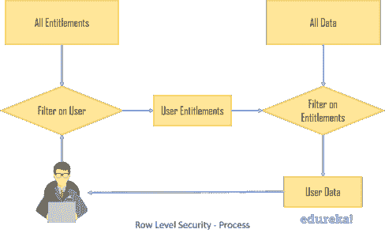

# Tableau 中的行级安全性:实现和使用

> 原文：<https://www.edureka.co/blog/row-level-security-in-tableau/>

如今，各种规模的组织都存在一些常见的问题，如保密性和时间管理问题。如果有一个解决方案可以向观众展示他们需要看到的信息，那该多好啊。Tableau 中行级安全性就是解决方案！

本文讨论了在 [Tableau](https://www.edureka.co/blog/tableau-tutorial/) 中开始使用行级安全性所需的所有内容，其概要如下:

*   **在 Tableau 中创建行级安全性的先决条件**
*   **行级安全性介绍**
*   **实现行级安全的方法**
*   **层次关系&组合键**
*   **您的数据库何时内置了行级安全性？**

## **在 Tableau 中创建行级安全性的先决条件**

1.您需要在 Tableau Server 中创建用户和组；

2.您需要联机连接到 Tableau 服务器/Tableau，因为 Tableau 桌面将从那里下载用户和组的列表

3.根据 Tableau 中的筛选顺序，您的用户筛选应该位于同一数据源级别

♠ **注意:**嵌入式数据源不太安全，应该仅在禁用网络编辑/下载的情况下使用。

现在你知道你需要什么了，让我们试着理解这个复杂的术语实际上是什么意思，好吗？

## **行级安全性介绍**

在理解 Tableau 中的行级安全性之前，您需要理解一些术语，即**权利**和**权利表**。

**权限**基本上是数据视图将被过滤的属性的单一唯一组合。这些属性必须存在于数据视图的列中。它可以是地区、次地区和国家的地理层级，或者是你能想到的任何其他组合。

一个**权利表**是数据将被过滤的属性的组合。例如，按区域、子区域和国家/地区筛选(如前所述)是一项权利。标准的数据库设计实践意味着，很少有一个表符合权限表的标准。大多数数据通常不会一对一地映射到单个用户；通常，数据安全由角色、组织名称或两者共同组织。

该过程的基本分解可以用以下步骤来解释:

*   确定用户名
*   为所述用户，仅仅是该用户，获取您的数据权利
*   [根据这些权利过滤您的数据](https://www.edureka.co/blog/filters-in-tableau/)

## **Tableau 中实现行级安全的方法**

实现行级安全性有两个主要选项:

**仅使用 Tableau**

实现行级安全性的一种方法是只通过 Tableau。您可以通过以下方式实现:

*   实时/提取连接
*   为每个数据源构建和应用用户过滤器

让我们考虑一个仅使用 Tableau 实现行级安全性的示例，Tableau 桌面上定义了用户过滤器。首先，我们在 Tableau Online 上创建所需的用户和组。

点击菜单栏>服务器>创建用户过滤器。可用字段列表出现在您面前，您可以开始使用用户筛选表单。

此外，如果您尚未登录 Tableau Server/Online，系统可能会在此阶段提示您进行登录。

这里我们有一些地理数据，我们需要将每个用户分配到适当的区域，只允许一个用户映射到给定的数据行。

与其他字段一样，全新的用户计算出现在“数据”窗格的“度量”下。

在弹出的对话框中选择**真**，点击**好**。

## **使用混合方法**

实现行级安全性的另一种方法是通过混合方法，其中 Tableau Server 或 Tableau Online 中的用户信息对应于数据库中的数据元素。

*   实时/提取连接
*   利用数据服务器
*   使用数据源筛选器

因此，在本例中，我们将两个订单与各自的销售代表联系起来。这包含用于可视化的实际数据和权限表，即人员表。数据表被连接到包含用户名和键值的权限表。该表是数据库中组件的一个实例，这些组件将用户与特定的数据元素(如用户与地区)相关联。

♠NOTE: 这是一个相对简单的例子，在现实生活中并不总是如此。

我们使用计算字段来创建利用此数据的用户筛选器，创建以下公式来检查用户名是否与销售代表字段匹配。

`USERNAME() = [Username]`

创建该字段后，可以将其拖到筛选器架上，或通过嵌入作为数据源筛选器应用到多个工作表。

**了解我们在顶级城市的 Tableau 培训课程**

| 印度 | 美国 | 其他热门城市 |
| [班加罗尔的 Tableau 培训](https://www.edureka.co/tableau-certification-training-bangalore) | [达拉斯的 Tableau 球场](https://www.edureka.co/tableau-certification-training-dallas) | [华盛顿的 Tableau 课程](https://www.edureka.co/tableau-certification-training-washington) |
| [海德拉巴的 Tableau 培训](https://www.edureka.co/tableau-certification-training-hyderabad) | [夏洛特的 Tableau 课程](https://www.edureka.co/tableau-certification-training-charlotte) | [奥斯汀的 Tableau 课程](https://www.edureka.co/tableau-certification-training-austin) |
| [金奈的 Tableau 培训](https://www.edureka.co/tableau-certification-training-chennai) | [纽约的 Tableau 课程](https://www.edureka.co/tableau-certification-training-new-york-city) | [西雅图的 Tableau 课程](https://www.edureka.co/tableau-certification-training-seattle) |

## **层级关系&组合键**

大多数组织都有一个层次结构，通常要求层次结构中的高层可以访问所有下属的数据，反之则不行。例如，让我们看看下面的层次结构，以便更好地理解这个概念。我们有 3 个级别需要考虑:

1.  **首席执行官(三级)**
2.  **团队领导(2 级)**
3.  **员工(一级)**

为了表示数据的不同层次，一种有效的技术是在权限视图中有一行表示每个安全过滤器的最细粒度级别。您可能需要从许多不同的表中构造一个视图，这些表存储用户权利的不同部分。

为了在您的权限视图中按部门和地区显示数据，CEO 将为每个部门和地区设置一行。每个团队领导依次只有一行属于他们职责的部门。团队领导下的每个员工可能都没有。

对于层次结构复杂的权利表，您可能需要使用多个字段将它们与主表连接起来。这就是所谓的**组合键。**

可以通过两种方式处理:

*   在您的权限视图和数据表中创建一个组合键字段。然后加入这两个
*   将权限视图连接到构成组合键的每个字段的数据表

层级过滤器的一个简单示例如下:

`IF ISMEMBEROF(‘level 3') THEN 1` `ELSEIF ISMEMBEROF(‘Team Leads’) THEN` `IF [Team Lead Username Field] = USERNAME() and [subdivision(entitlement)] = [subdivision(data table)] THEN 1 ELSE 0 END`

**您的数据库何时内置了行级安全性？**

*   在 [Oracle](https://www.edureka.co/blog/hdfs-using-sqoop/) 中，如果您为数据库用户设置了 VPD，您可以在 Tableau 中使用初始 SQL。这样，您可以利用现有的安全过滤
*   在 2016 年以后的版本的 [SQL Server](https://www.edureka.co/blog/sql-tutorial/) 中，您可以基于用户在数据库中设置行级安全性。Tableau 的 Impersonate-User-functional 将为您正确设置用户，而 SQL Server 会进行筛选。

这就把我们带到了这篇关于 Tableau 中行级安全性的文章的结尾。

[https://www.youtube.com/embed/aHaOIvR00So](https://www.youtube.com/embed/aHaOIvR00So)

*如果你想学习 Tableau，Edureka 有一个关于 **[Tableau 培训](https://www.edureka.co/tableau-certification-training)** 的策划课程，涵盖了各种各样的内容，如条件格式、脚本、链接图表、仪表板集成、Tableau 与 R 的集成等等。*

*有问题吗？请在评论区提到它，我们会尽快回复您。*