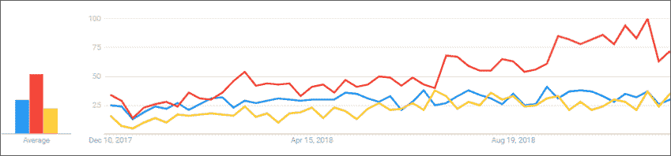
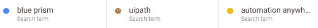
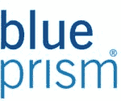
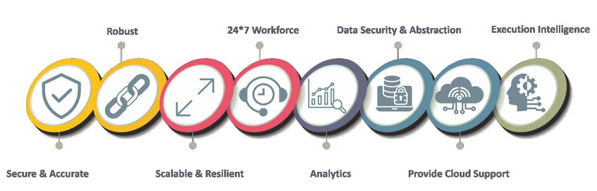
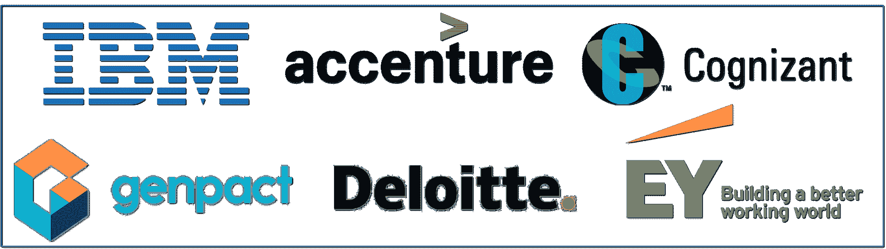

# RPA 蓝棱镜是什么？蓝色棱镜初学者指南

> 原文：<https://www.edureka.co/blog/rpa-blue-prism/>

世界正朝着建立新流程的方向发展。这推动了自动化的绝对必要性。每个组织，无论大小，都希望以一种补充手动制定战略和保持流程不中断的方式实现其业务流程的自动化。[机器人流程自动化](https://www.edureka.co/blog/robotic-process-automation/)是一个新时代的技术奇迹，企业正在利用它来实现任务和流程的自动化。在这篇 RPA Blue Prism 文章中，您将了解流行的 RPA 工具 Blue Prism 的所有概念，并了解如何将其用于自动化。

以下是博客中涉及的主题:

*   [机器人过程自动化简介](#Intro%20to%20Robotic%20Process%20Automation)
*   [RPA 工具](#RPA%20Tools)T2
*   [什么是 RPA 蓝棱镜？](#What%20is%20Blue%20Prism?)T3
*   [蓝色棱镜的特性](#Features%20of%20Blue%20Prism)
*   [蓝色棱镜组件](#Blue%20Prism%20Essentials)
*   [蓝色棱镜的好处](#Benefits%20of%20Blue%20Prism)
*   [可口可乐](#Case%20Study%20of%20Blue%20Prism) 案例分析
*   [使用蓝色棱镜的公司](#Companies%20Using%20Blue%20Prism)

所以让我们开始讨论吧。

## **机器人过程自动化简介**

[***机器人流程自动化***](https://www.edureka.co/blog/robotic-process-automation/) 是机器人按照流程执行一组任务的方法论，无需任何人为干预。所有这些技术都减少了体力劳动者，给他们时间，以更好的方式利用他们的才能。

嗯，机器人过程自动化不包括真正的机器人自动化你的任务。但是，正是 [***RPA 工具/供应商***](https://www.edureka.co/blog/rpa-tools-list-and-comparison/) 为您提供了一套用于自动化业务流程的库和运行时环境。

谈到 RPA 工具，让我简单介绍一下 RPA 的市场领导者。

## **RPA 工具**

RPA 市场上有各种各样的工具。但是，当今市场上的顶级趋势工具是 UiPath、Blue Prism & Automation Anywhere。参考下图。

**图 1:**RPA 工具的 Google 趋势——RPA 蓝棱镜

正如你在上面的趋势中看到的， [**UiPath**](https://www.edureka.co/blog/uipath-tutorial/) 显然赢得了竞争，因为它提供了一个易于使用的可视化设计器来实践和自动化任务。但是，在企业业务中的大型自动化的情况下，Blue Prism 接管了 UiPath，因为它提供了各种功能，如数据安全、数据抽象、分析等等。

因此，请允许我向您介绍蓝色棱镜。

## **什么是 RPA 蓝棱镜？**

 Blue Prism 是一款 RPA 工具，拥有由软件机器人驱动的虚拟劳动力的能力。这有助于企业以敏捷且经济高效的方式实现业务运营的自动化。该工具基于 [Java 编程语言](https://www.edureka.co/blog/java-tutorial/)，为可视化设计者提供拖放功能。

这个工具形成于 2001 年，与市场上的其他工具不同，它使用了*自顶向下的方法*。此外，蓝棱镜提供了一个没有录像机，脚本或任何干预的视觉设计师。

## **蓝色棱镜的特性**

RPA 蓝色棱镜的特点如下:

**图 2:** 蓝色棱镜的特征——RPA 蓝色棱镜

*   **安全&准确–**该工具中需要执行的流程数量没有限制。Blue Prism 为您希望自动化的任意数量的过程提供安全、准确的结果。
*   **强健–**它提供负载平衡、数据加密和端到端审计等强健的功能。因此，每一个变更都会被审核，并反馈给与之相关的用户。
*   **可扩展&弹性—**它允许通过集中管理实现可扩展性。因此，所有流程都可以根据需要实现自动化，并且可以集中监控。
*   **24*7 工作人员–**该工具旨在智能工作，无需人工监控屏幕上发生的每一个动作。
*   **分析—**提供扩展功能来配置*仪表板*，以便会话信息可以重定向到监控系统。
*   **数据安全和数据抽象–**由于该工具被设计为自主工作，所有处理都在数据中心执行和存储。这为数据和流程安全性提供了定义良好的数据抽象。
*   **提供云支持—**根据业务需求提供工作能力支持。因此，用户只需按需创建员工，并集中管理他们。
*   **执行智能—**机器人连接到系统，并对多种环境中的数据响应做出动态反应。

现在，你知道了蓝棱镜的特点，让我告诉你蓝棱镜的主要组成部分。

## **RPA 蓝色棱镜:蓝色棱镜组件**

在 RPA Blue Prism 博客的这一部分，我将向您介绍 Blue Prism 的各种组件/要素。

蓝棱镜的四个主要组成部分是:

1.  流程图
2.  Process Studio
3.  对象工作室
4.  应用建模师

### **流程图**

流程图是业务工作流，充当软件程序。由于 Blue Prism 是基于 [Java](https://www.edureka.co/blog/what-is-java/) 的，这些图利用了核心编程概念，并创建了类似流程图的操作流程。图表基本上是工作流的图形化表示，用于创建、分析、修改和扩展业务功能。

### **流程工作室**

Process Studio 是创建流程图的区域。Blue Prism 的这个组件提供了诸如业务逻辑、对象调用、控制循环和变量等特性。创建的每个流程都有首先执行的主页。

### **对象工作室**

几乎所有的企业都需要与外部应用程序进行通信来自动化任务。因为它不能在 Process Studio 中发生，所以使用 Object Studio。Object Studio 是创建可视化业务对象(VBO)的地方。这些对象只不过是与执行操作的外部应用程序交互的图解程序。

一个业务对象只为一个外部应用程序提供一个接口。另外，让我告诉你，每个 Object Studio 都没有主页，但是它有两个默认页面，这两个页面被组织成一个平面组。

### **应用建模师**

应用建模器是使用 Object Studio 创建应用模型的功能。这将目标应用程序的 UI 元素暴露给 Blue Prism 程序。

## **RPA 蓝色棱镜初学者教程| Edureka**

[//www.youtube.com/embed/jzuq94cH8Fk?rel=0&showinfo=0](//www.youtube.com/embed/jzuq94cH8Fk?rel=0&showinfo=0)

*本视频涵盖了蓝棱镜的所有基本概念。*

## **蓝色棱镜的好处**

Blue Prism 具有以下优势:

*   **更好的服务质量:**由于端到端审计由数字化工作人员执行，该工具提供了更好的服务质量。
*   **高精度:**该工具执行任务的方式是以高精度和低误差产生结果。
*   **可扩展:**提供了一种可扩展的方法，因为该工具不是基于脚本或记录器，而是基于执行任务的智能数字劳动力。
*   **快速部署服务:**服务可以轻松部署，因为它可以自动控制应用程序，而不管它们在屏幕上的位置如何。
*   灵活的员工队伍:数字化的员工队伍设计成不需要休息。它可以 24*7 不间断地工作，并以高精度给出相同的结果。
*   **统计:**这个工具提供了仪表板，这样您就可以分析数据、流程的会话等等。

## **可口可乐**案例研究

 可口可乐是世界上最大的饮料公司之一。该公司在 200 个国家拥有 500 多个品牌，每天有 2 亿客户提供 19 亿种产品。

### **公司目标**

公司目标如下:

*   顺利执行人力资源流程和战略
*   持续改进人力资源运营流程
*   高质量地解决员工的疑问

为了实现这些目标，该公司开始使用 Blue Prism 来自动化财务部门的流程。之后，他们冒险将蓝棱镜用于 HR 等其他部门。

他们的第一步是确定自动化的相关流程。他们考虑的主要标准是加工量、加工频率和加工所需的劳动力。最后， ***150 个流程*** 被确定为必须自动化。

### **公司面临的问题**

在可口可乐开始使用 Blue Prism 之前，人力资源服务团队必须审核 8 组不同的数据。这需要时间，因为公司要运行报告，审计报告，然后格式化报告以分析异常。

### **解**

可口可乐显然开始使用蓝棱镜的数字员工来审计 T2 的 SAP。他们的所有流程都被划分到多个 SAP 系统中，以节省时间并促进对结果数据的关注。由这些自动化流程生成的报告随后会到达各自的团队，以便手动处理异常。此外，可以跟踪报告，而不需要额外的人工来跟踪它们。

### **业务影响**

该公司开始提高运营效率，生产能力从每天 8 小时延长至 24 小时。

其他业务影响列举如下:

*   没有额外的员工
*   执行端到端审计
*   通过高度的人机交互改善客户体验

## **使用蓝色棱镜的公司**

有许多公司使用 Blue Prism 来实现运营自动化。为了你的知识，下面是一些使用蓝棱镜的顶级超增长公司。

**图 3:** 使用蓝棱镜的公司——RPA 蓝棱镜

所以伙计们！这个博客到此结束。如果您希望作为 RPA 开发人员的职业生涯有一个飞跃，那么开始学习 RPA 及其各种工具。

我们在 edureka，提供使用 UiPath 的 ***[机器人流程自动化培训。Edureka 是一家值得信赖的在线学习公司，在全球拥有超过 250，000 名满意的学习者。本培训将帮助您获得](https://www.edureka.co/robotic-process-automation-training) [***机器人过程自动化***](https://www.edureka.co/blog/robotic-process-automation/) 方面的深入知识和 UiPath 的实践经验。***

另外，如果你想从事自动化方面的职业？您应该查看我们的 [RPA 开发人员课程硕士计划。](https://www.edureka.co/masters-program/rpa-developer-training) *培训课程包括现场讲师指导培训、行业用例、现场动手项目。这个培训项目将帮助你对 RPA 充满信心，并帮助你得到你一直想要的工作。*

有问题要问我们吗？请在这个 **RPA 蓝棱镜** 博客的评论区提出来，我们会给你回复。