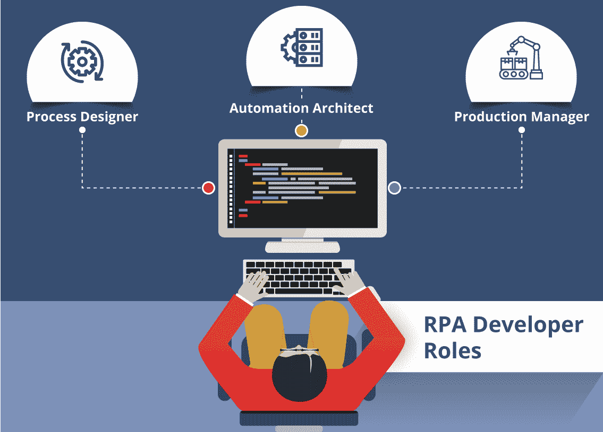
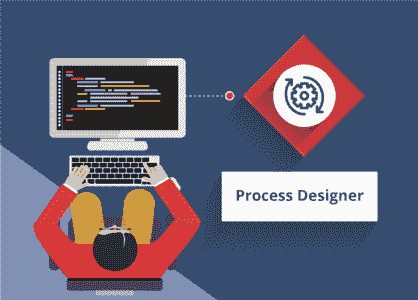
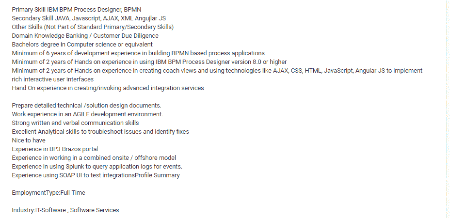
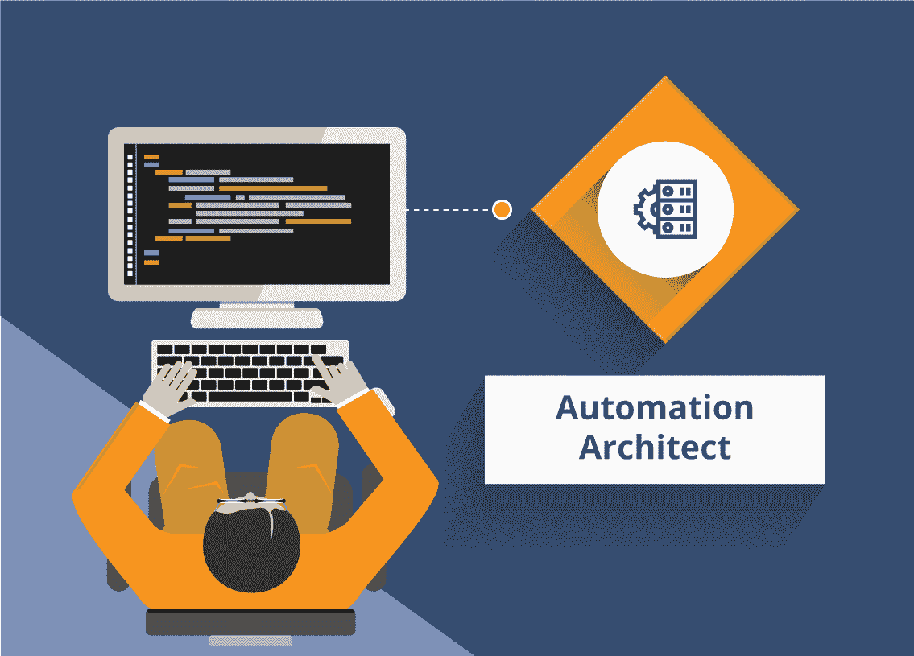
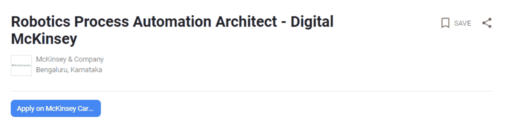
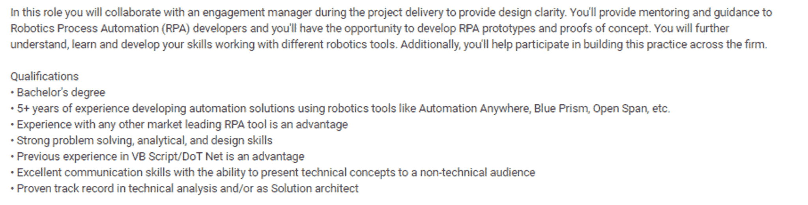
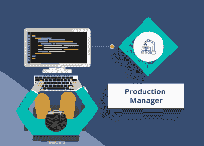

# RPA 开发人员的角色和职责

> 原文：<https://www.edureka.co/blog/rpa-developer-roles-and-responsibilities/>

在之前的博客中，你了解了 **[学习 RPA](https://www.edureka.co/blog/10-reasons-to-learn-rpa/)** 的 10 大理由。然而，尽管 RPA 能够弥合集成数字鸿沟，但成功的项目仍然需要合适的人在合适的地点做合适的事情。大家都知道对 ***[RPA 认证](https://www.edureka.co/robotic-process-automation-training)*** 的需求在不断上升，所以下一个问题会浮现在你的脑海中，这些人是谁，他们应该做些什么来支持一个成功的 RPA 项目？让我们看看 **RPA 开发人员的角色和职责。**

****

## **RPA 开发人员的角色和职责**

### **角色:**流程设计者

### **职责:**

*   流程设计师负责**了解当前流程。**
*   他/她确保参与 RPA 项目的**人员保持同步。**
*   他/她还**监控在开发或测试阶段实施反馈后发生的变化**，同时保持项目规格完整。

### **所需技能:**

*   很强的解决问题和分析能力
*   拥有一项或多项 RPA 技术的经验(例如 UiPath、Automation Anywhere、Blue Prism)
*   在编程(包括脚本/编码)、SQL 和关系数据库以及应用程序开发方面至少有 2 到 4 年的专业经验
*   具有流程分析、设计和实施、业务和技术需求、问题解决和系统测试的经验，包括 UAT 和错误修复
*   应该能够优先考虑和管理多个投资组合
*   对精益六适马过程方法论的基本理解

### **RPA 开发者:流程设计师薪资**

**印度**

*   对于**大一新生**或有 0-2 年经验的人-**每年 60 万印度卢比**到**80 万**
*   对于有 2-6 年经验的**高级角色**—**每年 90 万印度卢比**到**150 万**

**美国**

*   平均年薪从**84000**到 132000 不等

现在让我给你看一个流程设计师工作描述的例子

****

**注:**上述职位描述可能会因公司要求而异，但技能和职责是相同的。

## RPA 开发人员的角色和职责| RPA 开发人员培训| RPA 教程| Edureka

[https://www.youtube.com/embed/ipJQm0pj5yg?rel=0&showinfo=0](https://www.youtube.com/embed/ipJQm0pj5yg?rel=0&showinfo=0)This Edureka video on “RPA Developer Roles and Responsibilities” will help you to know the various Roles and Responsibilities of RPA Developer.

### **角色:**自动化架构师

### **职责:**

*   自动化架构师**使用 RPA 工具构建 RPA 项目。**
*   他/她是核心自动化团队的成员，**可能有也可能没有开发人员级别的专业知识**，这取决于组织使用的 RPA 工具。
*   自动化架构师仍然有一些编程和解决现实世界问题的经验。

### **所需技能:**

*   拥有 ITIL、TOGAF、CoBIT、PMP、Prince2、精益六适马等认证很好
*   应能设计 RPA 项目的技术规范文件
*   应该能够为 RPA 项目创建完整的技术体系结构，确保该体系结构可扩展和可伸缩
*   亲身体验 RPA 工具和认知平台，如 Blue Prism、Automation Anywhere、UiPath、Redwood、Open Span、WorkFusion 等。
*   拥有 C/C++、Python、VB Script、Ruby、Java、JS 等任何编程语言的经验。网
*   使用 NICE、Nuance、OCR 工具、企业系统 SAP、Oracle、PeopleSoft、Custom Apps、ITSM 工具服务 Now、BMC Remedy、吉拉等工具的经验。自动化平台/框架/工具

### **RPA 开发者:自动化架构师薪资:**

**印度**

*   对于**大一新生**或有 0-3 年经验的人-**印度卢比** **每年 10，000，000**
*   对于有 3-9 年经验的**高级角色**—**每年 19，55000**卢比

**美国**

*   平均年薪从-**128，000 美元到 170，000 美元**

现在让我给你看一个流程设计师工作描述的例子

****

**注:**上述职位描述可能会因公司要求而异，但技能和职责是相同的。

### **角色:生产经理**

### **职责:**

在一个项目被测试并投入生产后，它就变成了生产经理到的责任

1.  确保进程按预期触发
2.  处理内嵌处理机器人提示(例如，“发票金额超过采购订单金额，但订单是特殊订单项目–拒绝还是接受？”)
3.  处理流程异常——例如，“发票被拒，现在怎么办？”)
4.  向自动化架构师报告错误
5.  审查分析并向流程设计者提供流程改进信息

### **所需技能:**

*   至少 1-3 个 RPA 项目解决方案经验(端到端实施)。
*   必须具备 RPA 体系结构和交付经验。
*   RPA 工具的实践知识(UiPath、Automation Anywhere 或 Blue Prism)。
*   在创新和整合不同技术的能力方面有丰富的经验。
*   至少 0-5 年的 IT 行业技术经验，0-3 年的机器人自动化技术经验，使用 RPA 工具并对 RPA 工具有深入的了解。

### **RPA 开发人员:生产经理工资:**

**印度**

*   对于**大一新生**或有 0-4 年经验的人-**印度卢比** **每年 701000**
*   对于有 4-10 年经验的**高级角色**—**印度卢比** **每年 1800，000**

**美国**

*   平均年薪从–6 美元**8000 美元**到**125000 美元**不等

这就是关于 **RPA 开发人员角色和职责** 的全部内容。如果你对学习机器人过程自动化有进一步的兴趣，这个博客系列将会经常更新。

我们在 edureka！还提供 ***[机器人过程自动化培训使用 UiPath](https://www.edureka.co/robotic-process-automation-training)*** 。如果您有兴趣将职业生涯转移到 RPA，您可以在此注册课程[，并开始学习。](https://www.edureka.co/robotic-process-automation-training)

*有问题吗？请在这个 **RPA 开发人员角色和职责** 博客的评论部分提到它，我们会给你回复。*