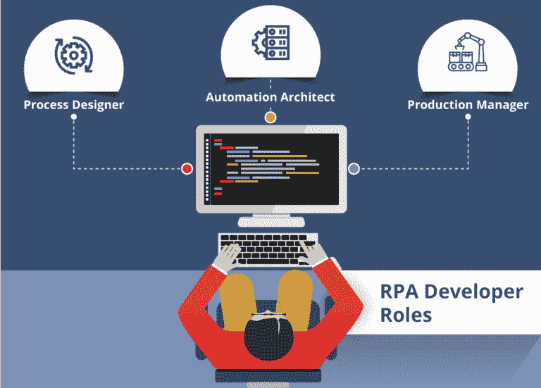

# RPA 开发人员工资:一个 RPA 开发人员的工资是多少？

> 原文：<https://www.edureka.co/blog/rpa-developer-salary>

我们生活在一个每个人都在谈论自动化以及自动化将如何改变世界的世界。但是，为了自动化繁琐的任务，我们需要首先设计自动化，为此我们需要一个 **[RPA 认证的开发人员](https://www.edureka.co/robotic-process-automation-training)** 。在本文中，我们将讨论全球 RPA 开发人员的薪资，并了解为什么每个企业都需要一名 [RPA 开发人员](https://www.edureka.co/blog/rpa-developer-roles-and-responsibilities/)。根据 Indeed.com 的说法，一名 RPA 开发人员的平均期望工资为 97，631 美元。

在本文中，我将按以下顺序讨论 RPA 开发人员工资的细节:

*   谁是 RPA 开发人员？
*   [RPA 开发人员工作趋势](#RPA%20Developer%20Job%20Trends)
*   [RPA 开发人员工资趋势](#RPA%20Developer%20Salary%20Trends)
*   [RPA 开发人员工资:基于角色](#RPA%20Developer%20Salary:%20Roles-Based)
*   [RPA 开发人员工资:基于公司](#RPA%20Developer%20Salary:%20Company-Based)
*   [RPA 开发人员工资:地理位置](#RPA%20Developer%20Salary:%20Geographically)

## **谁是 RPA 开发者？**

RPA 开发人员是自动化任务的高级设计师，拥有市场上顶级 RPA 工具的实践经验。为企业工作的 RPA 开发人员负责解决问题，并根据需求设计自动化。一旦自动化设计完成并投入生产，RPA 开发人员还需要确保设计的自动化实现了预期的结果。因此，我们可以得出结论，RPA 开发人员可以是任何了解[机器人流程自动化](https://www.edureka.co/blog/robotic-process-automation/)并且好奇使用各种工具来自动化任务的人。

现在，让我们来关注不同地区的 RPA 开发人员的工作趋势。

## **RPA 开发者就业趋势**

下表说明了全球不同地点的工作数量。

| **地点** | **岗位数量** |
| 美国 | Five thousand five hundred and twenty |
| 联合王国 | Five hundred and twelve |
| 印度 | Three thousand four hundred and thirty-nine |

如你所见，这些数字相当不错。RPA 开发人员的职业机会只会越来越多，初创公司和老牌公司都向 RPA 开发人员提供丰厚的薪水。

现在，您已经知道了 RPA 开发人员的职位空缺，让我们来看看他们的工资趋势。工资可根据以下参数变化:

*   基于位置
*   基于角色
*   基于公司的
*   在地理上

让我们逐一讨论它们。我们将从基于职位的薪资趋势开始。

## **RPA 开发者薪资趋势:职位基础**

根据 Indeed.com 的说法，下面是描述美国和印度 市场上不同职位的 RPA 开发人员平均工资的统计数据。

| **美国** |
| **职位** | **工资** |
| 开发者 | $97，631/年 |
| 初级开发人员 | $61，024/年 |
| 业务流程分析师 | $73，380/年 |
| 高级开发人员 | $108，325/年 |
| 首席开发人员 | $130，447/年 |

|  |
| **职位** | **工资** |
| 开发者 | 【₹10,80,600+】/年 |
| 初级开发人员 | 【₹9,01,300+】/年 |
| 业务流程分析师 | ₹7,31,700+/yr |
| 高级开发人员 | ₹4,44,400+/yr |
| 首席开发人员 | ₹5,63,600+/年 |

RPA 开发人员在这个行业中也主要有三个角色:流程设计师、自动化架构师和生产经理。

*   **流程设计者—**流程设计者负责了解当前流程，并监控在开发或测试阶段实施反馈后发生的变化。
*   自动化架构师—自动化架构师使用 RPA 工具来构建 RPA 项目，以解决现实世界中的问题。
*   **生产经理—**一旦项目投入生产，生产经理就要确保流程得到触发，所有异常都得到处理。

现在，让我们讨论基于 RPA 开发人员各种角色的工资。

## **RPA 开发者薪资:基于角色**

正如我上面提到的，RPA 开发人员在这个行业中也主要有三个角色:流程设计师、自动化架构师和生产经理。因此，让我来讨论一下基于这些角色你将获得的暂定工资。

| **流程设计者** |
| **印度** | **美国** |
| 

*   For people with or **0-2 years of experience** – **600,000** to **800,000** per year.
*   For **senior position** , he has **2-6 years of experience** – **900,000**

 | 平均年薪从**84000**到 132000 不等。 |

| **自动化架构师** |
| **印度** | **美国** |
| 

*   T0 is a freshman or a person with 0-3 years **experience** – **INR** **100,000** **per year**
*   "T0" is the senior role of **and 3** with **experience.**

 | 平均年薪从–**12.8 万美元到–**17 万美元不等。 |

| **生产经理** |
| **印度** | **美国** |
| 

*   T0 is a newcomer of **or a person with 0-4 years of working experience- **Indian Rupee** **701,000** per year.**
*   is a senior position of with 4-10 years of working experience-

 | 平均年薪从-6 美元**8000**到**12.5 万**美元不等。 |

这里列出了 [学习机器人过程自动化](https://www.edureka.co/blog/10-reasons-to-learn-rpa/)的十大理由。

现在，让我们讨论基于不同公司雇佣 RPA 开发人员的工资。

## **RPA 开发者薪资:公司制**

我列出了正在积极招聘 RPA 开发人员的大公司提供给他们的薪水。

| **公司** | **年薪** |
| UiPath | $71,047 |
| 埃森哲 | $97,631 |
| 齐格蒙特 | $50,290 |
| 自动化无处不在 | $57,182 |
| 安永会计师事务所 | $97,631 |

如你所见，无论是初创企业还是高速增长的企业，各种企业都愿意在 RPA 开发人员身上投入大量资金。现在，让我们讨论一下基于地理位置的 RPA 开发人员的工资。

## **RPA 开发者薪资:地域**

我列出了以下主要城市的工资:

| **地点** | **工资** |
| 美国 | $97,631 |
| 印度 | ₹1.1 万 |
| 联合王国 | 52500 |

如果你正在寻找一份有趣的职业，现在是提升技能和利用自动化职业机会的好时机。另外，如果你想通过视频讲座了解薪资讲座，那么可以参考下面的视频:

## **RPA 开发人员工资|印度 RPA 开发人员的平均工资&美国**

[https://www.youtube.com/embed/VvbcUo9Mtx8?rel=0&controls=0&showinfo=0](https://www.youtube.com/embed/VvbcUo9Mtx8?rel=0&controls=0&showinfo=0)

*这个视频讲的是一个 RPA 开发人员在印度和美国基于不同因素的平均工资。*

*Edureka 有一个特别策划的 **[机器人过程自动化培训](https://www.edureka.co/robotic-process-automation-training)** 会让你精通一个 RPA 工具- [UiPath](https://www.edureka.co/blog/uipath-tutorial/) 。T 他的培训将让您增强 RPA 方面的知识，并为您提供 UiPath 方面的丰富实践经验。*

*有问题吗？请在* *这篇文章的评论区提出来，我们会给你回复。*