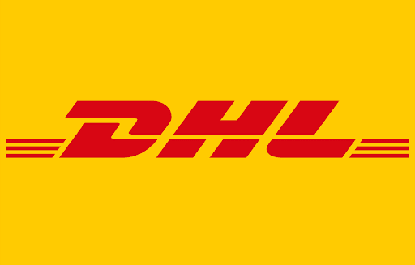
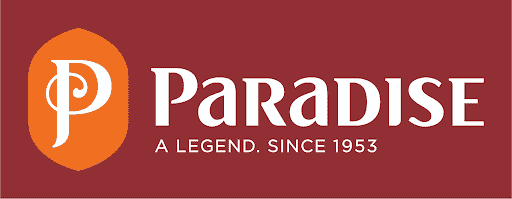
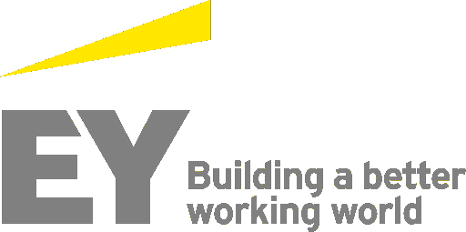
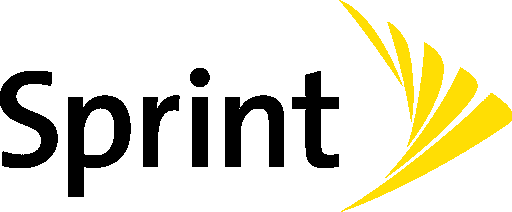
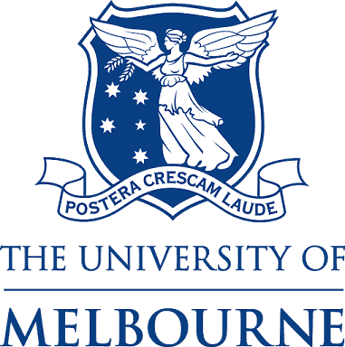

# 不同领域中的 RPA:RPA 如何解决行业级问题？

> 原文：<https://www.edureka.co/blog/rpa-in-various-domains/>

RPA 是一个流程，通过该流程，简单到复杂的任务可以在 [RPA 工具](https://www.edureka.co/blog/rpa-tools-list-and-comparison/)的帮助下实现自动化，并且可以在最少或没有人工干预的情况下完成。术语 RPA 是在自动化行业中发展起来的，但它不再局限于技术行业。在这篇关于 RPA 在各个领域的文章中，我将阐明[机器人过程自动化](https://www.edureka.co/blog/robotic-process-automation/)如何在各个领域中使用，以及这些行业如何从中受益。

由于 [UiPath](https://www.edureka.co/robotic-process-automation-training) 和 [Automation Anywhere](https://www.edureka.co/automation-anywhere-certification-training) 是当今市场上的两大 RPA 工具，因此您必须了解这些工具在当今行业中的使用情况。因此，为了让您更好地理解，我将本文分为以下两个部分:

*   ***[RPA 在各个域中使用 UiPath](#rpausecasesuipath)***

*   ***[RPA 在各个领域自动化随处可见](#rpausecasesautomationanywhere)***

在开始这篇文章之前，如果你想知道什么是机器人流程自动化以及它是如何工作的，你可以参考我关于 RPA 的[文章。](https://www.edureka.co/blog/what-is-robotic-process-automation/)

## **使用 UiPath 的各种域中的 RPA**

在文章中关于 RPA 在各个领域的这一部分，我们将讨论 RPA 如何被各种组织或机构使用 [UiPath](https://www.edureka.co/blog/uipath-tutorial/) 来自动化简单到复杂的流程。考虑的领域如下:

*   ***[银行业](#banking)***

*   ***[保险](#insurance)***

*   ***[医疗](#healthcare)***

*   ***[交通](#transportation)***

*   ***[美食](#foodindustry)***

## **银行业的 RPA**

### **简介**

联邦银行是一家领先的私营银行，总部位于印度喀拉拉邦。在过去的 10 年里，这家银行不断发展壮大，目前在印度拥有 1250 多家分行。

### **挑战**

银行想要**合并唯一的客户识别码来识别客户**。如果银行决定手动完成这项任务，那么它将**耗时，容易出错，并且很难同时扩展银行**。

观察到的另一个挑战是，银行希望确保其**员工能够提供并维护强大的客户关系**和其他以关系为导向的服务。但是，他们也希望在前线使用数字化转型来运营业务、服务客户和帮助员工。

### **解决方案**

为了克服这些挑战，联邦银行开始寻找各种机会，并开始评估顶级 RPA 供应商。该银行使用 UiPath 提供的机器人通过客户 id 来唯一识别客户。UiPath 机器人可以在一天内处理 10000 条客户记录的样本，并可以在一小时内合并 250 条记录。

### **结果**

如果我们用数字说话，那么 UiPath 已经帮助联邦银行实现了以下数字:

*   对账过程中的错误率为 0%
*   在 50%的时间内完成任务
*   非常快速地自动化 15 个不同的流程
*   该公司计划到 2020 年底实现约 53 项任务的自动化

## **保险中的 RPA**

### **简介**

未来忠利印度人寿保险有限公司拥有约 117 家分支机构，旨在通过一整套简化的解决方案来保护和改善人们的生活。它是由未来集团、忠利集团和工业投资信托有限公司(IITL)三家集团合资组建的。

### **挑战**

涉及团体保险的所有流程都是**手动的，平均需要大约 7 天的时间**。这是因为应用程序在 AS/400 平台上运行，所有业务流程在保单签发和承保生命周期的不同阶段都要输入或输出核心保险系统。

所以，简而言之，所有的操作都增加了公司的成本。相反，如果我们的运营活动(如上传各种策略的成员数据)是使用 RPA 完成的，那么该流程将更有效，成本也更低。

### **解决方案**

Future Generali India Life 的团队已经开始**在 Python 基于脚本的自动化的帮助下，每天**自动完成 50 笔交易的任务。虽然基于脚本的自动化在一个独立的自动化领域做得很好，但是对于各种其他的过程/项目来说却很困难。

因此，当团队决定迁移到 UiPath 时，他们已经意识到该平台易于使用。UiPath 机器人现在正在自动执行向客户发送记录文件的任务，因为指定的机器人将从系统中提取记录文件，并将其传送给客户。这不仅提高了处理的速度，还增强了安全性，因为通过电子邮件发送的每个附件都有密码保护。

虽然基于脚本的自动化可以很好地展示一个离散的、定义良好的自动化领域，但是团队意识到它很难持续多个过程/项目。有了像 UiPath 这样的 RPA 平台，他们发现实施非常简单和直观。所以，他们决定前进，设计了一个 UiPath 机器人。

指定的机器人**从核心系统中提取记录文件，然后将其传送给客户端**。机器人的实施提高了数据安全性，因为机器人通过电子邮件发送的每个附件都有密码保护。

除此之外，该公司还使用 UiPath 来自动化银行对账流程。在 UiPath 的帮助下，该公司能够完成以下流程:

*   通过机器人从核心系统上传未对账的银行交易和每日银行对账单。
*   调整日记帐会自动过帐到核心系统。
*   银行对账表现在有了一个预定义的格式，调整日志由机器人自动上传到系统。
*   为机器人设置一套灵活的规则，自动协调 93%完全匹配的交易。剩下的 7%是部分匹配交易的组合。

### **结果**

未来忠利印度人寿保险有限公司与 UiPath 合作的结果如下:

*   83%的自动化是在银行对账过程中实现的
*   通过自动化，识别需要完成核保的员工所需的时间从 1 天减少到 15 分钟。
*   33 个流程自动化

## **医疗保健领域的 RPA**

### **简介**

Max Healthcare 是印度顶级医疗保健服务提供商之一。它拥有一个由 14 家医院和 2300 多名医生组成的网络。他们治疗了来自 130 个国家的 280 多万名患者。

### **挑战**

Max Healthcare 面临的主要挑战之一是**处理大量患者交易，同时确保文档的安全性和准确性**。

如果我必须详细说明在处理患者文档事务时所面临的挑战，请参考以下几点:

*   必须简化非结构化数据
*   难以管理数据量和频率的突然峰值和下降。
*   数据输入和核对过程既耗时又容易出错。
*   保持准确性非常困难，因为他们存在格式问题、不明确的字段和丢失的数据。
*   理赔流程面临着诸如信息检索、跟踪以及文档安全性等问题。

### **解决方案**

Max Healthcare 决定采用 UiPath 企业平台，因为它非常易于使用，并帮助他们减少了当前流程中的周转时间。由于公司想从几个任务开始，他们选择了下面的自动化任务。

*   CGHS 数据的核对
*   索赔的处理
*   ECHS 数据的核对

开发了一个 UiPath 机器人来**从 PDF 文件和 outlook 邮件中提取客户相关信息**。数据收集完成后，以 CSV 格式填充到**中，以便与客户的数据库**集成。

对于 CGHS 和 ECHS 计划，创建了一个新的数据输入解决方案，其中机器人将通过不同医院和第三方管理员的 URL 登录到 ECHS 门户网站。同样，也将为 CGHS 的 12 个不同的附属医院这样做。一旦访问了 URL，指定的机器人将能够读取患者交易记录并验证条目的状态。每次成功验证数据后，将通过电子邮件通知相关部门。

### **结果**

Max Healthcare 使用 UiPath 的结果如下:

*   追回了大约 10 亿英镑的未付款。
*   在 CGHS 和 ECHS 处理过程中节省 65-75%的时间
*   索赔处理的周转时间缩短了近 50%。

## **运输中的 RPA**

### **简介**

DHL 全球货运代理(DGFF)是海运、陆运和空运服务的领先供应商。该公司有一个全球服务中心，下设五个中心。员工人数超过 4500 人，在货运公司和客户之间提供运输服务，以确保高效的运输和路线服务。

**挑战**

该公司的主要挑战是**改善其所有 5 个中心的财务和物流流程**。因此，他们的目标是创建一个全球流程自动化中心，以消除内部流程瓶颈，提供最佳服务。这一挑战的解决方案是提出一种由虚拟交付中心补充的人工交付中心结构。

### **解决方案**

虚拟交付中心是由 UiPath 企业平台支持的，因为 UiPath 确保了共享服务模式以最佳性能运行。DGFF 开始了一个名为 Post Flight 的试点项目，其中一个 **UiPath 机器人将从该部门的系统中提取数据，并将其与关键的飞行数据**相结合。然后，机器人会**自动生成一份报告。**

在此解决方案之前，该公司必须让 30 个人来完成相同的流程。但是，现在在 UiPath 帮助他们实现自动化后，15 名员工被转移到更有回报/价值更高的工作岗位，其余的则管理基于活动的异常，以提供更好的客户服务。

### **结果**

试点项目成功后，该团队成立了卓越中心(CoE ),以定义基于 RPA 的流程自动化标准，例如 DGFF 的配置和服务。

如果我们谈论数字，那么 UiPath 已经帮助 DGFF 实现了以下数字:

*   完成流程所需的总资源减少 50%
*   使人类员工能够做更多有益的工作
*   300 个机器人正在提供相当于 300 名全职员工的工作，这些员工目前正在以更好的方式工作。
*   不到一年就部署了 80 多个机器人
*   在 1 个月内获得全部投资回报

## **食品工业中的 RPA**

### **简介**

Paradise 以其标志性的 Hyderabadi Dum Biryani 而闻名，是印度最受推崇的连锁餐厅之一。从 1953 年的一家小咖啡馆开始，现在已经扩展到印度 8 个城市的 45 家分店。大约两年前，Paradise 与各种在线食品服务提供商合作，确保送货上门。这一举措将交付渠道从 5%增加到了 30%。

**挑战**

Paradise 面临的主要挑战是人工收入和对账过程中的**延迟和错误**。Paradise 与 Swiggy、Food Panda、Zomato 和 Uber Eats 合作，每天约有 6000 笔交易。因此，他们很难**每天手动调节收入**，该公司花了 5 天时间才完成一天的调节过程。这反过来又产生了大量积压的待对账工作，出错的可能性很高。

### **解决方案**

因此，这个问题的解决方案是自动执行任务，以**提高处理速度，同时提高准确性。** Paradise 随后联系了 AiRO Digital Labs，这是一家专注于 AI 和 RPA 领域的 IT 公司，旨在规范其对账流程。AiRO 和 Paradise 很快就瞄准了 UiPath Enterprise RPA 平台，因为它易于使用并且可以轻松扩展。

仅通过部署 2 个 UiPath 机器人，该团队就能够将对账时间从 5 天缩短到 4 小时，从而实现对账流程的自动化。

自动化的设计方式如下:

*   UiPath 机器人最初将从各种来源提取数据，如 ERP 系统、聚合器平台上的仪表板、第三方工具(其中将显示聚合器的所有订单)以及借记卡/信用卡详细信息的电子邮件。
*   收集到的数据将被合并并存储在一个文件中，之后将进行核对过程。
*   最后，机器人还将根据给定的信息映射每笔交易，并执行几次检查以识别任何异常。

### **结果**

如果我们用数字说话，那么 UiPath 已经帮助联邦银行实现了以下数字:

*   将对账时间从 5 天减少到 4 小时
*   达到 10%的准确度
*   使用人类员工完成更重要的任务

转到本文的下一部分，关于各种域中的 RPA，让我们了解 RPA 如何在自动化的帮助下被各种域使用。

## **在各个领域中使用自动化 Anywhere 的 RPA**

在文章中关于 RPA 在各种领域的这一部分，我们将讨论 RPA 如何被各种组织或机构利用 [Automation Anywhere](https://www.edureka.co/blog/rpa-automation-anywhere/) 来自动化简单到复杂的流程。考虑的领域如下:

*   ***[零售](#retail)***

*   ***[电信](#telecommunications)***

*   ***[BPO](#bpo)***

*   ***[教育](#education)***

## **金融服务领域的 RPA**

### **简介**

安永或俗称 EY 是全球最大的专业服务公司之一，总部设在伦敦。它提供保证、税务和交易服务及咨询，以解决客户的挑战。

### **挑战**

一家美国银行**在各种重复、易错和基于规则的流程上花费了大量的手动工作，例如数据输入、数据验证和文档记录**。因此，该银行与 EY 合作，通过实施 RPA 来自动化这些任务。主要任务是提高数据质量，提高生产率，并降低银行运营中的监管风险

### **解决方案**

为了克服上述挑战，该团队决定在选择 RPA 平台时考虑以下因素:

*   一种 RPA 工具，以前在银行和金融行业中使用过
*   许可灵活性
*   能够在现有应用范围和 IT 基础设施上运行的企业级解决方案
*   提供专业培训和快速部署

Automation Anywhere 是满足他们所有要求的 RPA 工具，团队决定使用此 RPA 工具以下列方式解决以下问题:

***洪水认证命令***

由于每天都有大量的洪水认证订单，团队不得不花费大量的时间来订购每一份洪水证书。这是因为有许多依赖性问题，因为团队必须等待供应商返回订单，然后将数据从 PDF 输入到系统中。

随着自动化无处不在，**机器人订购洪水证书，并自动收集从 PDF 文件**返回的数据。然后，这些机器人将数据输入系统记录。这有助于团队满足洪水区负载的要求，而不是浪费时间订购证书。

***抵押 QA/QC***

质量控制/保证团队花了一天中最长的**时间收集必要的贷款文件，并将其与多个来源的各种数据点进行比较**。

随着自动化无处不在，部署的机器人**获得了很高的收益，因为它们可以收集必要的贷款文件，并将数据提供给 QA/QC 审查人员**。这有助于团队避免错误和寻找正确数据的重复过程。现在，团队可以专注于识别和解决异常。

***地址验证***

对于客户的每一笔贷款，**银行必须对照美国邮政服务(USPS)网站检查记录系统中的每个地址，以确认官方记录**。要执行这项任务，员工必须遵循以下步骤:

*   导航至地址查找工具
*   比较地址
*   将截图附加到贷款文件中

自动化无处不在，**机器人可以比较地址，无需人工干预**。不正确的或在系统中没有任何匹配的地址将被自动标记，并由异常处理系统进一步处理。

### **结果**

取得的成果如下:

*   每年节省 100 多万美元。
*   包含监管组件的流程中没有错误。
*   效率提高 2-3 倍
*   更好的客户体验。

## **零售中的 RPA**

### **简介**

RBS 或零售商业服务是 Ahold Delhaize USA 的一个分支，为 Food Lion、Stop & Shop、Giant Food、Giant/Martin's、Peapod 和 Hannaford 提供服务。

### **挑战**

RBS 或 Retail Business Services 部署自动化已经超过 15 年，但当他们**试图自动化涉及与供应商应用程序或网站**交互的流程时，遇到了问题。这导致拒绝请求的频率更高，费用不合理

### **解决方案**

为了克服挑战，该公司决定在任何地方使用自动化。通过在任何地方使用自动化，该公司决定在财务等各个部门节省数千小时。在财务部门，公司**自动化了应付账款、回收账户和库存流程**的任务。不仅如此，现在**公司的流程不需要其应用程序供应商**进行更改，更不容易出错，需要的时间更少，也更简单。

### **结果**

取得的成果如下:

*   节省了 69，000 多个全职员工工时
*   75%的符合融资条件的流程是自动化的。
*   生产中部署了 65 个以上的机器人

## **电信领域的 RPA**

### **简介**

Sprint Corporation 是位于堪萨斯州 Overland Park 的顶级电信公司之一。它是美国第四大移动网络运营商，提供各种有线和无线服务。它拥有大约 5390 万客户，年收入为 336 亿美元。

### **挑战**

Spring Corporation 希望通过纳入税务部门的相关活动来实现财务任务的自动化。除此之外，该团队还希望自动化其他部门的任务，如销售、网络、人力资源、IT、企业、客户服务和采购。

### **解决方案**

为了克服这些挑战，Spring Corporation 选择了 Automation Anywhere 来自动化其任务。选择它是因为它对用户友好，提供无人值守机器人的高级功能，并可用于各种行业。自动化任务的程序最初从**的 50 个用例**、**开始，以减少特定时间内的人工干预**。该公司在 6 个月内实现了这一目标，并能够开发有价值的自动化。

### **结果**

取得的成果如下:

*   节省了 20，000 多个小时
*   开发了 50 多种自动化技术
*   超过 50 种自动化正在酝酿中。

## **BPO 中的 RPA**

### **简介**

MAXIMUS 是全球领先的政府服务提供商。它设计、开发和提供健康和人类服务项目。该公司在 6 个国家设有办事处，其员工每月在联络中心接听 700 多万个电话。

### **挑战**

MAXIMUS 是一家大型组织**希望采用顶级新兴技术，其中一项技术就是使用 RPA** 。因此，该团队主动创建了一本剧本，用于评估全球数百家 MAXIMUS 公司的运营情况。

### **解决方案**

MAXIMUS 使用 Automation Anywhere 平台**实施一个由流程、人员和工具组成的高度可用的交付网络，以管理所有自动化机会**。自动化的不同过程如下:

*   通过 RPA 触发消息来管理劳动力
*   数据输入任务
*   顾客的吸纳
*   文件管理
*   面向客户和后台处理，如健康计划登记、保费处理和资格确定
*   员工的供应和取消供应[由机器人执行]

### **结果**

取得的成果如下:

*   每年节省超过 250 万美元
*   39 个机器人已经投入生产，预计明年将有超过 10 个机器人投入生产。

## **教育领域的 RPA**

### **简介**

墨尔本大学位于墨尔本市中心，有近 50，000 名学生在学习各种专业，如法律、商业、经济、艺术、媒体和工程。这所大学与领先的研究中心合作，是澳大利亚最古老和最负盛名的机构之一。

### **挑战**

作为顶级机构之一，墨尔本大学的录取委员会团队必须手动输入所有学生的数据。这是一个相当耗费人力的过程，因为它涉及到下载个人附件和整合学生的成绩。这种**导致了数据的延迟和重复，并最终变得难以处理大量的学生申请**。

### **解决方案**

墨尔本大学决定**部署在机器人流程自动化**的帮助下自动化上述手动任务。他们决定选择“自动化无处不在”**，以减少人工干预，并自动化各个部门的流程，如教师招生、学生招生和供应商跟踪**。

部署在所有部门的机器人自动执行新入学申请的数据输入任务和附件。

### **结果**

取得的成果如下:

*   提高关键业务流程的效率。
*   提高员工敬业度，减少 10000 小时的人工劳动。
*   改善客户体验
*   处理供应商详细信息的吞吐量的 97%
*   22 个流程实现了自动化

朋友们，关于 RPA 在各个领域的文章到此结束。我希望您了解 RPA 是如何在当今行业的各个领域中使用的。如果您希望获得 RPA 认证，并成为一名 [***RPA 开发人员***](https://www.edureka.co/blog/rpa-developer-roles-and-responsibilities/) ，那么 Edureka 提供 ***[机器人流程自动化培训，使用 UiPath](https://www.edureka.co/robotic-process-automation-training)** ，我们也是 **[自动化随处培训](https://www.edureka.co/automation-anywhere-certification-training)*** 的认证培训合作伙伴。因此，您可以在此注册，开始参加讲师指导的现场课程。