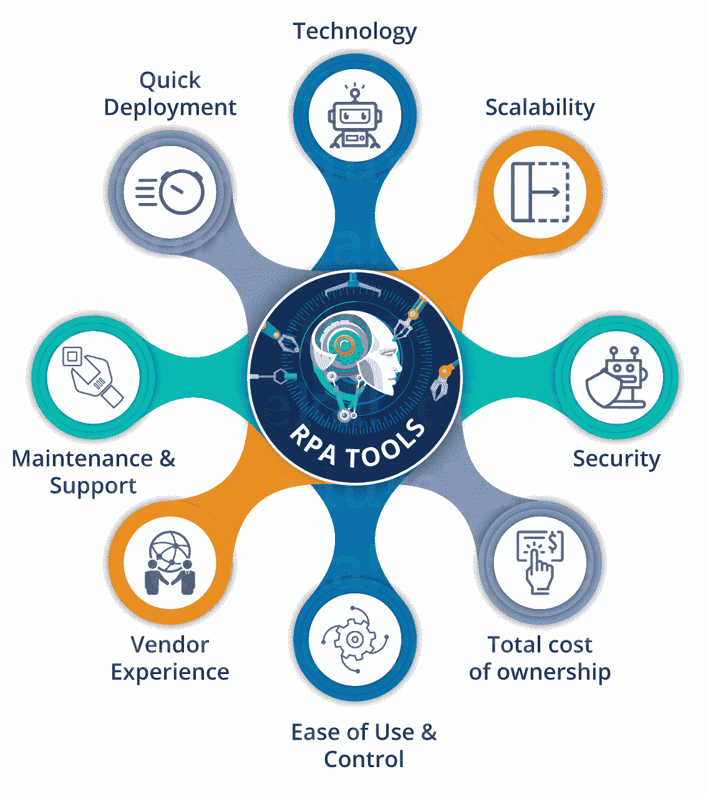

# RPA 工具列表和比较—RPA 软件的领导者

> 原文：<https://www.edureka.co/blog/rpa-tools-list-and-comparison/>

[***机器人流程自动化***](https://www.edureka.co/blog/what-is-robotic-process-automation/) 是当今市场上用于自动化日常任务的新时代技术，为此我们需要 RPA 工具。为了提升你的 RPA 职业技能，获得 [UiPath 培训](https://www.edureka.co/robotic-process-automation-training)或 [Automation Anywhere 认证](https://www.edureka.co/automation-anywhere-certification-training)培训是必须的，因为这可以帮助你成为 [RPA 开发人员](https://www.edureka.co/blog/rpa-developer-roles-and-responsibilities/)。 在这篇关于 RPA 工具的文章中，将涵盖以下主题:

*   [RPA 工具的类型](#typesofrpatools)
*   [RPA 工具列表](#listofrpatools)
*   [RPA 工具对比:ui path vs Blue Prism vs Automation Anywhere](#rpatoolscomparison)
*   [选择 RPA 工具的清单](#checklist)

在我详细列出当今市场上的顶级 RPA 工具之前，让我告诉你可用的不同类型的 RPA 工具。

## **RPA 工具的类型**

所有 RPA 工具可以分为 4 种不同类型的工具，它们是上一代机器人的扩展。同样请参考下表。

| **RPA 工具的类型** | **描述** |
| **Excel 自动化和宏** | 自动化基本流程的简单自动化解决方案。 |
| **可编程解决方案机器人** | 根据客户的要求/输入与其他系统互动。 |
| **自学工具** | 分析人类行为，并在各种平台上执行相同的操作 |
| **认知自动化机器人** | 能够处理非结构化数据，并根据复杂的非结构化输入做出决策的自学机器人。 |

既然您一定对可用的工具类型有所了解，那么让我们来看看当今市场上的顶级 RPA 工具列表。

## **RPA 工具列表**

| **厂商/工具** | 免费版可用/不可用 | **定价** |  | **选定合作伙伴** |
| **又是一个星期一** | 30 天免费试用 | – | 智能流程跟踪、拖放认知自动化 | 毕马威，普华永道 |
| **AntWorks** | – | – | 协作工具提供机器人克隆 | 赛博方舟，文生 |
| **自动化边缘** | 30 天免费试用 | – | 拖放技术与认知特征 | 基弗罗克斯·维普罗 |
| **自动化随处可见** | 提供社区版/免费版 | – | 拖放&并提供人工智能增强的 RPA | 安永认识到 |
| **蓝棱镜** | 30 天免费试用 | – | 拖放&功能，用于企业自动化 | 埃森哲、凯捷 |
| **Contextor【被 SAP 收购】** | – | 每月 1000 笔交易的单价【或】按使用付费 | 提供云部署和可视化设计器来创建机器人 | 世界线， IBM |
| 雅克达 | – | – | 高精度桌面自动化 | Priceline.com 直播电视公司 |
| **科法斯** | 提供免费试用 | – | 统一的设计环境，并提供内置分析 | 宝马、多米诺骨牌 |
| **克里昂系统** | 提供免费试用 | – | 提供强大的分析&部署效率 | PwC，哦 |
| **尼斯系统** | 30 天免费试用 | – | – | 埃森哲，认知 |
| **佩加** | 30 天免费试用 | – | 视觉设计师工作室 | 埃森哲、凯捷 |
| **红木软件** | 30 天免费试用 | – | – | 喜力，空客 |
| **UiPath** | 社区版 | 工作室许可证(年度):2000-3000 美元 | 拖放功能，易于使用的可视化设计器 | Cognizant，德勤 |
| **目测克罗恩** | 45 天免费试用 | 每台服务器 | 集成和任务调度工具 | 亚马逊，苹果 |
|  | 30 天免费试用 | 每个流程 | 拖放构建器并提供机器学习能力 | 美国银行 |

嗯，正如你在上面看到的，每个工具都有其积极和消极的因素。但是，如果你谈论市场领导者，它是著名的三重奏即 [**【蓝棱镜】**](https://www.edureka.co/blog/what-is-blue-prism)**[ui path](https://www.edureka.co/blog/uipath-studio/)**&**[自动化无处不在](https://www.edureka.co/blog/rpa-automation-anywhere/)** 。请参考下表了解这些工具之间的差异。

## **RPA 工具对比:ui path vs Blue Prism vs Automation Anywhere**

| **UiPath** | **蓝色棱镜** | **自动化无处不在** |
| 有社区版/免费版 | 最近推出了免费版。 | 最近推出了社区版 |
| 最受欢迎的工具 | 比自动化任何地方都受欢迎 | 不如其他人受欢迎 |
| 不需要编程知识 | 它提供了允许用户编写代码的功能，但是用户没有它也能管理。 | 不需要编程知识 |
| 拥有免费的在线培训和认证计划 | 提供官方认证程序 | 最近推出了 50 美元的认证。 |
| 提供桌面、web 和 Citrix 自动化 | 专为 Citrix automation for BPO 而设计。 | 所有媒介都合理。 |

现在，我已经解释了顶级工具之间的区别，您可以考虑下面的清单来选择适合您的工具。

## **选择合适工具的清单**

*   **技术**:大多数组织通过使用虚拟机或 Citrix 环境，在本地桌面之外执行日常任务。因此，该工具应该支持任何类型的应用程序，并且必须是平台独立的。
*   **可扩展性**:在选择 RPA 工具时，您必须考虑该工具高效响应客户/业务需求和变化的难易程度。
*   **安全性**:安全性在任何技术领域都是一个重要的方面。由于 RPA 工具是软件，所以在生产中部署 bot 时，您需要考虑许多安全措施。
*   **总拥有成本**:包括初始安装成本、维护成本和持续的供应商许可费用。这是选择工具时必须考虑的一个非常重要的参数。
*   **易用性&控制**:你选择的任何工具都必须是用户友好的，以提高员工满意度和效率。
*   **供应商经验**:建议选择一家在规模和行业方面与你的公司相似的供应商。这有助于你提高执行速度。
*   **维护&支持:**供应商必须遵循支持模型 t 以确保满足所需的服务水平协议。

现在你知道了选择工具时要考虑的参数，你应该知道什么时候选择哪种工具。参考下图，了解哪些工具最适合您的需求。

*看着上面的工具，如果你想在 RPA 领域提升你的职业技能，那么我们 Edureka 在 UiPath 上提供了一个结构化的课程来帮助你掌握这个工具。我们也是 Automation Anywhere 的官方培训合作伙伴之一，我们将为您提供企业版。如果你想掌握，那么看看我们在 **UiPath** 和 **Automation Anywhere** 上的课程。*

*有问题吗？请在这篇 RPA 工具文章的评论部分提到它，我们将会回复您。*