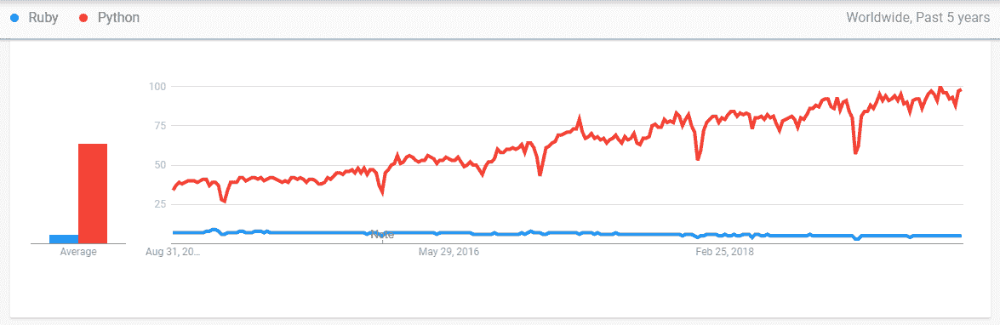

# Ruby vs Python:有什么区别？

> 原文：<https://www.edureka.co/blog/ruby-vs-python/>

[Python](https://www.edureka.co/blog/python-tutorial/) 和 [Ruby](https://www.edureka.co/blog/ruby-on-rails-tutorial/) 是新一代的高级服务器端脚本语言，专注于更简单、更好和高性能的代码。这两种编程语言有各自的相似之处和不同之处。这篇关于**Ruby vs Python**的文章将按以下顺序区分这两种编程语言:

*   [简介](#introduction)
*   [核心功能](#function)
*   [网络框架](#frameworks)
*   [用例](#usecase)
*   [学习曲线](#learning)
*   [与众不同的属性](#properties)
*   [灵活性](#flexibility)
*   [人气](#popularity)

## **简介**

| **红宝石** | **Python** |
|  Ruby 是一种解释型的高级通用编程语言。它主要用作 Web 应用程序的语言。 | Python 是一种可读性强、高效且功能强大的高级语言，具有自动内存管理功能。 |

## **核心功能**

| **红宝石** | **Python** |
| Ruby 的核心功能是 [Web 开发](https://www.edureka.co/blog/how-to-become-a-full-stack-web-developer/)和函数式编程。 | Python 主要用于学术和科学编程。它有许多数据科学的图书馆。 |

## **网络框架**

| **红宝石** | **Python** |
| Rails 是一个 Ruby 框架，它非常固执己见，偏爱约定胜于配置。 | Django 是一个类似于 Rails 的框架。它加速了建模过程，并作为一个 ORM。 |

## **用例**

| **红宝石** | **Python** |
| 它用于高流量的数据密集型站点和服务器。它在数学、[大数据](https://www.edureka.co/blog/what-is-big-data/)和科学计算方面运行更快。 | 这主要用于快速实现复杂和高流量的站点和应用程序。 |

## **学习曲线**

| **红宝石** | **Python** |
| 与 Python 相比，Ruby 可能需要更多的时间来适应。 | 语法更容易理解，对初学者来说可读性更强。 |

## **与众不同的特性**

| **红宝石** | **Python** |
| 一些与众不同的特性包括:易学、保守、代码可读性、快速和高效。 | 一些与众不同的特性包括:富有表现力、高效、优雅和强大。 |

## **灵活性**

| **红宝石** | **Python** |
| 在 Ruby 中，你总能找到许多不同的方法来完成一项任务。 | Python 代码不是最灵活的，但对于没有经验的程序员来说，它有很好的可读性。 |

## **人气**

| **红宝石** | **Python** |
|  Ruby 的使用在十大语言中排名下降，从 2014 年的第五位下降到 2018 年的第十位。 |  然而，Python 一直保持着它的受欢迎程度，从 2014 年的第四大使用语言上升到 2015 年的第三位，并在 2018 年保持了这一地位。 |

这些是两种编程语言之间的一些比较因素。希望这能帮助你了解哪种语言更符合你的目标。

*既然你已经了解了 Ruby & Python 之间的对比，那就来看看 Edureka 的* ***[Python 认证培训](https://www.edureka.co/python)** 。* *Python 认证培训将帮助您获得定量分析、数据挖掘和数据呈现方面的专业知识，通过将您的职业转变为数据科学家角色来超越数字。*

*有问题吗？请在“Ruby vs Python”的评论部分提到它，我们会给你回复。*