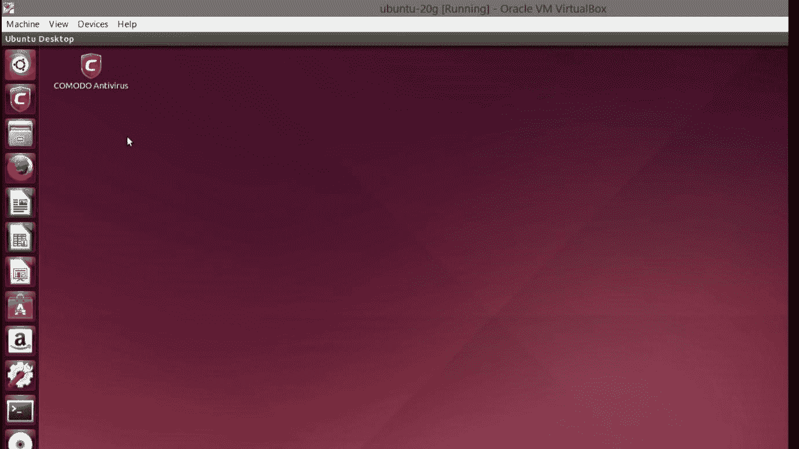
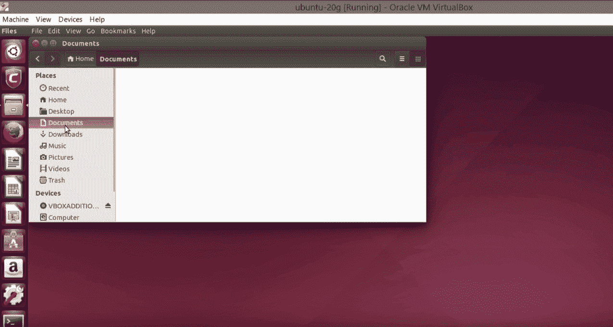
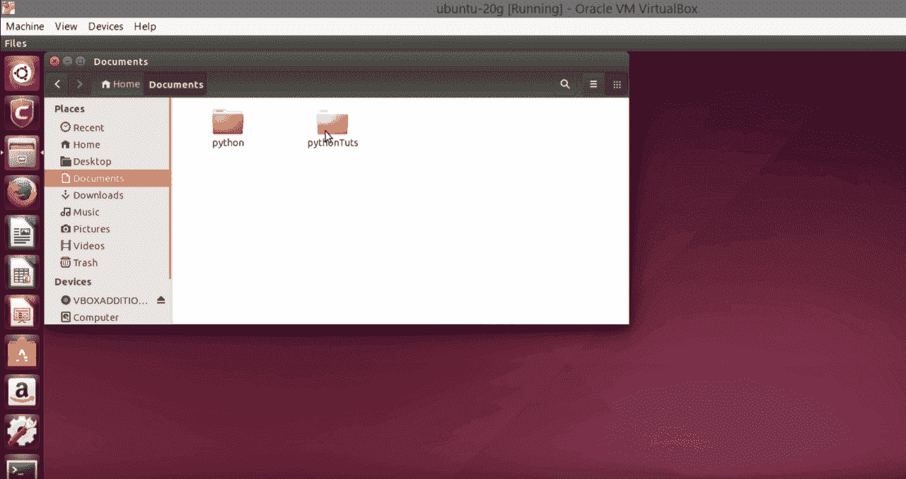
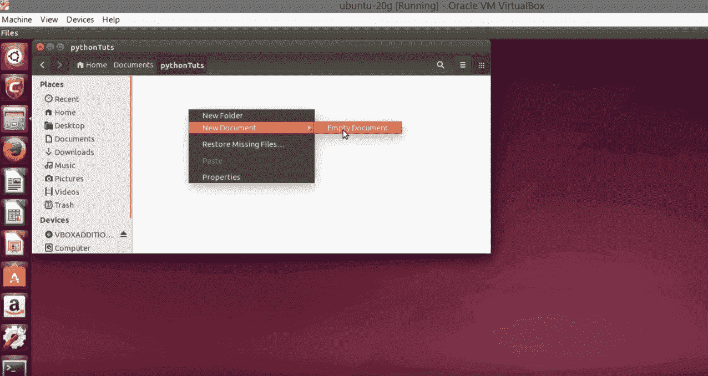
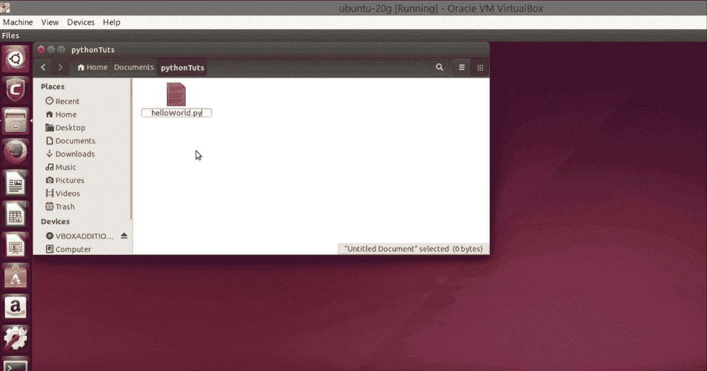
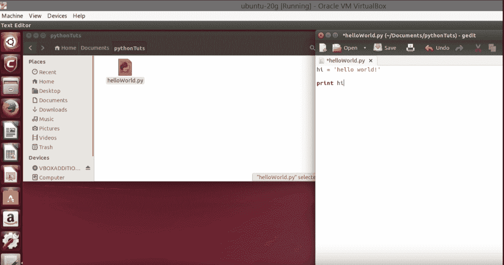
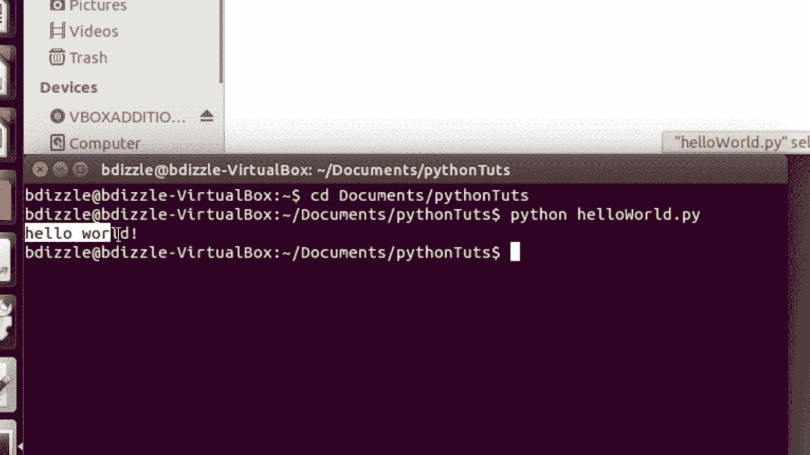
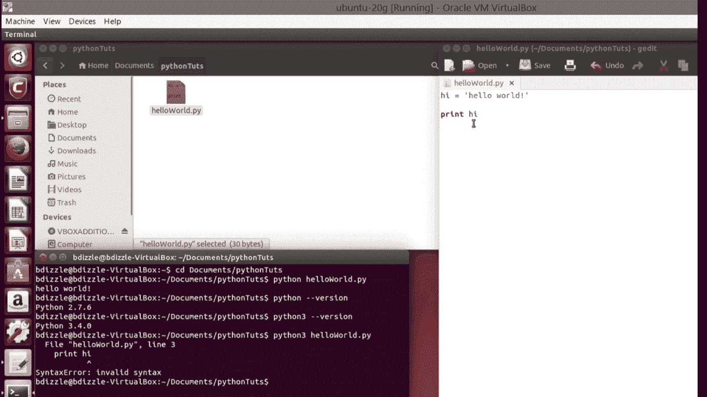
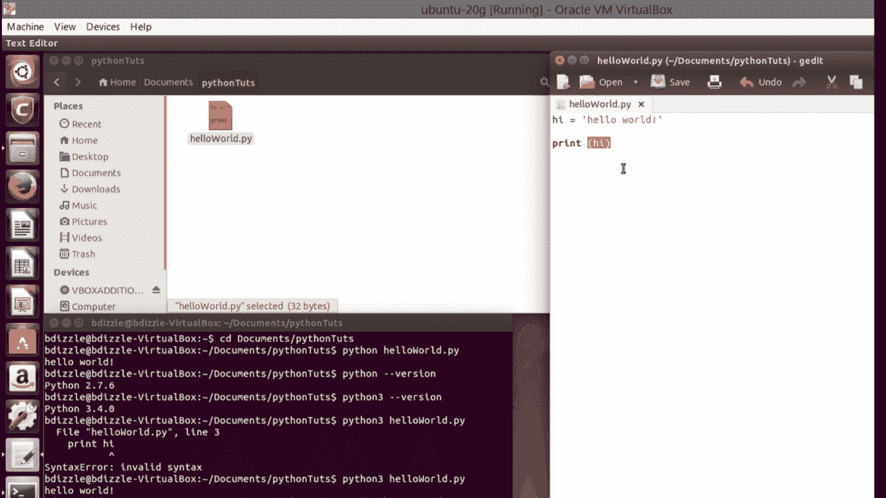

# 如何在 Ubuntu (Linux)中运行 Python？

> 原文：<https://www.edureka.co/blog/run-python-in-ubuntu-linux/>

本文将介绍一个非常简单但有趣且重要的概念，即 *如何在 Ubuntu (Linux)中运行 [Python](https://www.edureka.co/blog/python-programming-language) ？* 用详细的实际演示。那么让我们开始吧，

## **如何在 Ubuntu (Linux)中运行 Python**

如果你对如何在 Ubuntu 中运行 Python 感到好奇，这里有一篇文章可以帮助你。我们这里用的是 Ubuntu 版本。它支持 Python 2 和 Python 3 版本。

这是第一步。

第一步:像这样打开你的桌面。

**第二步:**去拿文件>左手边的文件。

在文档中，你可以选择一个文件夹来保存你的程序，或者直接在那里创建一个程序。

**第四步:**在该区域点击右键，选择一个新文档>空文档。

**步骤 5:** 用. py 扩展名命名文件，这样系统就可以检测出它是 python 文件。

**第六步:**打开你的文件，你会发现文件在‘gedit’中打开。

在给定区域写下你想要的程序并保存。

**第七步:**打开左手边下角的端子。

第 8 步:一旦完成，我们必须更改目录，以便我们可以方便地获取代码。

**第九步:**因为 linux 命令是 cd Documents */无论你的文件保存在哪里。*

第 10 步:一旦完成，输入，你就进入了那个特定的目录。

**步骤 11:** 现在运行你的 Python 文件，你所要做的就是命令' *python yourfilename.py '。*

**步骤 12:** 基本上是告诉终端运行 python 文件。

**第十三步:**万一你想查你用的是哪个版本的 Python，可以写*Python-version。*

**第 14 步:**不用 Python 2 版本，如果用 Python 3 版本，写*‘Python 3 your filename . py’就可以轻松执行。*

**步骤 15:** 确保在 Python 3 版本中执行 Python 代码时，使用了 Python 3 的语法。示例:Python 2 的 print 语句可能有也可能没有()with print 语句，但在 Python 3 中，print 语句应该有()。

我希望你能很好地理解这些概念，从而更准确地尝试它。这就把我们带到了本文的最后 *如何在 Ubuntu (Linux)中运行 Python？*

要深入了解 Python 编程语言及其各种应用，您可以立即注册参加 [Python 课程](https://www.edureka.co/python-programming-certification-training)培训，该培训提供全天候支持和终身访问。

*有问题吗？请在“如何在 Ubuntu (Linux)中运行 Python？”的评论部分提及文章，我们会尽快给您回复。*