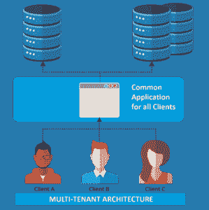
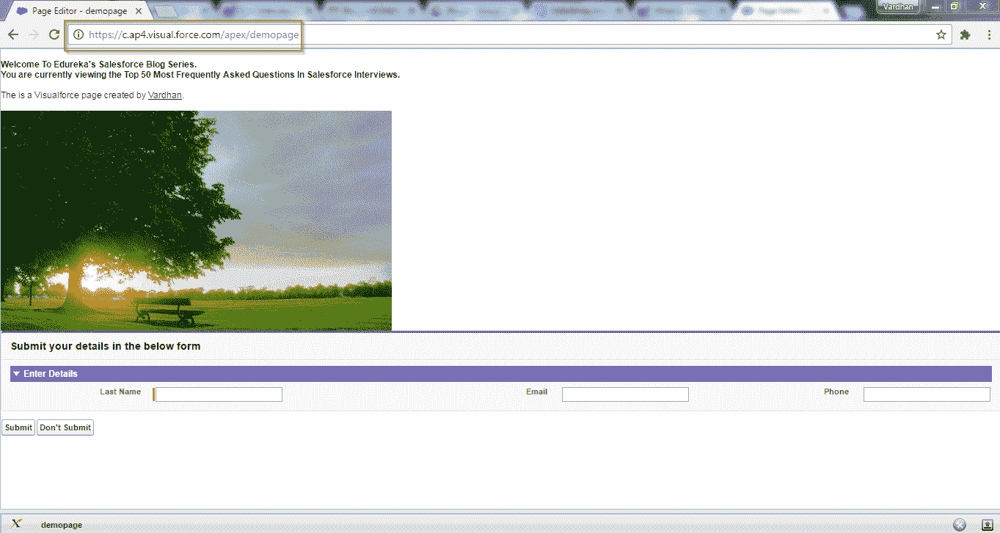

# 2023 年你必须准备的 50 个 Salesforce 面试问题和答案

> 原文：<https://www.edureka.co/blog/interview-questions/salesforce-interview-questions/>

截至 2021 年 1 月，Salesforce 是全球领先的 CRM 服务提供商。他们在云 CRM 领域拥有超过 40%的市场份额，并以 19.7%的市场份额主导着整个 CRM 领域。他们连续两年被评为世界第一 CRM，如果销售队伍的预计增长是可靠的，对受过 ***[销售队伍培训](https://www.edureka.co/salesforce-administrator-and-developer-training)*** 的专业人员的需求只会呈指数增长。这就是 Salesforce 的用武之地，也是促使我写了一篇博客，讨论 Salesforce 面试中最常被问到的**问题和答案**。

感谢我们一些业内专家分享的知识和智慧，我列出了这份确定的**50 大销售人员面试问题**清单，这将有助于你准备面试。希望这能帮助你在你热爱的领域找到一份顶尖的工作。如果你最近参加了某个面试，我们强烈建议你把你遇到的任何问题发表出来。我们的专家将很乐意为您解答。

Want to Upskill yourself to get ahead in Career? Check out the ***[Top Trending Technologies](https://www.edureka.co/blog/top-10-trending-technologies/)**.*

## **50 强 Salesforce 面试问答**

此面试问题列表分为 9 个部分，每个部分针对 Salesforce 的不同方面。

1.  Salesforce 基础知识
2.  陈述性特征
3.  审计&报告功能
4.  数据建模和数据管理
5.  逻辑&过程自动化
6.  软件测试
7.  调试&部署工具
8.  集成特性
9.  编程特性

## **a . Salesforce Fundamentals——面向新生的 sales force 基础面试问题**

### **1。两个用户可以拥有相同的配置文件吗？可以将两个配置文件分配给同一个用户吗？**

简档决定用户在 **Salesforce 组织**中可以拥有的访问级别。

就问题的第一部分来说，是的。一个配置文件可以分配给任意数量的用户。以一家公司的销售或服务团队为例。整个团队将被分配相同的配置文件。管理员可以创建一个配置文件: *销售配置文件* ，它可以访问公司认为必要的线索、机会、活动、联系人和其他对象。

通过这种方式，许多用户可以被分配相同的配置文件。如果团队领导或经理需要访问额外的记录/对象，则可以通过仅为这些用户分配**权限集**来实现。

回答问题的第二部分，每个用户只能分配一个个人资料。

### **2。Salesforce 中的管理员限制是什么？**

在 Salesforce 中，是**调控器限制**控制您可以在共享数据库中存储多少数据或多少记录。为什么？因为 Salesforce 是基于多租户架构的概念。简而言之，Salesforce 使用单个数据库来存储多个客户/顾客的数据。下图将帮助你理解这个概念。

## 

为了确保没有一个客户端独占共享资源，Salesforce 引入了**调控器限制**的概念，Apex 运行时引擎严格执行这一概念。

调控限制是 Salesforce 开发人员面临的最大挑战。这是因为如果 Apex 代码超出了限制，预期的调控器会发出一个无法处理的运行时异常。因此，作为 Salesforce 开发人员，您在开发应用程序时必须非常小心。要了解更多信息，请立即注册 [Salesforce 开发人员认证](https://www.edureka.co/salesforce-platform-developer-1-certification-training)。

sales force 中不同的调控器限制有:

*   每笔交易最高限额
*   Force.com 平台顶点极限
*   静态顶点极限
*   特定尺寸的顶点极限
*   其他顶点限制
*   电子邮件限额
*   推送通知限制

### **3。什么是沙盒组织？Salesforce 中有哪些不同类型的沙盒？**

沙盒是生产环境/组织的副本，用于测试和开发目的。它很有用，因为它允许在 Apex 编程上进行开发，而不会干扰生产环境。

什么时候可以用？ 当你想测试一个新开发的 Force.com 应用或者 Visualforce 页面的时候可以使用。您可以在 Sandbox org 中开发和测试它，而不是直接在生产中进行。

这样，您可以毫无困难地开发应用程序，然后将元数据和数据(如果适用)迁移到生产环境中。在非生产环境中这样做允许开发人员自由地端到端测试和试验应用程序。

沙箱的类型有:

*   开发商
*   专业开发者
*   部分复制
*   满了

### **4。能否在生产环境中编辑 apex 触发器/ apex 类？您能在生产环境中编辑 Visualforce 页面吗？**

不，不能在生产环境中直接编辑 apex 类和触发器。

需要先在开发者版或测试组织或沙盒组织中完成。然后，要在生产中部署它，具有 Author Apex 权限的用户必须使用部署工具部署触发器和类。

但是，Visualforce 页面可以在沙盒和生产环境中创建和编辑。

只有当页面必须做一些独特的事情(不同的值)，它将不得不通过沙盒开发。

### **5。标准字段记录名称可以有哪些不同的数据类型？**

标准字段记录名称的数据类型可以是 **自动编号** 或 **文本字段** ，最多 80 个字符。

自动生成编号，需要在定义字段时指定格式，之后每增加一条记录，编号就会自动生成。例如:-**Sr No-{ 1 }Sr No-{ 2 }Sr No-{ 3 }**

### **6。为什么从不同的域提供 Visualforce 页面？**

Visualforce 页面从不同的域提供服务，以提高安全标准并阻止跨站点脚本。看看下面 Visualforce 页面中突出显示的部分:-

**

## **B .陈述性特征——sales force 面试问题**

### **7。什么是活动中的 WhoId 和 whaid？**

*WhoID*指人。通常是:联系人或潜在客户。示例:LeadID，ContactID

*WhatID* 指物体。示例:AccountID，OpportunityID

### **8。写分享规则有什么用？可以使用共享规则来限制数据访问吗？**

编写 共享规则是为了向 Salesforce 组织中的某些个人授予 **编辑权限** (公共读写)或 **公共只读** **权限** 。一个典型的例子是:-与您的同事相比，只有您的经理或上级需要被给予您在 objects 中的记录的额外凭证。

默认情况下，您组织中的所有用户都将拥有组织级默认 **公共只读** 或 **私人** 的共享设置。 为了给用户更多不属于自己的记录的访问权限，我们编写了共享规则。 示例:共享规则用于将共享权限扩展到公共组或角色中的用户。因此，共享规则不像组织范围的默认设置那样严格。它们允许这些用户有更大的访问权限。

就问题的第二部分而言，答案是否定的。我们不能使用共享规则来限制数据访问。它仅用于允许更多地访问记录。

### **9。在 Salesforce 中可以创建哪些不同类型的电子邮件模板？**

下表列出了不同类型的电子邮件模板:-

| **正文** | 所有用户都可以创建或更改此模板 |
| **HTML 带信笺** | 只有拥有“编辑 HTML 模板”权限的管理员和用户才能基于信头创建此模板。 |
| **自定义 HTML** | 拥有“编辑 HTML 模板”权限的管理员和用户无需信头即可创建此模板 |
| **visual force** | 只有管理员和开发人员可以创建此模板。高级功能，如合并多个记录中的数据，仅在此模板中可用 |

## **C .审核&报表功能 Salesforce 面试问题**

### **10。什么是报表中的存储桶字段？**

存储桶字段可让您按范围和段将相关记录分组在一起，而无需使用复杂的公式和自定义字段。因此可以使用 **分组****过滤** ，或者 **排列** 报表数据。创建存储桶字段时，您需要定义用于对报告值进行分组的多个类别(存储桶)。

这样做的好处是，以前我们必须创建自定义字段来对某些数据进行分组或分段。

### **11。什么是动态仪表板？可以安排动态仪表板吗？**

在我们了解动态仪表板之前，让我们先了解静态仪表板。静态仪表板是基本的仪表板类型，任何使用其数据生成报告的用户都可以看到。这方面的一个例子是销售经理/营销经理能够在其 Salesforce 组织上看到的内容。换句话说，普通的仪表板仅从单个用户的角度显示数据。现在出现了动态仪表板的概念。

**动态仪表盘**用于显示为特定用户定制的信息。让我们考虑与上面相同的例子。如果销售经理想要查看只针对他的一个团队成员生成的报告，那么他可以使用动态仪表板。

当您想要显示特定用户的特定数据时，您可以使用动态仪表板，例如他们的个人配额和销售额，或案例关闭数，或转化的销售线索等。 当您想要向一组用户显示区域或组织范围内的数据时，您也可以使用普通/静态仪表板，例如特定区域的销售数字，或特定支持团队的个案关闭绩效。

就问题的第二部分而言，不，我们无法安排一个动态仪表板。这是因为无论何时我们打开仪表板，它都会显示实时生成的数据。

### **12。Salesforce 中有哪些不同类型的报告？我们可以在 Salesforce 中批量删除报告吗？**

## Salesforce 报表类型

| **1。表格报表** | 简单的 Excel 类型的表格，提供了带有总计的项目列表 |
| **2。总结报告** | 类似于表格报表，但也具有分组行、查看小计的功能&创建图表 |
| **3。矩阵报告** | 二维报告，允许您按行和列对记录进行分组 |
| **4。**加入报道 | 基于相同或不同的报告类型显示不同报告数据的多个块 |

这里需要注意的另一个要点是，只有汇总报表和矩阵报表可以作为仪表板的数据源。表格报表和联接报表不能用作仪表板的数据源。

我们可以在 Salesforce 中批量删除报告吗？当然，我们可以在 Salesforce 中批量删除报告。在**设置**中的**数据管理**下可以找到批量删除报告的选项。

## **D .数据建模&数据管理——sales force 面试问题**

### **13。salesforce 中有哪些不同类型的对象关系？你如何创造它们？**

没有涉及 Salesforce 中对象之间关系的 Salesforce 面试问题列表是不完整的。Salesforce 中的关系可用于在两个或多个对象之间建立链接。

sales force 中不同类型的对象关系有:

1.  **【1:n】**:-它是一种主对象控制从属子对象行为的父子关系。这是一个 1:n 的关系，父母只能有一个，但孩子可以有很多。 你需要知道的主要概念是，作为控制对象，主字段不能为空。如果主对象中的记录/字段被删除，相关对象中的相应字段也会被删除。这称为级联删除。从属字段将从其主字段继承所有者、共享和安全设置。 您可以定义两个自定义对象之间的主从关系，或者自定义对象和标准对象之间的主从关系，只要标准对象是该关系中的主对象。
2.  **查找关系(1:n)** :- 查找关系用于在两个对象之间创建链接，但不依赖于父对象时。与主从关系类似，您可以将此视为一种父子关系，其中只有一个父节点，但有多个子节点，即 1:n 关系。 这里的区别在于，尽管是控制字段，删除一条记录不会导致子对象中的查找字段自动删除。因此，子对象中的记录不会受到影响，这里也没有级联删除。子字段也不会继承其父字段的所有者、共享或安全设置。
3.  **【多对多】:-** 这种一个关系可以在需要创建两个主从关系的时候存在。通过链接 3 个自定义对象，可以创建两个主-详细信息关系。这里，两个对象将是主对象，第三个对象将依赖于这两个对象。简单地说，它将是两个主对象的子对象。

### **14。当主记录被删除时，明细记录会发生什么变化？删除父记录后，子记录会发生什么变化？**

在主-详细关系中，当主记录被删除时，详细记录被自动删除(级联删除)。

在查找关系中，即使父记录被删除，子记录也不会被删除。

### **15。在主-详细信息关系的情况下，可以有一个汇总汇总字段吗？**

是的。在主-详细关系的情况下，您可以有一个汇总摘要。但是在查找关系的情况下不是这样。

汇总汇总字段用于根据详细记录中一组字段的值显示主记录中的值。详细记录必须通过主-详细关系与主记录相关。

使用汇总汇总字段，您可以进行 4 种计算。您可以计算与主记录相关的详细记录的数量。或者，您可以计算详细记录中字段的总和、最小值或最大值。

### **16。解释 Salesforce 中的术语“数据不对称”。**

" **数据偏斜**"是你在为一个拥有超过 10，000 条记录的大客户工作时会遇到的一种情况。当一个用户拥有这么多记录时，我们称之为“所有权数据偏斜”。

当此类用户执行更新时，由于“数据不对称”，将会遇到性能问题。当单个角色的单个用户/成员拥有特定对象的大部分记录时，就会出现这种情况。

### **17。解释瘦表。瘦骨台有哪些考虑？**

在 Salesforce 中，瘦表用于访问常用字段并避免连接。这极大地提高了性能。瘦表非常有效，以至于即使修改了源表，瘦表也会与源表保持同步。

瘦表的注意事项:

*   瘦表最多可以包含 100 列。
*   瘦表不能包含来自其他对象的字段。
*   对于全沙盒:自 2015 年夏季发布以来，瘦表被复制到您的全沙盒组织中。

### **18。哪些字段在 Salesforce 中被自动索引？**

只有以下字段在 Salesforce 中自动编入索引:

*   **主键** (Id、名称和所有者字段)。
*   (查找或主从关系字段)。
*   **审计日期** (如 SystemModStamp)。
*   **自定义字段** 标记为外部 ID 或唯一字段。

### **19。使用数据加载器上传时，如何处理字段中的逗号？**

在数据加载器中。CSV，如果字段内容中有逗号，则必须用双引号将内容括起来:。

## **E. Logic &流程自动化 Salesforce 面试问题**

### **20。无法为工作流中的哪个标准创建“时间相关工作流操作”？**

无法创建依赖于时间的工作流动作为: **已创建，每次编辑** 。

### **21。Salesforce 中的自定义设置类型有哪些？使用自定义设置有什么好处？**

sales force 中有两种自定义设置: **列表自定义设置** 和 **层级自定义设置** 。

列表自定义设置是一种自定义设置，它提供了一组可重复使用的静态数据，无论用户/简档如何，您都可以在整个组织中访问这些数据。 层级自定义设置是另一种类型的自定义设置，它使用内置的层级逻辑对特定简档或用户进行“个性化”设置。

使用自定义设置的优势在于，它允许开发人员为不同的用户和简档创建一组自定义的访问规则。

### **22。在一个销售线索/案例中，您可以有多少个活动的分配规则？**

一次只能有一个规则处于活动状态。

### **23。Salesforce 中的自定义标签是什么？自定义标签的字符限制是多少？**

自定义标签是可从 Apex 类或 Visualforce 页面访问的自定义文本值。此处的值可以翻译成 Salesforce 支持的任何语言。 它们的好处是让开发者能够创建多语言应用程序，自动以用户的母语呈现信息。

您可以为您的组织创建多达 5，000 个自定义标签，它们的长度最多为 1，000 个字符。

### **24。Salesforce 中的角色和简档有什么区别？**

如之前 Salesforce 访谈问题中提到的，简档将最终控制用户在 Salesforce 组织中对哪些记录的访问。没有分配简档，任何用户都不能在 Salesforce 组织上工作。因此，**配置文件**对每个用户都是强制性的。

**角色**并不是每个用户都必须具备的。角色/角色层次结构的主要功能是允许层次结构中较高级别的用户访问层次结构中较低级别的用户所拥有的记录。例如，销售经理可以访问销售代表拥有的记录，而他们的同事却无法访问。

### **25。非确定性 Force.com 公式字段的例子有哪些？**

在我提到一些例子之前，我先给你介绍一下确定性和非确定性公式字段。其值为静态的公式字段称为确定性字段。然而，其值将动态更改或其值必须动态计算的公式字段被称为非确定性公式字段。一个经典的例子是返回当前日期和时间的公式。

Force.com 非确定性字段的一些例子有:

*   查找字段
*   参照跨越其他实体的公式字段
*   具有动态日期功能的字段，如:- TODAY()或 NOW()

Want to upskill yourself to get ahead in your career? Check out this video

## **2023 年要学的十大技术| Edureka**


[https://www.youtube.com/embed/M2NyXKxyUGc](https://www.youtube.com/embed/M2NyXKxyUGc)

## **F .软件测试 Salesforce 面试问题**

### **26。为什么我们需要编写测试类？如何识别一个类是不是测试类？**

来自世界各地的软件开发人员都会一致认为，在测试类中编写代码可以提高调试效率。为什么？这是因为测试类有助于创建健壮且无错误的代码，无论是 Apex 还是任何其他编程语言。由于单元测试本身功能强大，Salesforce 要求您用 Apex 代码编写测试类。T3T5

他们为什么这么厉害？因为测试类和测试方法验证某段代码是否正常工作。如果那段代码失败了，那么开发人员/测试人员可以准确地定位有错误的测试类。

测试类很容易确定，因为每个测试类都会用 **@isTest** 关键字标注。事实上，如果我们没有用 **@isTest** 来注释一个测试类，那么它就不能被定义为一个测试类。类似地，类中任何包含关键字 **testMethod** 的方法都是测试方法。

### **27。部署触发器所需的最小测试覆盖率是多少？**

在 Salesforce 中，如果您想要将您的代码部署到生产中，那么您必须确保单元测试至少覆盖了您的 Apex 代码 的 **75%。所有这些测试都必须成功完成。**

## **G .调试&部署工具——sales force 面试问题**

### **28。Salesforce 中有哪些不同的部署方式？**

您可以使用在 Salesforce 中部署代码

1.  改变设置
2.  日食与 Force.com IDE
3.  Force.com 迁移工具——基于 ANT/Java
4.  Salesforce 包

## **H .整合 Salesforce 面试问题**

### **29。什么是 Salesforce 中的外部 ID？哪些字段数据类型可以用作外部 id？**

外部 ID 是一个自定义字段，可用作记录中的唯一标识符。外部 id 主要在导入记录/数据时使用。导入记录时，这些记录中的许多字段之一需要标记为外部 ID(唯一标识符)。

需要注意的重要一点是，只有自定义字段才能作为外部 id 使用。可以标记为外部 id 的字段有: **文本** 、 **编号** 、 **电子邮件** l、 **自动编号** 。

### **30。在单个 Apex 事务中可以对外部服务进行多少次调出？**

调控器限制将限制单个 Apex 事务对 HTTP 请求或 API 调用最多进行 100 次调出。

### **31。如何在 Salesforce 中将 Apex 类公开为 REST WebService？**

您可以公开您的 Apex 类和方法，以便外部应用程序可以通过 REST 架构访问您的代码和应用程序。这是通过用 **@RestResource** 注释定义 Apex 类，将其作为 REST 资源公开来实现的。然后您可以使用**全局类**和一个 **WebService 回调方法**。

调用自定义 Apex REST Web 服务方法总是使用系统上下文。因此，不使用当前用户的凭据，任何有权访问这些方法的用户都可以使用其全部权限，而不管权限、字段级安全性或共享规则如何。T3T5

因此，使用 Apex REST 注释公开方法的开发人员应该注意不要无意中公开任何敏感数据。例如，看看下面这段代码:-

```
global class AccountPlan {
 webservice String area; 
 webservice String region; 
 //Define an object in apex that is exposed in apex web service
 global class Plan {
 webservice String name;
 webservice Integer planNumber;
 webservice Date planningPeriod;
 webservice Id planId;
 }
 webservice static Plan createAccountPlan(Plan vPlan) {
 //A plan maps to the Account object in salesforce.com. 
 //So need to map the Plan class object to Account standard object
 Account acct = new Account();
 acct.Name = vPlan.name;
 acct.AccountNumber = String.valueOf(vPlan.planNumber);
 insert acct;
 vPlan.planId=acct.Id;
 return vPlan;
 } }

```

**了解我们在顶级城市的销售队伍培训课程**

| 印度 | 美国 | 其他国家 |
| [海得拉巴的销售队伍培训](https://www.edureka.co/salesforce-administrator-and-developer-training-hyderabad) | [达拉斯的 Salesforce 培训](https://www.edureka.co/salesforce-administrator-and-developer-training-dallas) | [墨尔本的 Salesforce 培训](https://www.edureka.co/salesforce-administrator-and-developer-training-melbourne) |
| [班加罗尔的销售队伍培训](https://www.edureka.co/salesforce-administrator-and-developer-training-bangalore) | [夏洛特 Salesforce 培训](https://www.edureka.co/salesforce-administrator-and-developer-training-charlotte) | [伦敦的 Salesforce 培训](https://www.edureka.co/salesforce-administrator-and-developer-training-london) |
| [金奈的 Salesforce 培训](https://www.edureka.co/salesforce-administrator-and-developer-training-chennai) | [纽约的销售人员培训](https://www.edureka.co/salesforce-administrator-and-developer-training-new-york-city) | [悉尼的 Salesforce 培训](https://www.edureka.co/salesforce-administrator-and-developer-training-sydney) |

## **一、纲领性特点——资深专业人士高级 Salesforce 面试问答**

### **32。标准控制器和自定义控制器有什么区别？**

Apex 中的标准控制器，直接继承所有标准对象属性和标准按钮功能。它包含用于标准 Salesforce 页面的相同功能和逻辑。

自定义控制器是一个 Apex 类，它实现了页面的所有逻辑，而没有利用标准控制器。自定义控制器通过控制器属性与 Visualforce 页面相关联。

### **33。如何在 Visualforce 中实现分页？**

为了控制每页显示的记录数量，我们使用分页。默认情况下，列表控制器在页面上返回 20 条记录。为了自定义它，我们可以使用一个控制器扩展来设置 **页面大小** 。看看下面的示例代码:-

```
<apex:page standardController="Account" recordSetvar="accounts">
 <apex:pageBlock title="Viewing Accounts">
 <apex:form id="theForm">
 <apex:pageBlockSection >
 <apex:dataList var="a" value="{!accounts}" type="1">
 {!a.name}
 </apex:dataList>
 </apex:pageBlockSection>
 <apex:panelGrid columns="2">
 <apex:commandLink action="{!previous}">Previous</apex:commandlink>
 <apex:commandLink action="{!next}">Next</apex:commandlink>
 </apex:panelGrid>
 </apex:form>
 </apex:pageBlock>
</apex:page>

```

### **34。如何从 JavaScript 调用控制器方法？**

从 JavaScript 调用控制器方法(Apex 函数)，需要使用 **actionfunction** 。

请看下面这段代码，了解如何使用 actionfunction 调用控制器方法。

```

<script>
function JSmethodCallFromAnyAction()
{
callfromJS();
}
</apex:page>

```

### **35。如何使用 Apex 代码获取所有当前登录用户的 UserID？**

使用这个全局函数可以得到当前所有登录用户的 ID:**【userinfo . get userid()**。

### **36。选择查询可以返回多少条记录？一个 SOSL 查询可以返回多少条记录？**

调速器限制执行以下规则:-

SOQL 命令可以检索的最大记录数:50，000。

SOSL 命令可以检索的最大记录数:2000。

### **37。什么是属性标签？包含它们的语法是什么？**

属性标签是自定义组件属性的定义，它只能是组件标签的子标签。

注意，不能用 id 或 rendered 这样的名称定义属性。这些属性是为所有自定义组件定义自动创建的。 下面这段代码显示了包含它们的语法:

```
<apex:component>
 <apex:attribute name="myValue" description="This is the value for the component." type="String" required="true"/>
 <apex:attribute name="borderColor" description="This is color for the border." type="String" required="true"/>

</p>
<p>
</p>
<p>
</p>
<p>
</p>
<h1 style="border:{!borderColor}">
 <apex:outputText value="{!myValue}"/>
 </h1>
<p>
</p>
<p>
</p>
<p>
</p>
<p>

</apex:component>

```

### **38。Visualforce 中使用的三种绑定类型是什么？各指什么？**

sales force 中使用三种类型的绑定:-

*   **数据绑定** ，是指控制器 中设置的数据
*   **动作绑定**，指控制器 中的动作方法
*   **组件绑定**，引用其他 Visualforce 组件。

数据绑定和操作绑定是最常见的，它们将在每个 Visualforce 页面中使用。

### **39。Apex 中有哪些不同类型的集合？Apex 中的地图是什么？**

集合是可用于存储多个记录(数据)的变量类型。

这很有用，因为调控器限制限制了每个事务可以检索的记录数量。因此，集合可用于在定义为集合类型的单个变量中存储多条记录，并且通过以集合的形式检索数据，将检查调控器限制。集合类似于数组的工作方式。

在 Salesforce 中有 3 种收集类型:

*   列表
*   地图
*   设置

映射用于以键-值对的形式存储数据，其中每个唯一的键映射到一个值。语法:Map < String，String>country _ city = new Map<String，String>()；

### **40。如何在 Visualforce 页面中嵌入 Visualflow？**

1.  #### Find the unique name of the stream.

    1.  从设置中，在快速查找框中输入流程，然后选择流程。
    2.  点击流的名称。
    3.  复制流的唯一名称。
2.  #### From the settings, enter the Visualforce page in the quick search box, and then select the Visualforce page.

3.  #### Define a new Visualforce page or open an existing page.

4.  #### Add < flow: interview > component somewhere between < apex: page > tags.

5.  #### Set the name attribute to the unique name of the stream.

例如:

```
 </apex:page>
 <flow:interview name="flowuniquename"/>
 <apex:page>

```

6.  #### Click Save.

7.  #### Restrict which users can access the Visualforce page.

    1.  点击 Visualforce 页面。
    2.  单击您的 Visualforce 页面旁边的安全。
    3.  使用“添加”和“删除”按钮，将所有合适的配置文件从可用配置文件移动到启用的配置文件。
    4.  点击保存。
8.  #### Use custom buttons, links or Visualforce tabs to add Visualforce pages to your Force.com application.

### **41。“@未来”标注有什么用？**

未来标注用于异步标识和执行方法。如果该方法用“**@未来** ”标注，则仅当 Salesforce 有可用资源时才执行。

例如，您可以在对外部服务进行异步 web 服务调用时使用它。而在不使用注释的情况下，web 服务标注是由执行 Apex 代码的同一个线程生成的，并且在标注完成之前不会发生额外的处理(同步处理)。

### **42。批量 Apex 类有哪些不同的方法？**

**数据库。Batchable** 接口包含三个必须实现的方法:

1.  **启动方法** : 全局(数据库。query locator | Iterable<s object>)start(数据库。BatchableContext BC){ }
2.  **执行方法** : 全局作废执行(数据库。BatchableContext BC，list < P > ){}
3.  **完成方法** : 全局无效完成(数据库。BatchableContext BC){ }

### **43。什么是 Visualforce 组件？**

visual force 组件可以是预定义的组件(组件库中的标准组件)，也可以是确定用户界面行为的自定义组件。例如，如果您想将从 Visualforce 页面捕获的文本发送到 Salesforce 中的对象，则您需要使用 Visualforce 组件。例: **<顶点:明细>**

### **44。什么是 Trigger.new？**

Triger.new 是一个返回最近添加到 sObjects 中的记录列表的命令。更准确地说，将返回那些尚未保存到数据库中的记录。请注意，该 sObject 列表仅在 insert 和 update 触发器中可用，并且只能在 before 触发器中修改记录。

仅供参考，Trigger.old 返回一个 sObject 记录的旧版本列表。注意，这个 sObject 列表只在 update 和 delete 触发器中可用。

### **45。集合可以存储哪些数据类型？**

集合可以有以下任何数据类型:

*   原始类型
*   收藏
*   对象
*   用户自定义类型
*   内置顶点类型

### **46。什么是 sObject 类型？**

对象是可以存储在 Force.com 平台数据库中的任何对象。Apex 允许使用通用 sObject 抽象类型来表示任何对象。

例如，车辆是一种通用类型，汽车、摩托车都是车辆的具体类型。 在 SFDC，sObject 是类属，Account、Opportunity、CustomObject__c 是其具体类型。

### **47。SOQL 和 SOSL 有什么区别？**

差异如下表所示:

## SOQL vs SOSL

| **SOQL (Salesforce 对象查询语言)** | **【SOSL(sales force 对象搜索语言)** |
| 一次只能搜索一个对象 | 一次可以搜索多个对象 |
| 可以查询任何类型的字段 | 只能通过邮件、短信或电话查询 |
| 可用于类和触发器 | 可以在类中使用，但不能在触发器中使用 |
| 可以对查询结果进行 DML 操作 | 不能对搜索结果进行 DML 操作 |
| 返回记录 | 返回字段 |

### **48。什么是 Apex 交易？**

Apex 事务代表作为一个单元执行的一组操作。这里的操作包括负责查询记录的 DML 操作。事务中的所有 DML 操作要么成功完成，要么在保存单个记录时发生错误，然后回滚整个事务。

### **49。Apex 中的公共类和全局类有什么区别？**

**全局类** 可跨 Salesforce 实例访问，与名称空间无关。 然而， **公共类** 只能在相应的名称空间中访问。

### **50。什么是 getter 方法和 setter 方法？**

**Get (getter)方法** 用于将值从控制器传递到 VF 页面。T5，而 **set (setter)方法**用于将值设置回控制器变量。

希望这组 Salesforce 面试问题能帮助你在求职面试中获得高分。作为职业生涯的下一步，查看 Salesforce 提供的各种认证。这也将帮助你理解工作角色，并为自己规划职业道路。T3

此外，请观看由行业专家提供的关于**50 大常见销售人员面试问题**的视频。他分享了自己对 Salesforce 工作面试和行业需求的看法。一定要看看它，让我们知道它是否对你的面试准备有所帮助。

## **2023 年 Salesforce 面试问答| Salesforce 教程| edu reka**

[//www.youtube.com/embed/tQsiH7odkOQ?rel=0&;showinfo=0](//www.youtube.com/embed/tQsiH7odkOQ?rel=0&;showinfo=0)This Salesforce Interview questions and answers tutorial will help you to prepare for Salesforce interviews. Learn about the most important Salesforce interview questions and answers and know what will set you apart in the interview process. If you are interested to become master in Salesforce, go for [Salesforce Architect certification](https://www.edureka.co/masters-program/salesforce-architect-certification-course) today and become certified.Check out our [Salesforce Training in Richmond](https://www.edureka.co/salesforce-administrator-and-developer-training-richmond), which comes with instructor-led live training and real life project experience. Feel free to leave any questions you have in the comment box below.

*有问题吗？请在评论区提到它，我们会给你回复。*