# SAS 编程——学习如何用 SAS 编程！

> 原文：<https://www.edureka.co/blog/sas-programming/>

在这篇博客中，我将向你介绍 SAS 编程的一些重要概念。在我们开始之前，您必须熟悉 SAS。我之前关于 *[**SAS 教程**](https://www.edureka.co/blog/sas-tutorial/)* 的博客将帮助你理解 SAS，它的应用程序，并将帮助你安装 SAS 大学版，我们将在这里使用它作为编程环境。想知道今年你应该掌握哪些技能？此外，如果你一直计划进入数据分析领域， ***[SAS 认证培训](https://www.edureka.co/sas-training)*** 是入门的最佳方式之一。

Edureka 2019 年科技职业指南出炉！最热门的工作角色，精确的学习路径，行业前景&更多信息请见指南。[立即下载](http://bit.ly/2KmDS3b)。

那么，没有任何进一步的延迟，让我们开始 SAS 编程，好吗？

本博客将帮助你理解以下主题:

*   [SAS 编程基础](#FundamentalsOfSASProgramming)
*   [SAS 代码结构](#SASCodeStructure)
*   [SAS](#InformatsAndFormatsInSAS)中的信息和格式
*   [SAS 循环](#SASLoops)
*   [基本统计程序使用 SAS](#BasicStatisticalProceduresUsingSAS)

在我们开始编码之前，我想简单介绍几个对 SAS 编程很重要的术语。

## **SAS 编程基础**

## **SAS 窗口**

大型组织和培训机构更喜欢使用 SAS 窗口。SAS Windows 有很多实用程序可以帮助减少编写代码所需的时间。

下图显示了 SAS 窗口的不同部分。

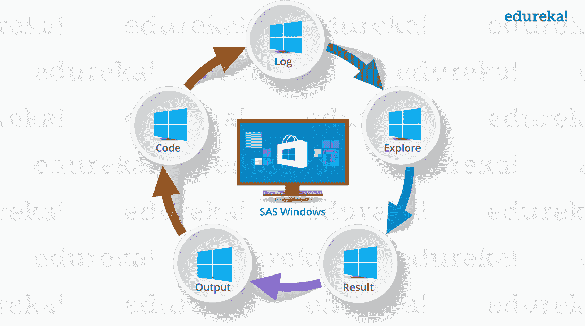

*   **日志窗口**:执行窗口。在这里，您可以检查程序的执行情况。它还显示错误、警告和注释。
*   **代码窗口** : 该窗口也称为编辑器窗口。你可以把它当成一张白纸或者记事本，在上面你可以写你的 SAS 代码。
*   **输出窗口**:顾名思义，该窗口显示你在编辑器中编写的程序/代码的输出。
*   **结果窗口** :列出一个会话中运行的程序的所有输出的索引。由于它保存特定会话的结果，如果您关闭软件并重新启动它，结果窗口将是空的。
*   **浏览窗口** :保存系统中所有库的列表。您也可以在这里浏览系统支持的文件。

一些组织使用 Linux，但是没有图形用户界面，你必须为每个查询编写代码。因此不便于使用。

## **SAS 数据集**

SAS 数据集称为数据文件。数据文件由行和列组成。行保存观察值，列保存变量名称。

## **SAS 变量**

SAS 有两种类型的变量:

*   **数值型变量**:这是默认的变量类型。这些变量用于数学表达式。
*   **字符变量** : 字符变量用于数学表达式中不使用的值。 它们被视为文本或字符串。通过在变量名称的末尾添加一个' $ign，变量就变成了一个字符变量。

## **SAS 库**

SAS 库是存储在计算机上同一文件夹或目录中的 SAS 文件的集合。

*   **临时库**:在这个库中，当 SAS 会话结束时，数据集被删除。
*   **永久库**:数据集永久保存。因此，它们在所有会话中都可用。

用户也可以使用关键字 **LIBNAME** 创建或定义一个新的库，称为用户定义库。这些也是永久图书馆。

## **SAS 编程:SAS 代码结构**

SAS 编程基于两个构建模块:

*   **数据步骤**:数据步骤创建一个 SAS 数据集，然后将数据传递到过程步骤
*   **过程步骤**:过程步骤处理数据

SAS 程序应该遵循下面提到的规则:

*   几乎每个代码都以数据或过程步骤开始
*   SAS 代码的每一行都以分号结束
*   SAS 代码以运行或退出关键字结束
*   SAS 代码不区分大小写
*   你可以在不同的行中编写一个代码，也可以在一行中编写多个语句

现在我们已经看到了一些基本术语，让我们从这个基本代码开始 SAS 编程:

```
DATA Employee_Info;
input Emp_ID Emp_Name$ Emp_Vertical$;
datalines;
101 Mak SQL
102 Rama SAS
103 Priya Java
104 Karthik Excel
105 Mandeep SAS
;
Run;

```

在上面的代码中，我们创建了一个名为 Employee_Info 的数据集。它有三个变量，一个数字变量是 Emp_Id，两个字符变量是 Emp_Name 和 Emp_Verticals。Run 命令在输出窗口中显示数据集。

下图显示了上述代码的输出。

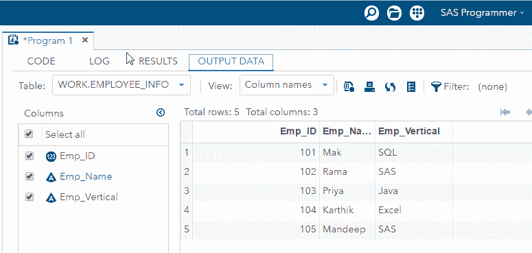

假设您想在打印视图中看到结果，那么您可以通过使用 PROC 打印过程来实现，其余的代码保持不变。

```

DATA Employee_Info;
input Emp_ID Emp_Name$ Emp_Vertical$;
datalines;
101 Mak SQL
102 Rama SAS
103 Priya Java
104 Karthik Excel
105 Mandeep SAS
;
Run;
PROC PRINT DATA=Employee_Info;
Run;

```

下图，显示了上面代码的输出。

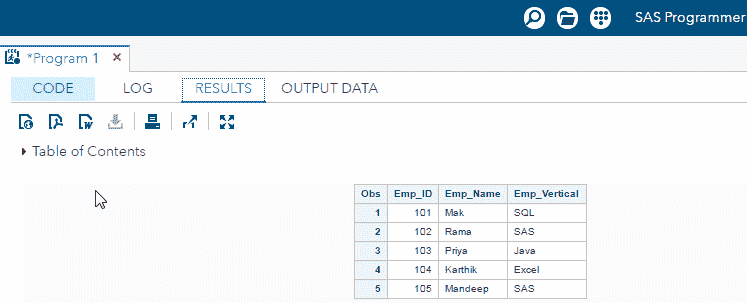

我们刚刚创建了一个数据集，并了解了打印程序的工作原理。现在，让我们将上面的数据集用于进一步的编程。假设我们想要将员工的加入日期添加到数据集中。所以我们创建了一个名为 DOJ 的变量，将其作为输入并打印结果。

```
DATA Employee_Info;
input Emp_ID Emp_Name$ Emp_Vertical$ DOJ;
datalines;
101 Mak SQL 18/08/2013
102 Rama SAS 25/06/2015
103 Priya Java 21/02/2010
104 Karthik Excel 19/05/2007
105 Mandeep SAS 11/09/2016
;
Run;
PROC PRINT DATA=Employee_Info;
Run;

```

下图显示了上述代码的输出。可以看到，创建了一个变量，但没有打印出 DOJ 的值。相反，我们看到点取代了日期值。

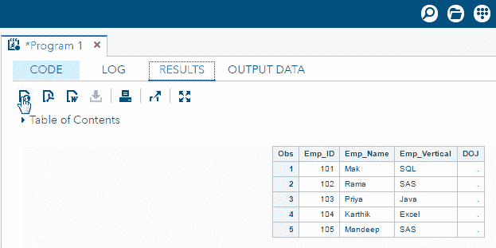 为什么会这样？嗯，DOJ 变量是没有后缀' $ '，这意味着，默认情况下，SAS 将读取它作为一个数字变量。但是，我们输入的数据有一个特殊字符'/'，因此它不会打印结果，因为它不是纯数字数据。如果您查看日志窗口，您将会看到一条错误消息“变量 DOJ 的数据无效”

现在我们如何解决这个问题？解决这个问题的一个方法是在 DOJ 变量后面加上一个后缀' $ '。这将转换 DOJ 变量为字符，您将能够打印日期值。让我们对代码进行更改，并查看输出。

```
DATA Employee_Info;
input Emp_ID Emp_Name$ Emp_Vertical$ DOJ$;
datalines;
101 Mak SQL 18/08/2013
102 Rama SAS 25/06/2015
103 Priya Java 21/02/2010
104 Karthik Excel 19/05/2007
105 Mandeep SAS 11/09/2016
;
Run;
PROC PRINT DATA=Employee_Info;
Run;

```

输出屏幕将显示以下输出。

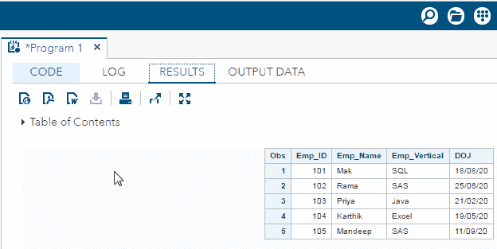 通过将 DOJ 转换为字符，可以看到数据值显示为日期。然而，这是一个临时的解决方案。让我怎么解释？

嗯，假设一家银行有一个类似的数据集。数据集包含账户持有人的详细信息，如贷款金额、分期付款、贷款分期付款的和到期日。想象一下，持有人错过了支付分期付款的最后期限，银行想要计算延迟。银行必须计算截止日期和当前日期之间的差值。

但是，如果银行的数据集包含字符格式的日期，那么银行将无法对其执行数学运算。这个问题也可能影响我们的数据集。那么我们如何解决这个问题呢？

下一个概念将帮助你克服这个问题。

## **SAS 中的信息和格式**

如果你想精通 SAS 编程，很好地理解这个主题是很重要的。如果您还记得，我之前提到过 SAS 有两种标准变量类型:

*   数字
*   字符

当 SAS 遇到非标准变量时，SAS 会抛出一个错误，否则你将得不到想要的输出。为了克服这个问题，SAS 使用了信息和格式。

## **信息**

信息通常用于从外部文件或平面文件(如 文本文件或顺序文件)中读取或输入数据。该信息指示 SAS 如何将 数据读入 SAS 变量。SAS 有三种类型的信息: 字符、数字和日期/时间。信息按照以下 语法结构命名:

*   字符信息:$ INFORMATw。
*   数字信息:信息宽度
*   通知日期/时间:通知。

“$”表示一个字符格式。informat 是指有时可选的 SAS 的 INFORMAT 名称。‘w’表示 变量的宽度(字节或列数)。' d '用于数值数据，指定 小数点右边的位数。所有信息都必须包含小数点(。)以便 SAS 可以 区分信息和 SAS 变量。

让我们回到之前的代码，看看日期/时间信息是否对我们有所帮助。因此，让我们相应地修改代码，添加一个日期格式，如下所示:

```
DATA Employee_Info;
input Emp_ID Emp_Name$ Emp_Vertical$ DOJ;
INFORMAT DOJ ddmmyy10.;
datalines;
101 Mak SQL 18/08/2013
102 Rama SAS 25/06/2015
103 Priya Java 21/02/2010
104 Karthik Excel 19/05/2007
105 Mandeep SAS 11/09/2016
;
Run;
PROC PRINT DATA=Employee_Info;
Run;

```

代码中的第 3 行指示 SAS 使用日期 格式 MMDDYYw 读入变量“加入日期”(DOJ)。对于每个占据 10 个空格的日期字段，将‘w .’限定符 设置为 10。

代码的输出如下所示。

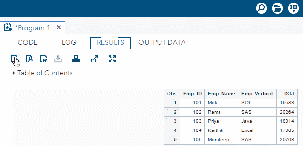

结果显示我们仍然没有得到想要的结果，相反 DOJ 列保存了一些数值，而不是我们指定的日期。这是为什么呢？一旦用日期格式读取了日期，SAS 就会将日期存储为一个数字。这意味着，它被读取为该日期和 1960 年 1 月 1 日之间的天数(例如:1994 年 3 月 15 日被存储为 12492)。

这背后的原因是 SAS 有三个独立的计数器来记录日期和时间。这些日期计数器在 1960 年 1 月 1 日从零开始。因此，1960 年 1 月 1 日之前的日期为负值，之后的日期为正值。每天午夜，日期计数器加 1。

有一个故事说，SAS 的创始人想用 IBM 370 系统的大概诞生日期，他们选择了 1960 年 1 月 1 日作为一个容易记忆的近似值。

既然你知道了列 DOJ 显示那些数字的原因，让我们试着解决这个问题。为了克服这个问题，我们使用格式。

## **格式**

信息是读取数据的指令，而格式是用于显示或 输出数据的指令。 定义变量的格式就是告诉 SAS 如何显示变量中的值。格式分为与信息相同的三类(字符、数字和日期时间),并且总是包含一个点。

格式语句的一般形式为:

*   格式变量名格式名。；

让我们回到拥有数据集 Employee_Info 的代码，看看我们能否使用 FORMAT 命令正确显示日期。

```
DATA Employee_Info;
input Emp_ID Emp_Name$ Emp_Vertical$ DOJ;
INFORMAT DOJ ddmmyy10.;
FORMAT DOJ ddmmyy10.;
datalines;
101 Mak SQL 18/08/2013
102 Rama SAS 25/06/2015
103 Priya Java 21/02/2010
104 Karthik Excel 19/05/2007
105 Mandeep SAS 11/09/2016
;
Run;
PROC PRINT DATA=Employee_Info;
Run;

```

我们在上面代码的第 4 行使用了 FORMAT 命令。下面的输出屏幕将给出我们想要的输出。

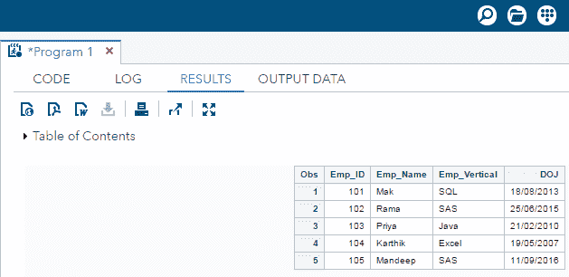

我们已经使用日期格式命令成功显示了数据集。我希望你已经理解了如何使用格式和信息。让我们继续我们的 SAS 编程博客，看看另一个重要的概念。

## **SAS 循环**

在进行 SAS 编程时，我们可能会遇到需要多次重复执行 代码块的情况。反复写同一套语句不方便。这就是循环进入画面的地方。  在 SAS 中，Do 语句是用来实现循环的。它也被称为 Do 循环。下图显示了 SAS 中 Do 循环语句的 一般形式。

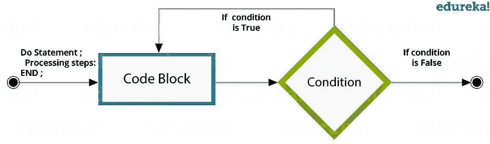以下是 SAS 中 DO 循环的类型:

*   **索引**:循环从索引变量的起始值继续到终止值。
*   **While** :只要 **While** 条件为假，循环就继续。
*   **直到**:循环继续到 **直到** 条件为真。

## **做指标循环**

我们使用一个索引变量作为**执行索引循环**的开始和停止值。SAS 语句重复执行，直到索引变量达到最终值。 **语法:**

```
Do indexvariable = initialvalue to finalvalue;
SAS statements;
End;

```

让我们看一看示例代码来理解 Do 索引循环。在下面的代码中，VAR 是索引变量。

```
DATA SampleLoop;
SUM=0;
Do VAR = 1 to 10;
SUM = SUM + VAR;
END;
PROC PRINT DATA = SampleLoop;
Run;

```

当你执行上面的代码时，你会得到下面的输出。

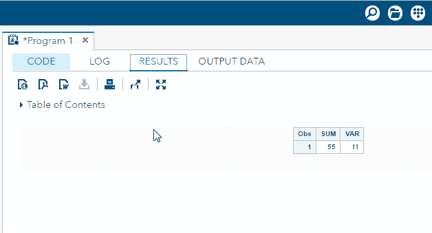

## **边做边循环**

**Do While**循环使用 While 条件。当条件为真时，该循环执行代码块，并一直执行，直到条件为假。一旦条件变为假，循环就终止。

**语法:**

```
Do While (condition);
SAS statements;
End;

```

以下示例代码将帮助您理解 DO WHILE 循环。

```
DATA SampleLoop;
SUM=0;
VAR=1; 
Do While(VAR<15);
SUM = SUM + VAR;
VAR+1;
END;
PROC PRINT DATA = SampleLoop;
Run;

```

上面的代码将给出如下输出。

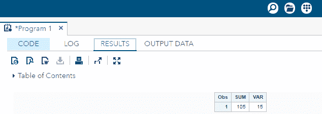

## **做循环直到**

Do Until 循环使用一个 **Until** 条件。当条件为假时，该循环执行代码块，并一直执行，直到条件为真。一旦条件变为真，循环就终止。

**语法:**

```
Do Until (condition);
SAS statements;
END;

```

让我们来看看示例程序。

```
DATA SampleLoop;
SUM=0;
VAR=1;
Do Until(VAR>15);
SUM=SUM+VAR;
VAR+1;
END;
PROC PRINT;
Run;

```

代码有如下输出。

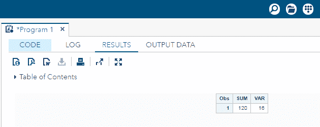

这样我们就完成了 SAS 编程中循环的概念。到目前为止，我们学习的所有主题都讨论了 SAS 编程的基本知识。

现在让我们看一看一些统计程序。这些程序将构成高级 分析程序 的基础。

#### 订阅我们的 youtube 频道获取新的更新..！