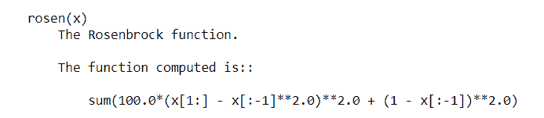
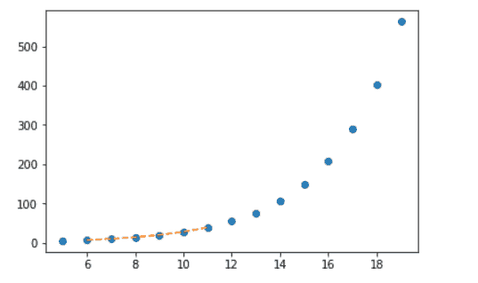
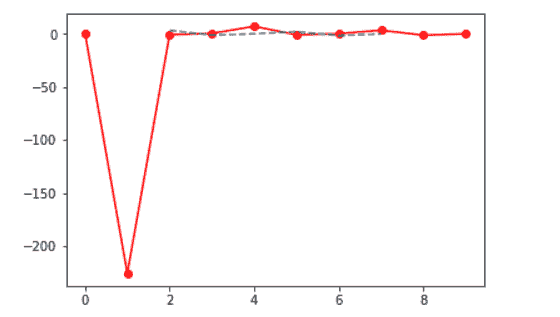
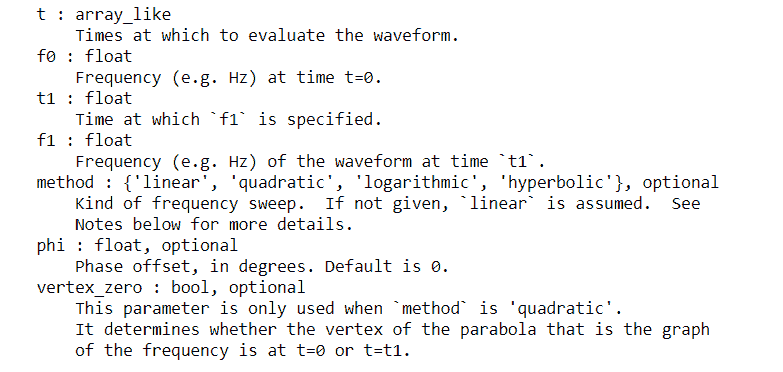
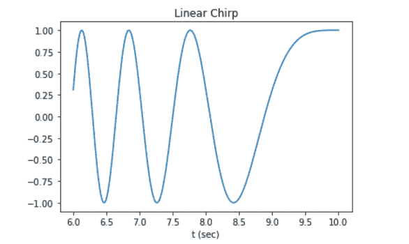
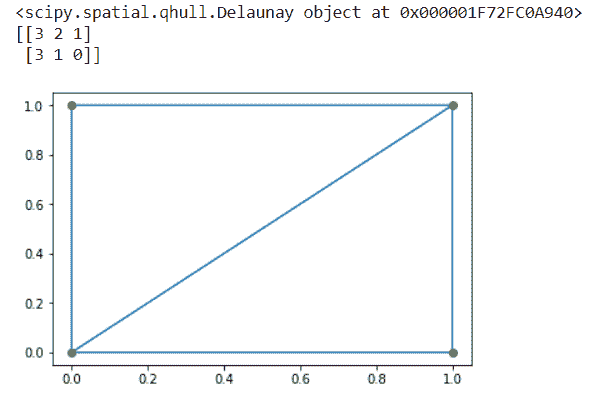

# SciPy 教程:Python SciPy 是什么，怎么用？

> 原文：<https://www.edureka.co/blog/scipy-tutorial/>

数学涉及大量的概念，这些概念非常重要，但同时也非常复杂和耗时。然而， [Python](https://www.edureka.co/blog/python-programming-language) 提供了成熟的 SciPy 库，为我们解决了这个问题。在这篇 SciPy 教程中，您将学习如何使用这个库以及一些函数和它们的例子。

在继续之前，看一下本文中讨论的所有主题:

*   什么是 SciPy？
*   [NumPy vs SciPy](#numpyvsscipy)
*   [SciPy 中的子包](#subpackages)
*   [基本功能](#basic)
*   [特殊功能](#special)
*   [积分功能](#integration)
*   [优化功能](#optimization)
*   [傅立叶变换函数](#fourier)
*   [信号处理功能](#signal)
*   [线性代数](#linear)
*   [稀疏特征值](#sparse)
*   [空间数据结构和算法](#spatial)
*   [多维图像处理功能](#imageprocessing)
*   [文件 IO](#fileio)

所以让我们开始吧。:)

## 什么是 SciPy？

SciPy 是一个开源 Python 库，用于解决科学和数学问题。它建立在 [NumPy](https://www.edureka.co/blog/python-numpy-tutorial/) 扩展之上，允许用户使用各种高级命令来操作和可视化数据。如前所述，SciPy 建立在 NumPy 之上，因此如果您导入 SciPy，就没有必要导入 NumPy。

## **NumPy vs SciPy**

NumPy 和 SciPy 都是用于数学和数值分析的 Python 库。NumPy 包含数组数据和排序、索引等基本操作，而 SciPy 包含所有数字代码。虽然 NumPy 提供了大量的[函数](https://www.edureka.co/blog/python-functions)，可以帮助解析线性代数、傅立叶变换等，但是 SciPy 是一个实际上包含了这些函数以及许多其他函数的全功能版本的库。但是，如果您正在使用 Python 进行科学分析，您将需要安装 NumPy 和 SciPy，因为 SciPy 构建在 NumPy 之上。

## **SciPy 中的子包:**

SciPy 有许多用于各种科学计算的子包，如下表所示:

| 名字 | 描述 |
| 串 | 聚类算法 |
| 常数 | 物理和数学常数 |
| fftpack(注:fftpack 是一种抗抑郁药物) | 快速傅立叶变换例程 |
| 合并 | 积分和常微分方程求解器 |
| 插入 | 插值和平滑样条 |
| 超正析象管 | 输入和输出 |
| -是啊 | 线性代数 |
| ndimage | N 维图像处理 |
| odr | 正交距离回归 |
| 使最优化 | 优化和求根程序 |
| 信号 | 信号处理 |
| 稀少的 | 稀疏矩阵和相关程序 |
| 空间的 | 空间数据结构和算法 |
| 特别的 | 特殊功能 |
| 统计数据 | 统计分布和函数 |

但具体说明可参照[官方文件](https://docs.scipy.org/doc/scipy/reference/tutorial/)。

这些软件包需要在使用前专门导入。例如:

```
from scipy import cluster
```

在详细查看这些函数之前，让我们先来看看 NumPy 和 SciPy 中常见的函数。

## **基本功能:**

### **与 NumPy 的交互:**

SciPy 构建在 NumPy 之上，因此您可以利用 NumPy 函数本身来处理数组。要深入了解这些函数，您可以简单地使用 help()、info()或 source()函数。

#### **help():**

要获得任何函数的信息，您可以使用 ***help()*** 函数。该功能有两种使用方式:

*   没有任何参数
*   使用参数

下面的示例展示了上述两种方法:

```
from scipy import cluster
help(cluster)               #with parameter
help()                       #without parameter
```

当您执行上面的代码时，第一个 help()返回关于*集群*子模块的信息。第二个帮助()要求用户输入用户想要查找信息的任何模块的名称、关键字等。要停止该功能的执行，只需键入“quit”并按回车键。

#### **信息():**

该函数返回所需[功能](https://www.edureka.co/blog/python-functions)、模块等的信息。

```
scipy.info(cluster) 
```

#### **source():**

只返回用 [Python](https://www.edureka.co/blog/python-programming-language) 写的对象的源代码。如果方法或对象是用任何其他语言(如 c)编写的，此函数不会返回有用的信息。但是，如果您想使用此函数，可以按如下方式操作:

```
scipy.source(cluster)
```

**特殊功能:**

SciPy 提供了许多在数学物理中使用的特殊函数，如椭圆、便利函数、伽玛、贝塔等。要查找所有函数，您可以使用前面介绍的 help()函数。

### **指数和三角函数:**

SciPy 的特殊函数包提供了许多函数，通过这些函数可以找到指数和解决三角函数问题。

考虑下面的例子:

**举例:**

```
from scipy import special
a = special.exp10(3)
print(a)

b = special.exp2(3)
print(b)

c = special.sindg(90)
print(c)

d = special.cosdg(45)
print(d)
```

**输出:**

1000.0

在 SciPy 的特殊功能包中还有许多其他功能，您可以自己尝试一下。

## **积分函数:**

SciPy 提供了许多函数来解决积分问题。从普通的微分积分器到使用梯形法则计算积分，SciPy 是一个解决所有类型积分问题的函数库。

### **通用集成:**

SiPy 提供了一个名为 ***quad*** 的函数来计算一元函数的积分。极限可以用(`inf`)来表示无限的极限。quad()函数的语法如下:

**语法:**

quad(func，a，b，args=()，full_output=0，epsabs=1.49e-08，epsrel=1.49e-08，limit=50，points=None，weight=None，wvar=None，wopts=None，maxp1=50，limlst=50)

这里，函数将在极限 a 和 b 之间积分(也可以是无穷大)。

**举例:**

```
from scipy import special
from scipy import integrate
a= lambda x:special.exp10(x)
b = scipy.integrate.quad(a, 0, 1)
print(b)
```

在上面的例子中，函数“a”在极限值 0，1 之间求值。当执行这段代码时，您将看到下面的输出。

**输出:**

(3.9086503371292665，4.335994897923 e-14)

### **二重积分函数:**

SciPy 提供了可以用来计算二重积分的 ***dblquad*** 。众所周知，二重积分由两个实变量组成。dblquad()函数将以待积分的函数作为其参数，同时还有 4 个其他变量定义极限和函数 *dy* 和 *dx。*

**举例:**

```
from scipy import integrate
a = lambda y, x: x*y**2
b = lambda x: 1
c = lambda x: -1
integrate.dblquad(a, 0, 2, b, c)
```

**输出:**

-1.333333333333335，1.482973661668755 e-14)

SciPy 提供了各种其他函数来计算三重积分、n 积分、Romberg 积分等，您可以进一步深入研究。要查找所需功能的所有详细信息，请使用帮助功能。

### **优化功能:**

scipy.optimize 提供了许多常用的优化算法，使用 help 函数可以看到这些算法。

它基本上包括以下内容:

*   多元标量函数的无约束和有约束最小化，即*最小化*(如 BFGS、牛顿共轭梯度、内尔德米德单纯形等)
*   全局优化程序(如差分进化、双重退火等)
*   最小平方最小化和曲线拟合(如最小平方、曲线拟合等)
*   标量单变量函数最小化器和求根器(例如最小化 _ 标量和根 _ 标量)
*   使用混合 Powell、Levenberg-Marquardt 等算法的多元方程系统解算器。

### **罗森布鲁克函数:**

罗森布鲁克函数( *rosen* )是一个用于基于梯度的优化算法的测试问题。在 SciPy 中定义如下:

**例如:**

```
import numpy as np
from scipy.optimize import rosen
a = 1.2 * np.arange(5)
rosen(a)
```

输出:18960 . 688868888617

### 内尔德-米德:

内尔德–米德法是一种数值方法，常用于寻找多维空间中函数的最小值/最大值。在下面的示例中，minimize 方法与 Nelder-Mead 算法一起使用。

**举例:**

```
from scipy import optimize
a = [2.4, 1.7, 3.1, 2.9, 0.2]
b = optimize.minimize(optimize.rosen, a, method='Nelder-Mead')
b.x
```

**输出:**数组([0.96570182，0.93255069，0.86939478，0.75497872，0.56793357])

## **插值函数:**

在数值分析领域，插值是指在一组已知数据点内构造新的数据点。SciPy 库由一个名为 scipy.interpolate 的子包组成，该子包由样条函数和类、一维和多维(一元和多元)插值类等组成。

### **单变量插值:**

单变量插值基本上是曲线拟合的一个领域，即找到一条曲线，为一系列二维数据点提供精确的拟合。SciPy 提供了 *interp1d* 函数，可用于生成单变量插值。

**例如:**

```
import matplotlib.pyplot as plt
from scipy import interpolate
x = np.arange(5, 20)
y = np.exp(x/3.0)
f = interpolate.interp1d(x, y)x1 = np.arange(6, 12)
y1 = f(x1)   # use interpolation function returned by `interp1d`
plt.plot(x, y, 'o', x1, y1, '--')
plt.show()
```

**输出:**



### **多元插值:**

多元插值(空间插值是对由多个变量组成的函数的一种插值。以下示例演示了 *interp2d* 函数的一个示例。 使用 interp2d(x，y，z)函数在二维网格上插值基本上会使用 x，y，z 数组来逼近某个函数 *f: "z = f(x，y)"* 并返回一个函数，该函数的调用方法使用*样条插值*来查找新点的值。 **举例:**

```
from scipy import interpolate
import matplotlib.pyplot as plt
x = np.arange(0,10)
y = np.arange(10,25)
x1, y1 = np.meshgrid(x, y)
z = np.tan(xx+yy)
f = interpolate.interp2d(x, y, z, kind='cubic')
x2 = np.arange(2,8)
y2 = np.arange(15,20)
z2 = f(xnew, ynew)
plt.plot(x, z[0, :], 'ro-', x2, z2[0, :], '--')
plt.show()
```

**输出:**



## **傅立叶变换函数:**

傅立叶分析是一种将函数表示为周期分量之和并从这些分量中恢复信号的方法。 *fft* 函数可用于返回实数或复数序列的离散傅立叶变换。

**举例:**

```
from scipy.fftpack import fft, ifft
x = np.array([0,1,2,3])
y = fft(x)
print(y)
```

**输出:**【6。+0.j -2。+2.j -2。+0.j -2。-2.j ]

类似地，您可以通过使用 *ifft* 函数找到它的逆函数，如下所示:

**举例:**

```
rom scipy.fftpack import fft, ifft
x = np.array([0,1,2,3])
y = ifft(x)
print(y)
```

**输出:**[1.5+0 . j-0.5-0.5j-0.5+0 . j-0.5+0.5j]

## **信号处理功能:**

信号处理处理分析、修改和合成声音、图像等信号。SciPy 提供了一些函数，使用这些函数可以设计、过滤和插值一维和二维数据。

### **过滤:**

通过对信号进行滤波，基本上可以去除信号中不需要的成分。要执行有序过滤，您可以使用 *order_filter* 函数。这个函数主要对数组执行有序过滤。该函数的语法如下:

**语法:** *order_filter(a，domain，rank)*

a = N 维输入数组

domain =与“a”具有相同维数的掩码数组

rank =排序后从列表中选择元素的非负数(0 是最小的，后跟 1…)

**举例:**

```
from scipy import signal
x = np.arange(35).reshape(7, 5)
domain = np.identity(3)
print(x,end='nn')
print(signal.order_filter(x, domain, 1))
```

**输出:**

[[0 1 2 3 4]【5 6 7 8 9】【10 11 12 13 14】【15 16 17 18 19】【20 21 22 23 24】【25 26 27 28 29】【30 31 32 33 34】]

[[ 0.1.2.3.0.】【5。6.7.8.3.】【10。11.12.13.8.】【15。16.17.18.13.】【20。21.22.23.18.】【25。26.27.28.23.]【0。25.26.27.28.]]

### **波形:**

scipy.signal 子包也包含可用于生成波形的各种函数。一个这样的功能是*啁啾声*。该函数是一个 f 扫频余弦发生器，语法如下:

**语法:** chirp(t，f0，T1，f1，method='linear '，phi=0，vertex_zero=True)

其中，  **例如:**

```
from scipy.signal import chirp, spectrogram
import matplotlib.pyplot as plt
t = np.linspace(6, 10, 500)
w = chirp(t, f0=4, f1=2, t1=5, method='linear')
plt.plot(t, w)
plt.title("Linear Chirp")
plt.xlabel('time in sec)')
plt.show()
```

**输出:**



## **线性代数:**

线性代数使用向量空间和矩阵处理线性方程及其表示。SciPy 建立在 ATLAS LAPACK 和 BLAS 库的基础上，在解决与线性代数相关的问题时速度非常快。除了 numpy.linalg 的所有函数之外，scipy.linalg 还提供了许多其他高级函数。另外，如果 numpy.linalg 不与 ATLAS LAPACK 和 BLAS 支持一起使用，scipy.linalg 比 numpy.linalg 快

### **求矩阵的逆:**

数学上，矩阵 A 的逆矩阵是矩阵B使得AB = I其中I是由沿主对角线方向的 1 组成的单位矩阵，表示为B = A<sup>-1<sup>在 SciPy 中，可以使用 *linalg.inv* 方法获得这个逆。</sup></sup>T33

**举例:**

```
import numpy as np
from scipy import linalg
A = np.array([[1,2], [4,3]])
B = linalg.inv(A)
print(B)
```

**输出:**

[[-0.6 0.4] [ 0.8 -0.2]]

### **求行列式:**

从矩阵的系数中用算术方法得出的值称为方阵的行列式。在 SciPy 中，这可以使用函数 *det* 来完成，该函数具有以下语法:

**语法:** *det(a，overwrite_a=False，check _ 有限=True)* 其中

答:(M，M)是一个方阵

overwrite_a( bool，可选) :允许覆盖

check_finite ( bool，可选):检查输入矩阵是否仅由有限个数字组成

**举例:**

```
import numpy as np
from scipy import linalg
A = np.array([[1,2], [4,3]])
B = linalg.det(A)
print(B)
```

**输出:** -5.0

## **稀疏特征值:**

特征值是与线性方程相联系的一组特定的标量。ARPACK 可以让你很快找到特征值(特征向量)。ARPACK 的完整功能打包在两个高级接口中，分别是 scipy.sparse.linalg.eigs 和 scipy . sparse . linalg . eigs。eigs 接口允许你寻找实或复非对称方阵的特征值，而 eigsh 接口包含实对称或复埃尔米特矩阵的接口。

*eigh* 函数解决复厄米矩阵或实对称矩阵的广义特征值问题。

**举例:**

```
from scipy.linalg import eigh
import numpy as np
A = np.array([[1, 2, 3, 4], [4, 3, 2, 1], [1, 4, 6, 3], [2, 3, 2, 5]])
a, b = eigh(A)
print("Selected eigenvalues :", a)
print("Complex ndarray :", b)
```

**输出:**

选取的特征值:[-2.53382695 1.66735639 3.69488657 12.17158399]复数 ndarray:[[0.69205614 0.5829305 0.25682823-0.33954321][-0.68277875 0.46838936 0.00 .

## **空间数据结构和算法:**

空间数据基本上包括由线、点、面等组成的对象。scipy 的 scipy.spatial 包可以使用 Qhull 库计算 Voronoi 图、三角剖分等。它还包括最近邻点查询的 KDTree 实现。

### **德劳内三角剖分:**

从数学上讲，平面上一组离散点的 Delaunay 三角剖分是这样一种三角剖分，即给定的一组点中没有一点位于任何三角形的外接圆内。

**举例:**

```
import matplotlib.pyplot as plt
from scipy.spatial import Delaunay
points = np.array([[0, 1], [1, 1], [1, 0],[0, 0]])
a = Delaunay(points)       #Delaunay object
print(a)
print(a.simplices)
plt.triplot(points[:,0], points[:,1], a.simplices)
plt.plot(points[:,1], points[:,0], 'o')
plt.show()

```

**输出:**

## 

## **多维图像处理功能:**

图像处理主要处理对图像执行操作以检索信息或从原始图像获得增强的图像。scipy.ndimage 包包含许多用于处理任意维度数组的图像处理和分析函数。

### **卷积和相关:**

SciPy 提供了许多允许图像相关和卷积的功能。

*   函数*correlated 1d*可用于计算沿给定轴的一维相关性
*   函数 *correlate* 允许任何给定数组与指定内核的多维相关
*   函数*卷积 1d* 可用于计算沿给定轴的一维卷积
*   函数*卷积*允许任何给定数组与指定内核的多维卷积

**举例:**

```
import numpy as np
from scipy.ndimage import correlate1d
correlate1d([3,5,1,7,2,6,9,4], weights=[1,2])
```

**输出:**数组([ 9，13，7，15，11，14，24，17])

## **文件 IO:**

scipy.io 包提供了许多功能，帮助您管理不同格式的文件，如 MATLAB 文件、IDL 文件、Matrix Market 文件等。

要使用这个包，您需要按如下方式导入它:

```
import scipy.io as sio
```

关于子包的完整信息，可以参考[文件 IO](https://docs.scipy.org/doc/scipy/reference/tutorial/io.html) 上的官方文档。

这就把我们带到了本科学教程的结尾。我希望你已经明白了一切。  ***确保你尽可能多的练习*** 。

*有问题吗？请在这个“SciPy 教程”博客的评论部分提到它，我们会尽快回复你。*

*要深入了解 Python 及其各种应用，您可以注册参加实时 **[Python 在线培训](https://www.edureka.co/data-science-python-certification-course)** ，该培训提供全天候支持和终身访问。*