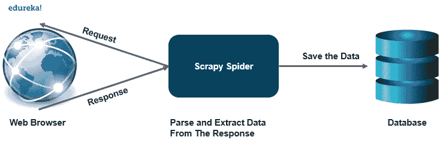

# Scrapy 教程:如何使用 Scrapy 制作网络爬虫？

> 原文：<https://www.edureka.co/blog/scrapy-tutorial/>

网络抓取是从网页中收集数据的一种有效方式，它已经成为数据科学中的一种有效工具。随着各种[python](https://www.edureka.co/data-science-python-certification-course)库的出现，像 [beautifulsoup](https://www.edureka.co/blog/web-scraping-with-python/) 这样的网络抓取，数据科学家的工作变得最优化。Scrapy 是一个强大的网络框架，用于提取、处理和存储数据。我们将在这个零碎的教程中学习如何制作一个网络爬虫，以下是本博客中讨论的主题:

*   [什么是刺儿头？](#scrapy)
*   [什么是网络爬虫？](#crawler)
*   [如何安装 Scrapy？](#install)
*   [开始你的第一个 Scrapy 项目](#project)
*   [制作你的第一只蜘蛛](#spider)
*   [提取数据](#extractingdata)
*   [存储提取的数据](#storingdata)

## **什么是刺儿头？**

Scrapy 是一个用 python 编写的免费开源网络爬行框架。它最初被设计用来执行 [web 抓取](https://www.edureka.co/blog/web-scraping-with-python/)，但是也可以用于使用 API 提取数据。它由 Scrapinghub 有限公司维护。

Scrapy 是一个完整的包，可以下载网页，处理和存储数据到数据库中。

它就像一个发电站，有多种方式来抓取网站。Scrapy 可以轻松处理更大的任务，在不到一分钟的时间内抓取多个页面或一组 URL。它使用异步工作的 twister 来实现并发性。

它提供了蜘蛛契约，允许我们创建通用和深度爬虫。Scrapy 还提供了项目管道来创建 spider 中的函数，这些函数可以执行各种操作，如替换数据中的值等。

## ****

## 什么是网络爬虫？

网络爬虫是一种自动在网上搜索文件的程序。它们主要是为自动浏览的重复动作而设计的。

它是如何工作的？

网络爬虫很像图书管理员。它在 web 上查找信息，对信息进行分类，然后对信息进行索引和编目，以便相应地检索和存储爬取的信息。

爬虫要执行的操作是预先创建的，然后爬虫自动执行所有那些将创建索引的操作。输出软件可以访问这些索引。

让我们来看看网络爬虫的各种应用:

*   价格比较门户使用网络爬虫搜索特定的产品细节，以便对不同平台上的价格进行比较。

*   网络爬虫在数据挖掘领域的信息检索中起着非常重要的作用。

*   数据分析工具使用网络爬虫来计算页面视图、入站和出站链接的数据。

*   爬虫也服务于信息中心，收集数据，例如新闻门户。

## **如何安装 Scrapy？**


要在你的系统上安装 scrapy，建议安装在专用的 virtualenv 上。安装工作与 python 中的任何其他包非常相似，如果您使用的是 [conda](https://www.edureka.co/blog/python-anaconda-tutorial/) 环境，请使用以下命令安装 scrapy:

```
conda install -c conda-forge scrapy

```

您也可以使用 pip 环境来安装 scrapy，

```
pip install scrapy

```

根据您的操作系统，可能会有一些编译依赖关系。Scrapy 是用纯 python 编写的，可能依赖于一些 python 包，如:

*   lxml——它是一个高效的 xml 和 HTML 解析器。

*   parcel——基于 lxml 编写的 HTML/XML 提取库

*   w3lib——它是处理 URL 和网页编码的多功能助手

*   twisted——一个异步网络框架

*   加密技术——它有助于满足各种网络级安全需求

## **开始你的第一个 Scrapy 项目**

要启动您的第一个 scrapy 项目，请转到您想要保存文件的目录或位置，并执行以下命令

```
scrapy startproject projectname

```

执行该命令后，您将在该位置创建以下目录。

*   项目名称/

    *   scrapy.cfg:它部署配置文件

*   项目名称/

    *   __init__。py:项目的 python 模块

    *   items.py:项目项定义文件

    *   py:项目中间件文件

    *   项目管道文件

    *   settings.py:项目设置文件

*   蜘蛛/

    *   __init__。py:一个目录，稍后你会把你的蜘蛛放在那里

## **制作你的第一只蜘蛛**

蜘蛛是我们定义的类，scrapy 用它从网络上收集信息。你必须子类化 scrapy。Spider 并定义要发出的初始请求。

您在一个单独的 python 文件中为您的蜘蛛编写代码，并将其保存在项目的 projectname/spiders 目录中。

**quotes_spider.py**

```

import scrapy

class QuotesSpider(scrapy.Spider):
    name = "quotes"
    def start_request(self):
          urls = [ 'http://quotes.toscrape.com/page/1/',
                       http://quotes.toscrape.com/page/2/,
                     ]
          for url in urls:
              yield scrapy.Request(url=url , callback= self.parse)

def parse(self, response):
     page = response.url.split("/")[-2]
     filename = 'quotes-%s.html' % page
     with open(filename, 'wb') as f:
           f.write(response.body)
     self.log('saved file %s' % filename)

```

如你所见，我们在蜘蛛中定义了各种功能，

*   名称:它识别蜘蛛，它必须在整个项目中是唯一的。

*   start_requests():必须返回蜘蛛开始爬行的请求的 iterable。

*   parse():这个方法将被调用来处理每个请求下载的响应。

## **提取数据**

直到现在蜘蛛没有提取任何数据，它只是保存了整个 HTML 文件。scrapy spider 通常会生成许多包含从页面中提取的数据的字典。我们在回调中使用 python 中的 yield 关键字来提取数据。

```

import scrapy

class QuotesSpider(scrapy.Spider):

       name = "quotes"
       start_urls = [ http://quotes.toscrape.com/page/1/',
                             http://quotes.toscrape.com/page/2/,
                           ]

       def parse(self, response):
            for quote in response.css('div.quote'):
                  yield {
                              'text': quote.css(span.text::text').get(),
                              'author': quote.css(small.author::text')get(),
                              'tags': quote.css(div.tags a.tag::text').getall()
                             }

```

当您运行这个蜘蛛时，它将输出提取的数据和日志。

## ****

## **存储数据**

存储提取数据的最简单方法是使用 feed exports，使用以下命令来存储数据。

```

scrapy crawl quotes -o quotes.json

```

该命令将生成一个 quotes.json 文件，其中包含所有抓取的项目，在 [JSON](https://www.edureka.co/blog/python-json/) 中序列化。

这就把我们带到了本文的结尾，在这里我们学习了如何使用 python 中的 scrapy 创建一个网络爬虫来抓取网站并将数据提取到一个 JSON 文件中。我希望你清楚本教程中与你分享的所有内容。

*如果你发现这篇文章与“Scrapy 教程”相关，请查看  [Edureka Python 认证培训，](https://www.edureka.co/data-science-python-certification-course)一家值得信赖的在线学习公司，拥有遍布全球的 250，000 多名满意的学习者。*

*我们在这里帮助你的每一步，并为想要成为 [Python 开发者](https://www.edureka.co/blog/how-to-become-a-python-developer/)的学生和专业人士设计课程。该课程旨在让您在 Python 编程方面有一个良好的开端，并训练您掌握核心和高级 Python 概念以及各种  [Python 框架](https://www.edureka.co/blog/python-frameworks/) ，如  [Django。](https://www.edureka.co/blog/django-tutorial/)*

如果你遇到任何问题，请在“Scrapy 教程”的评论区自由提问，我们的团队将很乐意回答。