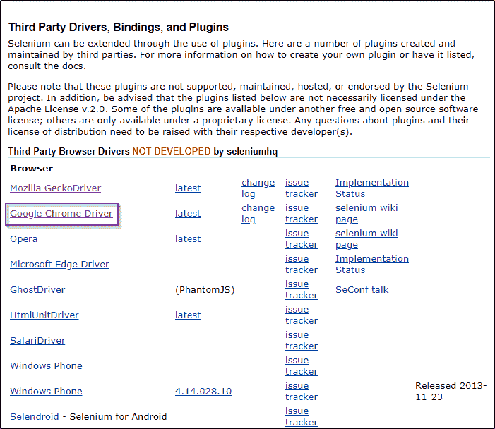
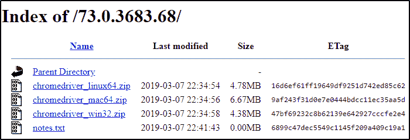
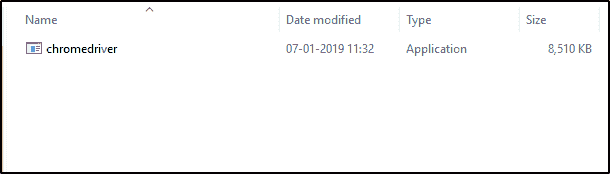
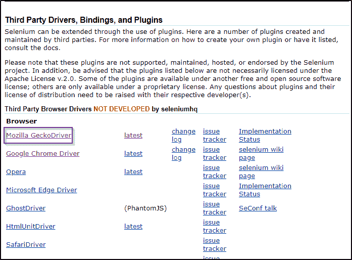
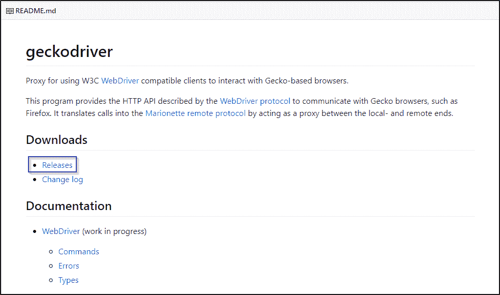
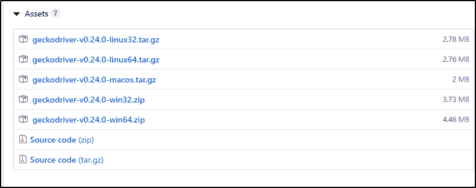

# Selenium 中的 ChromeDriver 和 GeckoDriver 是什么？

> 原文：<https://www.edureka.co/blog/selenium-chromedriver-and-geckodriver/>

最近，软件测试已经达到了流行的顶峰，而 [Selenium 认证](https://www.edureka.co/selenium-certification-training)的发展为这种转变增添了更多的翅膀。大家可能都知道，Selenium 是测试网站的最佳工具。但是网站测试最基本的东西是什么呢？嗯，Selenium 提供了一些驱动程序来帮助您创建浏览器实例和执行测试。 在这篇文章中，我将向你简要介绍两个重要的驱动程序，它们是 [Selenium](https://www.edureka.co/blog/what-is-selenium/) 中的 ChromeDriver 和 GeckoDriver。

下面是我将在本文中涉及的主题列表:

**ChromeDriver**

*   [什么是 ChromeDriver？](#WhatisChromeDriver?)
*   [为什么需要 ChromeDriver？](#WhydoyouneedChromeDriver?)
*   [设置 chrome driver](#SettingUpChromeDriver)

**壁虎**

*   [壁虎是什么？](#WhatisGeckoDriver?)
*   [为什么需要壁虎？](#SettingUpGeckoDriver)
*   [设置壁虎](#SettingUpGeckoDriver)

*你也可以通过专家在 Selenium 中对 ChromeDriver 的录音，在那里你可以通过例子以详细的方式理解主题。*

## Selenium 中的 ChromeDriver | Selenium 中的 chrome driver 设置| Selenium 培训| Edureka


[//www.youtube.com/embed/c86GdHQaLsY?rel=0&showinfo=0](//www.youtube.com/embed/c86GdHQaLsY?rel=0&showinfo=0)

这个在 Selenium Webdriver 中 ChromeDrive 上的 Edureka 视频将讲述什么是 ChromeDriver 以及你为什么需要它。它还会告诉你如何在你的系统上设置 ChromeDriver，以及如何在 Google Chrome 上执行测试用例。

## **什么是 ChromeDriver？**

WebDriver 是一款开源工具，用于跨多种浏览器自动测试 web 应用。它提供了导航到网页、用户输入、 [JavaScript](https://www.edureka.co/blog/what-is-javascript/) 执行等功能。ChromeDriver 是一个独立的服务器，为 Chromium 实现了 WebDriver 的有线协议。 为了实例化 ChromeDriver 的对象，你可以简单的借助下面的命令创建对象。

web driver driver = New chrome driver()；


现在，让我们继续阅读这篇关于 ChromeDriver 和 GeckoDriver 的文章，并理解为什么你需要一个 ChromeDriver 在 [Selenium](https://www.edureka.co/blog/what-is-selenium/) 中。

## **为什么需要 ChromeDriver？**

Chrome driver 的主要用途是推出谷歌 Chrome。否则，不可能在 Google Chrome 中执行 Selenium 测试脚本，也不可能自动化任何 web 应用程序。这是你需要 ChromeDriver 在谷歌 Chrome 浏览器上运行测试用例的主要原因。

现在你知道了什么是 ChromeDriver，为什么需要它，让我们继续前进，了解如何在系统中设置 ChromeDriver。

## **设置 ChromeDriver**

**第一步:**导航至[硒官网](https://www.seleniumhq.org/download/)。在第三方驱动下，你会找到所有的驱动。只需点击谷歌 ChromeDriver，选择最新版本下载即可。下图描述了同样的情况。



**第二步:**根据你的操作系统，你可以选择适合你操作系统的首选 ChromeDriver，如下图所示。



**第三步:**zip 文件下载完成后，你可以解压以便找回**chromedriver.exe。**可执行文件。下图描述了可执行的 ChromeDriver 应用程序。



**第四步:**配置好 ChromeDriver 后，需要复制保存了 ChromeDriver 的路径来设置驱动的系统属性。

**第五步:**现在让我们进一步理解 Selenium 脚本，看看 ChromeDriver 在启动谷歌 Chrome 浏览器和执行测试用例时是如何有用的。

```
package Edureka;
import java.util.concurrent.TimeUnit;
import org.openqa.selenium.By;
import org.openqa.selenium.chrome.ChromeDriver;
public class Chrome {
public static void main(String[] args) {
System.setProperty("webdriver.chrome.driver", "C:Selenium-java edurekachromedriver_win32chromedriver.exe"); // Setting system properties of ChromeDriver
WebDriver driver = new ChromeDriver(); //Creating an object of ChromeDriver
driver.manage().window().maximize();
driver.manage().deleteAllCookies();
driver.manage().timeouts().pageLoadTimeout(40, TimeUnit.SECONDS);
driver.manage().timeouts().implicitlyWait(30, TimeUnit.SECONDS);
driver.get("https://www.google.com/");
driver.findElement(By.name("q")).sendKeys("Edureka"); //name locator for text box
WebElement searchIcon = driver.findElement(By.name("btnK"));//name locator for google search
searchIcon.click();

```

在上面的代码中，我已经用**system . set . property()**设置了 ChromeDriver 的属性，然后创建了一个 ChromeDriver 的对象。这将帮助我们实例化 Google Chrome 浏览器并执行测试用例。因此，我将启动谷歌浏览器并导航到 google.com。在这里，我将尝试使用名称定位器来定位搜索框。在检查 web 元素时，您可以看到它有一个输入标记和属性，如 class 和 id。接下来，我将复制*名称定位器*的名称，并将其粘贴到我的 Selenium 脚本中，如上面的代码所示。在执行代码时，它会自动搜索 Selenium。基本上，它是这样工作的。但 ChromeDriver 的作用基本上是推出谷歌 Chrome 浏览器。

这都是关于 ChromeDriver 的。我希望这能帮助你获得一些关于 ChromeDriver 的见解。现在让我们更进一步，学习市场上广泛使用的另一个驱动程序(即 GeckoDriver)的基本原理。

## **壁虎是什么？**

GeckoDriver 是由 Mozilla 基金会和 Mozilla 公司开发的许多应用程序中使用的 web 浏览器引擎。 **GeckoDriver** 是你在 Selenium 中的测试和 Firefox 浏览器之间的链接。 **GeckoDriver** 是一个使用 W3C WebDriver 兼容客户端与基于 Gecko 的浏览器交互的代理。为了实例化 GeckoDriver 的对象，您可以在下面命令的帮助下简单地创建对象。

**web driver driver = New Firefox driver()；**

*你也可以通过专家在《硒中壁虎之旅》中的录音，在那里你可以通过例子以详细的方式理解主题。*

## Selenium web driver 中的 GeckoDriver |用 GeckoDriver 启动 Selenium 中的 Firefox 浏览器| Edureka


[//www.youtube.com/embed/Loe8IL8Tg-I?rel=0&showinfo=0](//www.youtube.com/embed/Loe8IL8Tg-I?rel=0&showinfo=0)

这个在 Selenium Webdriver 上关于 geckodriver 的 Edureka 视频会讲什么是 GeckoDriver，为什么需要它。它还将告诉您如何在您的系统上设置 Gecko 驱动程序，以及如何在 Mozilla Firefox 上执行测试用例。

## **为什么需要壁虎？**

对于 Mozilla Firefox 直到版本 47，我们从来不需要 GeckoDriver。但是 Mozilla Firefox 版本之后，附带了一个木偶，这是 Mozilla 的自动化驱动程序。

它可以远程控制 Gecko 平台的 UI 或内部 JavaScript，比如 Firefox。所以，火狐需要 GeckoDriver。如果不使用它，您将无法实例化 GeckoDriver 对象并启动 Firefox。这就是你需要一只壁虎的原因。

现在你知道了什么是 GeckoDriver，为什么需要它，让我们在这篇 ChromeDriver 和 Selenium 中的 GeckoDriver 的文章中更深入地探讨一下，并学习如何在系统中设置 GeckoDriver。

## **设置壁虎**

**第一步:**导航至[硒官网](https://www.seleniumhq.org/download/)。在第三方驱动下，你会找到所有的驱动。只需点击 Mozilla GeckoDriver，选择最新版本并下载即可。下图描述了同样的情况。



**第二步:**接下来，你会被重定向到 [GitHub](https://www.edureka.co/blog/how-to-use-github/) ，在那里你会找到如下图所示的 GeckoDriver 版本的选项。



**第三步:**根据你的操作系统，你可以选择适合你操作系统的首选 ChromeDriver，如下图所示。



**第四步:**zip 文件下载完成后，您可以对其进行解压缩，以便检索 geckodriver.exe 可执行文件。

**第五步:**配置好 GeckoDriver 后，需要复制保存 GeckoDriver 的路径来设置它的系统属性。

**第 6 步:**现在让我们进一步理解 Selenium 脚本，看看 GeckoDriver 在启动 Mozilla Firefox 浏览器和执行测试用例时是如何有用的。

```
package Edureka;
import java.util.concurrent.TimeUnit;
import org.openqa.selenium.By;
import org.openqa.selenium.WebDriver;
import org.openqa.selenium.WebElement;
import org.openqa.selenium.firefox.FirefoxDriver;

public class Example {
public static void main(String[] args) {
System.setProperty("webdriver.gecko.driver", "C:geckodriver-v0.23.0-win64geckodriver.exe");
WebDriver driver = new FirefoxDriver();
driver.manage().window().maximize();
driver.manage().deleteAllCookies();
driver.manage().timeouts().pageLoadTimeout(60, TimeUnit.SECONDS);
driver.manage().timeouts().implicitlyWait(50, TimeUnit.SECONDS);
String baseUrl = "https://www.edureka.co/";
String expectedTitle = "Instructor-Led Online Training with 24X7 Lifetime Support | Edureka";
String actualTitle = "";
// launch firfox and direct it to the Base URL
driver.get(baseUrl);
// get the actual value of the title
actualTitle = driver.getTitle();

/*compare the actual title of the page with the expected one and print
 the result as "Passed" or "Failed"*/

if (actualTitle.contentEquals(expectedTitle)){
System.out.println("Test Passed!");
} else {
System.out.println("Test Failed");
}
}
}

```

在上面的代码中，我已经用**system . set . property()**设置了 GeckoDriver 的属性，然后创建了一个 GeckoDriver 的对象。这将帮助我们实例化 Mozilla Firefox 浏览器并执行测试用例。因此，我将启动 Mozilla Firefox 并导航至**edureka.co 网站**。在这里，我将手动检查实际标题是否与网页的预期标题匹配。在执行代码时，GeckoDriver 将启动 Mozilla Firefox 浏览器，并导航到[Edureka.co](https://www.edureka.co)网站。在后端，Selenium 将隐式验证实际标题是否与预期标题匹配。如果匹配，那么它将打印测试通过。否则，它将打印测试失败。这就是它的工作原理。

这一切都是为了壁虎。 说到这里，我们结束这篇关于 ChromeDriver 和 GeckoDriver in Selenium 的文章。我希望你理解了这些概念，并且它增加了你知识的价值。

*如果您希望学习 Selenium 并在测试领域建立职业生涯，那么请查看我们在南安普敦的交互式在线直播 [Selenium 培训，它提供 24*7 支持，在整个学习期间为您提供指导。](https://www.edureka.co/selenium-certification-training-southampton)*

*有问题吗？请在 Selenium 文章中的 ChromeDriver 和 GeckoDriver 的评论部分提到它，我们将会回复您或加入我们今天的课程。*