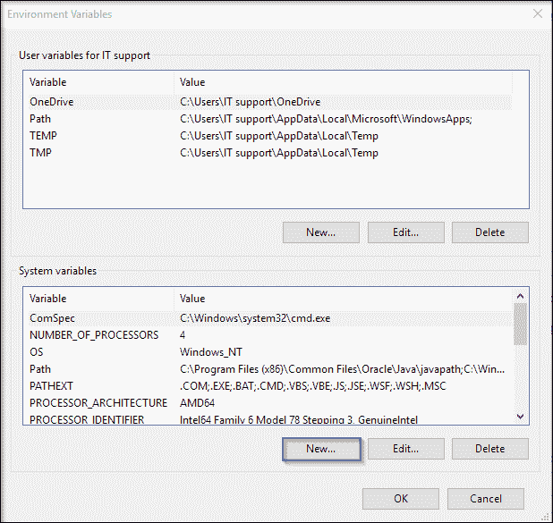
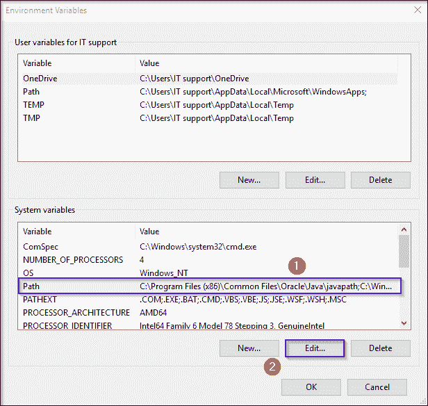
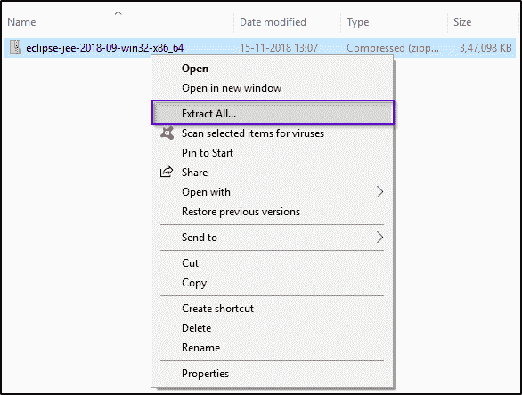
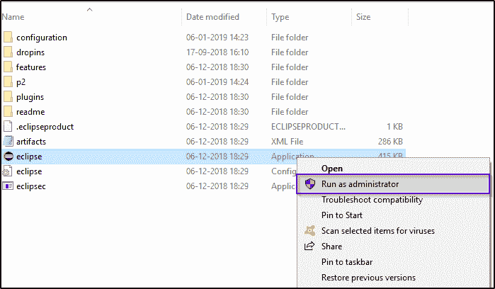
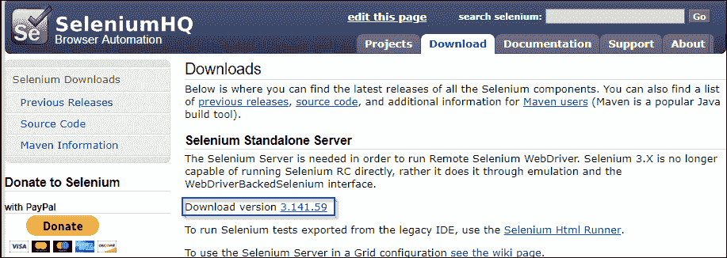
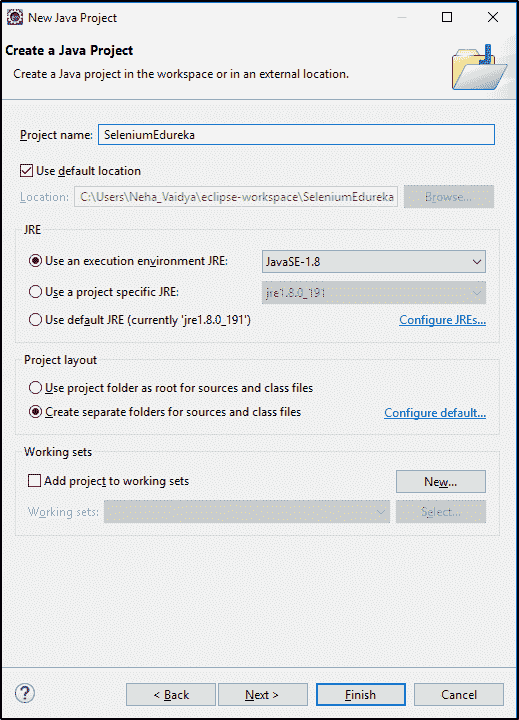
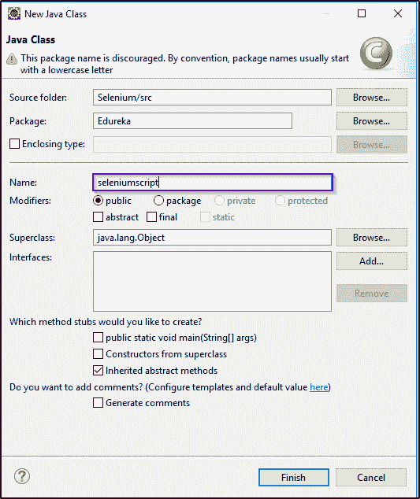

# 在 Eclipse 中逐步安装 Selenium

> 原文：<https://www.edureka.co/blog/selenium-installation/>

如果你对自动化测试感兴趣，想掌握 Selenium，Edureka 的 [Selenium 测试课程](https://www.edureka.co/selenium-certification-training)将是正确的选择。 开始使用 [Selenium](https://www.edureka.co/blog/what-is-selenium/) 的关键步骤是安装并熟悉它。为了帮助你，我写了一篇关于 Selenium 安装的文章。通过本文，我将指导您完成在系统上配置和安装 selenium 的简单步骤。

安装 Selenium 的过程包括 3 个步骤，即:

1.  [安装 Java](#JavaInstallation)
2.  [安装 Eclipse IDE](#ConfiguringEclipseIDE)
3.  [安装硒网驱动](#ConfiguringSelenium)

让我们开始吧。

Selenium 支持各种编程语言，如 [Java](https://www.edureka.co/blog/java-tutorial/) 、 [Python](https://www.edureka.co/blog/python-programming-language) 、C#、Perl、Ruby 等。Java 是 Selenium 使用最广泛的语言之一。让我们开始了解 Java 安装的过程。Java 安装需要的第一步是 配置 Java 环境，以便稍后可以使用 Java 代码来驱动 selenium。

## **安装 Java**

按照以下步骤完成您的 [Java](https://www.edureka.co/blog/java-tutorial/) 安装。

*   在下一页中，选择“Accept License Agreement”单选按钮，接受它并根据您的匹配系统配置单击“download”链接。
*   You can run the installer once the download is over and follow onscreen instructions.
    *   接下来，在“系统变量”下选择“新建”，输入变量名“JAVA_HOME”和 JAVA 安装目录的完整路径，如下所示:
    *   下图描绘了配置环境变量的名称和值。
    *   接下来你要做的是配置你的环境变量。让我们看看如何做到这一点。 在这里，你要编辑系统变量的路径如下所示。


*   在‘变量值’下，在该行的末尾，输入以下路径-***% JAVA _ HOME % bin；*** 现在，你可以点击‘确定’就大功告成了。
*   现在要交叉检查安装，只需在 cmd 中运行下面的命令—***Java-version***。它应该显示您系统中已安装的 Java 版本。

你甚至可以通过[测试自动化工程师](https://www.edureka.co/masters-program/automation-testing-engineer-training)来检查自动化工程师的细节。

## **安装 Eclipse**

按照下面的步骤在您的系统上配置 Eclipse:



*   打开文件夹，启动 eclipse.exe。 

现在，最后一步是安装[硒](https://www.edureka.co/blog/10-reasons-to-learn-selenium/)。让我们看看如何在您的系统中安装和配置 selenium。

## **安装硒 Web 驱动**

*   打开浏览器，导航至[http://www.seleniumhq.org。](http://www.seleniumhq.org/)
*   点击‘下载’菜单，选择‘下载版本’。即 x.y.z 

*   您可以简单地下载驱动程序，提取 zip 文件并保存在任何位置。同样，如果你使用的是 Mozilla 浏览器，你可以下载最新版本的 [gecko 驱动程序](https://github.com/mozilla/geckodriver/releases)并保存。
*   Next, you can simply create a new project in Eclipse IDE and add all the external selenium jar files from selenium lib directory. 
    *   首先，启动 Eclipse 并创建新项目，如下所示。T2T4
    *   接下来，指定项目的名称并创建一个类。 

*   让我们创建一个类文件并给出公共访问修饰符。 
*   接下来，您应该将引用的库添加到项目中。点击您的*项目- >构建路径- >配置构建路径*并添加外部 jar，如图所示。
*   现在你已经准备好执行第一个 Selenium 程序了。您可以运行下面的脚本并检查输出。

```
package Edureka;
import java.util.concurrent.TimeUnit;
import org.openqa.selenium.By;
import org.openqa.selenium.WebDriver;
import org.openqa.selenium.WebElement;
import org.openqa.selenium.chrome.ChromeDriver;
import org.openqa.selenium.support.ui.ExpectedConditions;
import org.openqa.selenium.support.ui.WebDriverWait;

public class FirstSeleniumScript {
public static void main(String[] args) throws InterruptedException{
System.setProperty("webdriver.chrome.driver", "C:Selenium-java-edurekachromedriver_win32chromedriver.exe");
WebDriver driver = new ChromeDriver();
driver.manage().window().maximize();
driver.manage().deleteAllCookies();
driver.manage().timeouts().pageLoadTimeout(40, TimeUnit.SECONDS);
driver.manage().timeouts().implicitlyWait(30, TimeUnit.SECONDS);
driver.get("https://login.yahoo.com/");
driver.findElement(By.xpath("//input[@id='login-username']")).sendKeys("edureka@yahoo.com");
} 
}

```

您也可以参考下面的视频，在 Selenium 上执行您的第一个测试案例。

## **如何写&在硒运行测试用例**


[//www.youtube.com/embed/_JNeiGbAgL4?rel=0&showinfo=0](//www.youtube.com/embed/_JNeiGbAgL4?rel=0&showinfo=0)

这个视频将帮助你编写&在 Selenium 中运行你的第一个测试用例。

至此，我们结束了 Selenium 的安装文章。

**了解我们在顶级城市的硒测试课程**

| 印度 | 美国 | 其他国家 |
| [印度硒培训](https://www.edureka.co/selenium-certification-training-india) | [芝加哥硒培训](https://www.edureka.co/selenium-certification-training-chicago) | [硒认证英国](https://www.edureka.co/selenium-certification-training-uk) |
| [加尔各答的硒培训](https://www.edureka.co/selenium-certification-training-kolkata) | [纽约硒培训](https://www.edureka.co/selenium-certification-training-new-york-city) | [新加坡硒培训](https://www.edureka.co/selenium-certification-training-singapore) |
| [浦那硒课程](https://www.edureka.co/selenium-certification-training-pune) | [美国硒培训](https://www.edureka.co/selenium-certification-training-us) | [硒训练悉尼](https://www.edureka.co/selenium-certification-training-australia) |

*如果您希望学习 Selenium 并在测试领域建立职业生涯，那么请在此处查看我们的交互式在线直播 **[Selenium 课程](https://www.edureka.co/selenium-certification-training)** ，该课程提供 24*7 支持，在整个学习期间为您提供指导。*

*有问题吗？请在“Selenium 安装”文章的评论部分提到它，我们会尽快回复您。*