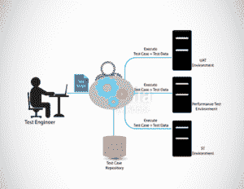
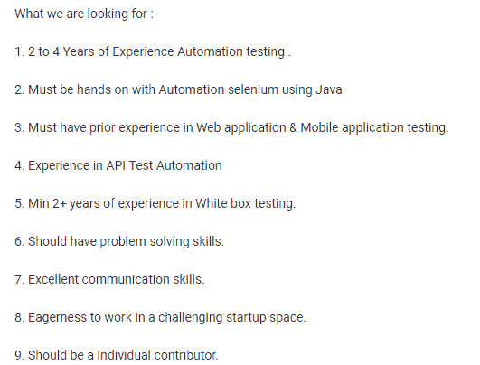
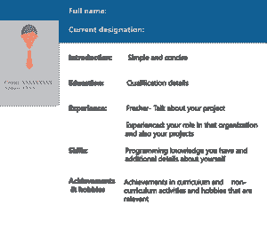

# Selenium 简历——打造令人印象深刻的测试工程师简历

> 原文：<https://www.edureka.co/blog/selenium-resume/>

当你想申请一份技术领域的工作时，你需要知道的一件事是学会如何掌握它。向理解如何破解面试迈出一小步，我们将学习如何写一份令人印象深刻的硒简历。在这篇 Selenium 简历文章中，你会明白为什么硒认证测试有巨大的职业机会 **s** 。

让我们从这篇博客将要涉及的话题开始:

*   [谁是自动化测试工程师？【T2](#Who_is_an_automation_tester?)
*   [自动化测试工程师岗位说明书](#Job_description_for_this_profile)
*   [自动化测试工程师角色和职责](#Roles_and_responsibilities_of_an_automation_tester)
*   [所需技能](#Skills_required)
*   [硒工作动向](#Selenium_job_trends)
*   [硒薪趋势](#Salary_trends)
*   [写简历要考虑的要点](#Key_points_to_be_considered_while_writing_a_resume)
*   [硒测试工程师样本简历](#Sample_resume)

所以我们将从了解谁是自动化测试工程师开始。

## **硒简历:自动化测试工程师是谁？**

当开发一个应用程序或软件时，需要对其进行测试，以确定它是否能给出期望的结果。测试应用程序有不同的方法。一个人可以通过输入、检查输出并报告来手动测试应用程序，或者他可以通过执行脚本来自动化这个过程。

自动化测试人员是编写脚本来测试应用程序正确性的人。

测试自动化包括创建和应用控制或监控软件产品的生产和及时交付的技术。自动化测试有助于减少执行繁琐任务所消耗的时间。

测试自动化工程师的职责包括设计、编程、模拟和部署有效的测试自动化解决方案。测试自动化工程师的主要目标是用最少的代码或脚本集来自动化尽可能多的测试。

自动化测试人员通过创建自动检查功能的脚本来设计测试用例。 自动化测试完全依赖于预先编写的测试，它会自动运行来比较实际结果和预期结果。因此，自动化测试人员在使应用程序免于缺陷方面扮演着重要的角色。

让我们来看看自动化测试员的工作描述。

## **自动化测试工程师岗位说明书**

开始建立一份测试自动化简历的最简单的方法是看工作描述。这是一家顶级公司 *Squareroot* 的工作描述，在那里你会发现 Selenium 是一个必须知道的工具。

本工作描述可能会根据组织的要求而有所不同。现在，让我们看看自动化测试人员的角色和职责。

## **角色&自动化测试工程师的职责**

要成为一名成功的自动化测试人员，你需要知道你打算做什么。我试图指出自动化测试工程师的主要角色和职责:

*   调查软件中的问题
*   识别&解决系统中的所有 bugs】
*   定义测试策略
*   设计和编写测试自动化脚本
*   开发、设计功能、非功能和性能测试的测试策略
*   处理、实施和监控测试
*   确保各项测试里程碑的及时交付
*   自我发展技能以跟上潮流

一个自动化测试人员并不局限于这些职责， 它可能会根据工作需求而有所不同。

现在你们已经对自动化测试人员的角色和职责有了清晰的认识，我们将会看到一个人为了成为一名杰出的测试人员而必须拥有的技能。

## **硒测试工程师简历|爱德华卡**

[//www.youtube.com/embed/9ExE9-pHwsk?rel=0&showinfo=0](//www.youtube.com/embed/9ExE9-pHwsk?rel=0&showinfo=0)

这个由 Edureka 制作的“Selenium Resume”视频帮助你了解如何制作一份简历来通过任何自动化测试面试。

## **硒简历:所需技能**

*“Give me six hours to chop down a tree and I will spend the first four sharpening the axe.” – Abraham Lincoln*

**类似于如何磨利斧头在砍树中起主要作用，技能在清除面试中起主要作用。一个人需要知道手工测试的基础，以便理解如果自动化的话过程会发生什么。这是测试领域中必须知道的技能。**

**我已经根据经验等级区分了技能组合。首先，我们将检查一名新生所需的技能:**

***   必须具备测试架构的基本知识*   对计算机语言和软件开发有扎实的理解*   知道如何设计测试框架*   应该精通创建测试脚本*   解决问题的能力*   应具备创造性思维能力*   良好的沟通能力**

**现在让我们看看一个有经验的自动化测试工程师需要的技能:**

***   在软件开发领域至少有 2-5 年的工作经验*   至少 3 年以上的实际测试经验*   3 年以上建立、领导和管理产品测试的经验*   展示开发和交付测试计划的领导力*   从事产品生命周期工作的经验*   开发创新策略以提高测试的有效性*   跨 Linux 工作的经验&基于 Windows 的开发*   彻底理解业务目标和规范**

**上面列出的是一家公司需要的基本技能。这可能因公司而异。**

**现在你已经看到了在面试中胜出所需的技能，我们将看到在过去几年中不断增长的 Selenium 工作趋势。**

## ****硒简历:硒求职趋势****

**Selenium 是最广泛使用的自动化测试工具之一，是一个人在测试领域建立职业生涯所必须掌握的。有许多组织提供诸如测试工程师、测试分析师、测试经理、QA 分析师以及任何你能想到的职位。因此，由于这份工作的工资水平很高，职位空缺也在增加。下图向我们展示了最新的就业趋势。**

****

**正如你所看到的，测试职位的空缺呈指数增长，人们根据自己的喜好选择长期工作和合同工。根据 [*ITJobsWatch*](https://www.itjobswatch.co.uk/jobs/uk/selenium.do) 指定的工资中位数为 50，000 欧元。 所以如果你们中的任何人想成为一名 [***成功的自动化测试员***](https://www.edureka.co/selenium-certification-training) ，现在正是开始为之努力的时候。**

**我们来了解一下一个自动化测试人员获得的工资。**

## ****硒简历:薪资趋势****

**现在我们来谈谈统计数据。一个自动化测试人员一年挣多少钱？**

***   在全球范围内，软件测试提供了最有前途的工作，在美国，这份工作的年薪高达 83，000 美元。*   在全球范围内，Selenium 被认为是测试自动化领域的重中之重，有 29%到 36%的人将测试作为他们的职业选择。因此，作为一名测试自动化工程师，必须掌握 Selenium。*   根据最近的一项调查，自动化测试员的平均工资在 396，736 卢比到 1，525，969 卢比之间。*   根据 [*薪级表*](https://www.payscale.com/research/US/Job=Selenium_Tester/Hourly_Rate) ，硒测试仪的平均薪酬为**每年 83200 美元**。**

**这就是硒测试仪的价值在最近几年增加的原因。**

**现在让我们继续，看看在写一份 Selenium 简历时，我们应该考虑哪些基本因素。**

## ****写简历要考虑的要点****

**要写一份有效的简历，我们需要考虑几件事。**

***   简历是面试官对你的第一印象。*   可以有两种写法，分别是:时间性和功能性*   按时间顺序排列的:这是写简历的一种传统方式，你可以根据事情发生的时间来说明你的经历。它通常用于保守领域。*   :这是一种全新的方式，你可以根据所需的技能来提及你最相关的经验。这是在面试官面前展示自己的一种更简单的方式。*   你的简历应该简单、简明、及时。*   消息应该清楚 。*   对于工作经验少于 8 年的人来说，应该有一页纸的简历。*   优先考虑那些与工作相关的技能。*   不要忘记提及你的成就和爱好，因为这有助于打破与面试官的僵局。**

**现在让我们进入本文最重要的部分，了解如何写一份 Selenium 简历。**

## ****样本** **硒简历****

****

**在写简历时，你需要知道的第一件事是保持适当的对齐。这最终引起了面试官的注意。**

***   简介应该简单，并且符合要求。*   接下来是你的教育细节。这应该包括在你的最新学位的顺序中。*   接下来是你在这个领域的经历。*   如果你是大一新生，不要担心，你可以提到你做过的项目，并证明你在其中的作用。*   如果你有经验，提及你最近的工作角色和你参与过的项目&你在以前单位的成就。*   一定要提到你的技能，具体说明你擅长什么。*   最后，但同样重要的是，提及你的成就和爱好。尽量不要谈论这个，因为这可能会分散面试官的注意力。尽量保持简单。**

****了解我们在顶级城市的硒测试课程****

| 印度 | 美国 | 其他国家 |
| [印度硒培训](https://www.edureka.co/selenium-certification-training-india) | [芝加哥硒培训](https://www.edureka.co/selenium-certification-training-chicago) | [硒认证英国](https://www.edureka.co/selenium-certification-training-uk) |
| [加尔各答的硒培训](https://www.edureka.co/selenium-certification-training-kolkata) | [纽约硒培训](https://www.edureka.co/selenium-certification-training-new-york-city) | [新加坡硒培训](https://www.edureka.co/selenium-certification-training-singapore) |
| [浦那硒课程](https://www.edureka.co/selenium-certification-training-pune) | [美国硒培训](https://www.edureka.co/selenium-certification-training-us) | [硒训练悉尼](https://www.edureka.co/selenium-certification-training-australia) |

***现在说到这里，我们就告一段落这个“硒简历”博客。我希望你们喜欢这篇文章，并且明白如何自己写一份有创意的简历。现在，您已经了解了制作简历的最简单方法，请查看 Edureka 提供的培训，这是一家值得信赖的在线学习公司，在全球拥有超过 650，000 名满意的学习者。本课程旨在向您介绍完整的 Selenium 特性及其在软件测试中的重要性。有问题吗？请在“Selenium 简历”的评论部分提及，我们会回复您。***