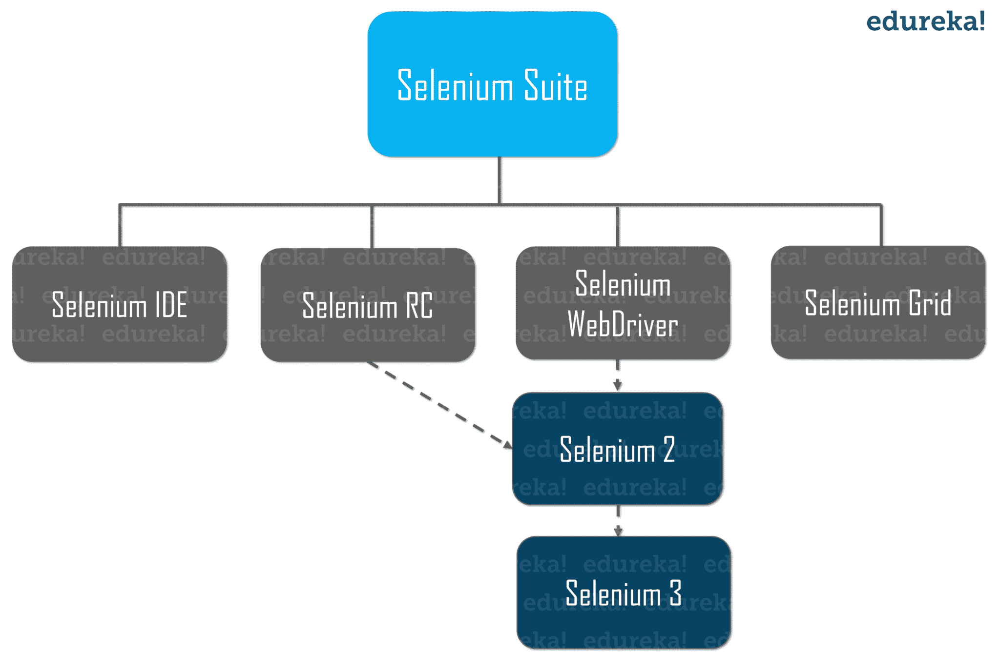
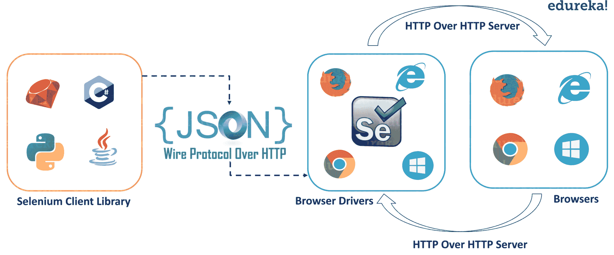

# 关于 Selenium WebDriver 架构，您需要知道的全部内容

> 原文：<https://www.edureka.co/blog/selenium-webdriver-architecture/>

在各种不利条件下测试系统是一项具有挑战性的任务，你需要一个工具来帮助你。自动化测试人员主要使用的工具之一是 Selenium。如果您是初学者，并且希望了解 Selenium 的内部功能，那么您已经找到了一个完美的地方。在本文中，我将向您简要介绍 Selenium WebDriver 架构。更多细节可以参考[硒训练](https://www.edureka.co/selenium-certification-training)。

下面是本文涉及的主题:

*   [硒是什么？](#WhatisSelenium?)
*   [硒套工具](#SeleniumSuiteofTools)
*   [硒 WebDriver 架构](#SeleniumArchitecture)
*   [演示](#Demo)

*您也可以浏览这段录音，通过示例详细了解主题。【T2*

## **Selenium WebDriver 架构|了解 Selenium 架构| Edureka**


[https://www.youtube.com/embed/gwkv6os1AYs?rel=0&showinfo=0](https://www.youtube.com/embed/gwkv6os1AYs?rel=0&showinfo=0)*This Edureka “Selenium Architecture” video will give you an introduction to Selenium Architecture and Webdriver.*

## **硒是什么？**

 [Selenium](https://www.edureka.co/blog/what-is-selenium/) 是一个开源的可移植框架，用于自动化测试 web 应用程序。在测试功能和回归测试用例时，它是高度灵活的。Selenium 测试脚本可以用不同的编程语言编写，如 [Java](https://www.edureka.co/blog/advanced-java-tutorial) 、 [Python](https://www.edureka.co/blog/python-tutorial/) 、C#等等。这些测试脚本可以跨各种浏览器运行，如 Chrome、Safari、Firefox、Opera，并且还提供跨各种平台的支持，如 Windows、Mac OS、Linux、Solaris。Selenium 还支持交叉浏览，其中测试用例同时在不同的平台上运行。它还有助于创建健壮的、基于浏览器的回归[自动化套件](https://www.edureka.co/blog/test-automation-frameworks/)并执行测试。

我希望你了解硒的基本原理。现在，让我们进一步了解 Selenium 套件中可用的各种工具。

## **硒套工具**

Selenium 主要由一套工具组成，包括:

*   硒 IDE
*   硒 RC
*   Selenium WebDriver
*   硒栅



让我们更详细地了解这些工具的功能。

### **硒 IDE**

IDE(集成开发环境)是一个火狐插件。它是 Selenium 套件中最简单的框架之一。它允许我们记录和回放脚本。如果您希望使用 [Selenium IDE](https://www.edureka.co/blog/selenium-ide) 创建脚本，您需要使用 Selenium RC 或 Selenium WebDriver 来编写更高级和健壮的测试用例。

接下来，我们来看看什么是硒 RC。

### **硒 RC**

Selenium RC，也称为 Selenium 1，在 WebDriver 合并带来 Selenium 2 之前的很长一段时间里是主要的 Selenium 项目。它主要依靠 JavaScript 来实现[自动化](https://www.edureka.co/blog/automation-testing-tutorial/)。它支持 Ruby，PHP，Python，Perl 和 C#，Java，Javascript。它支持几乎所有的浏览器。

***注:**硒 RC 正式弃用。*

### **硒网驱动**

[Selenium WebDriver](https://www.edureka.co/blog/selenium-tutorial) 是一个浏览器自动化框架，接受命令并将它们发送到浏览器。它是通过特定于浏览器的驱动程序实现的。它直接与浏览器通信并控制它。Selenium WebDriver 支持各种编程语言，如-[Java](https://www.edureka.co/blog/java-tutorial/)、c#[PHP](https://www.edureka.co/blog/php-tutorial-for-beginners/)、 [Python](https://www.edureka.co/blog/python-tutorial/) 、Perl、 [Ruby](https://www.edureka.co/blog/ruby-on-rails-tutorial/) 。还有[Javascript](https://www.edureka.co/blog/top-10-javascript-frameworks/)

Selenium WebDriver 支持以下功能:

1.  ***操作系统支持***——Windows、Mac OS、Linux、Solaris
2.  ***浏览器支持***——Mozilla Firefox、Internet Explorer、Google Chrome 12.0.712.0 及以上、Safari、Opera 11.5 及以上、Android、iOS、HtmlUnit 2.9 及以上。

### **硒栅**

[硒格](https://www.edureka.co/blog/selenium-grid-tutorial)是和硒 RC 一起使用的工具。它用于在不同的机器上针对不同的浏览器并行运行测试。这意味着——在运行不同浏览器和操作系统的不同机器上同时运行多个测试。

这就是 Selenium 工具套件的全部内容。让我们更深入地研究这篇文章，了解 Selenium WebDriver 架构的功能和各种组件。

## **硒 WebDriver 架构**

为了理解 Selenium WebDriver 架构，我们首先要知道什么是 WebDriver API。Selenium Webdriver API 有助于语言和浏览器之间的交流。每个浏览器都有不同的在浏览器上执行动作的逻辑。下图描述了 Selenium WebDriver 架构的各个组件。

它由四个主要部分组成，分别是:

1.  Selenium 客户端库
2.  【HTTP 客户端上的 JSON 有线协议
3.  浏览器驱动程序
4.  浏览器

让我们深入了解这些组件。

**1。Selenium 客户端库/语言绑定**

Selenium 支持 Java、Ruby、Python 等多种库。Selenium 开发人员已经开发了语言绑定，允许 Selenium 支持多种语言。如果你想了解更多关于图书馆的信息，请参考[硒图书馆](http://www.seleniumhq.org/download/#client-drivers)的官方网站。

**2。HTTP 客户端上的 JSON 有线协议**

JSON 代表 [JavaScript](https://www.edureka.co/blog/what-is-javascript/) 对象符号。它用于在 web 上的服务器和客户端之间传输数据。JSON Wire 协议是一个 REST API，它在 HTTP 服务器之间传输信息。每个 BrowserDriver(如 FirefoxDriver、 [ChromeDriver](https://www.edureka.co/blog/selenium-chromedriver-and-geckodriver/) 等。)有自己的 HTTP 服务器。

**3。浏览器驱动**

每个浏览器都包含一个单独的浏览器驱动。浏览器驱动程序与相应的浏览器进行通信，而不会暴露浏览器功能的内部逻辑。当浏览器驱动程序接收到任何命令时，该命令将在相应的浏览器上执行，响应将以 HTTP 响应的形式返回。

**4。浏览器**

Selenium 支持 Firefox、Chrome、IE、Safari 等多种浏览器。

现在，让我们更进一步，借助下面的例子来了解 Selenium 的内部功能。

## **演示**

实时地，您可以使用任何一个受支持的 Selenium 客户端库(比如 Java)在您的 UI(比如 Eclipse IDE)中编写代码。

*例如:*

```
WebDriver driver  = new FirefoxDriver();
driver.get("https://www.edureka.co");

```

一旦你准备好你的脚本，你将点击运行来执行程序。基于上述声明，Firefox 浏览器将启动，并导航至 [Edureka 网站](https://www.edureka.co)。

点击“运行”后，脚本中的每一条语句都将被转换成一个 URL，这将借助 HTTP 上的 JSON Wire 协议。URL 将被传递给浏览器驱动程序。(在上面的代码中，我已经使用了 FirefoxDriver)。这里，在这种情况下，客户端库(Java)会将脚本的语句转换成 JSON 格式，并进一步与 FirefoxDriver 通信。

Every Browser Driver uses an HTTP server to receive HTTP requests. Once the URL reaches the Browser Driver, then it will pass that request to the real browser over HTTP. Once done, the commands in your [Selenium](https://www.edureka.co/blog/selenium-using-python/) script will be executed on the browser. In the case of Chrome browser, you can write your Selenium script as shown below:

```
WebDriver driver  = new ChromeDriver();
driver.get("https://www.edureka.co");

```

如果请求是 *POST* 请求，那么浏览器上会有一个动作。如果请求是一个 *GET* 请求，那么相应的响应将在浏览器端生成。然后，它将通过 HTTP 发送到浏览器驱动程序，浏览器驱动程序通过 JSON Wire 协议将其发送到 UI (Eclipse IDE)。

这就是关于 Selenium WebDriver 架构的全部内容。我希望你理解了这些概念，并且它增加了你知识的价值。现在，如果你想对 Selenium 有更深入的了解，你可以查看关于 [Selenium 教程](https://www.edureka.co/blog/selenium-tutorial)的文章。

*如果您发现这个“Selenium web driver Architecture**”，* *请查看 Edureka 提供的 ***[Selenium 认证培训](https://www.edureka.co/selenium-certification-training)**** *，edu reka 是一家值得信赖的在线学习公司，拥有遍布全球的 250，000 多名满意的学习者。*

*有问题吗？请在 Selenium WebDriver Architecture 文章的评论部分提到它，我们会回复您。*