# ServiceNow 开发人员培训–service now 脚本简介

> 原文：<https://www.edureka.co/blog/servicenow-developer-training/>

ServiceNow 是最受欢迎的 ITSM 工具之一，它将各种业务流程自动化。在这篇博客中，我将从一个开发者的角度来讨论 ServiceNow。因此，让我们不要浪费任何时间，从这个 ServiceNow 开发人员培训博客开始吧。

这篇博客将带你了解以下几点:

1.  什么是 ServiceNow
2.  脚本简介
3.  ServiceNow 开发人员培训演示

让我们从这个 ServiceNow 开发者培训博客的第一个话题开始讨论

## **什么是 ServiceNow？**

ServiceNow 是一个软件平台，支持 IT 服务管理和常见业务流程的自动化。它包含许多模块化应用程序，这些应用程序会因实例和用户而异。ServiceNow 是一个集成的**云**解决方案，它将主要的云和业务服务整合到一个单一的记录系统中。

ServiceNow 从提供服务目录管理的 IT 服务管理应用程序开始，如今支持 IT 服务管理流程和 IT 企业，如人力资源管理、安全管理和 PPM 等。

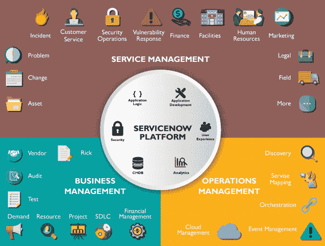

以下特点使 ServiceNow 优于其竞争对手:

*   基于实例的实现
*   易于定制
*   更好的支持和更低的维护成本
*   实时分析和报告

这是对 ServiceNow 的简短介绍。接下来，在这个 ServiceNow 开发人员培训博客中，我们将了解什么是 ServiceNow 中的脚本:

## **脚本简介**

一个**脚本**只不过是一种计算机编程语言，带有一系列无需编译就能执行的命令。简而言之，脚本就是配置你的系统执行由特定事件触发的特定任务。

您可以将脚本分为两种类型:**服务器端脚本**和**客户端脚本** **脚本**

### **服务器端脚本**

它是运行在网络服务器上的脚本，为每个用户对网站的请求生成定制的响应。服务器端脚本在**服务器**或**数据库** 上执行

服务器端脚本通常用于为用户提供定制的界面。这些脚本可以基于那些特征、用户的要求、访问权限等来汇集用于定制响应的客户端特征。服务器端脚本还使网站所有者能够隐藏生成界面的源代码。

### **客户端 脚本**

客户端脚本在客户端(网络浏览器)上运行。您可以使用客户端脚本来定义当事件发生时运行的自定义行为，例如，当加载或提交表单时，或者当单元格值发生变化时。正确的客户端处理首先依赖于表单的完全加载。在表单加载之前更新记录可能会产生绕过客户端处理的意外结果。客户端 Glide APIs(应用程序编程接口)提供了可以在脚本中用来执行客户端任务的类和方法。

拥有 JavaScript 基础知识的用户可以定义在客户端浏览器中运行的脚本。ServiceNow 支持多种类型的客户端脚本。让我们来看看那些:

*   onLoad()
*   onChange()
*   onSubmit()
*   大提琴组曲()

### **onLoad()**

当表单在用户看到之前加载时，onLoad()脚本就会运行。表单上的值直接来自数据库。这种类型的脚本允许您控制表单首次向用户显示的方式。

当用户改变任何字段中的值时，onChange 脚本运行。这个脚本可以方便地设置一个字段的值，或者根据用户在其他字段中输入的值显示值。

### **onSubmit()**

当用户提交表单时，onSubmit 脚本运行。这种类型的脚本对于验证用户输入的值非常有用。

### **【oncelldit()**

onCellEdit()脚本与 onChange()脚本非常相似。然而，这两者之间有一个主要的区别。onCellEdit()脚本在用户更改列表中字段的值时运行。

## **ServiceNow 开发者培训:演示**

在这个 ServiceNow 开发人员培训演示中，我们首先创建一个 github 帐户。

### **创建 Github 账号:**

**第一步:**进入下面的 *[链接](https://github.com/)* 创建和一个 Github 账号。将出现以下页面。**登录，**如果您已经有一个帐户，请按照步骤进行**注册**。

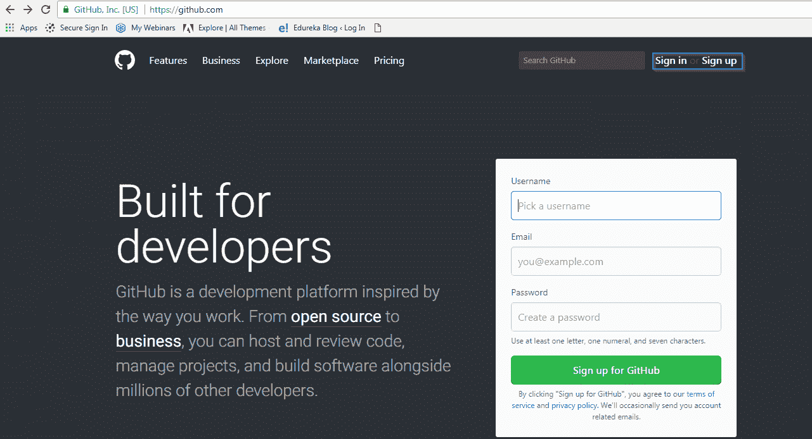

**第二步:**填写上述详细信息，点击**报名。**将出现以下窗口，在下面显示的字段中填写所需的详细信息

**第三步:** GitHub 会要求您填写以下信息，并点击继续

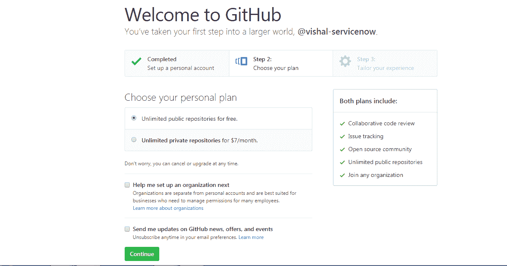

第四步:一旦你完成了这些，一个正式的信息页面就会出现，填写这些信息，你就可以开始了。

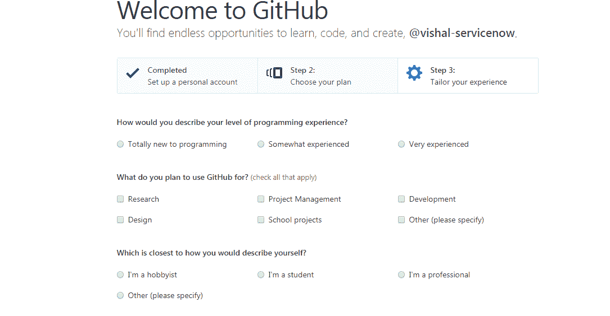

**第五步:**一旦你这样做了，你的账户就创建好了。接下来**点击**链接**来验证**你的账户，GitHub 会将链接发送到你注册的邮箱。

### **在 ServiceNow** 中分叉 needit 知识库

**第一步:**接下来打开你的浏览器，进入这个“*https://github.com/ServiceNow/devtraining-needit-jakarta*链接。该链接会将您重定向到以下页面。现在让我们通过点击 **fork** 将“dev training–need it–Jakarta”存储库与我们的 ServiceNow 实例**分支**

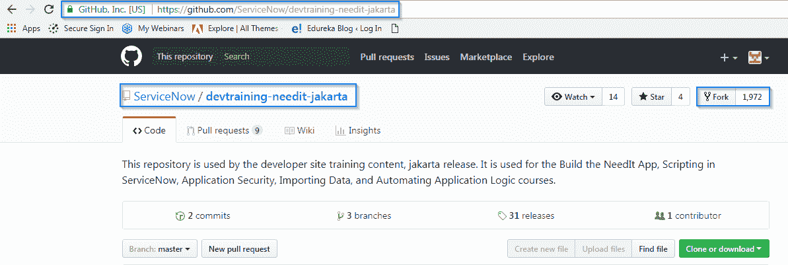

**第二步:**在你分叉了存储库之后。GitHub 会给你一个克隆库的选项。点击**克隆**标签， **Github** 会为你生成如下链接，**复制**该链接。您可以下载 zip 文件或直接在桌面上打开它。

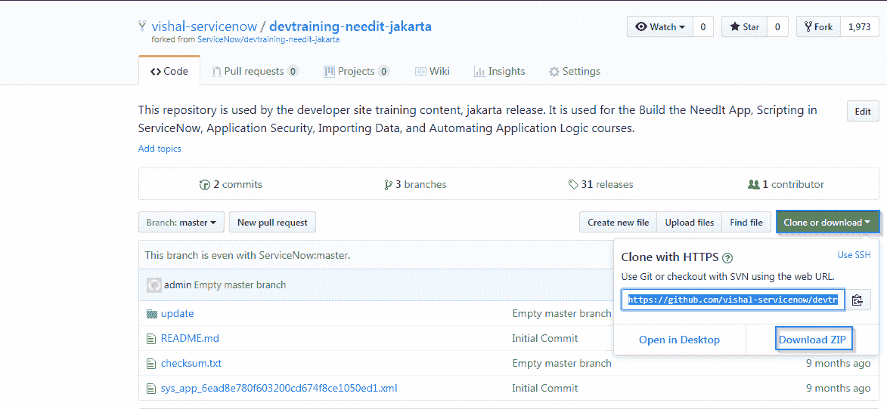

我们已经成功**分叉**了 **GitHub** 库。现在让我们继续使用我们的存储库创建一个客户端脚本。

### **ServiceNow 开发者培训:创建客户端脚本**

**步骤 1:** 转到**应用程序导航到 ServiceNow 实例中的** r。键入**工作室**和**打开**它。

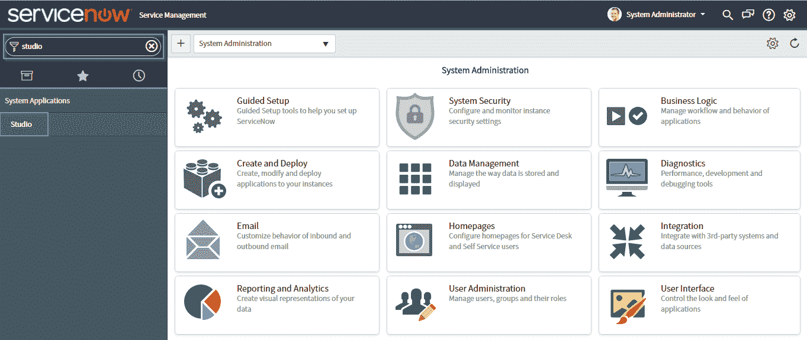

**第二步:**下面的标签页会打开。点击**导入源代码控制**来导入存储库。

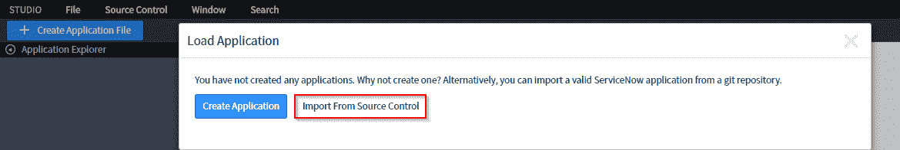

**第三步:**出现如下窗口。输入我们在克隆存储库时复制的链接，还输入我们用来创建帐户的 GitHub 凭证。点击**导入**

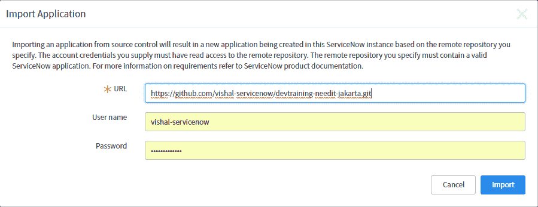

**第四步:**会出现如下页面。点击 **NeedIT** 资源库。

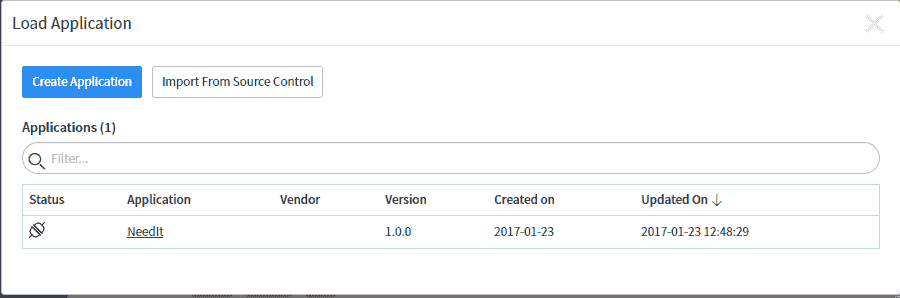

**第五步:**在**工作室**中，打开**源代码控制**菜单，点击**创建分支**选项

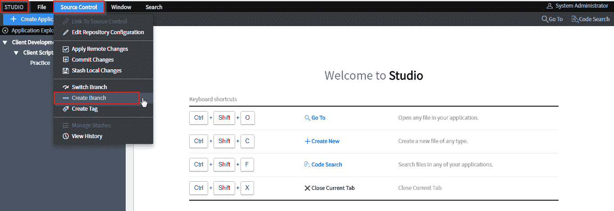

**第六步:**用以下凭证配置分支:

Branch Name: **ClientScriptsModule. **Create from Tag: **LoadForClientScriptsModule. **Click the **Create Branch** button. Click the **Close Dialog** button.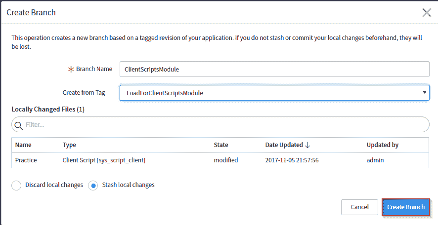**Step 7:** Click the **Create Application File** button. Choose the new file type, in this case, **Client Script. **Configure the new file.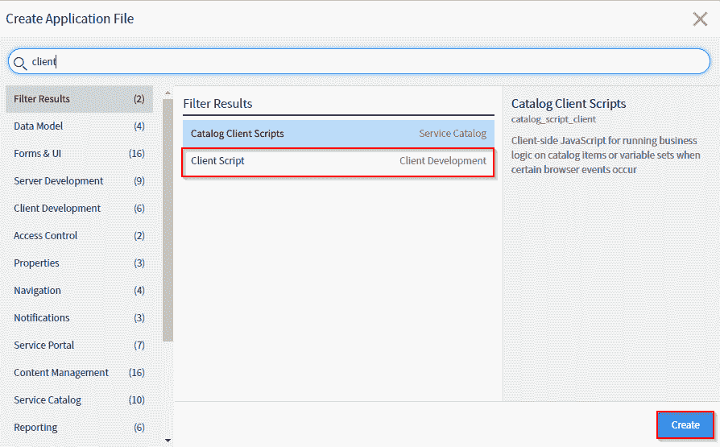**Step 8:** Go to **studio**, click on **client scripts** and finally on **NeedITonChangeExample.** Fill in the details and scroll down.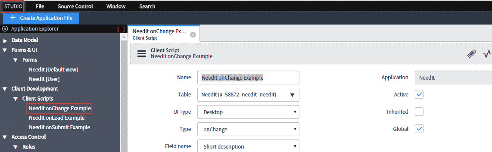**Step 9:** Following script will help you implement changes that are made to the form. Click on **submit** or **update.****Step10:** Similarly update records **NeedIT onChange Example** and **NeedIT onSubmit Example**First lets do it for **NeedIT onLoad Example.**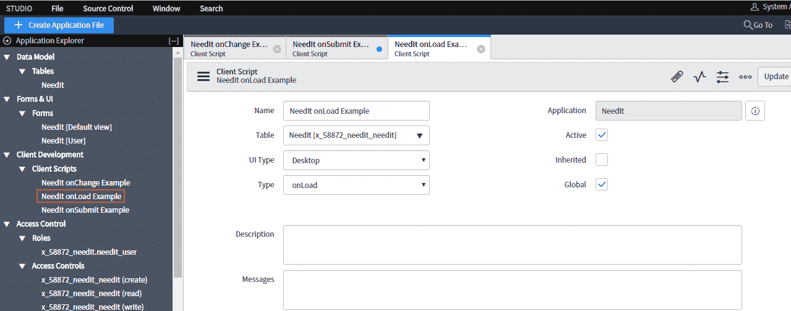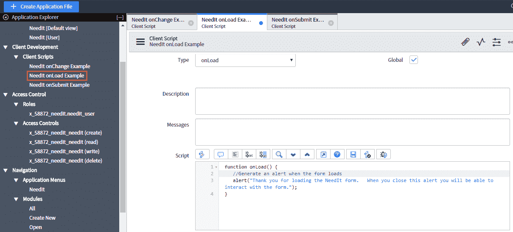 Finally we update the **NeedIT onSubmit Example** client script.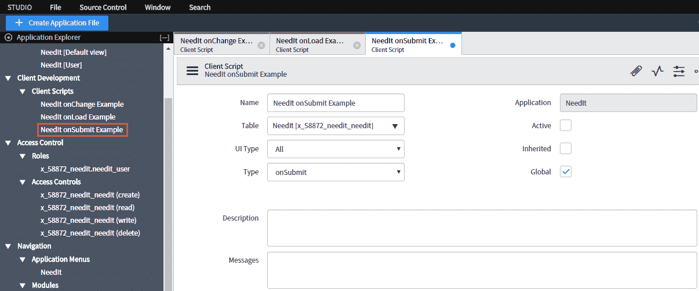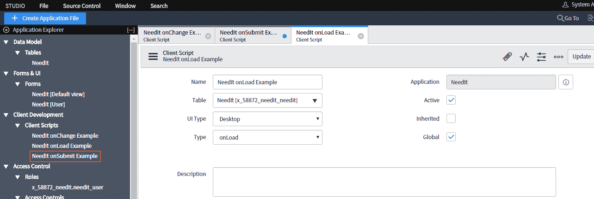We have successfully updated our three sample Client scripts. Now is the time to test them.

### **测试客户端脚本**

**第一步:**在主 ServiceNow 浏览器窗口(非 Studio)使用应用导航器打开 **NeedIt > All** 。选择您选择的记录并打开它。如果您的客户端脚本是活动的。它将显示如下图所示的警报。 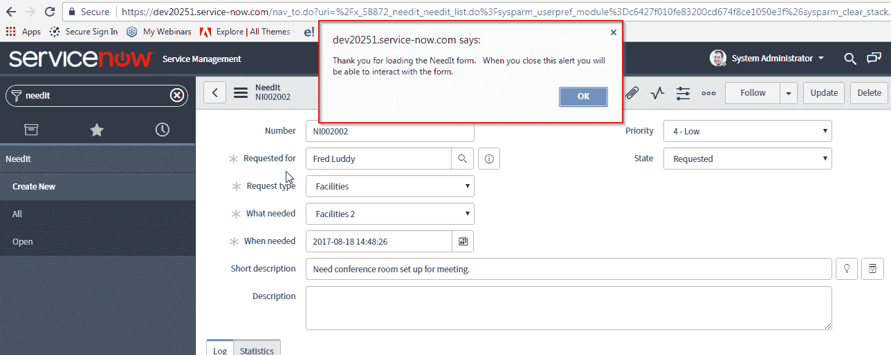

**第二步:**按确定。现在对记录进行更改。将优先级更改为**中等**并点击**更新。**将弹出 **onSubmit** 警报。

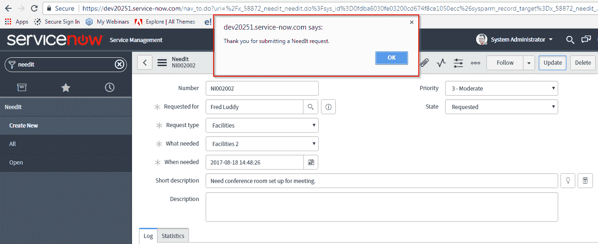

**Step3:** 最后让我们测试一下 **onChange** 客户端脚本。为此，对**简短描述**进行更改并更新。警报将弹出，如下图所示。

这验证了所有的客户端脚本都在工作，因此我们已经成功地创建了客户端脚本并相应地实现了它们。这就是我们对 ServiceNow 开发人员培训博客的总结。

***想成为服务专家吗？？*** 成为 ServiceNow 专家从 Edureka 的 [**ServiceNow 管理员认证培训**](https://www.edureka.co/blog/servicenow-developer-training/) 和 **ServiceNow 开发人员认证培训**开始，这些培训帮助学员成为管理 SN 平台的专家，使用银行、销售、金融领域的实时用例为业务流程、工作流、导入集开发脚本。

*有问题吗？请在评论区提到它，我们会给你回复。*