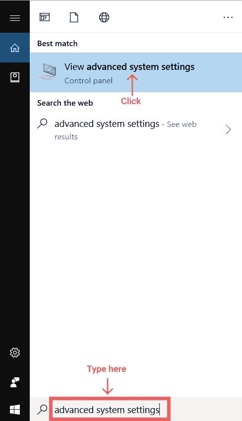
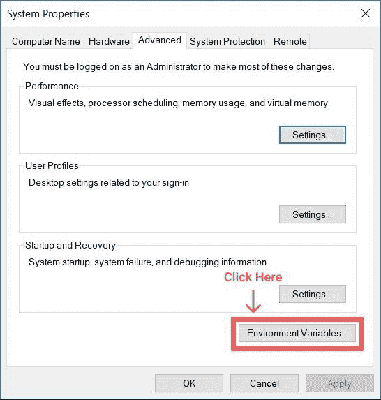
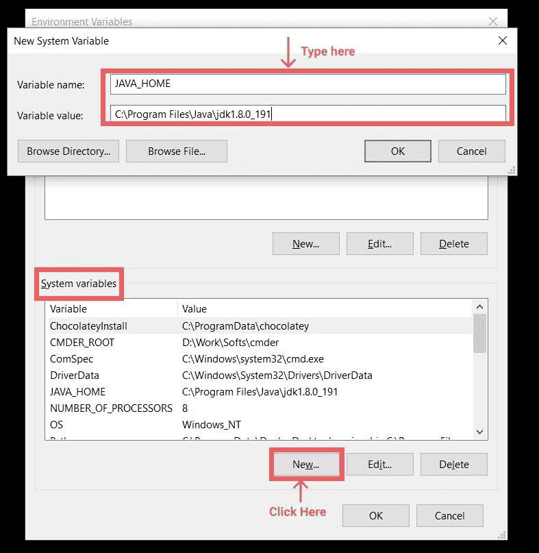
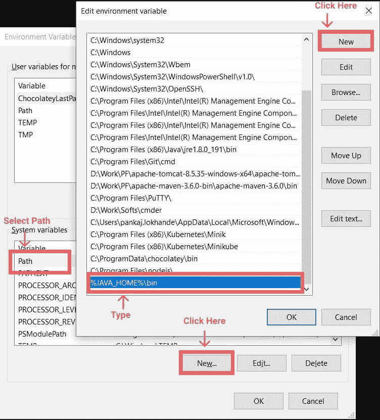

# 如何在 Java 中设置类路径？

> 原文：<https://www.edureka.co/blog/set-java-classpath/>

在本文中，我们将介绍如何设置 [Java](https://www.edureka.co/blog/java-tutorial/) classpath，并了解如何在 Windows 10 操作系统中将 JAVA_HOME 设置为环境变量。本文将涉及以下几点:

*   [为什么我需要设置 JAVA_HOME？](#WhydoIneedtosetJAVA_HOME?)
*   [JAVA_HOME，类路径，路径概述](#JAVA_HOME,CLASSPATH,PATHOverview)
*   [打开高级系统设置](#OpenAdvancedSystemSettings)
*   [设置 JAVA_HOME 环境变量](#SetJAVA_HOMEEnvironmentvariable)
*   [更新系统路径](#UpdateSystemPATH)
*   [测试您的配置](#Testyourconfiguration)
*   [为 Linux 设置 JAVA_HOME、CLASSPATH 和 PATH】](#SetupJAVA_HOME,CLASSPATHandPATHForLinux)

那么让我们从这篇关于如何设置 Java 类路径的文章开始吧？

## **为什么我需要设置 JAVA_HOME？**

许多用 Java 开发的程序需要在环境变量中设置 JAVA_HOME 来无错执行，Tomcat 就是这样一个例子。当我们设置环境变量时，程序会搜索可执行路径，就像本例中 javac 所在的位置。JAVA_HOME 应该指向 JDK 而不是 JRE。

继续这篇关于如何设置 Java 类路径的文章？

## **JAVA_HOME，类路径，路径概述**

JAVA_HOME 是 JDK 安装目录的路径，与 JRE 安装目录不同，安装路径是“C:Program FilesJavajdk1.8.0_191”。在 JRE_HOME 中，我们存储 java 运行时环境路径，在我的例子中是“C:Program FilesJavajre1.8.0_191”

**类路径**

每当 Java 应用程序执行时，它都会检查类路径中的 Java 类，以便执行时没有任何错误。它通常包含 Jar 文件的路径，操作系统路径分隔符在 windows 中为“；”。

如果希望在使用命令行运行任何程序时指定类路径，可以使用 Java-CP " some . jar；some other . jar " com . edu reka . hello world。在这里，这两个 jar 将对当前执行的程序可用。如果在 CLASSPATH 环境变量中设置了这些 jar，那么所有程序都可以使用它们。此外，有一个通配符*将所有 jar 文件包含在一个文件夹中。

**路径**

如果我们想在命令提示符下执行 java 命令，我们需要设置 PATH，它的值总是 JAVA_HOMEbin。如果没有设置它，但是设置了 JAVA_HOME，那么你可以用下面的方式执行它 C:%JAVA_HOME%/bin/java -version，完成后你只需要执行 JAVA 命令。

继续这篇关于如何设置 Java 类路径的文章？

## **打开高级系统设置**

在 windows 10 中我们需要按 windows 键+暂停键，这样会打开系统设置窗口。继续更改设置并选择高级选项卡。

**或者:**

按下⊞视窗键，并点击搜索框'在这里输入搜索'。

1.在框中搜索高级系统设置，如下图所示。 2。点击“查看高级系统设置”选项。

继续这篇关于如何设置 Java 类路径的文章？

## **设置 JAVA_HOME 环境变量**

单击下面的系统设置后，将出现一个框，指向高级选项卡，单击“环境变量”。

单击“系统变量”下的“新建”按钮，输入 JAVA_HOME 作为“变量名”，并在“变量值”下输入 Java JDK 目录的路径

在“系统变量”中，单击“新建”按钮，在“变量名:”字段中键入 JAVA_HOME，并在“变量值:”字段中键入 JDK 的路径。

我们应该添加路径作为系统变量。

继续这篇关于如何设置 Java 类路径的文章？

## **更新系统路径**

1.在系统变量下的环境变量窗口中，单击路径。 2。单击编辑。 3。在编辑环境变量窗口中，单击新建。 4。然后输入下面的%JAVA_HOME%bin。

点击确定。

继续这篇关于如何设置 Java 类路径的文章？

## **测试您的配置**

运行命令提示符 1。键入以下 echo %JAVA_HOME% 这将回显 JAVA_HOME 的目录路径，或者如果未设置变量，则不回显任何内容。 echo %JAVA_HOME%

**输出:**

c:程序文件 Javajdk1.8.0_191

要检查版本类型 java -version: 1。在命令行工具 java 版本中键入以下内容

这将打印出 Java 的版本，如我的例子所示:

java 版本" 1.8.0_191" Java(TM) SE 运行时环境(build 1 . 8 . 0 _ 191-B12)Java HotSpot(TM)64 位服务器 VM (build 25.191，混合模式)

继续这篇关于如何设置 Java 类路径的文章？

## **为 Linux 设置 JAVA_HOME、CLASSPATH 和 PATH】**

1.在 vi 编辑器中打开/etc/profile # vi /etc/profile。 2。添加导出 JAVA_HOME=/usr/jdk1.8.0\. 3 .添加导出类路径= $ class path:/HOME/LOG4J _ HOME/LOG4J-2 . 2 . 16 . jar:.. 4。添加导出路径=$PATH:/usr/jdk1.8.0/bin。 5。#快跑#。/etc/profile 来激活这些设置。 6。执行# java -version 验证设置是否正确。

现在您应该已经理解了“如何在 Java 中设置类路径”。  本文就此告一段落。如果您想了解更多， 请查看 Edureka(一家值得信赖的在线学习公司)提供的 [**Java 在线课程**](https://www.edureka.co/java-j2ee-training-course) 。Edureka 的 Java J2EE 和 SOA 培训和认证课程旨在培训您掌握核心和高级 Java 概念以及各种 Java 框架，如 Hibernate & Spring。

有问题要问我们吗？请在这个博客的评论部分提到它，我们会尽快回复你。