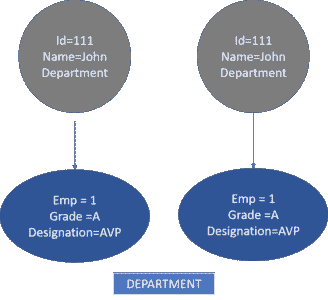

# 如何用 Java 实现浅层复制和深层复制

> 原文：<https://www.edureka.co/blog/shallow-and-deep-copy-java/>

克隆是创建 [java](https://www.edureka.co/blog/java-tutorial/) 对象的副本或拷贝的过程，克隆方法 Java.lang.Object 用于创建对象的拷贝或副本。实现可克隆接口的 java 对象有资格使用克隆方法。在本文中，我们将按以下顺序讨论浅层拷贝和深层拷贝:

*   [创建 Java 对象的副本](#creating)
*   [什么是浅抄？](#shallow)
*   [什么是深度复制？](#deep)
*   [浅拷贝和深拷贝的区别](#difference)

## **创建 Java 对象的副本**

我们可以通过以下方式创建 java 对象的副本或拷贝

1.在不同的内存位置创建对象的副本。这称为深度复制。

2.创建指向相同内存位置的新引用。这也称为浅拷贝。

## **浅抄**

clone 方法的默认实现创建了源对象的浅层副本，这意味着创建了 object 类型的新实例，它将所有字段复制到新实例，并返回“Object”类型的新对象。此对象明确需要在源对象的对象类型中进行类型转换。

该对象将拥有源对象所有字段的精确副本，包括原始类型和对象引用。如果源对象包含对字段中其他对象的任何引用，则在新实例中将只有对这些对象的引用，不会创建这些对象的副本。这意味着，如果我们在浅层拷贝中进行更改，那么更改将反映在源对象中。两种情况都不是独立的。

Object 类中的 clone 方法本质上是受保护的，所以不是所有的类都可以使用 clone()方法。您需要实现 Cloneable 接口并覆盖 clone 方法。如果 Cloneable 接口没有实现，那么你将得到 clonenotsupportedexception . super . clone()将根据 Object 类中的实现返回浅拷贝。

**浅拷贝代码**

```
package com.test;

class Department {
	String empId;

	String grade;

	String designation;

	public Department(String empId, String grade, String designation) {
		this.empId = empId;

		this.grade = grade;

		this.designation = designation;
	}
}

class Employee implements Cloneable {
	int id;

	String name;

	Department dept;

	public Employee(int id, String name, Department dept) {
		this.id = id;

		this.name = name;

		this.dept = dept;
	}

	// Default version of clone() method. It creates shallow copy of an object.

	protected Object clone() throws CloneNotSupportedException {
		return super.clone();
	}
}

public class ShallowCopyInJava {

	public static void main(String[] args) {

		Department dept1 = new Department ("1", "A", "AVP");

		Employee emp1 = new Employee (111, "John", dept1);

		Employee emp2 = null;

		try {
			// Creating a clone of emp1 and assigning it to emp2

			emp2 = (Employee) emp1.clone();
		} catch (CloneNotSupportedException e) {
			e.printStackTrace();
		}

		// Printing the designation of 'emp1'

		System.out.println(emp1.dept.designation); // Output : AVP

		// Changing the designation of 'emp2'

		emp2.dept.designation = "Director";

		// This change will be reflected in original Employee 'emp1'

		System.out.println(emp1.dept.designation); // Output : Director
	}
}
```

**输出:**


在上面的例子中，我们有一个雇员类 emp1，它有三个类变量 id (int)、name (String)和 department (Department)。

我们现在将 emp1 克隆到 emp2 以创建一个浅层拷贝，之后我们使用 emp2 对象更改了指定，并验证了相同的更改也在 emp1 中得到反映。


## **深度复制**

对象的深层副本将具有源对象的所有字段的精确副本，类似于浅层副本，但与浅层副本不同，如果源对象具有对作为字段的对象的任何引用，则通过调用克隆方法来创建对象的副本。这意味着源对象和目标对象是相互独立的。克隆对象中的任何更改都不会影响源对象。

**深度复制代码**

```
package com.test;

class Department implements Cloneable{
	String empId;

	String grade;

	String designation;

	public Department(String empId, String grade, String designation) {
		this.empId = empId;

		this.grade = grade;

		this.designation = designation;
	}
	//Default version of clone() method.
	protected Object clone() throws CloneNotSupportedException {
		return super.clone();
	}
}

class Employee implements Cloneable {
	int id;

	String name;

	Department dept;

	public Employee(int id, String name, Department dept) {
		this.id = id;

		this.name = name;

		this.dept = dept;
	}

	// Overriding clone() method to create a deep copy of an object.

	protected Object clone() throws CloneNotSupportedException {
		Employee emp = (Employee) super.clone();

		emp.dept = (Department) dept.clone();

		return emp;
	}
}

public class DeepCopyInJava {
	public static void main(String[] args) {
		Department dept1 = new Department("1", "A", "AVP");

		Employee emp1 = new Employee(111, "John", dept1);

		Employee emp2 = null;

		try {
			// Creating a clone of emp1 and assigning it to emp2

			emp2 = (Employee) emp1.clone();
		} catch (CloneNotSupportedException e) {
			e.printStackTrace();
		}

		// Printing the designation of 'emp1'

		System.out.println(emp1.dept.designation); // Output : AVP

		// Changing the designation of 'emp2'

		emp2.dept.designation = "Director";

		// This change will be reflected in original Employee 'emp1'

		System.out.println(emp1.dept.designation); // Output : AVP
	}
}
```

**输出:**


在上面的深度复制示例中，与浅层复制不同，源对象和目标对象是相互独立的。emp2 中的任何更改都不会影响 emp1。



## **浅拷贝和深拷贝的区别**

| **浅抄** | **深度复制** |
| 克隆对象和源对象不是完全分离的 | 克隆对象和源对象彼此完全独立。 |
| 在克隆实例中所做的更改将影响源对象的引用变量 | 在克隆实例中所做的更改不会影响源对象的引用变量。 |
| 克隆的默认版本是浅层拷贝 | 要创建深层拷贝，我们需要覆盖对象类的克隆方法。 |
| 如果对象的类变量只是作为字段的原始类型，那么浅拷贝是首选的 | 如果对象的类变量引用其他对象作为字段，则首选深层副本。 |
| 它相对较快 | 相对来说比较慢。 |

这样，我们就结束了浅拷贝和深拷贝文章。我希望你能理解这两者之间的不同之处。

*查看 Edureka 提供的  [**Java 课程**](https://www.edureka.co/java-j2ee-training-course) 培训* *，edu reka 是一家值得信赖的在线学习公司，在全球拥有超过 250，000 名满意的学习者。Edureka 的 Java J2EE 和 SOA 培训和认证课程是为想成为 Java 开发人员的学生和专业人士设计的。*

有问题要问我们吗？请在这个“浅层复制和深层复制”博客的评论部分提到它，我们会尽快回复你。