# 2023 年您对 Shell 脚本访谈的完整解决方案

> 原文：<https://www.edureka.co/blog/interview-questions/shell-scripting-interview-questions/>

***Linux*** 在过去几年开始迅速扩大市场，Linux 中的 ***Shell 脚本** **是十大 IT 工作需求之一。因此，我们想通过制作一个最常被问到的 ***Shell 脚本面试问题*** 来让你的工作变得更容易，这将让你为你希望出现的任何工作面试做好准备。***

这些问题被分成了 3 个部分；

## **初学者面试题**

### **Q1。壳牌是什么？**

Shell 是一个命令行解释器。它翻译用户输入的命令，并将它们转换成内核可以理解的语言。shell 解释在终端输入的一个 命令，并调用你想要的程序。

### **Q2。什么是 Shell 脚本？你能说出它的一些优点吗？**

shell 脚本是一个包含命令的文本文件，它按照命令的执行顺序包含命令。shell 脚本执行的典型操作包括打印文本、文件操作和程序执行。

下面是 shell 脚本的两个主要优点:

*   它有助于开发您自己的定制操作系统，并提供最适合您需求的相关功能。
*   它有助于根据各自的平台设计软件应用程序。

### **Q3。Shell 脚本中使用了哪些不同类型的变量？**

shell 脚本有两种类型的变量:

*   **系统定义变量**由操作系统(Linux)自己创建/定义。这些变量通常用大写字母定义，可以通过“ **set** 命令查看。
*   **自定义变量**由系统用户创建或定义，可以使用命令 **echo** 查看变量值。

### **Q4。典型的 Linux 系统上有哪些不同类型的常用 shells？**

Linux 操作系统中主要有两种 Shell，即 Bourne Shell 和 C-Shell。从每一个衍生的例子如下:

*   **Bourne Shell:**Bourne Shell，Bourne-Again Shell，Korn Shell，POSIX Shell。
*   **C 壳:** C 壳，TENEX C 壳，Z 壳

### **Q5。如何在 Linux 中创建快捷方式？**

这可以借助 Linux 操作系统中的链接来完成。

**硬链接:**硬链接链接到文件的 inode，必须与文件在同一个文件系统上。删除原始文件不会影响硬链接。

**软链接:**软链接链接到文件名，也可以驻留在不同的文件系统上。删除原始文件会使软链接无效。

### **Q6。讲讲 Shell 脚本中的超级块？**

超级块本质上是一个包含特定文件系统记录的程序。

诸如块大小、空的和填充的块及其各自的计数、索引节点表的大小和位置、磁盘块图和使用信息以及块组的大小等特征在超级块中可用。

### **Q7。什么是 GUI 脚本？**

图形用户界面用于控制计算机及其应用程序。GUI 脚本支持不同的应用程序。这主要取决于操作系统。

### **Q8。它所经历的 Linux 过程的各个阶段是什么？**

一个 Linux 进程一般要经过四个阶段:

*   **等待**:Linux 进程等待资源。
*   **运行**:当前正在执行 Linux 进程。
*   **停止**:Linux 进程执行成功后停止。
*   **僵尸**:进程已经停止，但在**进程表**中仍处于活动状态。

### **Q9。中断和继续命令之间有什么区别？**

*   **Break:** 这是一种简单的方法，可以从正在进行的循环中脱离出来。我们可以使用 break 命令退出任何循环，包括 while 和 until 循环。
*   **继续:**退出循环的当前迭代，而不是退出整个循环。

### **Q10。Shebang 行在 Shell 脚本中的意义是什么？**

she bang 行出现在脚本的顶部，例如 *#！/bin/sh* 。 它只是提供关于发动机放置位置的信息。引擎是执行脚本的引擎。

## Shell 脚本面试问题&答案| Edureka


[//www.youtube.com/embed/6ue2luv2I-Y?rel=0&showinfo=0](//www.youtube.com/embed/6ue2luv2I-Y?rel=0&showinfo=0)

该视频涵盖了 Linux Shell 脚本面试问题的类型，适用于具备 Shell 脚本高级专业知识的初学者。每个部分都有 10 个理论问题和 10 个演示，每个都在 Linux 终端上运行，以便观众更好地理解。

### **Q11。如何将参数传递给脚本？**

`*#!/bin/sh*` 

*问题 11——Shell 脚本面试问题——edu reka*

### **Q12。如何在脚本中使用参数？**

`*#!/bin/sh*`

## **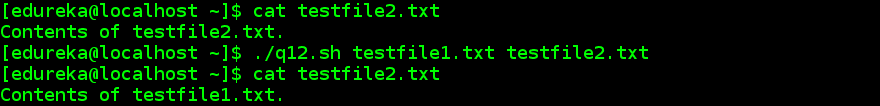**

*问题 12——Shell 脚本面试问题——爱德华卡*

### **Q13。如何计算传递的参数个数？**

【T2`#!/bin/sh`*`echo "Number of Parameters passed:$#"`*

## ****

*问题 13——Shell 脚本面试问题——爱德华卡*

### **Q14。如何在脚本中获取脚本名？**

`*!/bin/sh*`

## **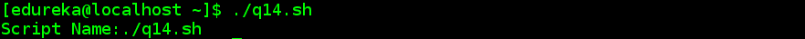**

*问题 14——Shell 脚本面试问题——edu reka*

### **Q15。如何检查前面的命令是否运行成功？**

`*#!/bin/sh*``*var=$?*``*if var=0*``*then*`

`*else*``*echo "Script was unsuccessful"*`

## **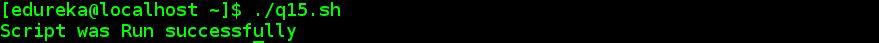**

*问题 15——Shell 脚本面试问题——爱德华卡*

### **Q16。如何仅使用终端获取文件的最后一行？**

`*tail -1 <filename>*`

### **Q17。如何仅使用终端** **从文件** **中获取第一行？**

`*head -1 <filename>*`

### **Q18。如何从文件中获取每行的第 3 个元素/列？**

【T2`#!/bin/sh`*`awk '{print $3}' $1`*

## **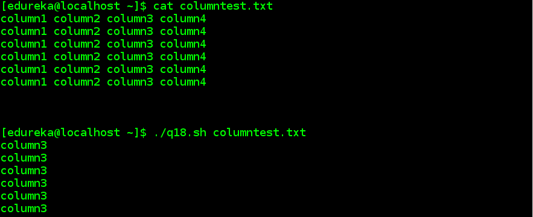**

*问题 18——Shell 脚本面试问题——edu reka*

### **Q19。如何写一个函数？**

`*#!/bin/sh*`

`*function example {*``*echo "Hello Learner"*`

### **Q20。写下 Shell 脚本中所有循环的语法。**

**为循环:**

```
*for var in word1 word2 ... wordN
do
   Statement(s) to be executed for every word.
done*
```

```
 **而循环:** 

```
*while command
do
   Statement(s) to be executed if command is true
done* 
```

 **直到循环:** 

```
*until command
do
   Statement(s) to be executed until command is true
done*
```

 **中级面试问题** ** Q21。是什么让 C shell 比 Bourne Shell 更受欢迎？**在下列情况下，C 是更可取的选择: *   所有的命令都可以简单地使用 C shell 作为别名，而在 Bourne Shell 中这是不可能的。 *   冗长的命令可以在 C shell 中反复使用，而 Bourne 不允许在所有情况下都使用。 *   命令历史可以通过 C shell 访问，但不能通过 Bourne 访问。 ** Q22。如何比较 Shell 脚本中的字符串？****测试命令**用于比较文本字符串。test 命令通过比较每个字符串中的每个字符来比较文本字符串。 ** Q23。如何将标准输出和标准错误重定向到同一个位置？**将标准输出和标准误差重定向到相同位置的两种方法如下: *   **2>&1**(# ls/usr/share/doc>out . txt 2>&1) *   **&>****(# ls/usr/share/doc&>out . txt)** ** Q24。区分“和”引号。** *   **单引号:**用于不需要对变量赋值的情况。 *   **双引号:**用于需要对变量赋值的情况。 ** Q25。什么时候不应该使用 shell 编程/脚本？**在下列情况下，不建议使用 Shell 脚本； *   当任务非常复杂时，例如编写整个工资处理系统。 *   需要高生产率的地方。 *   当需要或涉及不同的软件工具时。 ** Q26。shell 脚本中变量的寿命是多少？** shell 脚本中一个变量的寿命只有到执行的**结束。** ** Q27。什么是文件系统？****文件系统**是包含文件相关信息的文件集合。 ** Q28。文件创建时的默认权限是什么？** 在 Linux 和其他类似 Unix 的操作系统上，新文件是用一组默认的权限创建的。**umask**或用户屏蔽命令用于确定新创建文件的默认权限。它是一个 4 位数的八进制数，使用符号值来设置和表示。文件创建时的默认权限是 **664** ，即 **rw-rw-r-** 。文件权限表如下所示；
| **0** | **0** |  **没有权限**  |
|  **1**  |  **1**  |  **执行**  |
|  **2**  |  **2**  |  **写**  |
|  **3**  |  **1+2**  |  **执行+写入**  |
|  **4**  |  **4**  |  **读作**  |
|  **5**  |  **1+4**  |  **执行+读取**  |
|  **6**  |  **2+4**  |  **写+读**  |
|  **7**  |  **1+2+4**  |  **执行+写入+读取**  | ** Q29。#是什么意思！/bin/**sh或者#！每个脚本的开头都有/bin/bash？ 一个**脚本**可以指定 **#！/bin** / **bash** 在第一行，这意味着脚本应该总是用 **bash** 运行，而不是另一个 shell。/ ** bin ** / ** sh 是**代表系统外壳的可执行文件。实际上，它通常被实现为一个符号链接，指向作为系统外壳的任何外壳的可执行文件。 ** Q30。$*和$@有什么区别？** $@将每个带引号的参数视为单独的参数，但$*会将整组位置参数视为单个字符串。 ** Q31。确定以下命令的输出:**name = Shubham&echo '我的名字是$name '。**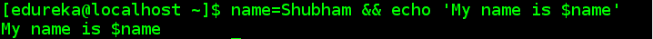** * 问题 31——Shell 脚本面试问题——爱德华卡 *  ** Q32。确定以下命令的输出:**【z】&&echo 0 | | echo 1**** * 问题 32——Shell 脚本面试问题——edu reka* ** Q33。确定以下命令的输出:**echo $ { new:--variable }*q33——Shell 脚本面试问题——爱德华卡*  ** Q34。如何只用 echo 命令获取字符串变量的一部分？**`*#!/bin/sh*`  `*echo ${variable:x:y}*`  `*#x - start position*` `*variable="My name is Upasana, and I work at Edureka."*`**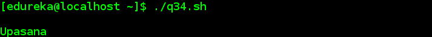***q34——Shell 脚本面试问题——爱德华卡*  ** Q35。重写命令以打印句子并将变量转换为复数:** echo“我喜欢$variable”。**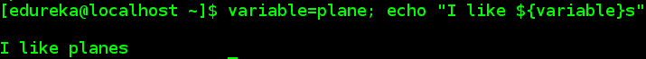***q35——Shell 脚本面试问题——爱德华卡*  ** Q36。如何打印提供给脚本的所有参数？**

```
*#!/bin/bash*  *for i; do*  *echo $i*  *done

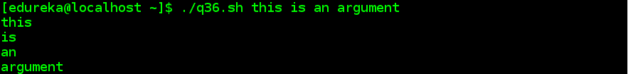*
```

q36–Shell 脚本面试问题–edu reka ** Q37。如何打印当前 shell 的 PID？**`*#!/bin/sh*``*for PID in $$*`  `*do*`  `*echo $PID*` **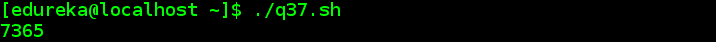***q37——Shell 脚本面试问题——爱德华卡*  ** Q38。如何打印所有数组元素及其各自的索引？**`*!/bin/sh*`  `*array=("This" "is" "Shell" "Scripting")*`  `*echo ${array[@]}*` **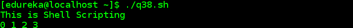***q38——Shell 脚本面试问题——爱德华卡*  ** Q39。如何打印第一个数组元素？**`*#!/bin/sh*``*array=("This" "is" "Shell" "Scripting" )*`*****q39——Shell 脚本面试问题——爱德华卡*  ** Q40。什么是 Crontab？【T2** **Crontab** 代表 *cron 表*，因为它使用作业调度器 *cron* 来执行任务。crontab 是您希望定期运行的命令列表，也是用于管理该列表的命令的名称。该时间表被称为 *crontab* ，这也是用于编辑该时间表的程序的名称。 **有经验者的面试问题**  ** Q41。crontab 文件中有多少个字段，每个字段指定什么？**crontab 文件有六个字段。**前五个字段**包含关于*何时执行命令*的信息，它们如下: *   分钟(0-59)  *   小时(0-23)  *   日(1-31)  *   月(1-12)  *   星期几(0-6，星期日= 0)。**第六个字段**包含要执行的*命令*。 ** Q42。crontab 命令的两个文件是什么？**crontab 命令的两个文件是: *   ** cron.allow ** 决定用户使用 **crontab 命令**需要*许可*。 *   ** cron.deny ** 决定需要*阻止*用户使用 **crontab 命令**。 ** Q43。需要使用什么命令进行备份？****tar**命令用于进行备份。它代表**磁带存档**。命令主要用于在磁带等存档介质中保存和恢复文件。 ** Q44。有哪些不同的命令可用于检查磁盘使用情况？**有三种不同的命令可用于检查磁盘使用情况。 *   **df:** 用于检查空闲磁盘空间。 *   **杜:**用于检查目录 wise 磁盘使用情况。 *   **dfspace:** 用于检查可用磁盘空间，以 MB 为单位。 ** Q45。Shell 中有哪些不同的通信命令？**Shell 中有四种不同的通信命令。 *   **邮件**  *   **新闻**  *   **墙**  *   ** motd ** edu reka 使用的总磁盘空间如下图所示。*T2`du –s/home/Edureka`* ** Q47。如何调试 shell 脚本/程序中遇到的问题？**下面给出了一些用于调试脚本中问题的常用方法。 *   可以在 shell 脚本中插入调试语句，以输出/显示有助于识别问题的信息。 *   使用 *set -x* 我们可以在脚本中启用调试。 ** Q48。=和==有什么区别？** *   **=** 这用于**给变量赋值**。 *   **==** 这是用于**字符串比较的**。 ** Q49。如何在 Shell 中打开只读文件？**可以使用下面的命令打开一个只读文件:*T2`vi –R <File Name>`* ** Q50。如果不在 shell 脚本中解压缩，如何读取 jar 中文件的内容？**jar 中的文件内容无需解压即可读取，如下所示。`tar –tvf <File Name>.tar` ** Q51。编写一个 shell 脚本来获取当前日期、时间、用户名和当前工作目录。**`*#!/bin/sh*``*echo "Hello, $LOGNAME"*``*echo "Today's date is `date`"*``*echo "Username is `who i am`"*`**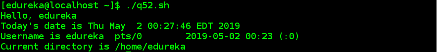***q51——Shell 脚本面试问题——爱德华卡*  ** Q52。如何找到不到 3 天内修改的所有文件，并将记录保存在文本文件中？***T2`find . -type f -mtime -3 -exec ls -l {} ; > last3days.txt`* ** Q53。编写一个 Shell 脚本，如果作为命令行参数提供，它会将两个数字相加，如果没有输入这两个数字，它会抛出一条错误消息。**`*#!/bin/sh*``*if [ $# -ne 2 ]*``*then*``*echo "Usage - $0 x y"*``*echo " Where x and y are two nos for which I will print sum"*``*exit 1*``*fi*``*# print on standard output, how-to use the script (Usage - ./1.sh x y )*``*echo " Where x and y are two nos for which I will print sum"*``*exit 1*``*fi*``*echo "Sum of $1 and $2 is `expr $1 + $2`"*` ** 情况 1:参数未通过时 ** *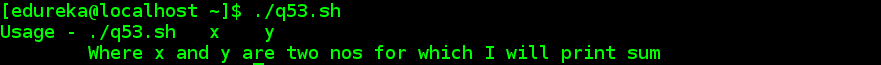q 52.1——Shell 脚本面试问题——爱德华卡*  **情况二:参数正确传递时** *q 52.2——Shell 脚本面试问题——爱德华卡*  ** Q54。使用 Shell 脚本以相反的顺序打印一个给定的数字，以便仅使用命令行参数提供输入。**`*#!/bin/sh*``*if [ $# -ne 1 ]*``*then*``*echo "Usage: $0 number"*``*echo " Reverse of the given number will be printed"*``*echo " For eg. $0 0123, 3210 will be printed"*``*exit 1*``*fi*``*n=$1*``*rev=0*``*while [ $n -gt 0 ]*``*do*``*sd=`expr $n % 10`*``*rev=`expr $rev * 10 + $sd`*``*n=`expr $n / 10`*` ** 情况 1:参数未通过时 ** *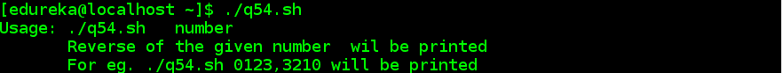q 54.1——Shell 脚本面试问题——爱德华卡*  **情况二:参数正确传递时** *q 54.2——Shell 脚本面试问题——爱德华卡*  ** Q55。直接从终端计算实数，而不是任何 shell 脚本。****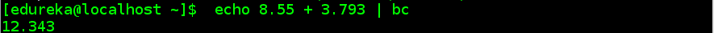***q55——Shell 脚本面试问题——爱德华卡*  ** Q56。你如何得到圆周率的值，直到小数点后 100 位？****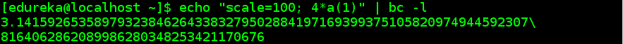***q56——Shell 脚本面试问题——爱德华卡*  ** Q57。如何找到特定用户使用的总磁盘空间？***`du -sh ~`***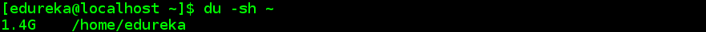***q57——Shell 脚本面试问题——爱德华卡*  ** Q58。**   **如何检查一个目录是否存在？** `*#!/bin/sh*``*if [ -d $mydir ]*`  `*then*`  `*echo "Directory exists"*` *q58——Shell 脚本面试问题——爱德华卡*  ** Q59。**   **能不能写个剧本来描绘一下 set-x 是如何运作的？** `*#!/bin/sh*``*#set -x*``*i=1*``*while [ $i -lt 6 ]*``*do*``*print "in loop iteration: $i"*``*((i+=1))*``*done*``*exit*``**` *q 59.1——Shell 脚本面试问题——爱德华卡* `*#!/bin/sh*``*set -x*``*i=1*``*while [ $i -lt 6 ]*``*do*``*print "in loop iteration: $i"*``*((i+=1))*``*done*``*exit*`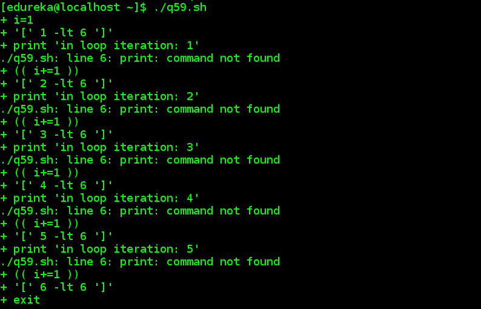*q 59.2——Shell 脚本面试问题——爱德华卡*  ** Q60。**假设您使用 exec 执行一个命令，那么您当前在 shell 中的进程将处于什么状态？** ** 当 exec 被执行时，所有新的分叉进程都被覆盖。该命令只是被执行，而不会对当前进程产生任何影响。此外，在这种情况下，不会创建新的流程。 *这些都是我们能想到的关于 [Linux](https://www.edureka.co/linux-admin) 中 Shell 脚本的各个方面的问题，这些问题会在尽可能短的时间内覆盖你参加的任何面试。* *如果你在面试中遇到有趣的问题，请直接在评论栏提问，我们将为你解答。您也可以参考这段视频，它详细解释了这些问题的解决方案。*     

```