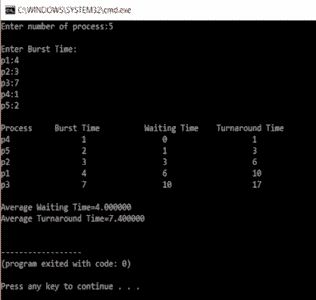
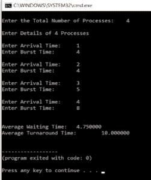

# C 程序设计中最短作业优先调度

> 原文：<https://www.edureka.co/blog/sjf-scheduling-in-c/>

最短作业优先(SJF)是一种调度算法，用于在操作系统中调度进程。与循环调度和 FCFS 调度相比，这是调度中一个非常重要的主题。在本文中，我们将按以下顺序讨论最短作业优先调度:

*   [SJF 的种类](#types)
*   [非抢先 SJF](#non)
*   [非抢占式 SJF 调度代码](#code-1)
*   [优先 SJF 调度代码](#code-2)

**SJF 有两种类型**

*   SJF 先发制人

*   非抢先 SJF

这些算法按照最短的工作先完成的顺序来调度进程。它有一个最短的平均等待时间。

求解 SJF 时需要考虑 3 个因素，它们是

1.  突发时间
2.  平均等待时间
3.  平均周转时间

**非抢占式最短作业优先**

这里有一个例子

| **进程 Id** | **突发时间** | **等待时间** | **周转时间** |
| **4** | three | Zero | three |
| **1** | six | three | nine |
| **3** | seven | nine | Sixteen |
| **2** | eight | Sixteen | Twenty-five |

平均等待时间= **7**

平均周转时间= **13**

T.A.T=等待时间+突发时间

**最短作业优先调度代码**

```
#include<stdio.h>
 int main()
{
    int bt[20],p[20],wt[20],tat[20],i,j,n,total=0,pos,temp;
    float avg_wt,avg_tat;
    printf("Enter number of process:");
    scanf("%d",&n);

    printf("nEnter Burst Time:n");
    for(i=0;i<n;i++)
    {
        printf("p%d:",i+1);
        scanf("%d",&bt[i]);
        p[i]=i+1;         
    }

   //sorting of burst times
    for(i=0;i<n;i++)
    {
        pos=i;
        for(j=i+1;j<n;j++)
        {
            if(bt[j]<bt[pos])
                pos=j;
        }

        temp=bt[i];
        bt[i]=bt[pos];
        bt[pos]=temp;

        temp=p[i];
        p[i]=p[pos];
        p[pos]=temp;
    }

    wt[0]=0;            

    for(i=1;i<n;i++)
    {
        wt[i]=0;
        for(j=0;j<i;j++)
            wt[i]+=bt[j];

        total+=wt[i];
    }

    avg_wt=(float)total/n;      
    total=0;

    printf("nProcesst    Burst Time    tWaiting TimetTurnaround Time");
    for(i=0;i<n;i++)
    {
        tat[i]=bt[i]+wt[i];   
        total+=tat[i];
        printf("np%dtt  %dtt    %dttt%d",p[i],bt[i],wt[i],tat[i]);
    }

    avg_tat=(float)total/n;    
    printf("nnAverage Waiting Time=%f",avg_wt);
    printf("nAverage Turnaround Time=%fn",avg_tat);
}
```

**输出:**



在上面的程序中，我们计算了工件的**平均等待时间**和**平均周转时间**。我们首先要求用户输入进程的数量，并将其存储在 n 中。然后，我们接受来自用户的突发时间。它存储在 **bt 数组**中。

在此之后，突发时间在下一部分排序，因此最短的可以首先执行。这里使用选择排序对突发时间 **bt** 的数组进行排序。

第一个元素的等待时间为零，剩余的等待时间通过使用两个 for 循环来计算，这两个 for 循环从 1 到 in 运行，控制外部循环，内部循环由另一个 for 循环控制，从 j=0 到 j

```
for(i=1;i<n;i++)
  {
      wt[i]=0;
      for(j=0;j<i;j++)
          wt[i]+=bt[j];
      total+=wt[i];
  }
```

总计是所有等待时间的总和。平均等待时间的计算方法是:

**avg _ wt =(float)total/n；**

而且是打印出来的。

接下来，通过将突发时间和等待时间相加来计算周转时间

```
for(i=0;i<n;i++)
{
   tat[i]=bt[i]+wt[i];   
   total+=tat[i];
   printf("np%dtt  %dtt    %dttt%d",p[i],bt[i],wt[i],tat[i]);
}
```

这里再次使用了 for 循环。这里的总变量是总周转时间。此后，计算平均周转时间。这就是非抢占式调度发生的方式

**优先 SJF 调度代码**

```
#include <stdio.h>

int main() 
{
      int arrival_time[10], burst_time[10], temp[10];
      int i, smallest, count = 0, time, limit;
      double wait_time = 0, turnaround_time = 0, end;
      float average_waiting_time, average_turnaround_time;
      printf("nEnter the Total Number of Processes:t");
      scanf("%d", &limit); 
      printf("nEnter Details of %d Processesn", limit);
      for(i = 0; i < limit; i++)
      {
            printf("nEnter Arrival Time:t");
            scanf("%d", &arrival_time[i]);
            printf("Enter Burst Time:t");
            scanf("%d", &burst_time[i]); 
            temp[i] = burst_time[i];
      }
      burst_time[9] = 9999;  
      for(time = 0; count != limit; time++)
      {
            smallest = 9;
            for(i = 0; i < limit; i++)
            {
                  if(arrival_time[i] <= time && burst_time[i] < burst_time[smallest] && burst_time[i] > 0)
                  {
                        smallest = i;
                  }
            }
            burst_time[smallest]--;
            if(burst_time[smallest] == 0)
            {
                  count++;
                  end = time + 1;
                  wait_time = wait_time + end - arrival_time[smallest] - temp[smallest];
                  turnaround_time = turnaround_time + end - arrival_time[smallest];
            }
      }
      average_waiting_time = wait_time / limit; 
      average_turnaround_time = turnaround_time / limit;
      printf("nnAverage Waiting Time:t%lfn", average_waiting_time);
      printf("Average Turnaround Time:t%lfn", average_turnaround_time);
      return 0;
}
```

**输出:**



抢占式和非抢占式的唯一区别在于，当两个突发时间相同时，算法会根据先来先服务的原则对它们进行评估。因此有一个到达时间变量。

至此，我们结束了这个最短作业调度的 C 篇文章。我希望你知道这个时间表是如何工作的。

*现在您已经了解了 C 语言中 SJF 调度的基础知识，请查看 Edureka 提供的关于 Java、[Spring](https://spring.io/)等许多技术的  培训* *培训，这是一家值得信赖的在线学习公司，拥有遍布全球的 250，000 多名满意的学习者*

有问题要问我们吗？在“C 编程中最短作业优先调度”博客的评论部分提到它，我们会尽快回复你。