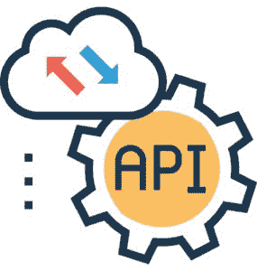

# 成为云工程师应该学习的技能

> 原文：<https://www.edureka.co/blog/skills-you-should-learn-to-become-a-cloud-engineer/>

云计算**的流行度**一飞冲天。预测者也对它竖起了大拇指，暗示云计算将会继续存在。难怪我们看到越来越多的人希望在这个领域有所作为。如果你也有类似的愿望，那么我相信你一定有这样的问题:要成为一名 **[云工程师](https://www.edureka.co/blog/cloud-engineer-roles-and-responsibilities/)** ，你应该学习哪些技能？这篇文章将帮助你回答这些问题。

## **成为云工程师应该学会的技能**

作为一名云工程师，你将与软件、运营和架构混合的跨职能团队一起工作。这意味着当谈到学习这些技能时，你的包里会有相当多的选项可供选择。下面是一些必须具备的**云工程师技能:**

## **1。云服务提供商**

如果你要开始使用云计算，你必须了解不同的云服务提供商是如何工作的。这些云服务提供商提供端到端的服务，如**计算、存储、数据库、ML、迁移、**这就是为什么几乎所有与云计算相关的东西都由他们提供，使之成为一项重要的云工程师技能。

重要的是你至少要从众多可用的选项中选择一个。 [**AWS**](https://www.edureka.co/blog/amazon-aws-tutorial/) 和 **[Azure](https://www.edureka.co/blog/microsoft-azure-tutorial)** 是市场领导者，在云市场上并驾齐驱。AWS 拥有占据市场首位的经验，并以其利基而闻名。Azure 是微软的一个产品，使得它更容易与几乎所有的微软产品进行集成。 **[、GCP](https://www.edureka.co/blog/google-cloud-platform-tutorial/)** 、Openstack 分别扼住了大数据和软件开发市场。根据业务需要，您可能需要选择一个或多个。

这些服务提供商都有自己的免费使用等级，足以让您入门并有足够的实践机会。你甚至可以通过 [天蓝球场](https://www.edureka.co/masters-program/azure-cloud-engineer-certification-training) 查看天蓝的详细情况。

**了解我们在顶级城市/国家的谷歌云培训**

| **印度** | **美国** | **其他城市/国家** |
| [班加罗尔](https://www.edureka.co/google-cloud-architect-certification-training-bangalore) | [纽约](https://www.edureka.co/google-cloud-architect-certification-training-new-york-city) | [英国](https://www.edureka.co/google-cloud-architect-certification-training-uk) |
| [海德拉巴](https://www.edureka.co/google-cloud-architect-certification-training-hyderabad) | [芝加哥](https://www.edureka.co/google-cloud-architect-certification-training-chicago) | 伦敦 |
| [浦那](https://www.edureka.co/google-cloud-architect-certification-training-pune) | 达拉斯 | [加拿大](https://www.edureka.co/google-cloud-architect-certification-training-canada) |
| [钦奈](https://www.edureka.co/google-cloud-architect-certification-training-chennai) | [休斯顿](https://www.edureka.co/google-cloud-architect-certification-training-houston) | [澳大利亚](https://www.edureka.co/google-cloud-architect-certification-training-australia) |

## **2。储存**

云存储可以定义为“**在云上在线存储数据**”，这样公司的数据就可以从多个分布的、相互连接的资源中存储和访问。

云存储的一些**优势**有:

*   更好的可访问性
*   可靠性
*   快速部署
*   强保护
*   数据备份和存档
*   灾难恢复
*   成本优化

根据组织的需求，可以从以下存储类型中进行选择:

*   个人云存储
*   公共云存储
*   私有云存储
*   混合云存储

数据是云计算的核心。了解在哪里储存以及如何储存是很重要的。这是因为实现上述目标所采取的措施可能会因组织想要存储和使用的数据类型和数量而异。因此，理解和学习云存储是如何工作的，将是一个好主意，使其成为一项重要的云工程师技能。

云服务提供商也使用各种流行的存储服务。举几个受欢迎的例子，我们有、AWS 中的冰川、[**blob&Queues**](https://www.edureka.co/blog/azure-storage-tutorial/)、Data Lakes、in Azure。

## **3。联网**

联网与云计算相关，因为客户端通过云共享集中式计算资源。 它刺激了**将更多的网络管理功能**推向云端的趋势，因此需要更少的客户设备来管理网络。

改进的互联网接入和可靠的广域网带宽使得将更多网络管理功能推送到云中变得更加容易。 这反过来刺激了对云网络的需求，因为客户在寻找更简单的方式来使用基于云的服务建立和访问网络。

云工程师还可能负责设计方法，通过建立自动调整程序来确保网络响应用户需求。因此，了解网络基础知识和 **[虚拟网络](https://www.edureka.co/blog/azure-virtual-network-tutorial/)** 是非常重要的云工程师技能，因为它们是云网络的核心。

## **4。虚拟化**

虚拟化软件允许许多用户通过在同一硬件上并排运行多个**虚拟机**，模拟他们 IT 系统的不同组件，来减少他们的硬件资产，或者更高效地使用它们。

虚拟化在为组织提供可扩展的容错资源方面发挥着非常重要的作用。因此，虚拟化或服务方面的工作经验或知识，如虚拟机、**[【EC2】](https://www.edureka.co/blog/ec2-aws-tutorial-elastic-compute-cloud/)**、 **[Lambda](https://www.edureka.co/blog/introduction-to-lambda-architecture/)** 将是迈向 **[无服务器计算的一大步。](https://www.edureka.co/blog/aws-lambda-tutorial)** 因此成为顶尖的云工程师技能。

## **5。Linux**

Linux 带来了开源、易于定制、安全等特性，使其成为程序员的天堂。云提供商意识到了这一事实，因此我们看到了 linux 在不同云平台上的采用。

如果我们考虑到仅支持 Azure 的服务器数量，你会注意到大约 30%的服务器是基于 Linux 的。因此，如果你是一名专业人员，拥有在云环境中设计、构建、管理和维护 **[Linux](https://www.edureka.co/blog/duties-of-a-linux-administrator/)** 服务器的技能，那么仅凭这一项云工程师技能，你就可以在云领域生存和发展。

获得行业级项目认证&快速跟踪你的职业 [<button>看看吧！</button>](https://www.edureka.co/masters-program/cloud-architect-training)

## **6。安全和灾难恢复**

云安全旨在保护云计算中涉及的数据、应用和基础设施。这与本地架构的安全性没有太大区别。但事实上，一切都在向云迁移，掌握这一点很重要。

对于任何计算环境，云安全都涉及维护足够的预防措施，例如:

*   知道数据和系统是安全的。
*   跟踪当前的安全状态。
*   追踪和应对突发事件

如果你对运营感兴趣，那么让我告诉你安全和灾难恢复的相关概念将对你作为 **[云工程师](https://www.edureka.co/blog/cloud-engineer)** 或云管理员有极大的帮助。这些是在云中操作软件的核心方法，也是能让你获得一份利润丰厚的工作的云工程师技能。

## **7。Web 服务和 API**

  底层基础对任何建筑来说都是非常重要的。云架构在很大程度上基于**[API](https://www.edureka.co/blog/how-to-write-restful-web-services-with-jax-ws/)**和 **[ Web 服务](https://www.edureka.co/blog/web-services-the-real-deal/)** ，因为 Web 服务为开发者提供了通过互联网集成 Web 应用的方法。 **XML** ， **SOAP** ， ** WSDL ** 和 UDDI 开放标准用于标记数据，传输数据，描述和列出可用的服务。另外，您需要 API 来完成所需的集成。

因此，拥有网站工作经验和相关知识将有助于你在开发云架构方面有一个强大的核心。查看我们的[谷歌云认证](https://www.edureka.co/google-cloud-architect-certification-training)项目，该项目包含讲师指导的现场培训和真实项目体验。

## **8。DevOps**

如果你是一名软件开发人员或运营工程师，那么你对这些人在不同环境中工作时经常遇到的问题并不陌生。 DevOps 将**的开发和运营方法放在一个模子里**从而减轻了他们的工作依赖，填补了两个团队之间的空白。

这个云工程师技能在这个列表上看起来有点不合适。但是这种发展方式确实让人们感受到了它的存在。DevOps 与大多数云服务提供商合作得非常好，特别是 AWS，这使得 **[AWS DevOps](https://www.edureka.co/blog/aws-devops-a-new-approach-to-software-deployment/)** 成为一项很好的技能。

## **9。集装箱T3**

容器提供了一种逻辑打包机制，其中**应用程序可以从它们实际运行的环境**中抽象出来。这种**解耦**允许基于容器的应用程序被轻松且一致地部署，无论目标环境是私有数据中心、公共云，甚至是开发人员的个人笔记本电脑。因此，了解像 **[ Kubernetes 和 Docker ](https://www.edureka.co/blog/kubernetes-vs-docker/)** work 这样的流行容器是如何给你的简历增加额外的内容的，不仅仅是对于云领域，而是对于一般的软件领域。

## **10。编程技巧**

谈到云工程师技能，你不能忽视开发人员在计算中的重要性。开发人员拥有快速构建、部署和管理应用程序的能力。云计算使用这个特性来增强可伸缩性。因此，学习适当的编程语言或框架将会大有裨益。下面是一些流行语言和框架的列表:

*   SQL:对数据操作和处理非常重要
*   Python:让你轻松创建、分析和组织大块数据
*   XML 与 Java 编程:数据描述
*   。net:必须有专门为 Azure 开发者设计的框架

积累这些编程技能，你将成为一名不可或缺的云工程师。

如果你想知道云工程师的角色和职责是什么，这篇文章一定会有帮助: **[云工程师的角色和职责](https://www.edureka.co/blog/cloud-engineer-roles-and-responsibilities/)**

获得行业级项目认证&快速跟踪你的职业 [<button>看看吧！</button>](https://www.edureka.co/masters-program/cloud-architect-training)

在这篇关于“成为云工程师应该学会的技能”的文章即将结束之际，it 界的朋友们来了。 如果您希望掌握云计算并在这一领域建立自己的事业，那么请查看我们的 [**云大师认证计划**](https://www.edureka.co/masters-program/cloud-architect-training) ，该计划带有讲师指导的现场培训和真实项目经验。本培训将帮助您深入了解云计算，并帮助您掌握成功的云计算职业生涯所必需的各种概念。

*有问题吗？请在评论区提出来，我们会尽快回复您，或者今天就参加我们在沙特的 [GCP 培训。](https://www.edureka.co/google-cloud-architect-certification-training-saudi-arabia)*