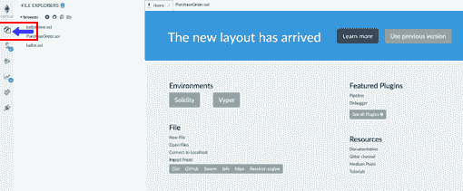
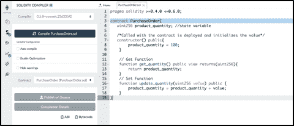
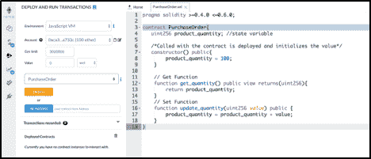
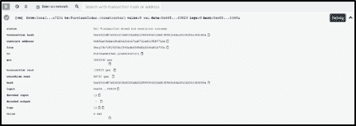
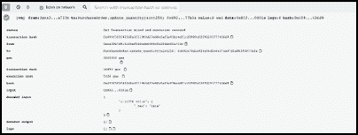

# 如何写你的第一份智能合同？

> 原文：<https://www.edureka.co/blog/smart-contract-development/>

在[之前的博客](https://www.edureka.co/blog/building-smart-contract-development-environment/)中，你已经了解了什么是智能合同，不同的智能合同语言以及如何建立智能合同开发环境。在本文中，您将学习如何构建您的第一个智能合同。我将使用 Remix IDE 开发和测试智能合同。

本智能合同开发教程涵盖以下主题:

*   [结论](#conclusion)

## **构建您的智能合同**

作为本博客系列的一部分，我们将开发一个简单的采购订单智能合同。随着本系列的进展以及 solidity 编程语言新概念的引入，采购订单智能合同将会发展和改进。

## **智能合约的结构**

Solidity smart contract 本质上是以下内容的集合

*   **数据**——维护合同的当前状态
*   **函数**–应用逻辑转换合同状态

Solidity 智能合约遵循标准结构。任何智能合约都以下面的语句开始

### **杂注指令**

关键字“pragma”可用于启用某些编译器特性或检查。下面的语句定义了源文件(智能合约)不能用 0.4.0 之前的编译器和 0.6.0 之后的编译器版本进行编译。该声明确保在引入新的编译器版本时不会引入意外的行为。

```
pragma solidity >=0.4.0 <=0.6.0

```

### **合同声明**

使用关键字“合同”声明合同。这声明了一个名为“PurchaseOrder”的空协定。

```
contract PurchaseOrder{
 }
```

## **将相关数据存储到合同中**

每个合同或一般来说每个程序都可能需要存储一些数据。向程序添加数据为它提供了一定程度的灵活性。从程序中的硬编码值转移到用户提供的值是一个重要的特性。变量允许您存储数据、标记数据、检索数据和操作数据。

## **智能合同开发:引入变量**

在固体中，变量有两种类型

1.  **值类型:**这些类型的变量是通过值传递的，也就是说，当它们被用作函数参数或用于赋值时，它们总是被复制。例如:整数、布尔地址等。
2.  **引用类型:**这些类型变量类型复杂，通过引用传递，这些变量不适合 256 位，必须小心管理，因为复制它们的开销很大。

## **向智能合约添加数据**

让我们给合同增加一些数据变量。对于每个采购订单，都必须有一定数量的产品与之相关联。让我们添加一个数据类型为整数或数字的变量 product_quantity。

我们现在引入的变量是一个无符号整数，用 uint256 表示，这里的 256 表示 256 位存储。

*   U-[无符号](https://en.wikipedia.org/wiki/Signedness) (意思是这种类型只能表示正整数，不能表示正负整数)
*   INT–整数
*   256–256 位大小
*   uint 256 可以分配的最小值为 0
*   uint 256 可以分配的最大值是 2^256-1【一个非常大的数】

产品数量只是一个正值，目前的假设是我们将迎合一个非常大的产品数量值。

声明的“product_quantity”变量是契约状态的一部分，因此被持久化或存储在契约空间中。目前，该变量的默认值为 0。

```
contract PurchaseOrder{
   uint256 product_quantity;
}

```

## **定义构造函数**

在部署契约时调用构造函数。构造函数用一些值初始化协定。在当前场景中，当部署合同时，产品数量设置为 100。也可以通过传递一个变量并使用传入的值初始化 product_quantity 来创建参数化的构造函数。

这里需要注意的关键点是与构造函数相关的访问修饰符“public”。Public 关键字指定任何人都可以访问这个函数，这不是一个受限制的函数。

```
constructor() public{
   product_quantity = 100;
} 
```

## **添加功能**

现在让我们添加一些功能来使我们的程序具有交互性。功能是可以添加到程序中的受控能力。任何函数前面都有关键字 function。总体来说这就是函数声明的样子**函数<函数名> <访问修改后的> <状态赋值器> <返回值>** 。

### 获取功能

对于任何程序来说，最常见的需求之一是读取存储值。在下面的合同中，我们将需要读取“product_quantity”值。为了提供这种能力，添加了 read 函数或 get 函数。在这个函数中，我们不对存储值进行任何操作，我们只是检索存储值。

现在让我们来分解我们的 get 函数(get_quantity)

| **号** | **关键词** | **值** |
| **1** | <功能名称> | get_quantity() 【无参数传递】 |
| **2** | <访问修饰符> | 公共{任何人都可以访问该功能} |
| **3** | <状态-变异子> | 查看{表示该功能只读取合同状态，不改变合同状态，因此查看} |
| **4** | <回报> | 返回 uint256 类型的变量{定义函数返回的内容} |

```
function get_quantity() public view returns(uint256){
   return product_quantity;
}

```

### **设定器功能**

读取数据是必要的，我们在上一节中已经完成了，但是大多数场景还需要写入/更新数据的能力。这种特定的功能是通过添加 setter 函数来提供的。该函数以输入参数的形式从用户处获取一个值。使用用户提供给函数的值，变量“产品数量”的值被写入/更新。

现在让我们分解我们的设定函数(更新 _ 数量)

增加更新产品数量值的功能

| **号** | **关键词** | **值** |
| **1** |  | update _ quantity(uint256 value){传递 uint 256 类型的参数值} |
| **2** | <访问修饰符> | 公共{任何人都可以访问该功能} |
| **3** | <状态-变异子> | 不需要，因为功能正在更新状态 |
| **4** | <回报> | 返回 uint256 类型的变量(定义函数返回的内容) |

```
function update_quantity(uint256 value) public {
        product_quantity = product_quantity + value;
}

```

将所有这些放在一起，这就是整个合同的样子。

```
pragma solidity >=0.4.0 <=0.6.0;

contract PurchaseOrder{
   uint256 product_quantity; //state variable

   /*Called with the contract is deployed and initializes the value*/
   constructor() public{
        product_quantity = 100;
    }

    // Get Function
    function get_quantity() public view returns(uint256){
        return product_quantity;
    }

    // Set Function
    function update_quantity(uint256 value) public {
        product_quantity = product_quantity + value;
    }
}

```

## **部署智能合约**

测试智能合同的时间到了。为了测试这个智能合约，我们将使用[Remix Online IDE](http://remix.ethereum.org/)。

Remix 是[以太坊智能合约](https://www.edureka.co/blog/ethereum-smart-contract-project)的在线游乐场。混音是完全基于浏览器的。Remix 为您提供了一个在线 IDE(集成开发环境)，您可以在其中编写您的智能合约。Remix 为你提供了一个在线可靠的编译能力。Remix IDE 中的智能合约可以使用特定的编译器版本无缝编译。

Remix 还提供了快速测试智能合约的能力。

Remix 提供了一个完整的工具集来开始智能合约的开发和智能合约的单元测试，而无需在本地机器上进行任何安装。这对于从可靠性开始非常有用，因为开发人员只需要专注于编写智能合同，而不是担心基础设施。

使用 Remix IDE，您只需要一个浏览器和一个互联网连接就可以开始智能合约开发。智能合同创意的快速开发、测试和验证。

Remix 最近升级了他们的 UI。



点击上图中突出显示的文件图标，文件浏览器将会打开。

1.  点击加号图标，可以创建一个新文件，将文件命名为 PurchaseOrder.sol
2.  这将创建一个名为 PurchaseOrder.sol 的空文件，单击并打开该文件。
3.  让我们将整个合同复制粘贴到采购订单中
4.  点击左侧菜单中的第二个图标，在文件图标的正下方，应该会出现 solidity 编译器选项。
5.  在编译器标签下，选择编译器版本。当前选择的版本是 0.5.8。
6.  选择编译器版本后，点击“编译 PurchaseOrder.sol”。这将编译智能合同。



7 .。智能合同编译成功后，单击“编译详细信息”按钮，应该会出现以下详细信息。编译后，提供两个关键信息

8.为了测试智能合约，需要部署智能合约。要部署智能合同，请单击左侧菜单中编译图标下方的下一个图标。将出现以下屏幕。为了测试智能合约，需要部署智能合约。要部署智能合同，请单击左侧菜单中编译图标下方的下一个图标。将出现以下屏幕。

### ****

### **部署选项**

部署屏幕提供了几个选项，让我们一个一个来看。

*   环境:这可以被认为是一个类似于选择从亚马逊、Flipkart、新蛋(所有这些都是在线零售商)购买笔记本电脑的选项，你可以根据自己的需求选择从哪里购买。类似地，在 Remix 的情况下，我们可以选择在哪里部署智能合约并测试智能合约。环境标签旁边的下拉菜单提供了三个选项
    *   JavaScript VM——本地以太坊单个节点在浏览器内存中启动，提供 5 个预先准备好的测试账户，可用于交易(部署、调用功能)
    *   注入的 Web3 提供–这依赖于元掩码。Metamask 就像一个经纪人或中间人，它允许 web 应用程序与智能合约进行交互。Metamask 提供了管理身份的功能，还可以对发送到以太网的交易进行签名。这个中间人或第 3 第 3方提供帮助你确定智能合约将被部署到的区块链网络。
    *   web 3 Provider–如果您正在运行本地以太坊节点，并且 RPC 端点可用，则可以使用此选项。智能合约将被部署到本地以太坊节点。
*   Accounts:该信息根据所选的环境进行填充。比如说。JavaScript VM 提供 5 个预先资助的测试账户。在 Web3 提供商和注入 Web3 的情况下，不提供预先资助的测试帐户。
*   气体限制:这定义了发起者愿意为任何交易花费的气体的最大数量。这是防止无限循环和在无限循环情况下耗尽账户所有资金的地方。
*   值:部署智能合约时可能需要发送的值。这是一个可选值。

为了部署合同，选择 JavaScript VM 选项，从帐户下拉列表中选择第一个帐户，注意帐户的余额(100 ether)。

确保出现的智能合同名称为 PurchaseOrder，单击 deploy。将要发生的关键行动

1.  账户余额从 100 以太变为 99.999999 以太，扣除的金额为部署智能合约的交易成本。
2.  在已部署的契约下，将出现一个新的智能契约磁贴，该磁贴还将提供新智能契约的地址，如下所示(0x 692 a70 D2 e 424 a 56 D2 c6c 27 aa 97 D1 a 86395877 B3 a)
3.  在控制台窗口中，将出现以下信息
    1.  交易散列–唯一标识合同部署
    2.  交易成本
    3.  合同地址

### 

### **与已部署的合同**交互

1.  在已部署的合同下，有以下两种交互方式:update_quantity 和 get_quantity。
2.  这两种交互方法都是在“采购订单”合同中定义的公共方法。
3.  更新数量“update_quantity”方法需要一个输入参数，因此需要输入框。
4.  Get quantity "get_quantity "方法检索 product_quantity 的值。
5.  让我们检查一下当 get_quantity 被调用时发生了什么，显示返回值 100，它是在构造函数中初始化的。这不会导致交易发生
6.  让我们调用 update_quantity 并提供 30 作为输入。这导致交易发生

简而言之，任何导致对合同状态的写操作(即改变合同变量)的操作都将导致一个事务。



任何只是读取合同状态的操作都不会导致交易。

## **智能合同开发结论**

有了这个，我们才刚刚创建了我们的第一个智能合同，仅仅触及了坚实的表面。我们刚刚看到了测试智能合约从部署智能合约到启动交易的整个过程。

在智能合同开发系列的下一篇博客中，我们将更深入地探讨可靠性基础，更深入地研究智能合同部署。

至此，我结束了这篇*智能合同*开发博客。我希望你喜欢阅读这个博客，并发现它的信息量。

*I 如果您希望学习智能合约，在区块链领域建立职业生涯，并获得以太坊编程方面的专业知识，请在这里注册在线直播 **[区块链培训](https://www.edureka.co/blockchain-training)** ，它将提供 24*7 支持，在整个学习期间为您提供指导。*

*有问题吗？请在“智能合同开发”的评论部分提到它，我们将在最早的街*回复您