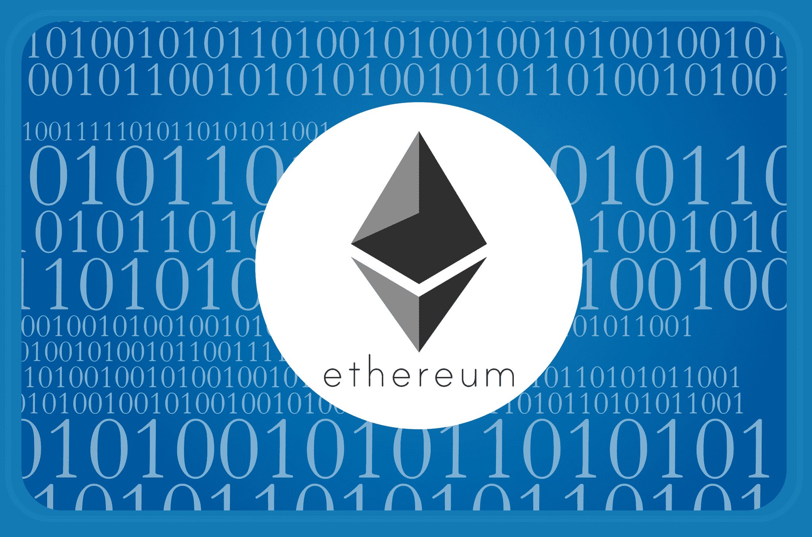
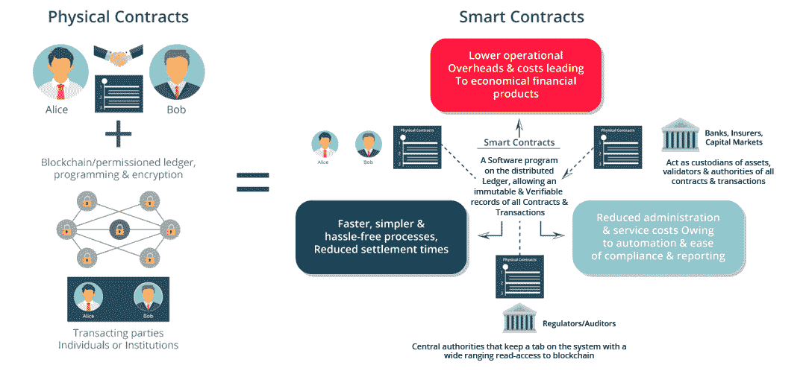
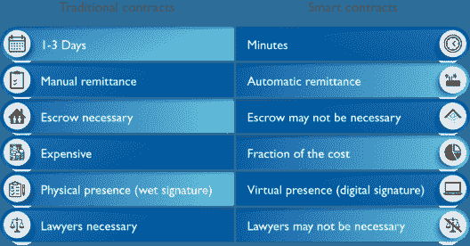
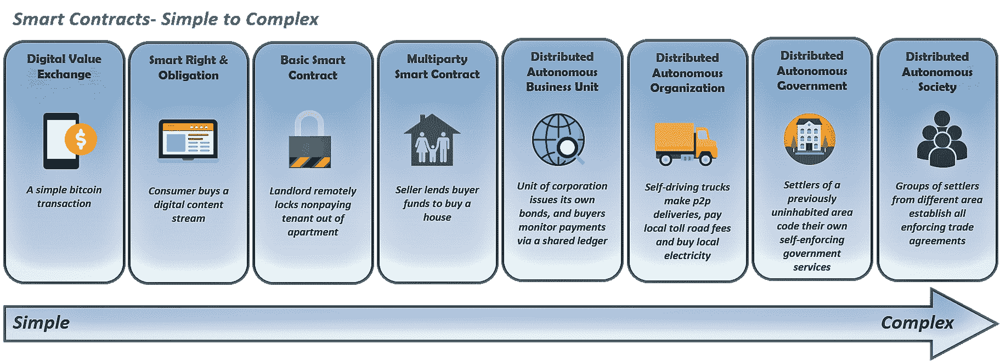
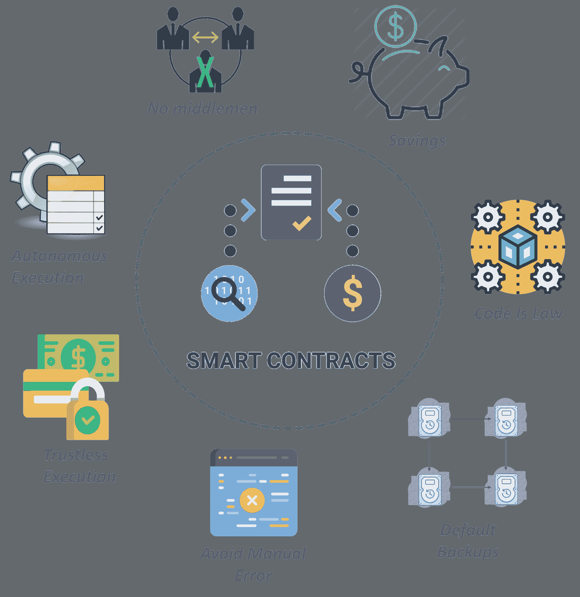
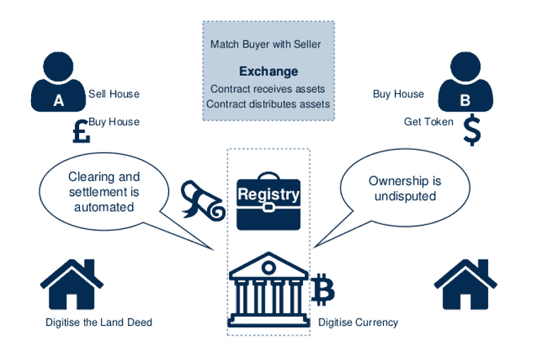

# 什么是智能合约？智能合约初学者指南

> 原文：<https://www.edureka.co/blog/smart-contracts/>

*“智能合约”* 的短语和概念是由 **Nick Szabo** 提出的 *，其愿景是将 POS(销售点)等电子交易方法的功能扩展到数字领域。* *智能合约帮助你以透明、无冲突的方式交换财产、股票或任何有价值的东西，同时避免中间人的服务。*T13T15

以下是我们将在智能合同博客中涉及的主题:

1.  1.  [什么是智能合约？](#whatcontracts)
    2.  [智能合约作者尼克·萨博](#NickSzabo)
    3.  [我们为什么需要智能合约？](#whysmartcontract)
    4.  [智能合同:根据用例的复杂性](#smartcomplexity)
    5.  [智能合约用例:医疗保健行业](#smartusecase)
    6.  [智能合约优势](#smartadvantage)
    7.  [撰写智能合约的区块链平台](#platformsmart)
    8.  [写作工具&部署智能合约](#toolsmart)
    9.  [编写以太坊的编程语言](#programsmart)
    10.  [产权转移智能合约](#propertysmart)

    ## **什么是智能合约？**

    智能合同是一种自我操作的计算机程序，在满足特定条件时自动执行。

    ***智能合约=不可信合约***

    有了智能合约，你可以在陌生人之间以无冲突透明的方式分享任何有价值的东西。

    你也可以把智能合约想象成基于区块链的自动售货机。就像自动售货机被配置成接受美元来分发你选择的商品一样，智能合同使用*乙醚*作为燃料，根据预先配置的规则来执行代码。

## **什么是智能合约|部署你的第一个以太坊智能合约| Edureka**

[//www.youtube.com/embed/hDcdUJHUfQU?rel=0&showinfo=0](//www.youtube.com/embed/hDcdUJHUfQU?rel=0&showinfo=0)

1.  ## **智能合约作者尼克·萨博** 

    在他的论文中，Szabo 建议执行一个合成资产的合同，比如衍生品和债券。“这些新证券是通过多种方式将证券(如债券)和衍生品(期权和期货)结合在一起形成的。他写道:“非常复杂的支付期限结构现在可以构建到标准化的合同中，并以低交易成本进行交易，这是因为对这些复杂期限结构的计算机化分析。

1.  ## **我们为什么需要智能合约？**

    我们可以通过在区块链上写合同来自动化许多解决方案，让事情变得简单高效。让我们比较和评估智能合同如何优于传统合同。

    ## 

    ## **智能合同:用例的复杂性**

    契约的复杂性取决于你在区块链上编写的用例。下图将让您更清楚地了解智能合约的复杂性。  

    *有了情境化的智能合约，不仅公司会实现自动化，还能形成一个去中心化的自治政府。*

    让我们借助用例来理解智能合同是如何工作的。

    ## **智能合约用例:医疗保健行业**

    **患者数据管理:**说到患者数据管理，医疗行业有两个主要问题:

    *   **首先是**，每位患者都是独一无二的，因此，为了适应治疗并提供个性化护理，访问完整的病历至关重要
    *   **其次**，在医疗界共享信息是一大挑战

    现在，上述问题可以通过区块链的智能合约功能得到解决。 

    ## **智能合约优势**

    以下是智能合约给你的: 

    ## **撰写智能合约的区块链平台**

    虽然 ***[以太坊](https://www.edureka.co/blog/what-is-ethereum/)*** 是最受欢迎的合同写作平台，但它并不是唯一的一个。以下是一些用于编写智能合同的其他平台:

    **比特币:**比特币在处理文档时使用功能有限的脚本。这些脚本是专门为处理比特币交易而设计的。

    **[Hyperledger Fabric](https://www.edureka.co/blog/hyperledger-fabric/):**在 Fabric 中，Chaincode 是部署在网络上的程序代码，在共识过程中，它由链验证器一起执行和验证。

    **NXT:** 这是一个公共的区块链平台，包含智能合约的有限模板选择。你必须使用给定的东西，你不能自己写代码。

    **侧链:**侧链增强区块链性能和隐私保护。他们还增加了 功能，如智能契约、安全句柄、和 **真实世界的财产登记。**

    ## **编写工具&部署智能合约**

    1.  **薄雾浏览器**——这是一个浏览和使用 dApps 的工具。它是一个独立的浏览器，可以用来浏览 dApps 并与之交互。
    2.  **Truffle 框架**–Truffle 是以太坊流行的开发框架。它具有内置的智能契约编译、链接、部署和二进制管理。
    3.  **元掩码**–元掩码是一座桥梁，它让人们可以在今天的浏览器中访问未来的分布式网络。它允许用户在浏览器中运行以太坊 dApps，而无需运行完整的以太坊节点。
    4.  **Remix**–Remix 是一个基于 web 浏览器的 IDE，允许用户编写 Solidity 智能合同，然后部署并运行智能合同。

    ## **编写以太坊智能合约的编程语言**

    *&Serpent*是书写以太坊智能合约的两种主要语言。

    **[坚实度](https://www.edureka.co/blog/solidity-tutorial/) :** 它是一种面向契约的高级语言，语法类似于 JavaScript，设计目标是以太坊虚拟机(EVM)。

    **Serpent:** Serpent 是一种为编写以太坊契约而设计的高级语言。它与 Python 非常相似，但截至 2017 年 9 月，Solidity 是以太坊开发者的首选开发语言。

    虽然 Solidity 是目前最流行的智能合同语言，但有一些即将出现的智能合同语言在未来会变得很重要。

    **即将推出的编程语言**

    1.  **Viper:** Viper 有类似 Python 的缩进模式。它关注安全性、语言和编译器的简单性。
    2.  **Lisk:** Lisk 使用 javascript 作为智能契约语言，这使得开发者编写应用程序更加容易。
    3.  **Chain:** Chain 为企业级区块链基础设施提供 Ruby、Java、NodeJS 等流行语言的 SDK。

    现在，由于 Solidity 是用于编写以太坊智能合约的最广泛使用的编程语言，让我带你看一个用 Solidity 编写的合约。

    ## **财产转移智能合同**

    **问题:**目前，我们使用中央机关来转移财产所有权。这不仅耗时，还会带来大量额外费用，并增加文档管理的负担。此外，由于系统是集中的，因此始终存在欺诈的可能性。

    **解决方案:** 计划是利用技术让房地产交易的细节对各方可见——银行、经纪人、政府官员、买家和卖家

    好吧，让我给你写一份智能合同:

    ```

    pragma solidity ^0.4.11;

    // We're making this use case for mimicking the real world property transfer
    // Pre-requisite of this use case is that:
    // A digital identity is in-place
    // Govt agrees to put the land records on the public blockchain
    // Each Development Authority (DA) becomes the defacto owner of the property that exist under their constituency/legislative body
    // When all the above conditions are met, then DA(owner) can easily attach the respective property to their rightful owner after thorough verification.
    // we shall be formulating the function around this set assumption.
    // we're assuming that each DA shall deploy their own smart contract as per their rule and regulation. This whole smart contract is written by considering DA as the owner, who can allot property.
    // A govt can become a layer on top of these DA. and the Govt can decide, which DA(address) becomes the owner of which contituency.
    // We can extend this easily. But after going through this smart contract, you shall be able to figure out, how the things might work.
    contract PropertyTransfer {

    address public DA; // DA shall be the owner, we shall be initializing this variable's value by the address of the user who's going to deploy it. e.g. let's say DA itself.

         uint256 public totalNoOfProperty; // total no of properties under a DA at any point of time. they should increase as per the allotment to their respective owner after verification.
     // Below is the constructor whose code is run only when the contract is created. 
    function PropertyTransfer() {
       DA = msg.sender; // setting the owner of the contract as DA.
    }// modifier to check the tx is coming from the DA(owner) or not
    modifier onlyOwner(){
       require(msg.sender == DA);
       _;}
    // This structure is kept like this for storing a lot more information than just the name
    struct Property{
       string name;  //keeping the map of the property against each address. we shall provide name to the property
       bool isSold;   // we're keeping the count as well for each address
    } 
    mapping(address => mapping(uint256=>Property)) public propertiesOwner; // we shall have the properties mapped against each address by its name and it's individual count.
    mapping(address => uint256) individualCountOfPropertyPerOwner; // how many property does a particular person hold
    event PropertyAlloted(address indexed _verifiedOwner, uint256 indexed _totalNoOfPropertyCurrently, string _nameOfProperty, string _msg);
    event PropertyTransferred(address indexed _from, address indexed _to, string _propertyName, string _msg);
    // this shall give us the exact property count which any address own at any point of time
    function getPropertyCountOfAnyAddress(address _ownerAddress) constant returns (uint256){
       uint count=0;
    for(uint i =0; i<individualCountOfPropertyPerOwner[_ownerAddress];i++){
       if(propertiesOwner[_ownerAddress][i].isSold != true)
       count++;
        }
       return count;
    }
    // this function shall be called by DA only after verification
    function allotProperty(address _verifiedOwner, string _propertyName)
    onlyOwner
    {
       propertiesOwner[_verifiedOwner][individualCountOfPropertyPerOwner[_verifiedOwner]++].name = _propertyName;
       totalNoOfProperty++;
       PropertyAlloted(_verifiedOwner,individualCountOfPropertyPerOwner[_verifiedOwner], _propertyName, "property allotted successfully");
    }
    // check whether the owner have the said property or not. if yes, return the index
    function isOwner(address _checkOwnerAddress, string _propertyName) constant returns (uint){
       uint i ;
       bool flag ;
    for(i=0 ; i<individualCountOfPropertyPerOwner[_checkOwnerAddress]; i++){
    if(propertiesOwner[_checkOwnerAddress][i].isSold == true){
       break;
    }
    flag = stringsEqual(propertiesOwner[_checkOwnerAddress][i].name,_propertyName);
    if(flag == true){
       break;
       }
    }
    if(flag == true){
       return i;
    }
    else {
       return 999999999; // We're expecting that no individual shall be owning this much properties
    }}
    // functionality to check the equality of two strings in Solidity
    function stringsEqual (string a1, string a2) constant returns (bool){
    return sha3(a1) == sha3(a2)? true:false;
    }
    // transfer the property to the new owner
    // todo : change from to msg.sender
    function transferProperty (address _to, string _propertyName)
    returns (bool , uint )
    {
    uint256 checkOwner = isOwner(msg.sender, _propertyName);
    bool flag;

    if(checkOwner != 999999999 && propertiesOwner[msg.sender][checkOwner].isSold == false){
         // step 1 . remove the property from the current owner and decrase the counter.
         // step 2 . assign the property to the new owner and increase the counter
       propertiesOwner[msg.sender][checkOwner].isSold = true;
       propertiesOwner[msg.sender][checkOwner].name = "Sold";// really nice finding. we can't put empty string
       propertiesOwner[_to][individualCountOfPropertyPerOwner[_to]++].name = _propertyName;
       flag = true;
       PropertyTransferred(msg.sender , _to, _propertyName, "Owner has been changed." );
    }
    else {
       flag = false;
       PropertyTransferred(msg.sender , _to, _propertyName, "Owner doesn't own the property." );}
    return (flag, checkOwner);
    }}

    ```

    那么，你刚刚编写了一个在分散网络上转移财产的方法。多酷啊！！

    ***你可以看到,【智能合约】改变社会方方面面的潜力是巨大的。***

    至此，我结束了这个*智能合同*的博客。我希望你喜欢阅读这个博客，并发现它的信息量。

    *有问题吗？请在评论区提到它，我们会在最早的街*回复你

    *I 如果您希望学习智能合约，在区块链领域建立职业生涯，并获得以太坊编程方面的专业知识，请在这里注册在线直播 **[区块链认证](https://www.edureka.co/blockchain-training)** ，它将提供 24*7 支持，在整个学习期间为您提供指导。*