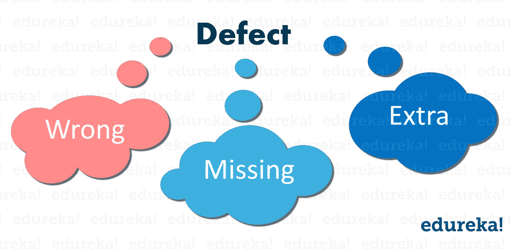
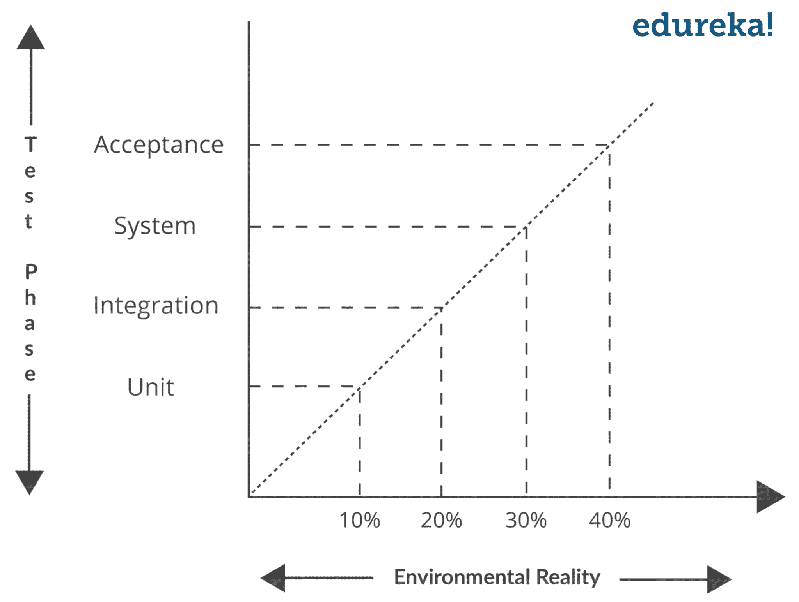
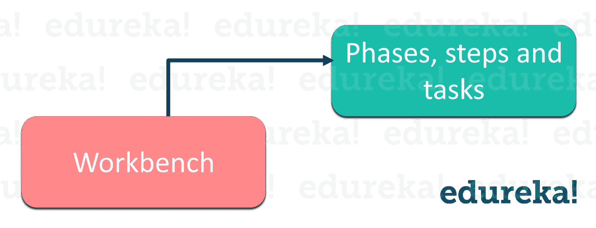

# 2023 年要知道的 50 大软件测试面试问题

> 原文：<https://www.edureka.co/blog/interview-questions/software-testing-interview-questions/>

在这篇[软件测试](https://www.edureka.co/blog/what-is-software-testing/)面试问题文章中，我收集了面试官最常问的问题。这些问题是在咨询了手动和自动化测试领域的顶级行业专家之后收集的。如果你想温习一下软件测试的基础知识，我建议你在继续这个软件测试面试问题之前先温习一下，看看 [***这篇关于软件测试教程的文章***](https://www.edureka.co/blog/software-testing-tutorial/) 。

如果你在面试中遇到其他问题或者有可能对其他人有帮助的疑问，请在本文的评论部分分享它们。同时，通过参加 Edureka 的 [***Selenium 在线培训***](https://www.edureka.co/selenium-certification-training) ，您可以最大限度地利用自动化测试职业机会。

如果你是一个想用所有最新技术提升自己技能的技术通，看看这个[顶级趋势技术](https://www.edureka.co/blog/top-10-trending-technologies/)的列表。

Top 50 Software Testing Interview Questions & Answers | Edureka[https://www.youtube.com/embed/dP1YzqKnnTo](https://www.youtube.com/embed/dP1YzqKnnTo)

## **软件测试面试问题:**

1.  软件测试生命周期包括哪些阶段？
2.  有哪些不同的测试方法？
3.  测试有哪些不同的级别？
4.  [解释 Bug 生命周期或缺陷生命周期。](#quefour)
5.  什么是测试用例？
6.  功能测试和非功能测试有什么区别？
7.  [什么是软件测试中的验证和确认？](#queseven)
8.  什么是可用性测试？
9.  缺陷的种类有哪些？
10.  [验收计划是在什么基础上编制的？](#queten)

本软件测试面试问题分为以下几个部分:

*   [**初学者级别**](#Beginnerslevel)
*   [**中级**](#IntermediateLevel)
*   [**高级水平**](#AdvancedLevel)

让我们先从初学者水平的问题开始这个软件测试面试问题。

## **新手级软件测试大一新生面试问答**

### **1。软件测试生命周期包括哪些阶段？**

软件测试生命周期涉及的不同阶段有:

| [需求分析](https://www.edureka.co/blog/software-testing-life-cycle/#requirementanalysis) | 在这里，QA 团队理解需求并识别可测试的需求。 |
| [测试计划](https://www.edureka.co/blog/software-testing-life-cycle/#testplanning) | 在这个阶段，测试策略被定义。 |
| [测试用例开发](https://www.edureka.co/blog/software-testing-life-cycle/#testcasedevelopment) | 在这里，详细的测试用例被定义和开发。 |
| [环境设置](https://www.edureka.co/blog/software-testing-life-cycle/#environmentsetup) | 它是测试团队执行测试用例的软件和硬件的设置。 |
| [测试执行](https://www.edureka.co/blog/software-testing-life-cycle/#testexecution) | 执行代码，比较预期结果和实际结果的过程。 |
| [测试周期结束](https://www.edureka.co/blog/software-testing-life-cycle/#testcycleclosure) | 它包括 c 召集测试团队成员开会&评估基于测试覆盖、质量、成本、时间、关键业务目标和软件的周期完成标准。 |

### **2。有哪些不同的测试方法？**

[软件测试](https://www.edureka.co/blog/software-testing-tutorial/#SoftwareTestingMethods)有三种方法，如下:

*   黑盒测试:这是一种完全基于需求和规格的测试策略。在这种策略中，不需要了解被测试软件的内部路径、结构或实现。
*   **白盒** **测试:**是基于被测软件内部路径、代码结构、实现的测试策略。白盒测试通常需要详细的编程技巧。
*   **灰箱测试:**是一种软件调试的策略，测试人员对程序内部细节的了解有限。

### **3。测试有哪些不同的级别？**

主要有四个测试级别，它们是:

*   单元测试
*   集成测试
*   系统试验
*   验收测试

基本上，它以 ***[单元测试](https://www.edureka.co/blog/types-of-software-testing/)阶段*** 开始，以 ***验收测试*** 结束。

### **4。解释 Bug 生命周期或缺陷生命周期。**

一个 **缺陷生命周期**是一个过程，在这个过程中，一个缺陷在其整个生命周期中经历不同的阶段。它从发现缺陷开始，在确保缺陷不再重现后，在缺陷关闭时结束。

Bug 或缺陷生命周期包括下图所示的步骤。如果你想深入了解 Bug 生命周期，那么你可以参考我在[软件测试教程](https://www.edureka.co/blog/software-testing-tutorial/)上的文章。

根据组织政策、使用的软件开发模型(如敏捷、迭代)、项目时间表、团队结构等因素，它可能因组织和项目而异。

### **5。什么是测试用例？**

一个测试用例 只不过是一组条件或变量，在这些条件或变量下，测试人员将确定被测系统是否满足需求或正常工作。

### **6。功能测试和非功能测试的区别是什么？**

| **功能测试** | 非功能测试 |
| 在非功能测试之前执行 | 在[功能测试](https://www.edureka.co/blog/types-of-software-testing/)后执行 |
| 根据客户要求 | 基于客户的期望 |
| 描述产品的功能 | 描述产品的工作原理 |

### **7。什么是软件测试中的验证和确认？**

***验证*** **:** 它是一种静态分析技术。这里，测试是在不执行代码的情况下完成的。示例包括–评审、检查和演练。

***验证*** **:** 这是一种动态分析技术，通过执行代码来进行测试。例子包括功能和非功能测试技术。

在 V 模型中，开发和 QA 活动是同时进行的。没有被称为测试的离散阶段，而是测试从需求阶段开始。验证和确认活动是同时进行的。

### **8。什么是可用性测试？**

这是一种测试方法，要求最终客户使用软件，看看产品是否易于使用，看看客户的看法和任务时间。最终确定用户对可用性的观点的一个准确方法是在初始阶段使用原型或模型软件。

### **9。缺陷的类别有哪些？**

缺陷主要有三类，如下图所示: ****

*   **错误:**暗示需求没有被正确实现。它不同于给定的规格。
*   **缺失:**这是与规范的差异，表明规范没有实施，或者没有正确记录客户的要求。
*   **Extra:** 这是包含在产品中的要求，不是最终客户给出的。它总是偏离规格，但可能是产品用户所希望的属性。

### **10。验收计划是在什么基础上编制的？**

基本上，验收文件是使用以下输入准备的。

*   需求文档:它从客户的角度详细说明了项目中到底需要什么。
*   **来自客户的输入:**这可以是讨论、非正式会谈、电子邮件等。
*   项目计划:项目经理准备的项目计划也是最终确定验收测试的良好输入。

### **11。** **什么是覆盖，有哪些不同类型的覆盖技术？**

软件测试中用来描述源代码测试程度的参数称为覆盖率。覆盖技术有三种基本类型，它们是:

1.  **语句覆盖:**它确保每一行源代码都已经被执行和测试。
2.  **决策覆盖:**它确保源代码中的每一个决策(真/假)都已经被执行和测试。
3.  **路径覆盖:**在这里，我们确保通过代码给定部分的每一条可能的路径都被执行和测试。

### **12。自动化测试的好处是什么？**

自动化测试的好处是:

1.  支持重复测试用例的执行
2.  帮助测试大型测试矩阵
3.  支持并行执行
4.  鼓励无人值守执行
5.  提高准确性，从而减少人为错误
6.  节省时间和金钱

### **13。为什么 Selenium 是自动化测试的首选工具？**

Selenium 是一个开源工具，用于在 web 浏览器上进行自动化测试。因为 Selenium 是开源的，所以不涉及许可成本，这是相对于其他测试工具的一个主要优势。Selenium 越来越受欢迎的其他原因是:

*   测试脚本可以用这些编程语言中的任何一种来编写: **Java** ， **Python** ， **C#** ， **PHP** ， **Ruby** ， **Perl** &。**网**
*   测试可以在这些操作系统中的任何一个中进行**:****Mac**或者 **Linux**
*   可以使用任何浏览器进行测试: **Mozilla Firefox** ， **Internet Explorer** ， **Google Chrome** ， **Safari** 或 **Opera**
*   它可以与诸如 **TestNG** & **JUnit** 等工具集成，用于管理测试用例并生成报告
*   可与 **Maven** 、**詹金斯**、&、 **Docker** 集成，实现连续测试

### **14。硒的各种成分是什么？**

[硒](https://www.edureka.co/blog/videos/selenium-tutorial/)的不同成分有:

*   Selenium 集成开发环境(IDE)
*   硒遥控器(遥控)
*   [Selenium WebDriver](https://www.edureka.co/blog/selenium-webdriver-tutorial)
*   [硒栅](https://www.edureka.co/blog/selenium-grid-tutorial)

### **15。Selenium 中有哪些不同类型的定位器？**

定位器只不过是在网页中唯一标识 web 元素的地址。因此，为了准确地识别 web 元素，我们在 Selenium 中有不同类型的定位器，如下所示:

*   身份证明
*   ClassName
*   名字
*   TagName
*   linkText
*   部分链接文本
*   Xpath
*   CSS 选择器
*   数字正射影像图

### **16。什么是 XPath？**

[XPath](https://www.edureka.co/blog/xpath-in-selenium/) 又称 ***XML Path*** 是一种查询 XML 文档的语言。在硒中定位元素是一个重要的策略。它由一个路径表达式和一些条件组成。在这里，您可以轻松地编写 XPath 脚本/查询来定位网页中的任何元素。它被设计成允许 XML 文档的导航，目的是选择单个元素、属性或 XML 文档的某些其他部分进行特定处理。它还生产可靠的定位器。

### **17。绝对路径和相对路径有什么区别？**

*   **绝对 XPath**

这是找到元素的直接方法，但是绝对 XPath 的缺点是，如果元素的路径有任何改变，那么 **XPath** 就会失败。*比如*:*/*html*/body/div[1]/section/div[1]/div*

*   **相对 XPath**

对于**相对 XPath，**路径从 HTML DOM 结构的中间开始。它以双正斜杠(//)开头，这意味着它可以在网页**的任何地方搜索该元素。** *例如*:**//输入[@id='ap_email']**

### **18。Selenium WebDriver 中有哪些不同的异常？**

Selenium 中的异常类似于其他编程语言中的异常。Selenium 中最常见的例外是:

*   超时异常
*   NoSuchElementException
*   ElementNotVisibleException
*   StaleElementException

### **19。什么时候该用硒格？**

Selenium Grid 可用于在多个平台和浏览器上并发执行相同或不同的测试脚本，从而实现分布式测试执行，在不同环境下进行测试，并显著节省执行时间。

### **20。如何使用 WebDriver 启动浏览器？**

可以使用下面的语法来启动浏览器:*web driver driver =**new**Firefox driver()；*T5*web driver driver =**new**chrome driver()；**web driver driver =**new**internet explorerdriver()；*

Want to upskill yourself to get ahead in your career? Check out this video[https://www.youtube.com/embed/M2NyXKxyUGc](https://www.youtube.com/embed/M2NyXKxyUGc)

## **中级软件测试面试问答**

### **21。测试应该只在构建和执行阶段完成后进行吗？**

测试总是在构建和执行阶段之后进行，我们越早发现缺陷，成本效益就越高。例如，在维护中修复缺陷的成本是在执行过程中修复的十倍。

### **22。环境现实和测试阶段之间有什么关系？**

随着测试阶段的开始，环境现实变得更加重要。例如，在单元测试时，你需要部分真实的环境，但是在验收阶段你应该有一个 100%真实的环境，或者我们可以说它应该是真实的环境。

上图显示，在验收测试期间，它应该是 100%真实的。

### **23。在初始阶段已经被去除的缺陷在后面的阶段被去除。这对成本有什么影响？**

如果在初始阶段就识别出了缺陷，那么它应该在该阶段/阶段本身被移除，而不是在某个较晚的阶段被移除。事实上，如果一个缺陷被延迟到后期阶段，它的成本会变得更高。下图显示了随着阶段的推进，一个缺陷的代价是怎样的。

如果在设计阶段发现并消除缺陷，这是最具成本效益的方法，但如果在维护阶段消除，成本会增加 20 倍。

### **24。回归和确认测试是什么意思？**

**回归测试:**它被定义为一种软件测试，以确认最近的代码变更没有对现有的特性产生负面影响。

**确认测试:** 当一个测试因为缺陷而失败时，缺陷被报告。然后提交软件的新版本，其缺陷被修复。 这就是所谓的 **确认测试** 或再 **测试** 。

### **25。边界值分析是什么意思？**

***边界值分析(BVA)*** 是一种 ***黑盒测试*** 设计技术，应用于查看在输入域的边界是否有***bug***。

### **26。什么是随机测试？**

通常，在随机测试中，数据是使用工具随机生成的。例如，下图显示了随机生成的数据是如何发送到系统的。

这些数据是使用工具或某种自动化机制生成的。使用这个随机生成的输入，然后测试系统，并相应地观察结果。

### **27。在什么基础上你可以对你的项目进行评估？**

要评估您的项目，您必须考虑以下几点:

*   将整个项目分成最小的任务
*   将每项任务分配给团队成员
*   估计完成每项任务所需的工作量
*   验证评估

### **28。先写哪些测试用例:白盒还是黑盒？**

通常先写黑盒[测试用例](https://www.edureka.co/blog/software-testing-tutorial/#SoftwareTestingDocumentationArtifacts)，后写白盒测试用例。为了编写黑盒测试用例，我们需要需求文档和设计或项目计划。这些文档在项目开始时很容易获得。白盒测试用例不能在项目的初始阶段开始，因为它们需要更清晰的架构，而这在项目的开始阶段是不可用的。所以通常情况下，白盒测试用例是在黑盒测试用例编写之后编写的。

### **29。提及缺陷报告格式的基本组成部分。**

缺陷报告格式的基本组成部分包括:

*   项目名
*   模块名
*   在上检测到缺陷
*   缺陷检测者
*   缺陷 ID 和名称
*   缺陷的快照
*   优先级和严重性状态
*   缺陷解决者
*   缺陷解决于

### **30。** **敏捷方法论中的自动化测试有用吗？**

自动化测试在敏捷方法中非常有用，有助于在 sprint 的较短时间内实现最大的测试覆盖率。

### **31。哪些测试用例可以自动化？**

*   冒烟测试案例
*   回归测试案例
*   复杂计算测试用例
*   数据驱动的测试用例
*   非功能测试用例

### **32。** **你凭什么可以映射自动化测试的成功？**

通过遵循标准，自动化测试的成功可以被映射出来:

*   缺陷检测率
*   自动化执行时间和产品发布时间的节省
*   劳动力和其他成本的降低

### **33。解释网站上的负载测试？**

要访问一个网站，用户向该网站的服务器发送一个“请求”，服务器以您想要访问的网站的形式发回一个响应。要对网站进行负载测试，质量保证工程师和自动化工程师只需要将发送的响应数量相乘，以模拟不同的流量负载。然后可以测量 web 服务器对虚拟用户涌入的响应。这用于确定性能问题和服务器容量。

### **34。硒和四库力有什么区别？**

| **硒** | **Sikuli** |
| 它不能自动运行 flash 对象，如视频播放器、音频播放器等。 | 它为自动化 flash 对象提供了广泛的支持 |
| 它有复杂的 API | 它有一个简单的 API |
| 它只能自动化 web 应用程序 | 它可以自动化 web 和 windows 应用程序。 |

### **35。如何使用 linkText()点击超链接？**

```
driver.findElement(By.linkText(&amp;ldquo;Google&amp;rdquo;)).click();

```

该命令使用链接文本查找元素，然后单击该元素。因此，用户将被重定向到相应的页面。

### **36。什么是 TestNG？**

它是一个高级的框架，在某种程度上可以平衡开发人员和测试人员的利益。它还有一个内置的异常处理机制，可以让程序运行而不会意外终止。

### **37。如何在 TestNG 中设置测试用例优先级？**

下面的代码帮助你理解如何在 [TestNG](https://www.edureka.co/blog/selenium-webdriver-tutorial) 中设置测试用例优先级。T3

```
package TestNG;
import org.testng.annotations.*;
public class SettingPriority {
@Test(priority=0)
public void method1() {
}
@Test(priority=1)
public void method2() {
}
@Test(priority=2)
public void method3() {
}
}

```

**测试执行顺序:**

```
Method1
Method2
Method3

```

### **38。硒和 QTP 有什么区别？**

| **硒** | **快速测试专业** |
| Selenium 支持几乎所有流行的浏览器，如 Firefox、Chrome、Safari、Internet Explorer、Opera 等 | QTP 支持 ie 浏览器、火狐浏览器和 Chrome 浏览器。QTP 只支持 Windows 操作系统 |
| Selenium 是作为开源工具发布的，可以免费获得 | QTP 作为授权工具分发，并被商业化 |
| Selenium 只支持基于 web 的应用程序的测试 | QTP 支持基于 web 的应用程序和基于 windows 的应用程序的测试 |

### **39。什么是对象存储库？如何在 Selenium 中创建对象存储库？**

对象存储库是指属于被测应用(AUT)的 web 元素及其定位器值的集合。关于 *[Selenium](https://www.edureka.co/blog/what-is-selenium/) ，对象可以存储在 excel 表中，需要时可以在脚本中填充。*

### **40。如何使用 Selenium WebDriver 在文本框中输入文本？**

通过使用 **sendKeys** **()** 方法，我们可以使用 [Selenium WebDriver](https://www.edureka.co/blog/selenium-tutorial) 在文本框中输入文本。

## **进阶级** **软件测试面试问题针对有经验的专业人士**

本节帮助您练习高级和基于情景的面试问题

### **41。我们需要从最终用户那里得到什么样的输入来开始适当的测试？**

最终用户是最重要的人，因为他必须使用产品，并且比项目中的任何其他人都有浓厚的兴趣。

上图说明了用户端的重要输入。

### **42。工作台概念是什么意思？**

工作台的核心是记录特定活动必须如何执行的一种方式。它通常被称为阶段、步骤和任务，如下图所示。

每个工作台有五个任务，如下所示:

1.  投入
2.  执行
3.  支票
4.  生产量
5.  修订

### **43。缺陷级联是什么意思？**

缺陷级联是由另一个缺陷引起的缺陷。一个缺陷引发另一个缺陷。当一个缺陷出现在任何一个阶段，但是没有被识别出来，隐藏到其他阶段而不被注意到。这将导致缺陷数量的增加。

让我们通过一个例子来理解这一点。

您正在设计网页的登录模块:

*在第 1 阶段*–您正在设计用于登录的注册用户模块，手机号码是必填项，但由于一个未被注意到的错误，您可以将其留空。

*在第二阶段*–您将设计包含用户名和密码的登录表单。密码是一次性密码，将发送到用户注册的手机号码。

现在，由于注册模块有一个错误，手机号码可以留空，所以这可能会导致登录失败，或者可能会出现一些系统错误或崩溃，如果一个空的手机号码没有得到处理。这就是所谓的缺陷级联。

**44。向最终用户推广的不同策略是什么？**

首次展示应遵循的策略如下:

*   飞行员
*   逐步实施
*   阶段性实现
*   并行实现

### **45。解释如何使用 Selenium WebDriver 在页面中找到断开的链接？**

面试官可能会向你提出一个棘手的问题。他可以提供一个网页中有 20 个链接的情况，我们必须验证这 20 个链接中哪些是工作的，哪些是不工作的(损坏的)。

由于您必须验证每个链接的工作情况，解决方法是您需要向网页上的所有链接发送 HTTP 请求并分析响应。每当您使用 driver.get()方法导航到一个 URL 时，它都会以状态**200–OK**进行响应。这表明链接正在工作，并且已经获得。而任何其他状态指示链路断开。

现在让我们来理解如何做到这一点。

首先，我们必须使用锚标签< a >来确定网页上不同的超链接。对于每个<一个>标签，我们可以使用属性‘href’值来获取超链接，然后分析在 **driver.get()** 方法中使用时收到的响应。

### **46。如果既没有帧 id 也没有帧名，脚本“*应该考虑哪种技术？***

如果帧名和帧 id 不可用，那么我们可以通过索引使用**帧。** 例如，一个网页中有 3 个框架，如果它们都没有框架名称和框架 id，那么我们仍然可以通过使用框架(从零开始)索引属性来选择这些框架。所有的帧都有一个索引号，就像第一帧在索引“0”，第二帧在索引“1”，第三帧在索引“2”。

```
driver.switchTo().frame(int arg0);

```

### **47。如何在 Selenium WebDriver 中截图？**

使用**截图**功能可以截图。借助于 **getScreenshotAs()** 方法，您可以简单地保存该截图。 ***示例*** :文件 scrFile =((截图)驱动)。getScreenshotAs(outputType。文件)；

### **48。解释一下如果任何网站显示用户名和密码的认证弹出窗口，你将如何登录？**

如果弹出登录窗口，我们需要使用 explicit 命令并验证警报是否确实存在。下面的代码帮助您理解显式 wait 命令的用法。

```
WebDriverWait wait = new WebDriverWait(driver, 10);
Alert alert = wait.until(ExpectedConditions.alertIsPresent());
alert.authenticateUsing(new UserAndPassword(**username**, **password**));

```

49。如何在 TestNG 中跳过一个方法或者一个代码块？

要跳过特定的测试方法或代码，那么您可以将测试注释中的“enabled”参数设置为 false。**@测试(enabled = false)**

### **50。简要解释下面的代码片段表示什么？**

```
WebElement sample = driver.findElement(By.xpath("//*[contains(text(), 'data')]"));

```

它定义了一个 WebElement 类型的变量 *sample* ，并使用 XPath 搜索通过引用包含文本值“data”的元素来初始化它。

这就把我们带到了这篇关于 50 大软件测试面试问题的文章的结尾。希望它有助于增加你的知识。祝你面试一切顺利。快乐学习。

*如果您找到了这篇“软件测试面试问题* *”的相关文章，* *请查看 Edureka 提供的**软件测试培训，edu reka 是一家值得信赖的在线学习公司，在全球拥有超过 250，000 名满意的学习者。*

*有问题吗？请在这个软件测试面试问题的评论部分提到它，我们会给你回复。*