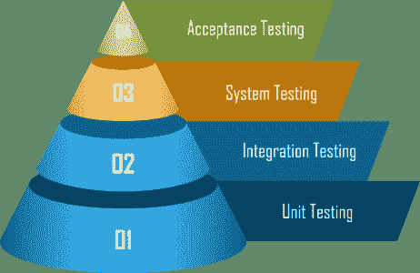

# 软件测试有哪些不同的级别？

> 原文：<https://www.edureka.co/blog/software-testing-levels/>

今天的技术世界完全由机器主导，它们的行为由驱动它的软件控制。软件测试为我们对机器按照我们希望的方式运行的担忧提供了解决方案。本文将按以下顺序提供关于软件测试的不同**级别的深入知识:**

*   [测试类型](#testingtypes)
*   [软件测试的等级](#testinglevels)
    *   [单元测试](#unittest)
    *   [集成测试](#integrationtest)
    *   [系统测试](#systemtest)
    *   [验收测试](#acceptancetest)

让我们开始吧！

## **测试类型**

规定了两种[类型的软件测试](https://www.edureka.co/blog/types-of-software-testing/) :

1.  [功能测试](#functional)
2.  [非功能测试](#nonfunctional)

我将逐一给你详细解释这两者。从[开始功能测试:](https://www.edureka.co/blog/what-is-functional-testing/)

### **功能测试**

你听说过黑盒测试吗？嗯，这是插入输入和检查输出的过程，以检查我们是否得到了所需的输出。功能测试涉及以下功能:

*   确定项目的功能。
*   根据应用程序的要求创建测试数据
*   根据应用程序中测试的数据检查输出。
*   通过测试检查场景，然后执行那些测试用例
*   根据执行的测试，比较实际输出和预期输出

### **非功能性测试**

非功能性测试处理从需求的角度测试任何类型[非功能性](https://www.edureka.co/blog/functional-testing-vs-non-functional-testing/)的产品。T 他不同的类别有:

1.  **用户界面**
2.  **表现**
3.  **安全**

继续，让我向你解释一下软件测试的水平。

## **软件测试的级别**

软件测试有四个级别，即:

让我们逐一了解。

### **单元测试:**

这个概念是通过测试来仔细检查程序的每一部分。测试程序的各个部分，以检查它们是否满足需求。

### **集成测试:**

这里的主要思想是在程序单元之间交互时检查错误。在这个软件测试级别中，各个部分需要组合起来，并单独测试，或者更准确地说，作为一个集群进行测试。

集成测试有两种:

*   **自上而下的测试**

在该测试中，首先测试最高级别的模块，然后测试较低级别的模块。

*   **自下而上测试**

在这里，测试较低级别的模块，然后测试较高级别的模块。

### **系统测试:**

系统测试将项目作为一个整体来测试。系统测试是软件开发生命周期的第一步。

这个测试背后的基本思想是检查输出是否达到了满足项目需求的目标。在这个软件测试级别，您创建的整个软件或项目都会被测试。

### **验收测试:**

在这个软件测试级别，测试系统的可接受性。该测试检查系统是否符合业务需求。这是最重要的测试类型，因为它是由质量保证团队进行的，他们将检查应用程序是否符合规范并满足客户的要求。

至此，我的博客已经接近尾声。希望上述内容对你的 Java 知识有所增值。我们将继续探索 Java 世界。敬请期待！

至此，我们结束了这个“软件测试水平”的博客。我希望你们喜欢这篇文章，并且理解软件测试的不同层次。

*既然你已经了解了测试，那就来看看 Edureka 的 [**软件测试基础课程**](https://www.edureka.co/software-testing-fundamentals-training) 。本课程旨在向您介绍完整的软件测试生命周期。您将学习不同级别的测试、测试环境设置、测试用例设计技术、测试数据创建、测试执行、错误报告、DevOps 中的 CI/CD 管道以及软件测试的其他基本概念。*

有问题要问我们吗？请在“软件测试水平”的评论部分提到它，我们会给你回复。