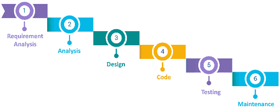
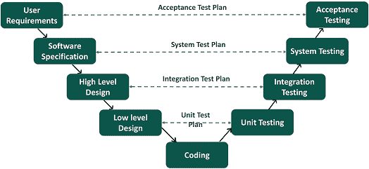
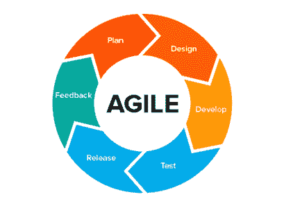
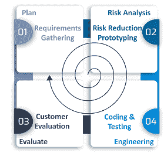
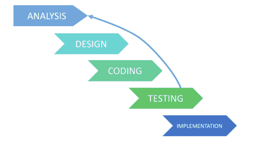

# 软件测试模型有哪些类型？

> 原文：<https://www.edureka.co/blog/software-testing-models/>

今天的技术世界完全由机器主宰，它们的行为由驱动它的软件控制。软件测试解决了我们对机器按照我们希望的方式运行的所有担忧。本文将按以下顺序提供关于不同软件测试模型的深入知识:

*   [软件测试模型](#softwaretestingmodels)
    *   [瀑布模型](#waterfallmodel)
    *   [V 型](#vmodel)
    *   [敏捷模式](#agilemodel)
    *   [螺旋模型](#spiralmodel)
    *   [迭代模型](#iterativemodel)

## **软件测试模型**

[软件测试](https://www.edureka.co/blog/what-is-software-testing/)是[软件开发生命周期](https://www.edureka.co/blog/software-testing-tutorial/)的一个组成部分。在软件开发过程中，您可以使用不同的模型或方法，每个模型都有自己的优点和缺点。因此，您必须根据项目的可交付性和复杂性来选择特定的模型。

不同的软件测试模型是:

### **瀑布模型**

这是最基本的[软件开发生命周期](https://www.edureka.co/blog/software-testing-life-cycle/)过程，在业界被广泛遵循。在这个模型中，开发人员遵循一系列的过程向下到达最终目标。它就像一个瀑布，包含了不同的阶段。

[**瀑布模型**](https://www.edureka.co/blog/waterfall-vs-agile/) 中的不同阶段有:

*   需求分析
*   分析阶段
*   软件设计
*   编程实现
*   测试
*   维护

**优势**

*   它易于实现和维护。
*   最初阶段对需求和系统的严格审查有助于在开发阶段节省时间。
*   对资源的需求是最小的，并且测试在每个阶段完成后进行。

**缺点**

*   不可能改变或更新需求。
*   一旦你进入下一个阶段，你就不能再做改变了。
*   前一阶段完成后，才能开始下一阶段。

### **V 型**

V 模型被认为优于瀑布模型。在这个模型中，开发和测试执行活动以下坡和上坡的形式并排进行。此外，测试从单元级别开始，并扩展到整个系统的集成。

**优势**

*   它很容易使用，因为像计划和测试设计这样的测试活动是在编码之前完成的。
*   这种模式增加了成功的机会并节省了时间。
*   缺陷大多是在早期阶段发现的，并且通常避免缺陷向下流动。

**缺点**

*   这是一个僵化的模式。
*   软件是在实现阶段开发的，所以产品的早期原型是不可用的。
*   如果中途有变化，你需要更新测试文档。

### **敏捷模式**

在敏捷模型中，需求和解决方案通过各种跨职能团队之间的协作而发展。它也被称为迭代和增量模型。敏捷软件测试模型通过工作软件产品的快速交付和将产品分解成小的增量构建来关注过程适应性和客户满意度。

**优势**

*   它确保客户对可交付成果的快速和持续开发感到满意。
*   客户、开发人员和测试人员之间的持续互动使它成为一个灵活的模型。
*   您可以快速开发工作软件，并定期适应不断变化的需求。

**缺点**

*   对于大型复杂的软件开发案例，在周期的开始阶段很难评估所需的工作。
*   由于与客户的持续互动，如果客户不清楚目标，项目可能会偏离轨道。

### **螺旋模型**

这个软件测试模型类似于[敏捷模型](https://www.edureka.co/blog/what-is-agile-testing/)，但是更加强调风险分析。螺旋模型的不同阶段包括计划、风险分析、工程和评估。在这种情况下，您需要收集需求，并在基础级别执行风险评估，并且每个上层螺旋都建立在它的基础上。

**优势**

*   它适用于复杂的大型系统。
*   您可以根据变化的环境添加功能。
*   软件是在周期的早期生产的。

**缺点**

*   这是一个昂贵的模型，需要高度专业化的风险分析专业知识
*   它在简单的项目上不太好用。

### **迭代模型**

在项目开始之前，迭代模型不需要完整的需求列表。开发过程从功能部分的需求开始，可以在以后扩展。该过程是重复的，并且每个周期都允许产品的新版本。每一次迭代都包括系统的一个独立组件的开发，该组件被添加到先前开发的功能组件中。

**优势**

*   由于高风险任务首先完成，因此更容易控制风险。
*   进展很容易衡量。
*   在一次迭代中定义的问题和风险可以在下一次冲刺中避免。

**缺点**

*   迭代模型比瀑布模型需要更多的资源。
*   这个过程很难管理。
*   即使在项目的最后阶段，风险也可能无法完全确定。

这些是软件开发生命周期中涉及的不同软件测试模型。我希望你明白这些模型是如何在软件测试中使用的。

*现在可以通过 Edureka 查看 [**软件测试基础课程**](https://www.edureka.co/software-testing-fundamentals-training) 。本课程旨在向您介绍完整的软件测试生命周期。您将学习不同级别的测试、测试环境设置、测试用例设计技术、测试数据创建、测试执行、错误报告、DevOps 中的 CI/CD 管道以及软件测试的其他基本概念。*

有问题要问我们吗？请在“软件测试模型”的评论部分提到它，我们会给你回复。