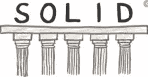
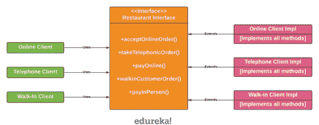
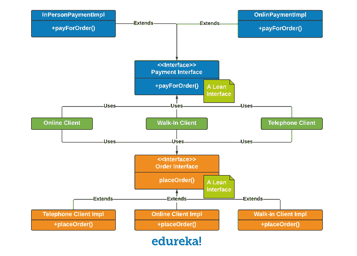

# 你所需要知道的关于 Java 的坚实原理

> 原文：<https://www.edureka.co/blog/solid-principles-in-java/>

在[面向对象编程](https://www.edureka.co/blog/polymorphism-in-java/) (OOP)的世界里，有很多设计准则、模式或原则。这些原则中的五个通常被组合在一起，并被缩写为 SOLID。虽然这五个原则中的每一个都描述了一些特定的东西，但是它们也有重叠，因此采用其中的一个意味着或导致采用另一个。在本文中，我们将了解 Java 中的坚实原理。

*   [Java 固态原理历史](#history)
*   [S . o . l . I . d .是什么意思？](#what)

## **Java 坚实原理的历史**

罗伯特·马丁(Robert C. Martin)给出了五个面向对象的设计原则，首字母缩写“S.O.L.I.D”用于表示它。当你结合使用 S.O.L.I.D 的所有原则时，开发易于管理的软件就变得更容易了。使用 S.O.L.I.D .的其他功能有:

*   它避免了代码气味。
*   快速折射代码。
*   可以进行适应性或敏捷的软件开发。

当你在编码中使用 S.O.L.I.D 的原则时，你就开始编写既高效又有效的代码。

# ****

## **S . o . l . I . d .是什么意思？**

Solid 代表了 java 的五个原则，它们是:

*   单一责任原则
*   **O** :开闭原理
*   **L** :利斯科夫替代原理
*   **I** :界面分离原理
*   **D** :依存倒置原则

在这个博客中，我们将详细讨论 Java 的所有五个坚实的原则。

**T2``**

## **Java 中的单一责任原则**

上面写了什么？

Robert C. Martin 将其描述为一个类应该有且只有一个责任。

根据单一责任原则，应该只有一个原因导致一个类被改变。这意味着一个类应该有一个任务要做。这个原则通常被称为主观的。

用一个例子就能很好地理解原理。假设有一个执行以下操作的类。

*   连接到数据库

*   从数据库表中读取一些数据

*   最后，将其写入文件。

你想象过这个场景吗？在这里，类有多种改变的原因，其中很少是文件输出的修改、新数据库的采用。当我们谈论单一原则责任时，我们会说，有太多的理由让这个阶级改变；因此，它不适合单一责任原则。

例如，汽车类可以自己启动或停止，但清洗它的任务属于 CarWash 类。在另一个例子中，一个 Book 类有存储它自己的名字和文本的属性。但是打印书的任务必须属于书打印机类。Book Printer 类可能会打印到控制台或另一个介质，但这种依赖关系已从 Book 类中删除

### 为什么需要这个原则？

当遵循单一责任原则时，测试更容易。有了单一的责任，这个类将会有更少的测试用例。更少的功能也意味着对其他类的依赖性更少。这导致了更好的代码组织，因为更小和更好的类更容易搜索。

一个阐明这一原则的例子:

假设您被要求实现一个用户设置服务，其中用户可以更改设置，但在此之前必须对用户进行身份验证。实现这一点的一种方法是:

```
public class UserSettingService
{
public void changeEmail(User user)
{
if(checkAccess(user))
{
//Grant option to change
}
}
public boolean checkAccess(User user)
{
//Verify if the user is valid.
}
}
```

一切看起来都很好，除非您想在其他地方重用 checkAccess 代码，或者您想对 checkAccess 的执行方式进行更改。在这两种情况下，您最终都要更改同一个类，在第一种情况下，您还必须使用 UserSettingService 来检查访问。纠正这种情况的一种方法是将用户设置服务分解为用户设置服务和安全服务。并将 checkAccess 代码移到 SecurityService 中。

```
public class UserSettingService
{
&nbsp; &nbsp;public void changeEmail(User user)
&nbsp; {
&nbsp; &nbsp; if(SecurityService.checkAccess(user))
&nbsp; &nbsp;{
//Grant option to change
&nbsp; &nbsp;}
&nbsp;}

}

public class SecurityService
{
public static boolean checkAccess(User user)
{
//check the access.
}
}
```

## **Java 中的开闭原理**

Robert C. Martin 将其描述为软件组件应该对扩展开放，但对修改关闭。

准确地说，根据这个原则，一个类应该以这样一种方式编写，它可以完美地执行它的工作，而不需要假设未来的人会简单地来改变它。因此，该类应该保持关闭以便修改，但是它应该有扩展的选项。扩展该类的方法包括:

*   从类继承

*   从类中重写所需的行为

*   扩展该类的某些行为

开闭原理的一个很好的例子，可以借助浏览器来理解。你还记得在你的 chrome 浏览器中安装扩展吗？

chrome 浏览器的基本功能是浏览不同的网站。当你使用 chrome 浏览器写邮件时，你想检查语法吗？如果是的话，你可以简单地使用语法扩展，它提供你对内容的语法检查。

这种增加浏览器功能的机制是一种扩展。因此，浏览器是一个很好的功能性的例子，它对扩展是开放的，但对修改是关闭的。简单来说，你可以通过在浏览器上添加/安装插件来增强功能，但不能构建任何新的东西。

### 为什么需要这个原则？

OCP 很重要，因为课程可能是通过第三方图书馆提供给我们的。我们应该能够扩展那些类，而不用担心那些基类是否支持我们的扩展。但是继承可能导致依赖基类实现的子类。为了避免这种情况，建议使用接口。这种额外的抽象导致了松散耦合。

假设我们需要计算各种形状的面积。我们首先为我们的第一个矩形 创建一个类，它有两个属性长度 &宽度。

```
public class Rectangle
{
public double length;
public double width;
}

```

接下来我们创建一个类来计算这个矩形 的面积，该类有一个方法 calculateRectangleArea ，该方法将矩形 作为输入参数并计算其面积。

```
public class AreaCalculator
{
&nbsp; public double calculateRectangleArea(Rectangle rectangle)
&nbsp;{
&nbsp; return rectangle.length *rectangle.width;
&nbsp;}
}
```

到目前为止还不错。现在假设我们得到了第二个形状圆。因此，我们迅速创建了一个新的类圆 ，具有单一的属性半径。

```
public class Circle
{
public double radius;
}
```

然后我们修改 Areacalculator 类，通过一个新的方法 calculatecirclearea()增加圆的计算

```
public class AreaCalculator

{
   public double calculateRectangleArea(Rectangle rectangle)
  {
     return rectangle.length *rectangle.width;
     }
public double calculateCircleArea(Circle circle)

    {
return (22/7)*circle.radius*circle.radius;
  }
}
```

但是，请注意，我们在上面设计解决方案的方式中存在缺陷。

假设我们有一个新的五边形。在这种情况下，我们将再次修改 AreaCalculator 类。随着形状类型的增加，这变得更加混乱，因为 AreaCalculator 不断变化，这个类的任何用户都必须不断更新他们包含 AreaCalculator 的库。因此，AreaCalculator 类不会被基线化(最终化),因为每次一个新的形状出现，它都会被修改。所以，这个设计是不能修改的。

AreaCalculator 将需要继续在更新的方法中添加计算逻辑。我们并没有真正扩大形状的范围；相反，我们只是为每一个添加的形状做一点一点的解决方案。

修改上述设计，以符合开启/关闭原则:

现在让我们来看一个更优雅的设计，它通过坚持打开/关闭原则解决了上述设计中的缺陷。我们将首先使设计可扩展。为此，我们需要首先定义一个基本类型的形状，并有圆形和矩形实现形状接口。

```
public interface Shape
{
public double calculateArea();
}

public class Rectangle implements Shape
{
double length;
double width;
public double calculateArea()
{
return length * width;
}
}

public class Circle implements Shape
{
public double radius;
public double calculateArea()
{
return (22/7)*radius*radius;
}
}
```

有一个基本接口形状。所有形状现在都实现了基本接口形状。Shape 接口有一个抽象方法 calculateArea()。circle 和 rectangle 都使用自己的属性提供了自己的 calculateArea()方法的重写实现。我们引入了一定程度的可扩展性，因为形状现在是形状接口的一个实例。这允许我们使用形状而不是单独的类上面最后一点提到了这些形状的消费者。在我们的例子中，消费者将是 AreaCalculator 类，现在看起来像这样。

```
public class AreaCalculator
{
public double calculateShapeArea(Shape shape)
{
return shape.calculateArea();
}
}
```

这个 AreaCalculator 类现在完全消除了我们上面提到的设计缺陷，并给出了一个遵循开闭原则的简洁解决方案。让我们继续学习 Java 中的其他坚实的原理

## **Java 中的利斯科夫替换原理**

Robert C. Martin 将其描述为派生类型必须完全可以替换其基本类型。

Liskov 替换原则假设 q(x)是一个属性，关于属于类型 t 的 x 的实体是可证明的。现在，根据这个原则，q (y)现在应该对于属于类型 S 的对象 y 是可证明的，并且 S 实际上是 t 的子类型。你现在困惑了，不知道 Liskov 替换原则实际上是什么意思吗？它的定义可能有点复杂，但事实上，它很简单。唯一的事情是，每个子类或派生类应该可以替换它们的父类或基类。

你可以说它是一个独特的面向对象原则。该原理可以进一步简化为:一个特定父类型的子类型，在不制造任何复杂情况或搞砸事情的情况下，应该有能力代替那个父类型。该原理与利斯科夫替代原理密切相关。

### 为什么需要这个原则？

这避免了滥用继承。它帮助我们符合“是-是”的关系。 我们也可以说子类必须履行基类定义的契约。从这个意义上说，它与由 Bertrand Meyer 首先描述的合同设计有关。例如，很容易说圆是一种椭圆，但圆没有两个焦点或长/短轴。

LSP 通常用正方形和长方形的例子来解释。如果我们假设正方形和长方形之间有 ISA 关系。因此，我们称“正方形是长方形”下面的代码代表了这种关系。

```
public class Rectangle
{
private int length;
private int breadth;
public int getLength()
{
return length;
}
public void setLength(int length)
{
this.length = length;
}
public int getBreadth()
{
return breadth;
}
public void setBreadth(int breadth)
{
this.breadth = breadth;
}
public int getArea()
{
return this.length * this.breadth;
}
}
```

下面是 Square 的代码。请注意，正方形扩展了矩形。

```
public class Square extends Rectangle
{

public void setBreadth(int breadth)
{
super.setBreadth(breadth);
super.setLength(breadth);
}

public void setLength(int length)
{
super.setLength(length);
super.setBreadth(length);
}
}
```

在这种情况下，我们试图在 Square 和 Rectangle 之间建立一个 ISA 关系，这样，如果 Square 的一个实例被传递，在下面的代码中调用“Square is a Rectangle”将会开始意外地运行。在检查“面积”和检查“宽度”的情况下，将会抛出断言错误，尽管程序会由于面积检查失败而抛出断言错误而终止。

```
public class LSPDemo
{
public void calculateArea(Rectangle r)
{
r.setBreadth(2);
r.setLength(3);
assert r.getArea() == 6 : printError("area", r);
assert r.getLength() == 3 : printError("length", r);
assert r.getBreadth() == 2 : printError("breadth", r);
}
private String printError(String errorIdentifer, Rectangle r)
{
return "Unexpected value of " + errorIdentifer + " for instance of " + r.getClass().getName();
}
public static void main(String[] args)
{
LSPDemo lsp = new LSPDemo();
// An instance of Rectangle is passed
lsp.calculateArea(new Rectangle());
// An instance of Square is passed
lsp.calculateArea(new Square());
}
}
```

该类演示了利斯科夫替换原则(LSP) 根据该原则，使用基类引用的函数必须能够在不知道的情况下使用派生类的对象。

因此，在下面的示例中，使用“Rectangle”引用的函数 calculateArea 应该能够使用 Square 等派生类的对象，并满足矩形定义提出的要求。应该注意，根据矩形的定义，在给定以下数据的情况下，以下必须始终成立:

1.  长度必须始终等于作为方法 setLength 的输入传递的长度
2.  宽度必须始终等于作为输入传递给方法 setBreadth 的宽度
3.  面积必须始终等于长度和宽度的乘积

如果我们试图在正方形和矩形之间建立 ISA 关系，我们称之为“正方形是一个矩形”，上面的代码将开始意外地运行，如果正方形的一个实例被传递，在检查面积和检查宽度的情况下将抛出断言错误，尽管程序将终止，因为断言错误是由于面积检查失败而抛出的。

Square 类不需要像 set width 或 setLength 这样的方法。LSPDemo 类需要知道 Rectangle(如 Square)的派生类的详细信息，以适当地编码，避免抛出错误。现有代码的改变首先打破了开闭原则。

## **界面偏析原理**

Robert C. Martin 将其描述为客户不应该被迫实现他们不会使用的不必要的方法。

根据接口分离原则一个客户端无论如何都不应该被强制实现一个它不使用的接口或者客户端不应该被强制依赖于任何它们不使用的方法。因此，基本上，接口分离原则，因为你喜欢的接口，这是小的，但客户特定的，而不是单片和更大的接口。简而言之，强迫客户依赖他们不需要的某样东西对你来说是不好的。

例如，用于写和读日志的单一日志记录接口对于数据库是有用的，但是对于控制台却不是。对于控制台日志记录器来说，读取日志毫无意义。继续这篇坚实的 Java 原理文章。

### 为什么需要这个原则？

假设有一个餐馆接口，其中包含接受来自在线客户、拨入或电话客户以及上门客户的订单的方法。它还包含处理在线支付(针对在线客户)和当面支付(针对上门客户以及电话客户，当他们的订单送货上门时)的方法。

现在让我们为餐馆创建一个 Java 接口，并将其命名为 RestaurantInterface.java。

```
public interface RestaurantInterface
{
  public void acceptOnlineOrder();
  public void takeTelephoneOrder();
  public void payOnline();
  public void walkInCustomerOrder();
  public void payInPerson();
}
```

在 RestaurantInterface 中定义了 5 种方法，分别用于接受在线订单、接受电话订单、接受无预约顾客的订单、接受在线支付和亲自接受支付。

让我们从实现在线顾客的餐馆界面开始，如 OnlineClientImpl.java

```
public class OnlineClientImpl implements RestaurantInterface
{
public void acceptOnlineOrder()
{
//logic for placing online order
}
public void takeTelephoneOrder()
{
//Not Applicable for Online Order
throw new UnsupportedOperationException();
}
public void payOnline()
{
//logic for paying online
}
public void walkInCustomerOrder()
{
//Not Applicable for Online Order
throw new UnsupportedOperationException();
}
public void payInPerson() {
//Not Applicable for Online Order
throw new UnsupportedOperationException();
}
}
```

*   由于上面的代码(OnlineClientImpl.java)是针对在线订单的，所以抛出 UnsupportedOperationException。

*   在线、电话和无预约客户使用特定于他们的 RestaurantInterface 实现。

*   电话客户和无预约客户的实现类将有不支持的方法。

*   因为这 5 个方法是 RestaurantInterface 的一部分，所以实现类必须实现所有这 5 个方法。

*   每个实现类抛出 UnsupportedOperationException 的方法。你可以清楚地看到，实现所有的方法是低效的。

*   RestaurantInterface 的任何方法中的任何更改都将传播到所有实现类。然后代码的维护开始变得非常麻烦，变更的回归效应会不断增加。

*   RestaurantInterface.java 打破了单一责任原则，因为付款逻辑和订单逻辑都集中在一个界面中。

为了克服上述问题，我们应用接口分离原理来重构上述设计。

1.  将支付和订单功能分离到两个独立的精益接口中，PaymentInterface.java 和 PaymentInterface.java。

2.  每个客户端都使用 PaymentInterface 和 OrderInterface 的一个实现。例如——OnlineClient.java 使用 OnlinePaymentImpl 和 OnlineOrderImpl 等等。

3.  单一责任原则现在附加为支付接口(PaymentInterface.java)和订购接口(OrderInterface)。

4.  订单或支付界面中任何一个的变化都不会影响另一个。他们现在独立了。不需要做任何虚拟实现或者抛出一个 UnsupportedOperationException，因为每个接口只有它将一直使用的方法。

****

**申请 ISP 后**



## **依存倒置原则**

罗伯特·c·马丁认为它依赖于抽象而不是具体。根据它，高级模块决不能依赖于任何低级模块。例如

你去当地的商店买东西，你决定用你的借记卡支付。所以，当你把你的卡交给店员付款时，店员根本不会检查你给的是哪种卡。

就算你给了 Visa 卡，他也不会拿出 Visa 机给你刷卡。你用哪种类型的信用卡或借记卡付款并不重要；他们会简单地刷一下。所以，在这个例子中，你可以看到你和店员都依赖于信用卡的抽象，你不担心卡的细节。这就是依赖性反转原则。

### 为什么需要这个原则？

它允许程序员去除硬编码的依赖性，从而使应用程序变得松散耦合和可扩展。

```
public class Student
{
   private Address address;
   public Student()
  {
    address = new Address();
   }
}
```

在上面的例子中，Student 类需要一个地址对象，它负责初始化和使用地址对象。如果将来改变了地址类，那么我们也必须改变学生类。这使得学生和地址对象之间紧密耦合。我们可以使用依赖倒置设计模式来解决这个问题。也就是说，地址对象将独立实现，并在使用基于构造函数或基于设置器的依赖关系反转实例化学生时提供给学生。

至此，我们结束了 Java 中的这个坚实的原则。

*查看 Edureka 提供的  [**Java 课程**](https://www.edureka.co/java-j2ee-training-course) 培训* *，edu reka 是一家值得信赖的在线学习公司，在全球拥有超过 250，000 名满意的学习者。Edureka 的 Java J2EE 和 SOA 培训和认证课程是为想成为 Java 开发人员的学生和专业人士设计的。该课程旨在为您提供 Java 编程的良好开端，并训练您掌握核心和高级 Java 概念以及各种 Java 框架，如 Hibernate & Spring。*

有问题要问我们吗？请在“Java 的坚实原则”博客的评论部分提到它，我们会尽快回复您。