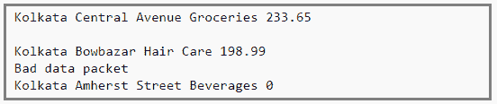
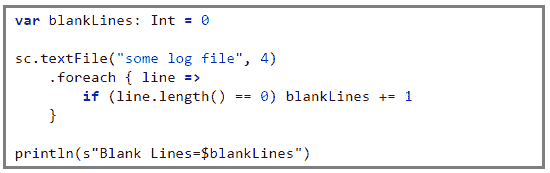
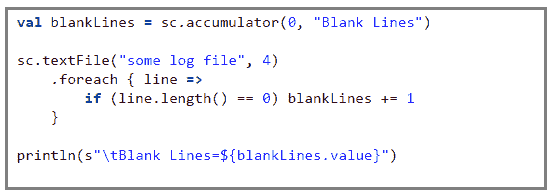

# 火花累加器解释:阿帕奇火花

> 原文：<https://www.edureka.co/blog/spark-accumulators-explained>

*供稿:Prithviraj Bose*

这里有一个博客是关于你需要知道的关于火花蓄电池的东西。随着 ***[Apache Spark 认证](https://www.edureka.co/apache-spark-scala-training)*** 成为大多数 IT 招聘人员追逐的关键技能，其在行业中的增长和需求自开始以来一直呈指数增长。

## 什么是累加器？

累加器是用于汇总执行者信息的变量。例如，这些信息可能与数据或 API 诊断有关，比如有多少记录被破坏，或者某个特定的库 API 被调用了多少次。

为了理解我们为什么需要累加器，让我们看一个小例子。

这是一份想象中的加尔各答中部地区一家连锁店的交易日志。

<u>有 4 个字段，</u>

*字段 1 - >城市*

*字段 2 - >地点*

*字段 3 - >售出商品的类别*

*字段 4 - >售出商品的价值*

但是，日志可能会损坏。例如，第二行是一个空行，第四行报告了一些网络问题，最后一行显示销售值为零(这不可能发生！).

我们可以使用累加器来分析交易日志，以找出空白日志(空白行)的数量、网络失败的次数、任何没有类别的产品，甚至记录零销售的次数。完整的样本日志可以在 这里找到 [。累加器适用于 1 的任何操作。可交换- > *f(x，y) = f(y，x)* ， 2。Associative - > *f(f(x，y)，z) = f(f(x，z)，y) = f(f(y，z)，x)* 例如， *sum* 和 *max* 函数满足上述条件，而 *average* 则不满足。](https://github.com/prithvirajbose/spark-dev/blob/master/data/purchases.log)

## 为什么要使用火花蓄电池？

现在，我们为什么需要累加器，为什么不像下面的代码那样使用变量呢？

The problem with the above code is that when the driver prints the variable *blankLines* its value will be zero. This is because when Spark ships this code to every executor the variables become local to that executor and its updated value is not relayed back to the driver. To avoid this problem we need to make *blankLines* an accumulator such that all the updates to this variable in every executor is relayed back to the driver.So the above code should be written as,

这保证了累加器 *blankLines* 在每个执行器之间被更新，并且更新被转发回驱动程序。

我们可以为网络错误或零销售额等实现其他计数器。完整的源代码连同其他计数器的实现可以在 [这里](https://github.com/prithvirajbose/spark-dev/blob/master/src/main/scala/examples/PurchaseLogAnalysis.scala) 找到。

熟悉 Hadoop Map-Reduce 的人会注意到 Spark 的累加器类似于 Hadoop 的 Map-Reduce 计数器。

## 注意事项

当使用累加器时，我们作为程序员需要注意一些警告，

1.  在*转换*中的计算是延迟计算的，所以除非一个*动作*发生在一个 RDD 上，否则*转换*不会被执行。因此，在像 *map()* 或 *filter()* 这样的函数中使用的累加器不会被执行，除非在 RDD 上发生了一些*动作*。
2.  Spark 保证只更新*动作*内的累加器**一次**。因此，即使重新启动任务并重新计算沿袭，累加器也只会更新一次。
3.  Spark 对*转换*不保证这一点。因此，如果重新启动一个任务并重新计算沿袭，当累加器更新不止一次时，就有可能出现不希望的副作用。

为了安全起见，始终只在动作内部使用蓄能器。 这里的代码展示了如何实现这一点的一个简单而有效的例子。有关累加器的更多信息，请阅读 [本](http://spark.apache.org/docs/latest/rdd-programming-guide.html#accumulators) 。

有问题要问我们吗？在评论区提到它们，我们会回复你。

**相关帖子:**

[Apache Spark 和 Scala](https://www.edureka.co/apache-spark-scala-training "Get started with Apache Spark and Scala")T3【入门】

[阿帕奇火花组合](https://www.edureka.co/blog/apache-spark-combinebykey-explained)比奇解释